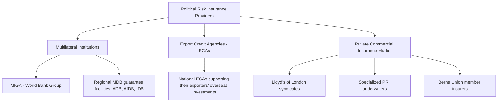
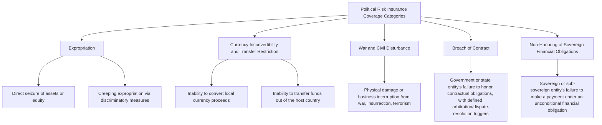
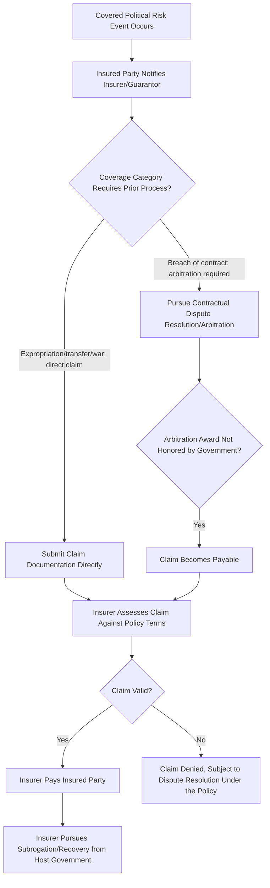

## Political Risk Insurance and Multilateral Guarantee Coverage

### Overview

Political Risk Insurance (PRI) is a category of insurance and guarantee products designed to protect private investors and lenders against losses arising from adverse government actions or political events in the host country of an investment. Multilateral guarantee coverage refers specifically to PRI-type products provided by multilateral institutions — most prominently the Multilateral Investment Guarantee Agency (MIGA), part of the World Bank Group — as opposed to private commercial insurers or export credit agencies. This risk mitigation instrument is a critical component of the broader credit enhancement toolkit for PPPs in emerging and frontier markets, complementing contractual risk allocation mechanisms (see also: Political, Regulatory, and Sovereign Risk) and partial guarantee instruments (see also: Partial Risk Guarantees and Partial Credit Guarantees) by transferring defined political risks to a well-capitalized third-party insurer/guarantor rather than relying solely on the host government's own contractual undertakings.

### The PRI Market Landscape

#### Multilateral Investment Guarantee Agency (MIGA)

A member of the World Bank Group established specifically to promote foreign direct investment into developing countries by providing political risk insurance and credit enhancement to investors and lenders. MIGA's mandate and institutional structure give it distinctive features relative to private PRI providers, discussed below.

#### Regional Development Bank Guarantee Facilities

Several regional MDBs (Asian Development Bank, African Development Bank, Inter-American Development Bank, European Bank for Reconstruction and Development) offer their own political risk guarantee products, often with similar core coverage categories to MIGA but scoped to their respective regional mandates.

#### Export Credit Agencies (ECAs)

National ECAs (e.g., US EXIM, UK Export Finance, Japan's NEXI, Germany's Euler Hermes) provide political risk cover often bundled with export finance support for their national companies' overseas investments and equipment exports, extending coverage that supports both the export transaction and the broader investment.

#### Private Commercial PRI Market

Lloyd's of London syndicates and specialized private insurers (many organized under the Berne Union, an international association of export credit and investment insurers) provide PRI coverage on commercial terms, often used to supplement multilateral coverage or for transactions/amounts where multilateral capacity is unavailable or insufficient.

### Standard Coverage Categories

| Coverage Category | What It Protects Against |
| --- | --- |
| Expropriation | Direct seizure/nationalization of the investment, and often creeping expropriation (a series of measures that cumulatively deprive the investor of the benefit of its investment without formal seizure) |
| Currency inconvertibility and transfer restriction | Government-imposed restrictions preventing the conversion of local currency into foreign currency, or the transfer of funds outside the host country |
| War and civil disturbance | Physical damage to assets, or business interruption, resulting from war, revolution, insurrection, or politically motivated violence |
| Breach of contract | Government or state entity's failure to honor its contractual obligations to the investor, typically requiring the investor to first pursue a defined dispute resolution mechanism (arbitration) before a valid PRI claim can be made |
| Non-honoring of sovereign financial obligations | A specific, more streamlined coverage (offered by MIGA and some ECAs) for a sovereign or sub-sovereign entity's failure to pay under an unconditional financial payment obligation, often without requiring prior arbitration |

### MIGA-Specific Structural Features

- **World Bank Group institutional relationship**: MIGA's affiliation with the World Bank Group is widely regarded as providing a distinctive deterrent effect — host governments are generally understood to have a strong incentive to avoid actions that would trigger a MIGA claim, given the broader relationship and credibility implications with the World Bank Group as a whole, beyond MIGA's own institutional standing alone
- **Preferred creditor status considerations**: while MIGA guarantee claims function differently from direct MDB lending, MIGA's position within the World Bank Group is generally understood to carry similar practical leverage in claim resolution and government engagement
- **Coverage tenor**: MIGA and similar multilateral guarantees can typically provide coverage for extended tenors (commonly up to 15-20 years, sometimes longer), aligning with the long-term nature of infrastructure investment, which can exceed what private commercial PRI markets are willing to offer at reasonable pricing
- **Environmental and social performance standards**: MIGA-guaranteed projects are subject to MIGA's own environmental and social performance standards (aligned with IFC Performance Standards), adding an additional layer of E&S due diligence and ongoing compliance monitoring
- **Both equity and debt coverage**: MIGA provides guarantees covering both equity investments (against expropriation, transfer restriction, war, and breach of contract affecting the equity investment) and loans/debt (against non-payment risk arising from covered political risk events)

### PRI Claims Process

A key procedural distinction exists between coverage categories: expropriation, currency transfer restriction, and war/civil disturbance claims are typically more directly assessable against the policy's defined triggers, while breach-of-contract coverage generally requires the insured party to first exhaust the contract's own dispute resolution mechanism (often international arbitration) and obtain a favorable, but unenforced/unpaid, award before a PRI claim becomes payable — reflecting the insurer's role as backstopping non-honored legal remedies rather than substituting for them entirely.

### Pricing Considerations

PRI premiums are typically calculated as an annual percentage of the insured amount, varying based on:

$$Premium_{PRI} = f(CountryRisk, SectorRisk, CoverageScope, Tenor, CoveragePercentage)$$

- **Country risk profile**: higher perceived political risk (based on sovereign ratings, governance indicators, historical expropriation/breach patterns) generally corresponds to higher premiums
- **Coverage scope**: comprehensive coverage across all standard categories costs more than narrower, single-category coverage (e.g., currency transfer risk only)
- **Tenor**: longer coverage periods generally command higher premiums, reflecting extended risk exposure
- **Coverage percentage**: most PRI (multilateral and private) covers a percentage of the insured exposure (commonly 90-95%, though this varies), rather than 100%, preserving some "skin in the game" for the insured party

[Inference] Multilateral PRI providers, including MIGA, are generally understood in market practice to offer pricing that can be competitive with, and sometimes more favorable than, private commercial PRI markets for higher-risk jurisdictions specifically, reflecting their developmental mandate rather than a purely commercial return objective — though actual comparative pricing depends on the specific country, sector, and transaction, and private markets may be more competitive in lower-risk or more established markets where commercial capacity is more readily available.

### Interaction with Contractual Risk Allocation

PRI and multilateral guarantee coverage should be understood as complementary to, not a substitute for, sound contractual risk allocation in the underlying PPP agreement:

- **PRI covers what the contract cannot fully secure**: even a well-drafted change-in-law or termination compensation clause depends on the government's willingness and ability to actually pay; PRI provides an independent, third-party-backed source of recovery if the government fails to honor that contractual commitment
- **PRI does not eliminate the need for careful contract drafting**: PRI breach-of-contract coverage specifically requires a valid, well-drafted contract and (typically) a functioning dispute resolution mechanism to establish that a breach occurred — poor contract drafting undermines the insured party's ability to make a valid claim
- **Coordination with other guarantee instruments**: PRI is often used alongside Partial Risk Guarantees and government support instruments as part of an integrated credit enhancement package, with each instrument addressing a specific, distinct risk dimension rather than overlapping redundantly

### Common Structuring Considerations and Pitfalls

| Consideration/Pitfall | Explanation | Mitigation |
| --- | --- | --- |
| Assuming PRI eliminates the need for careful political risk contractual drafting | Weak change-in-law or termination clauses undermine the insured party's ability to establish a valid breach-of-contract claim | Ensure PRI procurement is coordinated with, not a substitute for, robust contractual risk allocation drafting |
| Underestimating claims process timelines, particularly for breach-of-contract coverage requiring prior arbitration | Significant delay between the triggering event and actual claim payment, creating interim liquidity/cash-flow strain | Factor realistic claims timelines into overall project contingency and liquidity planning |
| Selecting coverage categories that do not match the project's actual risk profile | Gaps in protection against the specific political risks most relevant to the jurisdiction and sector | Conduct a jurisdiction- and sector-specific political risk assessment to inform coverage category selection, rather than defaulting to standard package coverage |
| Not engaging PRI providers early in project preparation | Delays in transaction timeline if PRI underwriting and pricing negotiations are left until late in the process | Engage MIGA, relevant ECAs, or private PRI brokers during early project structuring to confirm indicative terms and underwriting requirements |
| Overlooking MIGA's/multilateral insurers' environmental and social performance standard requirements | Additional compliance obligations and potential project preparation cost/timeline not initially budgeted | Incorporate multilateral E&S requirements into project preparation planning from the outset if multilateral PRI is being pursued |

### Key Points

- **PRI transfers political risk to a well-capitalized third party rather than relying solely on host government contractual commitments**, providing an independent recovery mechanism that strengthens overall project bankability, particularly in jurisdictions with weaker contract sanctity track records.
- **Multilateral providers, particularly MIGA, offer distinctive institutional leverage** derived from their World Bank Group affiliation, generally regarded as enhancing the practical deterrent effect against government actions that would trigger a claim, beyond what a purely commercial insurer could replicate.
- **Breach-of-contract coverage typically requires exhausting contractual dispute resolution first**, distinguishing it procedurally from more directly triggered coverage categories like expropriation or currency transfer restriction — a distinction with real implications for claims timeline and interim liquidity planning.
- **PRI is a complement to, not a substitute for, sound contract drafting and risk allocation** — its effectiveness in practice depends on the quality of the underlying contractual and legal framework it is designed to backstop.

### Example

A renewable energy IPP project with foreign equity sponsors in a country with a developing PRI/political risk track record structures its risk mitigation as follows:

1. Given the specific concern about the state utility's payment reliability under the power purchase agreement (PPA) and broader currency transfer considerations, the sponsors procure a MIGA guarantee covering equity investment against expropriation, currency transfer restriction, war and civil disturbance, and breach of contract (specifically covering non-payment under the PPA).
2. Given that breach-of-contract coverage requires exhausting the PPA's own dispute resolution mechanism, the PPA is drafted with an efficient international arbitration clause (ICC rules, neutral seat) specifically to ensure that, should a PPA payment dispute arise, the path to a valid, actionable arbitration award — and subsequently a valid MIGA claim if unpaid — is as clear and efficient as the underlying contract can reasonably provide.
3. Lenders separately require debt-side political risk coverage, structured as a MIGA guarantee for the project loans covering the same core risk categories, extending the guarantee's benefit to the debt financing alongside the equity coverage.
4. The overall risk mitigation package combines this MIGA political risk coverage with the PPA's own contractual change-in-law and termination compensation provisions (see also: Political, Regulatory, and Sovereign Risk), providing layered protection: contractual remedies as the first line, backstopped by independent multilateral guarantee coverage if the government fails to honor those remedies.

### Related Topics

- Political, Regulatory, and Sovereign Risk
- Partial Risk Guarantees and Partial Credit Guarantees
- Currency and Macroeconomic Risk
- Bilateral Investment Treaties and International Arbitration in PPP Disputes
- Government Support Instruments: Guarantees and Viability Gap Funding
- Power Purchase Agreement Structuring and Off-Taker Credit Risk
- IFC Performance Standards and Environmental/Social Safeguard Frameworks
- Multilateral Development Bank Financing Structures for Infrastructure