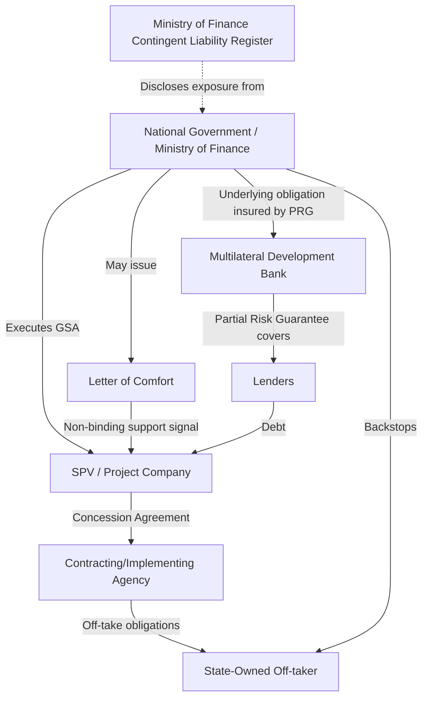

## Government Support Agreements and Letters of Comfort

### Definition and Purpose

A **Government Support Agreement (GSA)** is a contractual instrument, typically executed alongside or as a schedule to the Concession Agreement (CA)/Public-Private Partnership (PPP) Agreement, in which the Grantor (national government, a line ministry, or a designated government instrumentality) undertakes specific, legally binding obligations toward the private party (Project Company/Special Purpose Vehicle, SPV) and, by extension, its lenders. These obligations are distinct from the Grantor's role as counterparty to the concession itself; the GSA addresses risks that sit outside the direct control of the implementing agency but that materially affect project bankability — such as sovereign, political, regulatory, and cross-agency coordination risks.

A **Letter of Comfort (LoC)**, sometimes called a Letter of Support or Letter of Awareness, is a weaker, generally non-binding (or only partially binding) instrument in which a government body expresses moral or political support for a project, acknowledges the project's importance, and signals an intention (not an obligation) to assist in resolving obstacles, without extending a legal guarantee of performance or payment.

The distinction between the two is central to PPP risk allocation theory:

| Attribute | Government Support Agreement | Letter of Comfort |
| --- | --- | --- |
| Legal enforceability | Binding contract; breach gives rise to claims/damages | Typically non-binding or has limited enforceability |
| Credit rating impact | Can be treated as credit enhancement by lenders/rating agencies | Rarely improves credit rating meaningfully |
| Scope | Specific, itemized obligations (e.g., tariff adjustment enforcement, land delivery, permits) | General statement of support/intent |
| Contingent liability recognition | Usually recorded as a contingent liability by the Ministry of Finance | Often not recorded, or recorded with lower probability weighting |
| Typical use case | Large-scale infrastructure with high political/regulatory risk (power, toll roads, rail) | Smaller projects, or as a supplementary comfort alongside a GSA |

### Rationale within PPP Risk Allocation Theory

The foundational principle of PPP risk allocation is that **risk should be borne by the party best able to manage it at least cost**. Certain risk categories cannot be efficiently managed by the private party regardless of its diligence or capability:

- **Regulatory/policy risk**: changes in law, tariff-setting frameworks, or subsidy regimes
- **Political risk**: expropriation, war, civil disturbance, or government repudiation of contract
- **Cross-agency/coordination risk**: delays in permits, right-of-way acquisition, or environmental clearances controlled by agencies other than the contracting authority
- **Payment risk from off-takers**: particularly relevant where the off-taker is a separate state-owned enterprise (SOE) with its own credit profile (e.g., a state-owned electricity distribution utility purchasing power under a Power Purchase Agreement)

Because these risks originate from government action or inaction, the Grantor is the least-cost risk bearer under the theory. The GSA operationalizes this allocation by converting an implicit sovereign risk into an explicit, monitorable contractual commitment.

### Typical Contents of a Government Support Agreement

**Key Points**

- **Termination payment guarantees**: Government commitment to make (or ensure payment of) termination compensation if the Grantor or off-taker defaults, or upon political force majeure/termination for convenience.
- **Payment support for off-taker obligations**: Especially in energy and water sectors, where the direct counterparty is an SOE; the GSA may include a sovereign guarantee, indemnity, or escrow/liquidity support mechanism backing the off-taker's payment obligations under the PPA or Bulk Supply Agreement.
- **Change-in-law compensation mechanics**: Detailed formulae or adjustment mechanisms for tariff/toll revision following discriminatory or project-specific legislative/regulatory changes.
- **Convertibility and transferability of currency**: Assurance that the SPV can convert local currency revenues and repatriate profits/debt service in foreign currency, relevant for foreign-currency-denominated debt.
- **Cross-default and coordination clauses**: Commitments by the Grantor to use its authority to expedite permits, land acquisition, or resettlement, and remedies (extension of time, compensation) if it fails to do so.
- **Step-in rights support**: Government cooperation with lender step-in rights upon SPV default, ensuring continuity of essential permits/licenses during lender-led remediation.
- **Non-discrimination and stabilization clauses**: Commitments against expropriation without compensation and against retroactive or discriminatory tax/regulatory changes.

### Interaction with Guarantee Instruments

GSAs frequently function as the contractual anchor for, or work alongside, other credit enhancement instruments:

- **Sovereign Guarantees**: A full guarantee by the national treasury of a specific payment obligation (e.g., termination payment, minimum revenue guarantee). The GSA may itself constitute the guarantee, or may reference and incorporate a separate standalone guarantee deed.
- **Partial Risk Guarantees (PRGs)**: Instruments issued by multilateral development banks (MDBs) such as the World Bank or Asian Development Bank (ADB) that cover private lenders against the risk of government non-performance under the GSA itself. In this structure, the GSA becomes the underlying obligation being insured, and the MDB's PRG steps in if the government fails to honor it — effectively transferring the sovereign counterparty risk to a AAA/AA-rated multilateral, which substantially improves the project's financeability.
- **Escrow accounts**: Some GSAs establish or reference an escrow mechanism (funded from a specific revenue stream, e.g., fuel levy or budget appropriation) as the payment source for guaranteed obligations, reducing reliance on discretionary annual budget allocations.

$$\text{Effective Project Risk} = \text{Commercial Risk (SPV-borne)} + \left[\text{Sovereign Risk} \times (1 - \text{GSA/PRG Coverage Ratio})\right]$$

This formulation is illustrative rather than a standard industry formula: it conceptually expresses how a GSA (and any backing PRG) reduces the portion of sovereign risk priced into the project's cost of capital, though actual lender risk pricing incorporates many additional qualitative and quantitative factors. [Inference]

### Contingent Liability Management

A central fiscal governance concern is that GSAs create **contingent liabilities** for the sovereign — obligations that may or may not crystallize depending on future events (e.g., an off-taker default triggering a payment guarantee call). Ministries of Finance in jurisdictions with mature PPP frameworks (e.g., the Philippines' Department of Finance and the PPP Center, South Africa's National Treasury PPP Unit, India's Ministry of Finance) typically require:

- **Contingent liability registers**: Disclosure of all outstanding GSA-related exposures in fiscal risk statements or budget documents.
- **Fiscal risk assessment/actuarial provisioning**: Estimating the probability-weighted cost of the guarantee to inform whether provisioning or budget set-asides are needed, sometimes using government support fund mechanisms (e.g., Indonesia's Indonesia Infrastructure Guarantee Fund, IIGF, and India's Viability Gap Funding-adjacent guarantee mechanisms).
- **Approval thresholds and ceilings**: Statutory or policy limits on aggregate contingent liability exposure from PPPs, to avoid unconstrained fiscal risk accumulation across a portfolio of projects.

[Unverified] The specific institutional design (e.g., whether a dedicated guarantee fund is capitalized ex ante versus relying on general budget appropriations ex post) varies significantly by country and is not standardized; readers should consult the specific jurisdiction's PPP fiscal risk framework.

### Letters of Comfort: Structure and Limitations

A Letter of Comfort is typically a short-form document issued by a ministry, head of agency, or sometimes a head of state/government, containing:

- A statement acknowledging the strategic/national importance of the project
- An expression of the government's intention to support the project's successful implementation
- Non-binding assurances regarding facilitation of permits, inter-agency coordination, or future policy support
- Explicit disclaimers (in most well-drafted LoCs) that the letter does not constitute a guarantee, does not create a binding payment obligation, and does not bind future administrations or the legislature's budgetary discretion

**Example** (illustrative excerpt structure, not a real document):

> "The Department confirms its support for the Project and its commitment to facilitate the timely issuance of permits within its jurisdiction. This Letter does not constitute a guarantee of the Project Company's obligations, does not create a financial obligation on the part of the Government, and shall not be construed as binding on future budget appropriations."

**Key Points on limitations**:

- Lenders generally **cannot** book a Letter of Comfort as credit enhancement for capital adequacy or rating purposes because it lacks enforceable payment obligations.
- Case law in several jurisdictions (drawing especially from corporate finance precedents, e.g., *Kleinwort Benson Ltd v Malaysia Mining Corp Bhd* [1989] in English contract law, concerning a parent company comfort letter) has held that comfort letters are generally **statements of present policy/intention**, not contractual promises, unless the language is unusually specific and promissory. [Inference] The precise enforceability of any given LoC depends heavily on its exact wording and the governing law; general statements of intent are typically non-binding, while more specific, unconditional language may shift a letter closer to being treated as binding — courts examine each instrument's actual text rather than applying a blanket rule.
- LoCs are sometimes used **strategically** as a lower-cost, lower-fiscal-exposure alternative when a full sovereign guarantee is politically or fiscally infeasible, accepting that this will result in a narrower lender base or higher required returns.

### Illustrative Contractual Architecture

### Rating Agency and Lender Perspective

Credit rating methodologies (e.g., those applied by Moody's, S&P, and Fitch to project finance transactions) generally treat GSAs as improving the project's credit profile only to the extent that:

1. The obligation is unconditional and irrevocable within its defined scope
2. The mechanism for payment (budget line item, dedicated fund, escrow) is credible and does not depend solely on annual discretionary appropriation
3. There is a demonstrated track record of the sovereign or agency honoring similar commitments
4. The GSA is enforceable in a forum with reasonable recourse (e.g., international arbitration under a bilateral investment treaty or ICSID, rather than solely domestic courts of the same government granting the support)

[Speculation] The magnitude of credit spread compression attributable to a well-structured GSA in any specific transaction is deal-specific and not something that can be generalized into a single benchmark figure without reference to the particular sector, country risk rating, and instrument design.

### Practical Example: Power Sector PPP

**Example**

In an Independent Power Producer (IPP) structure:

- The SPV signs a Power Purchase Agreement (PPA) with a state-owned distribution utility (off-taker).
- Because the utility's own balance sheet may be weak (common in several emerging markets), lenders require additional comfort beyond the PPA.
- The national government (through the Ministry of Finance or Energy) executes a GSA that includes a **payment support agreement**: if the off-taker fails to pay amounts due under the PPA within a specified cure period, the government (or an intermediary such as a Partial Risk Guarantee-backed escrow) pays the shortfall directly to the SPV, subject to defined caps and triggers.
- This transforms the offtaker's weak stand-alone credit into an effectively sovereign-linked payment stream, materially lowering the project's cost of debt and improving the deal's bankability.

### Common Pitfalls and Negotiation Points

- **Overbroad drafting of comfort letters** that inadvertently use promissory language, exposing the government to unintended binding liability, or conversely, drafting so vague that lenders derive no bankability value at all.
- **Undefined trigger and cure mechanisms** in GSAs — vague standards for what constitutes a qualifying default or delay reduce the instrument's practical enforceability.
- **Absence of a dedicated funding source**, leaving the guaranteed obligation dependent on annual budget cycles, which weakens its credit value.
- **Jurisdictional/forum risk**: reliance on domestic courts against the same sovereign granting the support, versus international arbitration, significantly affects enforceability perception among foreign lenders.
- **Political discontinuity risk**: GSAs and especially LoCs may face reduced practical force across changes in administration, even where legally the state (not the administration) is the binding party.

### Related Topics

- Sovereign Guarantees and Partial Risk Guarantees (PRGs) in project finance
- Viability Gap Funding and government support funds (e.g., IIGF-type structures)
- Contingent liability accounting and fiscal risk management for PPPs
- Termination payment mechanisms and compensation on early termination
- Change-in-law and force majeure risk allocation in concession agreements
- Multilateral Development Bank credit enhancement instruments (World Bank PRG, ADB PRG, MIGA political risk insurance)
- Power Purchase Agreements and off-taker credit risk mitigation
- Escrow account structuring in infrastructure finance