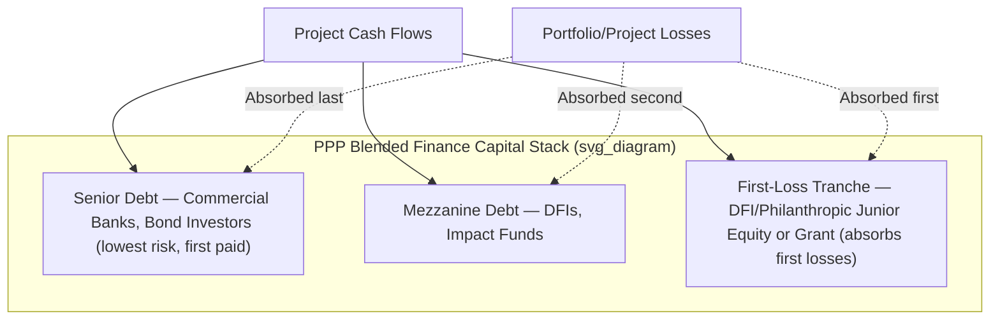

## First-Loss Facilities and Blended Finance Structures

### Definition and Core Concept

A **first-loss facility** is a credit enhancement mechanism in which a designated party contractually agrees to absorb losses on a portfolio or transaction **up to a specified threshold** before any other capital provider (senior lenders, mezzanine investors, or other tranches) bears any loss. The first-loss provider sits at the bottom of the capital stack in terms of loss-absorption priority, even though it may not necessarily hold the most subordinated position in terms of cash flow priority in every structure.

**Blended finance** is the broader structuring approach within which first-loss facilities are one of several tools. It is commonly defined (following the usage popularized by the OECD and the Convergence blended finance network) as the strategic use of development finance and philanthropic capital to mobilize additional private sector capital flows toward projects that deliver development impact while generating market or near-market financial returns. In PPP economics specifically, blended finance structures are used to make projects bankable where pure commercial capital alone would demand a risk-adjusted return the project's revenues cannot support.

### Position within Risk Mitigation Theory

The core economic logic parallels that of government support agreements and guarantees (see Government Support Agreements and Letters of Comfort) but operates through **capital structure subordination** rather than contractual government obligations:

$$\text{Loss}_{\text{Senior Lender}} = \max\left(0,\ \text{Total Portfolio Loss} - \text{First-Loss Tranche Size} - \text{Mezzanine Tranche Size}\right)$$

By absorbing initial losses, the first-loss tranche shifts the effective risk profile perceived by senior capital, allowing senior lenders to price debt as though the underlying asset were substantially safer than its unadjusted risk profile would suggest. This is a form of **risk layering**, distinct from risk transfer (as in insurance/guarantee instruments) because the first-loss provider retains genuine loss exposure rather than transferring it elsewhere.

### Capital Stack Structure

**Key Points**

A typical blended finance capital stack, from most subordinated (highest risk, first to absorb losses) to most senior:

1. **First-loss/junior equity tranche** — typically funded by development finance institutions (DFIs), philanthropic foundations, or government-backed catalytic funds; accepts below-market or concessional returns, or in some structures forgoes upside entirely, in exchange for enabling the deal.
2. **Mezzanine/subordinated debt tranche** — often funded by DFIs, impact investors, or blended vehicles; higher risk than senior debt, priced accordingly, subordinated in both loss absorption and payment priority.
3. **Senior debt tranche** — funded by commercial banks, institutional investors (pension funds, insurance companies), or capital markets (project bonds); benefits from the cushion provided by the tranches below it.
4. **Guarantees/insurance overlay** (optional, can apply across tranches) — instruments such as MIGA political risk insurance or partial credit guarantees that further reduce residual risk to senior capital.

### Common First-Loss Instrument Types

- **First-loss equity/junior tranche**: Direct capital contribution ranking behind senior and mezzanine claims; often structured as preferred or common equity with capped or subordinated return rights.
- **First-loss guarantee**: A guarantee (rather than funded capital) that covers losses up to a defined cap; may be funded (cash-collateralized) or unfunded (contingent), the latter being cheaper to establish but carrying counterparty risk on the guarantor.
- **Loss reserve/cash collateral account**: A funded reserve account, often held in escrow, drawn upon to cover defined loss events before senior claims are affected.
- **Risk-sharing facilities**: Structures such as partial credit guarantees where the first-loss provider and senior lender share losses pari passu above a threshold (as opposed to strict sequential loss absorption).

### Blended Finance Structuring Approaches

**Key Points**

1. **Concessional capital layering** — DFI or donor capital is deliberately priced below market rate (or provided as grant-funded first loss) specifically to de-risk the senior tranche, distinguishing blended finance from ordinary co-financing where all parties expect market-rate risk-adjusted returns.
2. **Grant-funded technical assistance facilities** — often paired with first-loss capital to fund project preparation, feasibility studies, and capacity building, addressing the "bankable pipeline" problem common in PPP markets with limited project preparation capacity.
3. **Guarantee/insurance overlays** — MDB instruments (e.g., World Bank Group Partial Risk Guarantees, MIGA political risk insurance, ADB credit guarantees) layered on top of or alongside a first-loss tranche to address specific risk categories (political, regulatory, currency) that first-loss capital alone does not target.
4. **Currency risk mitigation facilities** — vehicles such as TCX (The Currency Exchange Fund) that provide local-currency hedging for cross-border blended finance transactions, addressing the currency mismatch risk common when hard-currency DFI capital funds local-currency-revenue projects.

### Illustrative Numerical Example

**Example**

Consider a USD 100 million toll road PPP with historically volatile traffic revenue risk:

| Tranche | Amount (USD mm) | % of Stack | Indicative Return Expectation | Loss Absorption Order |
| --- | --- | --- | --- | --- |
| First-loss (DFI/donor) | 10 | 10% | Concessional / capped | 1st (absorbs first $10mm of losses) |
| Mezzanine (DFI/impact fund) | 20 | 20% | Above senior, below commercial equity | 2nd (absorbs next $20mm) |
| Senior debt (commercial banks/bonds) | 70 | 70% | Market senior debt rate | 3rd (only impaired beyond $30mm total loss) |

Under this structure, senior lenders are only exposed to loss once cumulative losses exceed $30 million (30% of total capital), materially improving the effective probability of full repayment relative to a scenario without the subordinated tranches. [Inference] The specific pricing benefit (basis points of spread compression) that this structure would generate for the senior tranche in a real transaction depends on the issuer's credit assessment methodology, prevailing market conditions, and rating agency treatment, and cannot be generalized from the structure alone.

### Institutional Providers Active in This Space

- **Multilateral Development Banks (MDBs)**: World Bank Group (IFC, MIGA), Asian Development Bank (ADB), African Development Bank (AfDB), Inter-American Development Bank (IDB)
- **Bilateral DFIs**: U.S. International Development Finance Corporation (DFC), UK's British International Investment (BII), Germany's DEG, France's Proparco, Netherlands' FMO
- **Dedicated blended finance vehicles**: Global Infrastructure Facility (GIF), Global Energy Alliance for People and Planet (GEAPP)-linked structures, InfraCredit (Nigeria, local-currency guarantee provider), IIGF (Indonesia Infrastructure Guarantee Fund)
- **Philanthropic foundations**: Increasingly participate as first-loss/junior capital providers in climate and development-linked infrastructure, particularly through vehicles convened by platforms such as Convergence Blended Finance

[Unverified] The precise catalytic ratio (private capital mobilized per unit of concessional/first-loss capital) varies substantially by sector, geography, and reporting methodology across these institutions; publicly cited mobilization multiples should be treated as illustrative rather than as universal benchmarks, and methodologies for calculating "mobilization" differ across the OECD, MDB Task Force, and individual institution reporting standards.

### Distinguishing First-Loss Facilities from Related Instruments

| Instrument | Mechanism | Key Difference from First-Loss Facility |
| --- | --- | --- |
| Government Support Agreement | Contractual government obligation to pay/perform | Obligation-based (contract), not capital-stack-based |
| Sovereign/Partial Risk Guarantee | Third-party guarantor covers specified default | Guarantor typically does not hold capital position in the deal |
| Viability Gap Funding (VGF) | Upfront capital grant to close funding gap | Addresses affordability/bankability gap, not loss absorption per se |
| Mezzanine debt | Subordinated debt with fixed/preferred return | Absorbs losses only after first-loss tranche; retains debt-like return expectations |
| Insurance (e.g., political risk insurance) | Risk transfer via premium-based indemnity | Risk transferred to insurer's balance sheet, not layered within the deal's own capital stack |

### Design and Negotiation Considerations

- **Sizing the first-loss tranche**: Must be calibrated against historical or projected loss distributions (e.g., via Monte Carlo simulation of revenue risk, or benchmarking against comparable infrastructure default/recovery statistics) — undersized tranches fail to meaningfully de-risk senior capital, while oversized tranches waste scarce concessional capital that could de-risk additional projects elsewhere.
- **Additionality requirement**: Most DFI mandates require demonstrating that the concessional first-loss capital is genuinely necessary to mobilize private capital (i.e., the deal would not proceed, or would proceed on materially worse terms, without it) rather than displacing capital that would have been available commercially — a principle central to blended finance governance frameworks (e.g., the DFI Enhanced Principles for blended concessional finance).
- **Exit and recycling mechanics**: Because first-loss/concessional capital is scarce, well-designed facilities often include mechanisms for the first-loss provider to be partially repaid or to recycle capital into subsequent transactions once the underlying project de-risks (e.g., post-construction refinancing), maximizing catalytic reach across a portfolio rather than being permanently locked into a single deal.
- **Moral hazard and governance safeguards**: Because senior lenders are insulated from initial losses, facility design typically includes underwriting standards, reporting covenants, and alignment mechanisms (e.g., requiring the first-loss provider to retain approval or information rights) to prevent senior capital from underpricing genuine project risk simply because it is contractually insulated from first losses.
- **Fiscal/accounting treatment**: Where a government or DFI-backed public entity is the first-loss provider, similar contingent liability disclosure considerations apply as with GSAs, since drawn first-loss amounts represent realized fiscal exposure.

### Sectoral Applications in PPP Context

- **Renewable energy PPPs**: First-loss facilities have been widely used to de-risk early-stage renewable IPPs in emerging markets where off-taker credit and regulatory frameworks are still maturing.
- **Water and sanitation PPPs**: Blended structures address the combination of weak tariff cost-recovery and municipal off-taker credit risk.
- **Municipal/sub-sovereign infrastructure**: First-loss facilities help sub-national governments access capital markets despite limited independent credit history, often paired with credit rating enhancement programs.
- **Climate-linked infrastructure**: Increasingly structured with results-based or outcome-linked first-loss triggers tied to climate/development KPIs rather than purely financial default events.

### Related Topics

- Viability Gap Funding (VGF) mechanisms and design
- Partial Risk Guarantees and Partial Credit Guarantees from MDBs
- Capital stack structuring and subordination mechanics in project finance
- Local currency financing and currency hedging facilities (e.g., TCX)
- DFI blended concessional finance principles and additionality assessment
- Credit rating enhancement for sub-sovereign and municipal infrastructure
- Project preparation facilities and pipeline development funding
- Results-based financing and outcome-linked infrastructure instruments