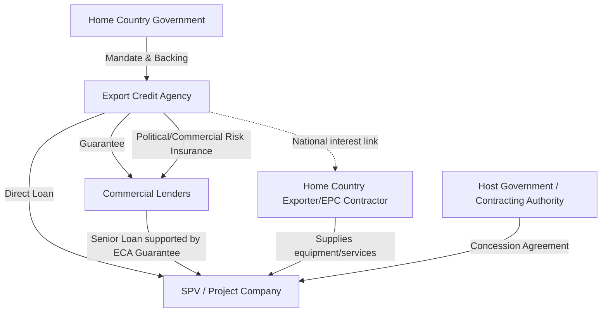

## Role of Export Credit Agencies in PPP Risk Mitigation

### Definition and Institutional Mandate

**Export Credit Agencies (ECAs)** are government-backed or government-sponsored institutions established to promote their home country's exports and outward investment by providing financing, guarantees, and insurance that mitigate risks commercial lenders and exporters are unwilling or unable to bear alone. In the context of PPP economics, ECAs function as **credit enhancement and risk mitigation intermediaries**, distinct from multilateral development banks (MDBs) in that their mandate is tied to supporting exports/goods and services from their sponsoring country rather than pursuing development outcomes as a primary objective, though the two mandates increasingly overlap in infrastructure finance.

Major ECAs relevant to PPP transactions include:

- **US EXIM Bank** (United States)
- **UK Export Finance (UKEF)** (United Kingdom)
- **Euler Hermes / now Allianz Trade, acting as Germany's official ECA** (Germany)
- **Coface** (France, historically the official French ECA function, now largely transferred to Bpifrance Assurance Export)
- **SACE** (Italy)
- **JBIC (Japan Bank for International Cooperation) and NEXI (Nippon Export and Investment Insurance)** (Japan)
- **K-EXIM and K-sure** (South Korea)
- **China Export & Credit Insurance Corporation (Sinosure) and China EXIM Bank** (China)
- **EDC (Export Development Canada)** (Canada)
- **ECGC** (India)

### Position within PPP Risk Mitigation Architecture

ECAs typically enter PPP transactions where the project involves procurement of equipment, works, or services from the ECA's home country (the "national content" or "national interest" requirement), most commonly in:

- **Power generation** (turbines, generators, transmission equipment)
- **Transportation infrastructure** (rail rolling stock, port equipment, airport systems)
- **Water and wastewater treatment plants**
- **Telecommunications infrastructure**

This distinguishes ECA involvement from MDB or DFI participation (see First-Loss Facilities and Blended Finance Structures), which is generally development-outcome-driven rather than tied to procurement nationality.

### Core Instrument Types Offered by ECAs

**Key Points**

1. **Direct lending** — the ECA itself extends a loan to the SPV, typically at rates informed by the OECD Arrangement on Officially Supported Export Credits (the "OECD Consensus"), which sets minimum interest rates, maximum repayment terms, and premium benchmarks to prevent unfair subsidized competition among ECAs.
2. **Buyer credit guarantees** — the ECA guarantees repayment of a loan extended by a commercial bank to the SPV (the "buyer"), covering both commercial risk (SPV default) and political risk (host country actions), allowing commercial banks to lend at improved terms and tenors.
3. **Supplier credit insurance** — the ECA insures the home-country exporter/EPC contractor against non-payment by the SPV, typically used for shorter-tenor, smaller-value export contracts embedded within a larger project.
4. **Political risk insurance/cover** — standalone political risk cover addressing expropriation, currency inconvertibility, war/civil disturbance, and breach of contract by the host government, similar in function to MIGA's political risk insurance but tied to the ECA's national-content nexus.
5. **Untied/cover-only facilities** — some ECAs (notably UKEF and certain Nordic ECAs) have expanded programs that provide financing support even where national-content requirements are only partially met, reflecting evolving competitive pressure among ECAs for large infrastructure mandates.

### Why ECAs Matter for PPP Bankability

**Key Points**

- **Extended tenors**: ECA-backed debt frequently achieves longer repayment tenors (often 12–18 years or more, subject to OECD Consensus maximum repayment term rules) than uncovered commercial bank debt would typically offer for emerging market infrastructure, improving debt service coverage ratio (DSCR) profiles.
- **Lower effective cost of capital**: The ECA's sovereign-linked credit rating (often equivalent to or near its home sovereign's rating) allows guaranteed or ECA-funded tranches to price closer to the ECA's own cost of funds rather than the SPV's or host country's stand-alone risk profile.
- **Political risk absorption**: ECA cover on expropriation, currency transfer restriction, and war/civil disturbance risk addresses categories that are otherwise difficult or costly for the SPV to hedge commercially.
- **Crowding-in of commercial lenders**: Similar in logic to first-loss/blended finance structures, a partial ECA guarantee on a senior tranche can crowd in commercial bank participation that would not otherwise be available at the required tenor or pricing.
- **Currency and procurement linkage**: Because ECA support is tied to procurement from the sponsoring country, it can also provide indirect technology transfer and quality assurance benefits, though this comes with the constraint of tying procurement decisions to ECA-eligible suppliers rather than a purely competitive tender outcome. [Inference] Whether ECA-linked procurement affects overall project cost efficiency compared to fully competitive international tendering is deal- and market-specific and cannot be generalized.

### The OECD Arrangement and Multi-Sourcing Structures

The **OECD Arrangement on Officially Supported Export Credits** is the key multilateral framework governing ECA terms, setting:

- Minimum premium rates (based on country risk classification, using the OECD Country Risk Classification system, typically 0–7, with 0 being lowest risk)
- Maximum repayment terms (historically up to 10 years for most exports, with extended terms up to 18–22 years permitted under the **Sector Understanding on Export Credits for Renewable Energy, Climate Change Mitigation and Adaptation, and Water Projects**, reflecting the long-dated cash flow profiles typical of infrastructure PPPs)
- Minimum interest rates (Commercial Interest Reference Rates, CIRRs) for fixed-rate official financing support

Because large PPP infrastructure projects frequently source equipment from multiple countries, **multi-sourced ECA structures** are common, in which two or more ECAs jointly cover different equipment/service packages within a single financing, requiring intercreditor coordination among ECAs with potentially differing risk appetites, documentation standards, and cover policies toward the host country.

### Illustrative Example: Multi-ECA Power Project Financing

**Example**

A combined-cycle gas power PPP procures gas turbines from a German manufacturer, balance-of-plant EPC services from a South Korean contractor, and control systems from a Japanese supplier:

| Financing Component | ECA Involved | Instrument | Approx. Role |
| --- | --- | --- | --- |
| Turbine package | Euler Hermes/Allianz Trade (Germany) | Buyer credit guarantee | Covers commercial lender loan for turbine procurement |
| EPC/BOP package | K-EXIM (South Korea) | Direct loan | Funds a tranche directly at OECD Consensus terms |
| Control systems | NEXI (Japan) | Supplier credit insurance | Insures Japanese supplier against SPV non-payment |
| Political risk overlay | Multiple ECAs (pari passu) | Political risk cover | Covers expropriation/currency risk across the combined facility |

This structure requires a common terms agreement or intercreditor arrangement to harmonize repayment schedules, security sharing, and default/cross-default provisions across ECA tranches alongside any commercial or DFI tranches in the capital structure. [Unverified] The specific intercreditor mechanics (e.g., whether ECAs share security pari passu or in defined priority) vary by transaction and by the specific ECAs' internal policy requirements, and are negotiated on a deal-by-deal basis rather than following a single standardized template across all ECAs globally.

### ECAs Compared to Other Risk Mitigation Instruments

| Instrument | Primary Driver | Risk Coverage Focus | Tied to Procurement? |
| --- | --- | --- | --- |
| Export Credit Agency support | Export promotion (home country) | Commercial + political risk on ECA-linked debt | Yes, typically |
| MDB Partial Risk Guarantee | Development mandate | Government/sovereign non-performance | No |
| Government Support Agreement | Host government risk allocation | Sovereign/regulatory/off-taker risk | No |
| MIGA Political Risk Insurance | Development mandate (World Bank Group) | Expropriation, currency, war, breach of contract | No |
| First-loss/blended finance facility | Capital mobilization | Portfolio/tranche loss absorption | No |

### Emerging Trends and Evolving ECA Roles

- **Climate and green finance mandates**: Many ECAs have expanded eligibility criteria and extended tenor allowances specifically for renewable energy and climate-resilient infrastructure PPPs, partly in response to competitive pressure from Chinese ECAs (Sinosure, China EXIM) financing overseas infrastructure with less restrictive environmental and procurement-tying conditions historically. [Inference] The comparative competitiveness of Western ECAs versus Chinese ECA financing in terms of overall project cost to host countries is a matter of ongoing policy debate and depends on numerous deal-specific factors including implicit conditions, debt sustainability considerations, and total lifecycle cost — not something reducible to headline interest rate comparisons alone.
- **Untied and local-currency financing pilots**: Some ECAs have piloted local-currency-denominated facilities to reduce currency mismatch risk for host-country revenue-generating PPPs, addressing a historic criticism that hard-currency ECA debt exposes SPVs (and ultimately consumers/taxpayers) to currency risk on projects with local-currency revenue streams.
- **Coordination with MDBs and DFIs**: Increasing use of co-financing structures where ECA-backed debt sits alongside MDB guarantees or DFI first-loss capital within the same transaction, reflecting a broader trend toward blended, multi-instrument risk mitigation stacks in large PPP financings (see First-Loss Facilities and Blended Finance Structures).

### Related Topics

- OECD Arrangement on Officially Supported Export Credits and Country Risk Classification
- MIGA Political Risk Insurance and comparison with ECA political risk cover
- Intercreditor arrangements in multi-source project finance
- Buyer credit vs. supplier credit structuring in EPC contracts
- Local currency financing and currency mismatch risk in emerging market PPPs
- Multilateral Development Bank co-financing structures
- Sector Understanding on Export Credits for Renewable Energy and Climate Projects
- Sovereign credit rating linkage in officially supported export finance