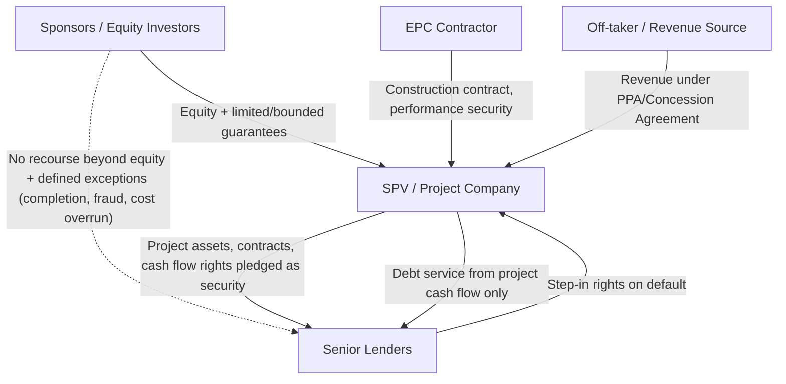
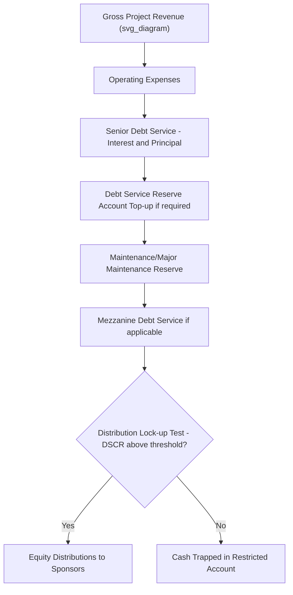

## Non-Recourse and Limited-Recourse Financing Principles

### Definition and Foundational Concept

**Non-recourse financing** is a lending structure in which the lender's claim for repayment is limited exclusively to the assets, cash flows, and contractual rights of a specific project or Special Purpose Vehicle (SPV), with no recourse to the balance sheets, other assets, or credit of the project sponsors (equity investors) beyond their equity contribution. **Limited-recourse financing** is the more commonly used real-world variant, in which sponsors retain some defined, bounded exposure beyond their equity — typically through specific guarantees or undertakings covering discrete risk periods or events (most commonly the construction phase) — while the underlying financing remains predominantly asset/cash-flow based rather than sponsor-credit based.

In practice, **pure non-recourse financing is relatively rare** in PPP and infrastructure project finance; the overwhelming majority of transactions marketed as "non-recourse" are, on close examination of the finance documents, limited-recourse structures containing sponsor support obligations for specific risk windows.

### Core Economic Rationale

**Key Points**

- **Risk isolation/ring-fencing**: The SPV is a legally and financially distinct entity from its sponsors, so project-specific risks (construction cost overruns, revenue shortfalls, operational failures) do not directly impair sponsor balance sheets beyond the equity at risk.
- **Off-balance-sheet treatment**: Historically, sponsors sought non-recourse structures partly to keep project debt off their consolidated balance sheets, though accounting standards (e.g., IFRS 10 on consolidation, and equivalent US GAAP guidance) have significantly narrowed the circumstances under which this is achievable, since control-based consolidation tests often require sponsors to consolidate SPVs they effectively control regardless of the non-recourse debt structure. [Inference] Whether a specific SPV structure achieves off-balance-sheet treatment depends on the precise consolidation accounting standard applied and the sponsor's actual degree of control, and cannot be assumed from the non-recourse financing structure alone.
- **Leveraging sponsor capital across multiple projects**: Because sponsor liability is capped, a sponsor with a fixed amount of equity capital can participate in a larger number of projects than would be possible if each project's debt exposed the sponsor's full balance sheet.
- **Enforced credit discipline through structuring**: Because lenders cannot rely on sponsor credit as a backstop, non-recourse/limited-recourse lending compels rigorous project-level due diligence, extensive contractual risk allocation, and close ongoing monitoring — a discipline that shapes much of standard project finance documentation practice.

### Distinguishing Non-Recourse, Limited-Recourse, and Full-Recourse Structures

| Structure | Lender's Claim Scope | Sponsor Exposure | Typical Use Case |
| --- | --- | --- | --- |
| Full-recourse (corporate finance) | SPV assets + sponsor's full balance sheet | Unlimited (up to sponsor's total net worth) | Corporate borrowing, smaller/lower-risk capex |
| Limited-recourse | Primarily SPV assets/cash flows + specific bounded sponsor guarantees | Capped, defined, typically time- or event-bound | Standard PPP/project finance (most common) |
| Non-recourse (pure) | SPV assets/cash flows only | None beyond equity invested | Rare; typically only after construction completion and with strong operating track record |

### Typical Areas of Limited Sponsor Recourse

**Key Points**

Even in a predominantly non-recourse structure, lenders commonly require sponsor support instruments covering the following discrete exposures:

1. **Completion guarantees**: Sponsors guarantee project completion (on time, on budget, to specification) during the construction period, since construction risk is generally viewed as the highest-risk phase and one where sponsor influence (via EPC contractor selection, oversight) is most direct.
2. **Cost overrun undertakings**: Sponsor commitment to fund cost overruns beyond an agreed contingency, sometimes structured as a standby equity commitment or a cash-deficiency support agreement.
3. **Debt service undertakings during ramp-up**: Sponsor support for a limited period post-completion while the project ramps up to full operating capacity and stabilized cash flow generation.
4. **Environmental and indemnity carve-outs**: Sponsors often remain liable, without a recourse cap, for certain "bad boy" or exclusion events, such as fraud, willful misconduct, environmental contamination caused by the sponsor, or misrepresentation, which are considered outside the ordinary risk allocation the lender is willing to accept on a non-recourse basis.
5. **Equity bridge/committed equity support**: Undertakings to fund committed equity contributions on a defined schedule, sometimes backed by a bank guarantee or letter of credit (an equity bridge loan structure) to give lenders certainty over sponsor equity funding timing.

### Security Package in Non-Recourse/Limited-Recourse Structures

Because lenders cannot rely on sponsor credit, the security package taken over the project itself becomes central to the risk mitigation architecture:

- **Assignment of project contracts**: Security assignment of the concession agreement, offtake/PPA, EPC contract, O&M contract, and insurance policies, giving lenders the ability to step into these contracts upon SPV default.
- **Pledge over SPV shares**: A share pledge from sponsors over their SPV equity, allowing lenders to enforce a change of control/ownership upon default without directly recoursing sponsor assets.
- **Charge/mortgage over project assets**: Fixed and floating charges over physical assets, receivables, bank accounts, and intellectual property/permits, to the extent the underlying legal framework and concession terms permit such security (concession agreements for public infrastructure often restrict or condition the ability to grant security over the underlying public asset itself).
- **Direct/tripartite agreements ("step-in rights")**: Agreements between lenders and the Grantor/off-taker allowing lenders to step into the SPV's position (or novate the contract to a substitute entity) upon SPV default, preserving the underlying concession/PPA rather than triggering automatic termination.
- **Cash flow waterfall and reserve accounts**: Contractually mandated cash flow allocation (see typical project finance debt service reserve and distribution waterfall mechanics), including a Debt Service Reserve Account (DSRA), maintenance reserve accounts, and lock-up covenants restricting equity distributions if coverage ratios fall below defined thresholds.

### Cash Flow Waterfall Illustration

**Example**

A simplified project finance cash flow waterfall, reflecting the priority of claims that underpins lender comfort in a non-recourse structure:

### Debt Service Coverage Ratio and Lender Risk Assessment

Because repayment depends entirely on project cash flow rather than sponsor credit, lenders in non-recourse/limited-recourse structures rely heavily on coverage ratio analysis:

$$DSCR = \frac{\text{Cash Available for Debt Service}}{\text{Scheduled Principal and Interest Payments}}$$

$$LLCR = \frac{\text{NPV of Cash Flows Available for Debt Service over Remaining Loan Life}}{\text{Outstanding Debt Balance}}$$

Where LLCR is the Loan Life Coverage Ratio. Lenders typically require minimum DSCR levels (commonly cited in a range depending on sector and revenue risk profile, e.g., contracted/availability-based projects generally justify lower minimum DSCRs than merchant/demand-risk projects) [Unverified] as specific minimum DSCR thresholds vary considerably by sector, jurisdiction, revenue risk profile (availability-based vs. demand/merchant risk), and individual lender credit policy, and should not be treated as a fixed industry-wide standard. Breach of a minimum DSCR covenant typically triggers cash trap/distribution lock-up mechanisms (restricting equity distributions) before escalating to a full event of default.

### Bankruptcy-Remoteness and SPV Structuring

A critical structural feature enabling non-recourse/limited-recourse lending is **bankruptcy remoteness** of the SPV from its sponsors:

- **Single-purpose entity restrictions**: SPV constitutional documents typically restrict the entity to conducting only the specific project's business, preventing it from taking on unrelated liabilities that could jeopardize lender security.
- **Restrictions on additional indebtedness**: Negative covenants prohibit the SPV from incurring debt beyond what is contemplated in the financing structure without lender consent.
- **Independent director/manager requirements**: Some structures require at least one independent director whose consent is needed for insolvency filings, reducing the risk of sponsor-directed voluntary bankruptcy that could disadvantage lenders.
- **Non-consolidation considerations**: Legal opinions are often required confirming that the SPV would not be substantively consolidated with sponsor entities in an insolvency proceeding, particularly relevant in jurisdictions with equitable consolidation doctrines.

### Implications for Sponsors: Risk-Return Trade-offs

**Key Points**

- **Higher cost of debt relative to full-recourse corporate borrowing**: Because lenders bear concentrated project-specific risk without a sponsor credit backstop, non-recourse/limited-recourse debt typically prices at a spread premium relative to what the same sponsor might achieve through unsecured corporate borrowing, reflecting the absence of diversification benefit lenders would otherwise gain from a broader corporate credit base.
- **More extensive and costly documentation/due diligence**: Because the lender's sole recourse is the project, financial close processes in non-recourse/limited-recourse deals typically involve substantially more extensive technical, legal, insurance, and market due diligence (independent engineer reports, traffic/revenue studies, legal opinions) compared to general corporate lending.
- **Enhanced sponsor capital efficiency**: The capped liability structure allows sponsors to pursue a portfolio strategy across multiple concurrent projects, a key driver of how infrastructure investment funds and specialized PPP developers structure their overall balance sheets and equity deployment strategy.
- **Governance and monitoring intensity**: Extensive financial covenants, reporting requirements, and lender consent rights over material project decisions (e.g., contract amendments, major capital expenditure, refinancing) are the practical trade-off sponsors accept in exchange for the liability limitation.

### Related Topics

- Project finance cash flow waterfall and distribution lock-up mechanics
- Debt Service Coverage Ratio (DSCR) and Loan Life Coverage Ratio (LLCR) analysis
- Security packages and step-in rights in project finance
- Equity bridge loans and committed equity support structures
- Completion guarantees and construction-phase risk allocation
- SPV bankruptcy remoteness and single-purpose entity structuring
- Government Support Agreements and Letters of Comfort
- First-Loss Facilities and Blended Finance Structures