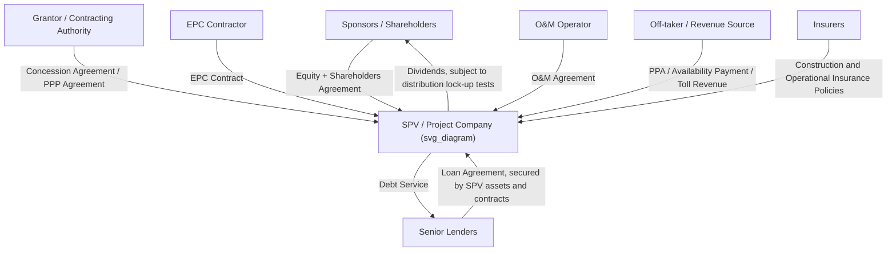
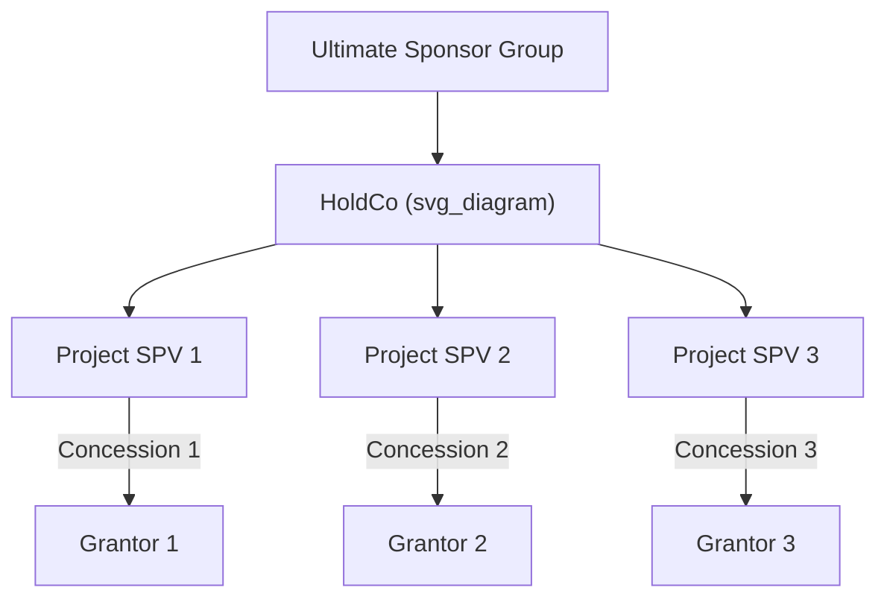

## Special Purpose Vehicle Structuring

### Definition and Core Function

A **Special Purpose Vehicle (SPV)**, also referred to as a Special Purpose Entity (SPE), Project Company, or Project Vehicle, is a legally distinct entity created specifically to design, finance, build, own, and/or operate a single infrastructure project or a defined portfolio of related assets. The SPV serves as the central contracting hub in a PPP transaction, entering into all material project contracts (concession agreement, EPC contract, O&M contract, offtake/revenue agreements, financing documents) and serving as the borrower under the project's non-recourse or limited-recourse debt (see Non-Recourse and Limited-Recourse Financing Principles).

The SPV's defining structural purpose is to **legally and financially ring-fence** the project — isolating its assets, liabilities, and cash flows from those of its sponsors and from any other projects those sponsors may be involved in — enabling the risk allocation and financing architecture characteristic of project finance.

### Why SPVs Are Structurally Necessary in PPPs

**Key Points**

- **Enables non-recourse/limited-recourse lending**: Lenders require a distinct legal entity whose assets and cash flows can be isolated, pledged as security, and monitored independently of sponsor balance sheets.
- **Facilitates multi-sponsor consortium structures**: PPP projects are frequently developed by consortia combining construction firms, infrastructure funds, and O&M operators with different risk appetites and capital structures; the SPV provides a neutral joint-venture vehicle through which these parties can co-invest under a single governance structure.
- **Contractual counterparty clarity for the Grantor**: The public sector Grantor needs a single, clearly identified private counterparty against which to enforce concession obligations, rather than an unincorporated consortium of multiple entities with unclear several liability.
- **Isolation of project-specific risk from sponsor operations**: Cost overruns, revenue shortfalls, or project-level litigation are contained within the SPV rather than exposing sponsors' other business lines or unrelated projects.
- **Facilitates equity transferability**: Sponsor equity interests in the SPV (shares or partnership interests) can, subject to concession agreement and lender consent restrictions, be transferred or refinanced independently of the underlying project assets, supporting secondary market transactions (e.g., sponsor exit post-construction to long-term infrastructure investors).

### Common Legal Forms

The specific legal form used for an SPV depends heavily on the host jurisdiction's corporate and tax law, but common structures include:

| Legal Form | Typical Jurisdiction Context | Key Characteristics |
| --- | --- | --- |
| Private limited liability company | Most civil and common law jurisdictions (e.g., Philippine corporation, UK private limited company) | Separate legal personality, limited liability for shareholders, flexible governance via shareholders' agreement |
| Joint venture company | Multi-sponsor consortium projects | Governed by a shareholders' agreement defining board composition, reserved matters, funding obligations, and exit mechanics |
| Limited partnership | Some fund-sponsored infrastructure investments (particularly in common law jurisdictions) | General partner manages the vehicle; limited partners have capped liability and typically passive roles |
| Trust structure | Certain jurisdictions with infrastructure trust vehicles (e.g., some Australian and Canadian infrastructure trusts) | Beneficial ownership held via trust units; used partly for tax efficiency reasons |

[Unverified] The specific legal form selected in any given transaction depends on host-country company law, tax treaty considerations, and sponsor jurisdiction preferences, and should be confirmed against current local counsel guidance rather than assumed from general principles.

### Typical SPV Contractual Architecture

### Governance Structure

**Key Points**

1. **Shareholders' Agreement (SHA)**: The foundational governance document among sponsors, defining:
   - Board composition and voting rights (often reflecting equity ownership percentages, though reserved matters may require supermajority or unanimous consent regardless of ownership split)
   - Funding obligations and default consequences (e.g., dilution or forced sale mechanisms if a sponsor fails to fund a capital call)
   - Transfer restrictions (rights of first refusal, tag-along/drag-along rights, lock-up periods before permitted transfer)
   - Deadlock resolution mechanisms
   - Reserved matters requiring enhanced consent (e.g., material contract amendments, additional indebtedness, distributions)
2. **Board of Directors/Management**: Typically includes representatives from major sponsors, and in some structures, an independent director whose consent is required for insolvency-related decisions, supporting bankruptcy-remoteness objectives (see Non-Recourse and Limited-Recourse Financing Principles).
3. **Lender consent rights**: Common terms agreements and financing documents typically grant lenders consent or consultation rights over specified SPV actions even though they are not shareholders, reflecting the lender's reliance on SPV-level asset and cash flow integrity for repayment.

### Capital Structure Considerations

The SPV's capital structure typically layers multiple instrument types, reflecting the risk allocation principles discussed in Non-Recourse and Limited-Recourse Financing Principles and First-Loss Facilities and Blended Finance Structures:

$$\text{Total Project Cost} = \text{Senior Debt} + \text{Mezzanine Debt (if applicable)} + \text{Subordinated Shareholder Loans} + \text{Equity}$$

**Subordinated shareholder loans** are a particularly common feature of SPV capital structures: sponsors often fund a portion of their contribution as debt (subordinated to senior/mezzanine lenders) rather than pure equity, for reasons including:

- **Tax efficiency**: Interest payments on shareholder loans may be tax-deductible at the SPV level in many jurisdictions, subject to thin-capitalization and transfer pricing rules, whereas dividends are typically not deductible. [Inference] The specific tax treatment and any thin-capitalization limits applicable to shareholder loan structuring depend entirely on the host jurisdiction's tax code and any relevant double-tax treaties, and require jurisdiction-specific tax advice rather than general assumption.
- **Repatriation flexibility**: Debt service on subordinated loans may, depending on the concession and financing documents, be subject to different (sometimes less restrictive) distribution tests than dividend payments, though senior lenders typically subordinate shareholder loan repayment behind senior debt service in the cash flow waterfall regardless.
- **Capital structure flexibility**: Debt can typically be structured with defined repayment schedules, providing sponsors a clearer capital recovery profile than pure equity subject to indefinite distribution lock-up risk.

### Multi-SPV and Holding Structures

For larger or portfolio-based PPP programs, sponsors frequently interpose additional holding company layers:

This structure supports:

- **Portfolio-level refinancing or securitization**, aggregating multiple project cash flows to achieve diversification benefits potentially improving overall financing terms
- **Tax consolidation** within permitted jurisdictional rules
- **Staged sponsor exits**, allowing sale of interests in the HoldCo (representing a diversified portfolio) rather than negotiating separate exits at each individual project SPV level
- **Isolation between projects**: maintaining separate SPVs per project (rather than a single multi-project entity) preserves the non-recourse ring-fencing between projects, so that a default in one project does not directly cross-contaminate lender security in another, subject to any cross-default provisions negotiated at the HoldCo or sponsor guarantee level

### Cross-Border and Tax Structuring Considerations

**Example**

A cross-border PPP consortium might structure ownership as follows: international sponsors hold interests through an intermediate holding vehicle in a jurisdiction offering favorable double-tax treaty network coverage with the host country (subject to substance requirements and anti-treaty-shopping provisions such as the OECD's Base Erosion and Profit Shifting, BEPS, Principal Purpose Test), which then holds equity in the local host-country SPV required by host jurisdiction law or the concession agreement to be a locally incorporated entity.

[Unverified] The specific viability and tax efficiency of any particular holding jurisdiction structure depends on the current bilateral tax treaty terms between the relevant jurisdictions, evolving BEPS-related anti-avoidance rules, and host country foreign investment regulations, all of which are subject to change and require current specialist tax and legal advice rather than reliance on general structuring patterns.

### Regulatory and Local Ownership Requirements

Many jurisdictions impose specific constraints on SPV structuring relevant to PPP transactions:

- **Local incorporation requirements**: Host jurisdictions frequently require the SPV itself (as opposed to upstream holding entities) to be incorporated locally, and to hold the concession/license directly.
- **Foreign ownership restrictions**: Certain sectors or jurisdictions impose caps on foreign equity ownership in infrastructure SPVs (common in sectors deemed strategically sensitive), requiring local sponsor participation or nominee/trust structures to satisfy compliance while preserving intended economic ownership splits among consortium members.
- **Minimum capitalization requirements**: Some concession frameworks specify minimum equity-to-debt ratios or absolute minimum paid-up capital for the SPV as a condition of contract award, intended to ensure sponsor "skin in the game" commensurate with project scale.

### SPV Lifecycle Considerations

**Key Points**

1. **Formation/pre-financial-close phase**: SPV incorporated to execute the concession agreement and enter into conditional project contracts, often with minimal initial capitalization pending financial close.
2. **Construction phase**: Highest risk period; SPV governance and lender oversight focus heavily on construction milestone monitoring, cost/schedule tracking, and completion guarantee mechanics.
3. **Operations phase**: Post-completion, governance typically shifts toward operational performance monitoring, distribution management, and coverage ratio compliance; some sponsors use this stabilization point to refinance construction-phase debt at improved terms reflecting reduced risk, or to sell down equity stakes to longer-term infrastructure investors.
4. **Refinancing events**: Common in mature operating PPPs, refinancing the SPV's debt to capture improved terms; gain-sharing mechanisms between sponsors and the Grantor upon refinancing gains are increasingly standard features of well-drafted concession agreements, reflecting the public interest rationale that some refinancing benefit stems from risk reduction achieved partly through the Grantor's own contractual commitments and performance.
5. **Handover/transfer at concession expiry**: For Build-Operate-Transfer (BOT) and similar structures, the SPV's terminal obligation is to transfer the asset (in a condition specified by the concession agreement's handback/handover standards) to the Grantor, after which the SPV is typically wound down.

### Related Topics

- Non-Recourse and Limited-Recourse Financing Principles
- First-Loss Facilities and Blended Finance Structures
- Shareholders' Agreements and consortium governance in PPPs
- Subordinated shareholder loans and thin-capitalization rules
- Refinancing gain-sharing mechanisms in concession agreements
- Cross-border tax structuring and BEPS Principal Purpose Test considerations
- Bankruptcy remoteness and single-purpose entity restrictions
- BOT/BOO/BOOT contractual structures and asset handback standards