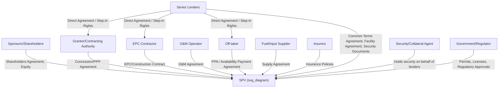

## Sponsors, Lenders, and the Project Finance Contractual Web

### Definition and Conceptual Overview

The **project finance contractual web** refers to the interlocking network of agreements that collectively allocate risk, define cash flow rights, and establish enforcement mechanisms among all parties to a PPP transaction. Unlike corporate finance, where a lender's credit assessment centers on a single borrowing entity's consolidated financial strength, project finance depends on the **quality, completeness, and mutual consistency of this contractual web**, since the SPV (see Special Purpose Vehicle Structuring) has no operating history or diversified asset base to fall back on — its creditworthiness is entirely a function of the contracts it holds and how tightly those contracts bind counterparties to their obligations.

This item addresses the two principal classes of parties — **sponsors** (equity) and **lenders** (debt) — and how the contractual architecture connecting them and other stakeholders is structured to make the project financeable.

### Sponsors: Role, Motivations, and Categories

**Key Points**

Sponsors are the equity investors who initiate, develop, and ultimately own the SPV. Sponsor categories commonly seen in PPP transactions include:

1. **Strategic/industrial sponsors**: Construction companies, EPC contractors, or O&M operators who sponsor projects partly to secure construction or operations contracts for their own operating businesses, in addition to seeking equity returns. Their motivation often blends project-level IRR with upstream contract margin capture.
2. **Financial sponsors**: Infrastructure investment funds, pension funds, sovereign wealth funds, and insurance companies investing primarily for long-duration, inflation-linked, or contracted cash flow returns, generally without operational involvement.
3. **Government/state-owned sponsors**: In some jurisdictions or sectors, a state-owned enterprise participates as a minority or co-sponsor, sometimes to satisfy local participation requirements or to retain strategic oversight of critical infrastructure.
4. **Development sponsors**: Entities specializing in originating and de-risking projects through financial close, then partially or fully divesting to longer-term financial sponsors post-construction (a "develop-to-sell" or "develop-to-core" strategy).

Sponsor economic interest is typically measured through **project-level equity IRR**, factoring in the leverage effect of the underlying debt structure, the timing of distributions (constrained by lock-up/DSCR tests, see Non-Recourse and Limited-Recourse Financing Principles), and any refinancing or exit gains realized during the concession term.

### Lenders: Role, Categories, and Risk Perspective

**Key Points**

1. **Commercial banks**: Traditionally the dominant senior lenders in project finance, providing construction-phase and term debt; increasingly cautious on long-tenor infrastructure debt due to Basel III/IV capital adequacy requirements that penalize long-duration illiquid lending, prompting growth in institutional and capital markets alternatives.
2. **Institutional lenders/bondholders**: Pension funds, insurance companies, and asset managers investing via project bonds (public or private placement), typically preferring post-construction, operational-phase risk (lower risk, matching their liability duration profiles) over greenfield construction risk.
3. **Multilateral Development Banks (MDBs) and Development Finance Institutions (DFIs)**: Provide direct loans, guarantees, and often anchor/mobilize commercial co-lenders, particularly in higher-risk emerging market contexts (see First-Loss Facilities and Blended Finance Structures).
4. **Export Credit Agencies (ECAs)**: Provide buyer credit, direct loans, or guarantees tied to procurement from their home country (see Role of Export Credit Agencies in PPP Risk Mitigation).
5. **Mezzanine/subordinated lenders**: Bridge the gap between senior debt and sponsor equity, accepting higher risk for higher (often equity-like) returns.

Lenders' central concern, given the non-recourse/limited-recourse nature of the financing, is the **bankability of the contractual web itself** — specifically whether the sum of all contracts creates a sufficiently reliable, back-to-back-matched cash flow stream to service debt under a reasonable range of stress scenarios.

### The Contractual Web: Structural Map

### Back-to-Back Contract Matching Principle

A foundational design principle of the contractual web is **back-to-back risk matching**: the SPV's obligations under upstream contracts (to lenders, to the Grantor) should, wherever possible, be mirrored by equivalent obligations imposed on downstream contractors and suppliers, so that risk passes through the SPV rather than resting with it.

**Example**

If the concession agreement imposes liquidated damages on the SPV for late completion, the EPC contract should impose matching (or larger, to cover SPV margin/administrative buffer) liquidated damages on the EPC contractor for the same delay, so that the SPV is not left bearing uncompensated exposure to a risk it does not control. Similarly, performance guarantees on availability or output under the offtake agreement should be matched by equivalent performance warranties in the O&M contract.

[Inference] In practice, perfect back-to-back matching is rarely fully achievable — gaps commonly remain around caps on contractor liability, force majeure definitional mismatches between upstream and downstream contracts, and timing differences between claim notification periods, and identifying and negotiating these gaps is a central task of project finance legal and technical due diligence.

### Key Contracts in the Web and Their Function

| Contract | Parties | Primary Function |
| --- | --- | --- |
| Concession/PPP Agreement | Grantor – SPV | Defines scope, term, performance standards, payment/tariff mechanism, termination rights |
| EPC Contract | SPV – EPC Contractor | Construction delivery, typically fixed-price, date-certain, with liquidated damages for delay/performance shortfall |
| O&M Agreement | SPV – Operator | Ongoing operations and maintenance performance standards, often with incentive/penalty regimes |
| Offtake/PPA/Availability Agreement | SPV – Off-taker/Grantor | Revenue mechanism — defines payment triggers (availability, output, demand/toll volume) |
| Common Terms Agreement (CTA) | SPV – all senior lenders | Harmonizes terms across multiple lender tranches (commercial banks, ECAs, DFIs) |
| Facility/Loan Agreement | SPV – Lenders | Loan terms, covenants, conditions precedent, events of default |
| Security/Intercreditor Agreement | Lenders – Security Agent | Governs priority and enforcement of security among multiple creditor classes |
| Direct Agreements | Lenders – Grantor/Off-taker/EPC/O&M | Grants lenders step-in and cure rights vis-à-vis third-party counterparties |
| Shareholders' Agreement | Sponsors | Governs sponsor relationship, funding obligations, transfer restrictions |
| Insurance Policies | SPV – Insurers | Risk transfer for construction, property, business interruption, third-party liability |

### The Common Terms Agreement (CTA) in Multi-Lender Structures

Where multiple lender classes participate (commercial banks, ECAs, DFIs — see Role of Export Credit Agencies in PPP Risk Mitigation), a **Common Terms Agreement** is typically used to harmonize:

- Common representations, warranties, and conditions precedent applicable across all tranches
- Shared financial covenants (minimum DSCR, leverage ratios) and shared events of default
- Common security package and intercreditor priority arrangements
- Coordinated waiver/amendment mechanics, often requiring majority lender consent thresholds calibrated by exposure

This avoids the inefficiency and legal risk of each lender class negotiating fully separate, potentially conflicting covenant packages against the same SPV cash flows.

### Direct Agreements and Step-In Rights

**Key Points**

**Direct agreements** (sometimes called "tripartite agreements" or "consent and direct agreements") are entered into directly between lenders and key project counterparties (the Grantor, off-taker, EPC contractor, O&M operator) who are not themselves parties to the financing documents. Their core functions:

- **Notice and cure rights**: Requiring the counterparty to notify lenders of any SPV default under the underlying contract and giving lenders a defined period to cure the default or step in before the counterparty can terminate.
- **Step-in/novation rights**: Permitting lenders (or a lender-nominated substitute entity) to assume the SPV's position under the contract upon SPV default, preserving contract continuity rather than triggering automatic termination that would destroy the project's value as loan security.
- **Non-disturbance assurances**: Grantor/off-taker commitments not to terminate the underlying concession/offtake agreement solely due to an SPV default under the financing documents, provided lenders exercise their step-in rights within agreed timeframes.

This mechanism is central to why lenders are willing to extend non-recourse/limited-recourse debt: without direct agreements, a lender's security over project contracts would be largely illusory, since the Grantor or off-taker could simply terminate the underlying contract upon SPV default, leaving lenders with security over a shell entity holding no live revenue-generating rights.

### Intercreditor Dynamics

Where more than one class of debt exists (senior, mezzanine, ECA-guaranteed tranches, DFI tranches), an **Intercreditor Agreement** governs:

- **Payment priority (cash flow waterfall) and security priority** — which may differ (e.g., pari passu security but subordinated payment priority for mezzanine debt)
- **Voting and consent thresholds** for waivers, amendments, and enforcement actions, often requiring different majority thresholds depending on the significance of the decision (e.g., simple majority for minor waivers, unanimous consent for release of security or extension of final maturity)
- **Standstill provisions**, restricting subordinated/mezzanine lenders from taking unilateral enforcement action for a defined period following a senior default, preserving senior lenders' ability to manage a workout process in an orderly manner
- **Turnover provisions**, requiring any payments received by a subordinated creditor in breach of the agreed priority to be turned over to senior creditors

### Illustrative Risk-Allocation Logic Across the Web

$$\text{SPV Net Cash Flow Available for Debt Service} = \text{Revenue (Offtake/Concession)} - \text{O\&M Costs} - \text{Reserve Fundings} - \text{Taxes}$$

Every contract in the web is designed, in principle, to protect the stability and predictability of this equation: fixed-price EPC contracts protect the capital cost base underlying debt sizing; O&M contracts with performance guarantees protect the cost side; offtake/concession agreements with defined payment mechanisms protect the revenue side; and insurance protects against catastrophic disruption to any of these components. [Inference] The degree to which any individual project's contractual web actually achieves this protective effect in practice depends on the specific drafting quality, counterparty creditworthiness, and negotiated risk caps in each contract, and is assessed deal-by-deal through lender due diligence (technical, legal, insurance, and market advisors) rather than assumed from the general structure.

### Common Points of Contractual Web Failure

**Key Points**

- **Liability cap mismatches**: EPC or O&M contractor liability caps set below the SPV's own exposure under the concession agreement or financing documents, leaving a residual uncovered risk gap.
- **Force majeure definitional inconsistency**: Different force majeure definitions or relief mechanisms across the concession agreement, EPC contract, and financing documents can create situations where the SPV is excused from one obligation but not a corresponding upstream or downstream obligation.
- **Termination trigger misalignment**: Termination rights under the concession agreement not adequately synchronized with default/acceleration triggers under the financing documents, potentially leaving lenders without adequate time to exercise step-in rights before contract termination becomes irreversible.
- **Currency and indexation mismatches**: Revenue denominated or indexed differently from debt service or cost obligations, creating unhedged residual currency or inflation risk within the SPV despite an apparently complete contractual web.

### Related Topics

- Special Purpose Vehicle Structuring
- Non-Recourse and Limited-Recourse Financing Principles
- Direct Agreements and lender step-in rights mechanics
- Intercreditor Agreements and subordination structures
- Common Terms Agreements in multi-source project financing
- Role of Export Credit Agencies in PPP Risk Mitigation
- First-Loss Facilities and Blended Finance Structures
- Force majeure and change-in-law risk allocation across concession and financing documents