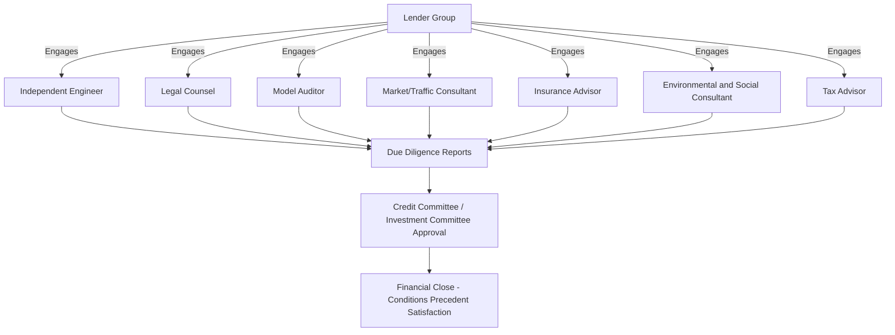
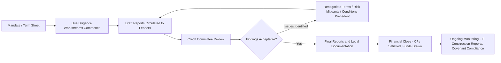

## Due Diligence Processes in Project Finance

### Definition and Purpose

**Due diligence** in project finance is the structured, multi-disciplinary investigation process undertaken by lenders (and often independently by sponsors and equity investors) to verify, quantify, and stress-test every material risk embedded in the contractual web (see Sponsors, Lenders, and the Project Finance Contractual Web) before committing capital. Because lending is non-recourse or limited-recourse (see Non-Recourse and Limited-Recourse Financing Principles), lenders cannot rely on a borrower's historical financial statements or diversified balance sheet as a credit proxy — due diligence on the specific project is the primary substitute for that missing credit history, making it substantially more extensive than diligence typically performed for corporate lending of comparable size.

### Core Due Diligence Workstreams

**Key Points**

Project finance due diligence is typically organized into parallel workstreams, each led by a specialist advisor engaged by the lender group (sometimes jointly with sponsors, though independent lender-side advisors are standard for larger transactions):

1. **Technical due diligence** — led by an Independent Engineer (IE), covering design adequacy, construction methodology, cost and schedule realism, technology risk, and O&M plan feasibility.
2. **Legal due diligence** — led by lenders' legal counsel, covering the enforceability, consistency, and completeness of the contractual web, corporate/SPV structure, permits, and security package validity.
3. **Financial/model due diligence** — led by a Model Auditor, verifying the integrity, logic, and assumption reasonableness of the financial model used to size and structure debt.
4. **Market/commercial due diligence** — covering demand forecasts (traffic, patronage, tariff/off-take volumes), competitive dynamics, and revenue risk drivers, particularly critical for merchant/demand-risk projects as opposed to availability-based structures.
5. **Insurance due diligence** — led by an Insurance Advisor, reviewing the adequacy, market availability, and pricing of the insurance program relative to the risks the contractual web assumes will be insured rather than contractually allocated.
6. **Environmental and Social due diligence (ESDD)** — assessing compliance with applicable environmental and social standards (host country law, and often lender-specific standards such as the Equator Principles or IFC Performance Standards where relevant lenders are signatories).
7. **Tax and accounting due diligence** — reviewing SPV tax structuring efficiency, withholding tax exposure, and accounting/consolidation treatment implications for sponsors.

### Technical Due Diligence: Scope and Independent Engineer Role

**Key Points**

The **Independent Engineer (IE)** is retained by lenders (though frequently paid by the SPV, a common structuring convention to preserve lender independence while allocating cost appropriately) to provide an objective technical opinion, typically covering:

- **Design review**: Assessing whether the engineering design meets the performance and output specifications required under the offtake/concession agreement and applicable technical codes.
- **Construction cost and schedule review**: Benchmarking the EPC contract price and construction schedule against comparable projects, assessing contingency adequacy, and flagging any gap between the EPC contract scope and the full scope required for the project to achieve contractual performance obligations (a "scope gap" is a common and material finding).
- **Technology risk assessment**: For projects using less proven or first-of-a-kind technology, assessing performance risk, warranty adequacy, and whether performance guarantees in the EPC and O&M contracts are realistic and enforceable.
- **O&M plan review**: Evaluating whether proposed O&M budgets, staffing, and maintenance schedules are adequate to sustain the performance levels assumed in the financial model over the full concession/loan term, including major maintenance/lifecycle capital expenditure planning.
- **Construction monitoring role**: Post-financial-close, the IE typically continues in an ongoing monitoring role, certifying drawdown requests against actual construction progress and flagging delays or cost overruns to lenders in periodic reports.

### Legal Due Diligence: Scope

**Key Points**

- **Corporate structure verification**: Confirming SPV incorporation, capitalization, and shareholder structure match what is represented, and that no undisclosed liabilities or encumbrances exist.
- **Contract review for consistency**: Cross-checking the concession agreement, EPC contract, O&M agreement, offtake agreement, and financing documents for the back-to-back matching gaps discussed in Sponsors, Lenders, and the Project Finance Contractual Web (liability caps, force majeure definitions, termination triggers).
- **Permit and license verification**: Confirming all required permits, licenses, and regulatory approvals are validly obtained, in good standing, and (where relevant) transferable or capable of being stepped into by lenders upon enforcement.
- **Security package enforceability**: Legal opinions confirming that the intended security (share pledges, asset charges, account pledges, assignment of contracts) is validly created and enforceable under the relevant governing law, including any host-country restrictions on foreign lender security enforcement over strategic infrastructure assets.
- **Title and land rights verification**: Particularly critical for greenfield projects, confirming clear land title, right-of-way, or leasehold rights sufficient for construction and long-term operation without encumbrance disputes.

### Financial Model Due Diligence

The **financial model** is the quantitative backbone against which debt sizing, coverage ratios, and sponsor equity returns are all assessed. Model due diligence, typically performed by an independent Model Auditor, covers:

- **Mechanical integrity**: Verifying the model is free of formula errors, circular reference issues (common in models with interest-during-construction or cash sweep mechanics), and internally consistent linkage between the three financial statements.
- **Assumption reasonableness**: Benchmarking key assumptions (construction cost, O&M cost escalation, revenue/demand forecasts, discount/interest rate assumptions, inflation indices) against market data and comparable transactions.
- **Sensitivity and scenario testing**: Confirming the model correctly calculates coverage ratios (DSCR, LLCR — see Non-Recourse and Limited-Recourse Financing Principles) under stress scenarios (construction delay, cost overrun, revenue downside, interest rate movement) that lenders use to determine appropriate debt sizing and covenant thresholds.

$$\text{Debt Sizing (illustrative)} = \min\left(\frac{\text{PV of Projected CFADS at Target DSCR}}{1},\ \text{Maximum Gearing Ratio} \times \text{Total Project Cost}\right)$$

Where CFADS denotes Cash Flow Available for Debt Service. [Inference] Actual debt sizing methodology varies by lender, sector, and jurisdiction, and typically applies the more conservative (lower) of multiple sizing tests (average DSCR, minimum DSCR, LLCR, and maximum leverage constraints) rather than a single formula; the equation above illustrates the general logic rather than a universally standardized calculation.

### Market/Commercial Due Diligence

For projects with demand or merchant revenue risk (as opposed to availability-based payment structures), market due diligence is particularly critical:

- **Independent traffic/demand studies**: For toll roads, ports, or airports, independent traffic engineers produce demand forecasts under base and stress case scenarios, which lenders typically haircut relative to sponsor projections to build in conservatism.
- **Tariff/pricing regulatory review**: Assessing the durability and predictability of the tariff-setting mechanism, particularly relevant where tariffs are subject to periodic regulatory review or political sensitivity (a key link to the change-in-law and regulatory risk categories addressed by Government Support Agreements and Letters of Comfort).
- **Competitive landscape assessment**: Evaluating risk of competing infrastructure (e.g., a parallel free road route to a toll road, or a competing port) that could erode projected demand over the concession term.

### Environmental and Social Due Diligence (ESDD)

**Key Points**

- **Regulatory compliance verification**: Confirming the project has obtained, or has a credible pathway to obtain, all required environmental permits and approvals under host-country law.
- **International standards alignment**: Where lenders are signatories to the **Equator Principles** (a voluntary risk management framework based substantially on the IFC Performance Standards, adopted by many commercial banks active in project finance) or where DFIs/MDBs are involved, additional environmental and social standards apply, covering biodiversity impact, involuntary resettlement, indigenous peoples' rights, labor standards, and community health and safety.
- **Resettlement Action Plans (RAPs)**: Where land acquisition requires resettlement of affected communities, due diligence assesses the adequacy and implementation status of resettlement compensation and livelihood restoration plans against applicable standards.
- **Climate risk assessment**: Increasingly incorporated as a distinct due diligence stream, assessing both physical climate risk (e.g., flood, extreme weather exposure over the asset's operating life) and transition risk (e.g., regulatory or market shifts affecting carbon-intensive projects).

### Insurance Due Diligence

The Insurance Advisor assesses whether the proposed insurance program appropriately covers risks that the contractual web does not otherwise allocate contractually, including:

- **Construction All Risks (CAR) and Delay in Start-Up (DSU) insurance** adequacy during the construction phase
- **Operational property damage and business interruption insurance** adequacy during operations
- **Third-party liability coverage** sufls
- **Market capacity and pricing risk**: Confirming that the assumed insurance program is actually available in the market at the pricing assumed in the financial model, and identifying risks (e.g., certain natural catastrophe perils) where coverage may be capped, excluded, or prohibitively expensive, requiring residual risk retention analysis

### Due Diligence Timeline and Financial Close Sequencing

### Conditions Precedent (CPs) as Due Diligence Output

**Example**

Due diligence findings are typically translated into a detailed **Conditions Precedent (CP) list** that must be satisfied before financial close (or before subsequent drawdowns), such as:

- Delivery of all legal opinions confirming security enforceability and corporate authority
- Evidence of all required permits and land rights being validly obtained
- Independent Engineer's confirmation that the EPC contract scope matches the design basis with no unaddressed scope gaps
- Insurance policies incepted and premiums paid for the initial coverage period
- Financial model finalized and locked, reflecting agreed base case assumptions post-due-diligence adjustment
- Equity contribution evidence (or equity bridge/committed funding letters) confirming sponsor funding is in place per the agreed funding sequence

### Ongoing Monitoring as Extended Due Diligence

Due diligence does not end at financial close; it continues throughout the loan life via:

- **Periodic Independent Engineer reports** during construction, certifying progress against schedule/budget for drawdown approval purposes
- **Annual/periodic technical and insurance reviews** during operations
- **Financial covenant compliance certificates** (DSCR, leverage) reviewed against the audited model outputs
- **Material contract amendment review**, requiring lender consent (per financing document covenants) and often triggering supplementary technical or legal due diligence on the proposed amendment's risk implications

### Common Due Diligence Findings and Their Risk Allocation Consequences

**Key Points**

- **EPC scope gaps** identified by the IE often lead to renegotiation of the EPC contract price/scope, or to lenders requiring additional sponsor contingency funding commitments before financial close.
- **Legal inconsistencies** (e.g., mismatched liability caps across contracts) frequently result in negotiated contract amendments, additional sponsor guarantees, or increased debt service reserve requirements to compensate for the residual gap.
- **Demand forecast conservatism gaps**, where independent traffic studies materially undercut sponsor projections, typically lead to reduced debt sizing (lower gearing) or a shift toward more conservative coverage ratio covenants.
- **Environmental/social compliance gaps** can delay financial close significantly or, in some cases, cause lenders (particularly Equator Principles signatories or MDBs/DFIs with binding safeguard policies) to decline participation entirely until remediated.

[Unverified] The specific weight given to any particular due diligence finding, and whether it results in repricing, restructuring, or transaction abandonment, depends on the severity of the finding relative to the overall risk tolerance of the specific lender group and cannot be generalized across all transactions.

### Related Topics

- Sponsors, Lenders, and the Project Finance Contractual Web
- Non-Recourse and Limited-Recourse Financing Principles
- Special Purpose Vehicle Structuring
- Independent Engineer role in construction monitoring and drawdown certification
- Equator Principles and IFC Performance Standards in project finance
- Financial model construction and coverage ratio methodology (DSCR, LLCR)
- Conditions Precedent structuring and financial close sequencing
- Resettlement Action Plans and social safeguard compliance