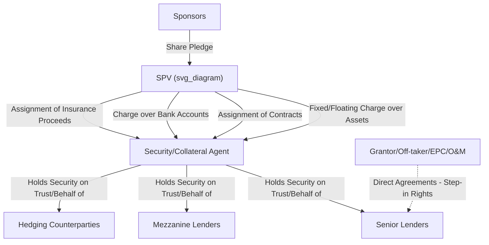
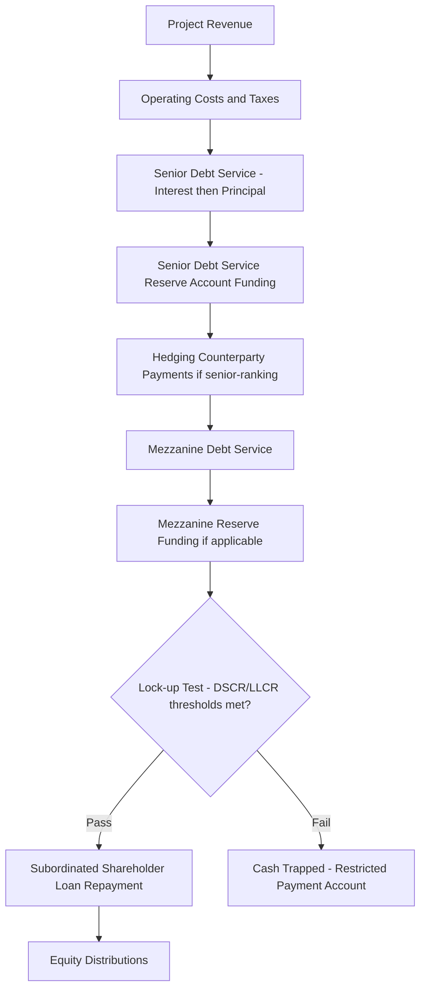

## Security Packages and Intercreditor Arrangements

### Definition and Function within Project Finance

A **security package** is the complete set of collateral interests granted by the SPV (and, where applicable, its shareholders) in favor of lenders to secure repayment of project debt. Because project finance is non-recourse or limited-recourse (see Non-Recourse and Limited-Recourse Financing Principles), the security package — rather than sponsor credit — is the lender's principal recovery mechanism upon default, and is designed to give lenders effective control over the SPV's assets, cash flows, and contractual rights sufficient to either remediate a default or realize value through enforcement.

An **intercreditor arrangement** is the contractual framework governing the relative rights, priorities, and coordinated behavior of multiple classes of creditors (senior lenders, mezzanine lenders, hedging counterparties, ECAs, DFIs) who hold competing or overlapping claims against the same SPV and security package. It exists because project finance transactions frequently involve several distinct creditor classes (see Sponsors, Lenders, and the Project Finance Contractual Web; Role of Export Credit Agencies in PPP Risk Mitigation) whose interests must be reconciled to avoid destructive, uncoordinated enforcement action.

### Core Components of the Security Package

**Key Points**

1. **Share pledge/charge over SPV equity**: Sponsors pledge their shares in the SPV to lenders, enabling lenders to enforce a change of control (transferring ownership to themselves or a lender-nominated substitute) without directly recoursing sponsor assets beyond the pledged shares.
2. **Fixed and floating charges over SPV assets**: Security over physical project assets (plant, equipment, real property interests to the extent grantable), intellectual property, and any other tangible or intangible assets held by the SPV.
3. **Assignment of project contracts**: Security assignment of the SPV's rights under the concession agreement, EPC contract, O&M agreement, offtake/PPA, and insurance policies, allowing lenders to step into these contracts upon default (operationalized through Direct Agreements — see Sponsors, Lenders, and the Project Finance Contractual Web).
4. **Charge/pledge over bank accounts and receivables**: Security over the SPV's project accounts (revenue account, debt service reserve account, maintenance reserve account, distribution account), typically structured through an account bank agreement that restricts withdrawal rights absent lender consent or satisfaction of specified conditions.
5. **Assignment of insurance proceeds**: Ensuring insurance payouts (particularly business interruption and property damage proceeds) flow to lenders or into a controlled account rather than directly to the SPV or sponsors, preserving their availability for reconstruction or debt service.
6. **Step-in rights via Direct Agreements**: While not strictly "security" in the proprietary sense, direct agreements with the Grantor, off-taker, EPC contractor, and O&M operator function as a critical complement to the security package, since security over a contract is of limited value if the counterparty can simply terminate it upon SPV default.

### Jurisdictional Considerations in Security Creation

**Key Points**

- **Restrictions on security over public/concession assets**: Many concession agreements restrict or prohibit the SPV from granting security directly over the underlying public infrastructure asset itself (since legal title may remain with the Grantor throughout the concession term in BOT-type structures), meaning lender security instead focuses on the SPV's contractual rights, receivables, and equity rather than the physical asset itself.
- **Perfection requirements**: Security interests typically require specific perfection steps under local law (registration with a companies registry, land registry, or secured transactions registry) to be enforceable against third parties and effective in insolvency; failure to properly perfect security is a common and material legal due diligence finding (see Due Diligence Processes in Project Finance).
- **Foreign lender enforcement restrictions**: Some jurisdictions impose restrictions on foreign entities directly holding certain security types (e.g., land mortgages) or enforcing security over strategically sensitive infrastructure, sometimes necessitating the use of a local security trustee or agent structure.
- **Security trustee/agent structures**: Because syndicated or multi-tranche lending involves numerous individual lenders, security is typically granted to and held by a single **Security Agent** or **Security Trustee** on behalf of all secured parties, avoiding the impracticality of registering security separately in favor of each individual lender and simplifying enforcement coordination.

[Unverified] The specific security instruments available, their perfection requirements, and any restrictions on foreign lender enforcement vary substantially by jurisdiction and are subject to local law that requires current jurisdiction-specific legal advice rather than generalized assumption.

### Intercreditor Agreement: Core Functions

**Key Points**

1. **Priority ranking (security and payment)**: Establishing which creditor classes rank ahead of others for both (a) proceeds of security enforcement and (b) ordinary course payment priority in the cash flow waterfall — these two priorities are not always identical (e.g., debt may be secured pari passu but subordinated in payment priority).
2. **Voting and consent thresholds**: Defining the majority lender threshold (e.g., simple majority, supermajority, or unanimous) required for various categories of decisions — waivers, amendments, extensions of maturity, release of security — with more consequential decisions (often termed "entrenched rights" or requiring unanimous or near-unanimous consent) requiring higher thresholds.
3. **Standstill provisions**: Restricting subordinated or mezzanine creditors from taking independent enforcement action for a defined standstill period following a senior default, allowing senior lenders to lead and control any workout or enforcement process without interference.
4. **Turnover provisions**: Requiring any payment received by a subordinated creditor in violation of the agreed payment waterfall or during a standstill/payment blockage period to be held on trust for, and turned over to, senior creditors.
5. **Enforcement decision-making**: Specifying which creditor class (typically senior lenders, or a designated "Majority Lenders" group under the Common Terms Agreement) controls enforcement decisions and instructs the Security Agent.
6. **Payment blockage/standstill triggers**: Defining events (e.g., a senior payment default) that trigger a blockage on payments to subordinated creditors even absent a formal acceleration of senior debt.

### Priority Structures: Pari Passu vs. Sequential/Tiered

| Structure | Security Priority | Payment Priority | Typical Use Case |
| --- | --- | --- | --- |
| Pari passu, sequential payment | All senior lenders share security equally | Senior lenders paid pro rata before any subordinated tranche | Standard multi-bank senior syndicate |
| Structurally subordinated | Mezzanine at a different (often holding company) level | Naturally subordinated by corporate structure | Mezzanine provided at HoldCo level, senior debt at SPV level |
| Contractually subordinated | Same security pool, contractual subordination | Explicit intercreditor subordination provisions | Mezzanine/subordinated debt at the same SPV level as senior debt |
| ECA/DFI pari passu with commercial | Shared pro rata security | Shared pro rata payment priority, subject to CTA harmonization | Multi-source ECA/DFI/commercial bank financing (see Role of Export Credit Agencies in PPP Risk Mitigation) |

### The Cash Flow Waterfall and Its Relationship to Intercreditor Priority

The payment priority established by the intercreditor arrangement is typically operationalized through the SPV's cash flow waterfall (see Non-Recourse and Limited-Recourse Financing Principles for the general waterfall structure):

### Hedging Arrangements within the Security and Intercreditor Structure

**Example**

Where the SPV's debt carries floating interest rates but project cash flows are relatively fixed (e.g., availability payments), the SPV typically enters interest rate swaps to hedge exposure. Hedging counterparties are usually brought into the intercreditor structure on a **pari passu basis with senior lenders**, since an unhedged position would otherwise undermine the very cash flow stability the security package is designed to protect. This requires:

- Inclusion of hedge termination payments within the secured obligations and the cash flow waterfall (often ranking senior, alongside or just behind senior debt service)
- Coordination of hedge counterparty voting/consent rights within the intercreditor agreement, since a hedge termination event (e.g., counterparty insolvency) can have security and enforcement implications similar to a lender default

### Enforcement Mechanics Upon Default

**Key Points**

1. **Event of Default declaration**: A qualifying majority of lenders (per intercreditor/CTA thresholds) declares an Event of Default and may accelerate the debt, though acceleration itself does not automatically trigger enforcement of security.
2. **Standstill period observance**: Subordinated creditors are typically restrained from independent action during the agreed standstill period, preserving senior lenders' control over the process.
3. **Instruction to Security Agent**: The Security Agent acts only on instructions from the requisite majority of secured creditors (per intercreditor agreement thresholds), rather than at its own discretion, and is typically indemnified by the lender group for actions taken on their instruction.
4. **Step-in via Direct Agreements**: Before or instead of full enforcement (share sale, asset sale), lenders may exercise step-in rights under direct agreements to remediate the default while preserving the underlying concession/offtake contracts — often the preferred first course of action since outright enforcement risks losing the value embedded in those contracts if the Grantor or off-taker were to treat enforcement as triggering termination rights.
5. **Realization and application of proceeds**: Proceeds from enforcement (e.g., sale of pledged shares, or a negotiated restructuring) are applied according to the agreed priority waterfall in the intercreditor agreement.

[Inference] Whether lenders in practice pursue step-in/remediation versus outright enforcement in any given default scenario depends heavily on the specific circumstances (nature of the default, project's remaining value, relationship with the Grantor, and the terms of applicable direct agreements), and there is no single standard sequence that applies uniformly across all transactions.

### Common Negotiation Tension Points

**Key Points**

- **Senior lenders vs. mezzanine lenders**: Mezzanine lenders typically seek shorter standstill periods and greater information/consultation rights, while senior lenders seek maximum control and the longest practicable standstill to manage a workout without interference.
- **ECA/DFI vs. commercial bank priority**: ECAs and DFIs sometimes require specific carve-outs or preferential treatment (e.g., preferred creditor status commonly associated with certain MDBs) that must be reconciled within the Common Terms Agreement and intercreditor structure alongside commercial lenders who may resist subordinating their own claims.
- **Grantor consent to security enforcement**: Concession agreements frequently impose conditions on the Grantor's consent to a change of SPV ownership resulting from share pledge enforcement (e.g., requiring the incoming controller to meet defined technical/financial capability criteria), which must be carefully negotiated to avoid undermining the practical value of the share pledge as security.
- **Sponsor step-in vs. lender step-in priority**: Some structures grant sponsors a limited right to cure defaults before lenders can exercise enforcement rights, requiring careful sequencing in the direct agreements and intercreditor documents to avoid conflicting rights.

### Related Topics

- Non-Recourse and Limited-Recourse Financing Principles
- Sponsors, Lenders, and the Project Finance Contractual Web
- Special Purpose Vehicle Structuring
- Direct Agreements and lender step-in rights mechanics
- Common Terms Agreements in multi-source project financing
- Due Diligence Processes in Project Finance
- Hedging strategies and interest rate risk management in project finance
- Role of Export Credit Agencies in PPP Risk Mitigation