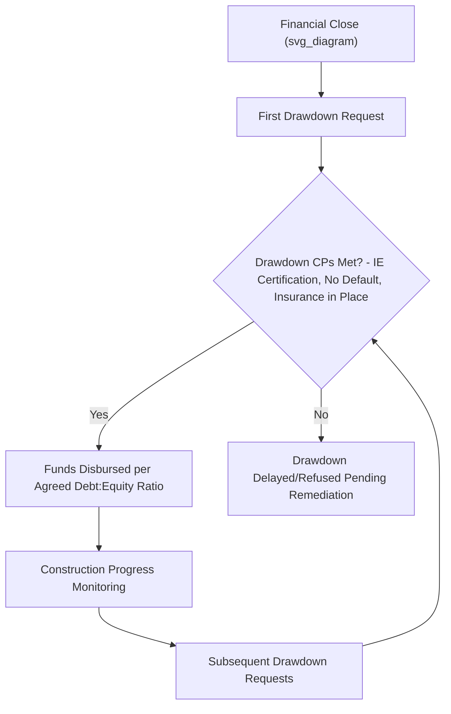

## Financial Close and Conditions Precedent

### Definition and Significance

**Financial Close (FC)** is the point in a PPP transaction's development at which all financing documents, project contracts, and security arrangements have been fully executed, and all specified **Conditions Precedent (CPs)** have been satisfied or waived, such that the SPV (see Special Purpose Vehicle Structuring) becomes entitled to draw down debt and equity funding to commence (or continue) project implementation. Financial Close is a distinct milestone from **Commercial/Contract Close** (execution of the concession agreement) and from **Effective Date** or **Notice to Proceed** (which may follow FC if additional regulatory or governmental conditions remain outstanding).

**Conditions Precedent** are the specific, itemized requirements — legal, technical, financial, and documentary — that must be satisfied before lenders are obligated to fund. They operationalize the findings and requirements arising from due diligence (see Due Diligence Processes in Project Finance) into a discrete, verifiable checklist gating the release of funds.

### Position within the PPP Project Lifecycle

The gap between Commercial Close and Financial Close — often called the **"financing gap"** — can range from a few months to well over a year in complex, multi-lender, cross-border transactions, and is a period of significant execution risk: bid-stage assumptions (cost estimates, interest rate assumptions, market conditions) can shift, sometimes requiring re-negotiation of terms before CPs can realistically be satisfied.

### Categories of Conditions Precedent

**Key Points**

Conditions Precedent are typically organized into the following categories:

1. **Corporate/authority CPs**: Evidence of SPV incorporation, board/shareholder resolutions authorizing the transaction, and confirmation of signing authority for all parties.
2. **Legal opinion CPs**: Delivery of legal opinions from counsel in each relevant jurisdiction confirming the enforceability of the financing documents, validity of the security package (see Security Packages and Intercreditor Arrangements), and absence of conflicts with existing law or contracts.
3. **Contractual CPs**: Executed and effective concession agreement, EPC contract, O&M agreement, offtake/PPA agreement, and any direct agreements with the Grantor and key counterparties, each in form and substance satisfactory to lenders.
4. **Permitting and regulatory CPs**: Evidence that all material permits, licenses, and governmental approvals required to commence construction have been obtained (or, in some structures, a defined and lender-accepted pathway and timeline for obtaining any outstanding permits).
5. **Financial CPs**: Finalized and locked financial model reflecting agreed base case assumptions; evidence of sponsor equity or equity bridge funding commitments; hedging arrangements executed (where required); rating agency confirmations (for rated project bonds).
6. **Insurance CPs**: Insurance policies incepted for the relevant coverage period, premiums paid, and insurance broker letters of undertaking/confirmation of coverage adequacy delivered.
7. **Technical CPs**: Independent Engineer's initial due diligence report confirming no unresolved material technical issues, and confirmation of construction commencement readiness (e.g., site access, land rights).
8. **Security perfection CPs**: Evidence that security interests have been validly created and, where applicable, registered/perfected under local law.

### Illustrative Conditions Precedent Checklist Structure

**Example**

| CP Category | Example Item | Typical Responsible Party |
| --- | --- | --- |
| Corporate | Certified copies of SPV constitutional documents and board resolutions | SPV/Sponsors |
| Legal opinions | Local counsel opinion on enforceability of security | Lenders' Counsel |
| Contractual | Fully executed EPC contract with no unresolved scope gaps per IE review | SPV/EPC Contractor |
| Permitting | Environmental Compliance Certificate / equivalent approval | SPV/Regulator |
| Financial | Locked financial model and agreed base case | SPV/Model Auditor |
| Insurance | Construction All Risks policy incepted, premium receipt evidenced | SPV/Insurance Broker |
| Technical | Independent Engineer's Financial Close Report with no unresolved red flags | Independent Engineer |
| Security | Registration of share pledge with companies registry | Security Agent/Local Counsel |

### Conditions Subsequent and Post-Close Undertakings

Not all requirements can realistically be satisfied before first drawdown; lenders commonly permit certain items to be completed as **Conditions Subsequent (CS)** — obligations to be fulfilled within a defined period after Financial Close, backed by an undertaking or covenant, rather than gating the initial drawdown itself. Common examples include:

- Finalizing perfection/registration of certain security interests where registry processing timelines exceed the desired FC date
- Obtaining specific secondary permits not required until a later construction stage
- Delivering updated legal opinions in jurisdictions with pending law changes

[Inference] The specific allocation of items between CPs (gating drawdown) versus CS (post-close undertakings) is a negotiated outcome reflecting the relative bargaining leverage and risk tolerance of lenders versus sponsors in each transaction, rather than a fixed or standardized categorization.

### Conditions Precedent Waiver Mechanics

**Key Points**

- **Waiver authority**: Financing documents specify which party (typically a defined majority of lenders, or in smaller syndicates, all lenders) has authority to waive a CP, and under what conditions (e.g., unanimous consent for material CPs, majority lender consent for administrative/minor CPs).
- **Conditional waivers**: Lenders may waive a CP subject to a replacement condition (e.g., waiving delivery of a permit in exchange for an indemnity or additional reserve funding), effectively converting a CP into a risk-priced concession rather than an outright waiver.
- **Long-stop dates**: Financing documents typically specify a long-stop date by which all CPs must be satisfied or the financing commitment automatically lapses, protecting lenders from open-ended exposure to a transaction that fails to reach Financial Close within a reasonable timeframe.

### Sequencing and Drawdown Mechanics Post-Financial Close

Financial Close does not necessarily mean full funds are drawn immediately; drawdowns are typically staged against construction progress, subject to ongoing satisfaction of drawdown-specific conditions:

Common drawdown mechanics include:

- **Pro-rata debt:equity funding**: Requiring debt and equity to be drawn in a fixed ratio for each drawdown, preventing sponsors from delaying equity contribution while fully drawing debt early (front-loading lender exposure).
- **Equity-first or equity-support drawdown structures**: In some transactions, equity (or an equity bridge loan, see Non-Recourse and Limited-Recourse Financing Principles) is required to be substantially or fully drawn before debt drawdowns commence, giving lenders comfort that sponsor capital is genuinely at risk from the outset.
- **IE certification requirement**: Each drawdown typically requires the Independent Engineer to certify that construction progress justifies the requested drawdown amount, tying disbursement to actual physical/financial progress rather than the construction schedule alone.

### Common Causes of Financial Close Delay

**Key Points**

- **Permitting delays**: Outstanding environmental, land, or sectoral regulatory approvals frequently prove to be the critical path item, particularly where multiple government agencies with uncoordinated timelines are involved.
- **Legal opinion gaps or novel legal issues**: Particularly in jurisdictions with less developed project finance case law or untested security enforcement mechanisms, legal opinions may require extended negotiation or structural workarounds.
- **Model/assumption renegotiation**: Where due diligence findings (see Due Diligence Processes in Project Finance) reveal cost overruns, demand forecast conservatism gaps, or other issues requiring renegotiation of the financial model, debt sizing, or contract terms.
- **Market condition shifts**: Interest rate movements, currency volatility, or broader credit market conditions between bid submission and financial close can require re-pricing or restructuring of the financing package, particularly problematic in jurisdictions or sectors with long procurement-to-close timelines.
- **Intercreditor negotiation complexity**: In multi-source financings involving commercial banks, ECAs, and DFIs (see Role of Export Credit Agencies in PPP Risk Mitigation), reconciling differing institutional policies, documentation standards, and approval processes can materially extend the CP satisfaction timeline.

[Unverified] The relative frequency and typical duration of delay attributable to each of these causes varies significantly by sector, jurisdiction, and market conditions at the time of the transaction, and no single generalized industry benchmark exists that would apply reliably across all PPP markets.

### Fiscal and Programmatic Implications of Financial Close Timing

For the public sector Grantor, Financial Close timing has direct budgetary and programmatic implications:

- **Government support commitments** (see Government Support Agreements and Letters of Comfort) often only become financially "live" (i.e., subject to contingent liability recognition) from Financial Close onward, since prior to FC there may be no binding financing obligation for the government to backstop.
- **Project delivery timeline dependencies**: Public communication and infrastructure delivery planning are typically calibrated from the Financial Close date rather than the earlier Commercial Close date, since construction financing (and often construction mobilization itself) cannot commence at scale until funds are available for drawdown.
- **Bid bond/performance security transition**: Bid-stage security instruments posted by the winning bidder are typically replaced at or shortly after Financial Close by construction-phase performance securities under the executed EPC contract.

### Related Topics

- Due Diligence Processes in Project Finance
- Security Packages and Intercreditor Arrangements
- Special Purpose Vehicle Structuring
- Non-Recourse and Limited-Recourse Financing Principles
- Government Support Agreements and Letters of Comfort
- Role of Export Credit Agencies in PPP Risk Mitigation
- Equity bridge loans and committed equity funding structures
- Independent Engineer drawdown certification mechanics