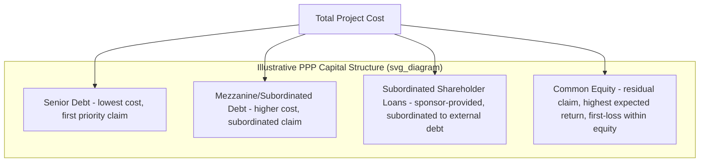

## Capital Structure and Debt-to-Equity Ratios

### Definition and Role in PPP Financial Structuring

**Capital structure** in a PPP/project finance context refers to the composition of the funding sources used to finance total project cost — principally the mix of senior debt, subordinated/mezzanine debt, and equity (including subordinated shareholder loans, see Special Purpose Vehicle Structuring) — and the proportional relationship between them. The **debt-to-equity ratio** (often expressed as "gearing" in project finance terminology) is the single most consequential structural variable in a PPP transaction, since it simultaneously determines sponsor risk exposure, sponsor return potential, the project's cost of capital, and the residual risk borne by lenders.

$$\text{Gearing (Debt:Equity)} = \frac{\text{Total Debt}}{\text{Total Debt} + \text{Total Equity}}$$

A project described as having "80:20 gearing" or "80% leverage" means debt funds 80% of total project cost, with equity (including subordinated shareholder loans, depending on how a given transaction classifies them) funding the remaining 20%.

### Why Capital Structure Matters: The Core Trade-off

**Key Points**

- **Cost of capital differential**: Debt is generally cheaper than equity because lenders hold a senior, contractually fixed claim (principal and interest) ranking ahead of equity in the cash flow waterfall (see Security Packages and Intercreditor Arrangements), while equity investors bear residual risk and therefore demand a higher expected return to compensate.
- **Leverage effect on equity returns**: Because debt is fixed-cost, increasing leverage (holding all else constant) amplifies the project-level equity IRR when the project performs at or above the base case, since a smaller equity base captures the same absolute cash flow upside — but equally amplifies downside losses if performance falls short, a standard financial leverage effect.
- **Risk allocation implication**: Higher gearing shifts more of the project's risk onto lenders (who bear a larger share of the capital structure) and increases the sensitivity of coverage ratios (DSCR, LLCR — see Non-Recourse and Limited-Recourse Financing Principles) to adverse variance in project cash flows, meaning highly geared projects have less cash flow cushion before a covenant breach or default is triggered.
- **Weighted Average Cost of Capital (WACC) implications**: Because debt is typically cheaper than equity, increasing leverage (within limits lenders will accept) generally reduces the project's blended WACC, which is a key driver of overall project affordability — particularly significant in PPPs where lower WACC can translate into lower tariffs or lower government payment obligations under an availability-based structure.

$$WACC = \left(\frac{D}{D+E}\right) \times K_d \times (1-t) + \left(\frac{E}{D+E}\right) \times K_e$$

Where $D$ is total debt, $E$ is total equity, $K_d$ is the pre-tax cost of debt, $K_e$ is the cost of equity, and $t$ is the applicable corporate tax rate (the $(1-t)$ term reflects the tax deductibility of interest expense in most jurisdictions, though the specific tax treatment depends on the applicable jurisdiction's tax code).

### Illustrative Leverage Sensitivity Example

**Example**

Consider a project with Total Project Cost of $100 million and a projected pre-financing operating cash flow yield sufficient to service debt comfortably at moderate leverage:

| Scenario | Debt | Equity | Gearing | Illustrative Equity IRR (base case) | Illustrative Equity IRR (downside case) |
| --- | --- | --- | --- | --- | --- |
| Conservative | $60mm | $40mm | 60:40 | Lower base case IRR due to smaller leverage benefit | Smaller downside impact — more cash flow cushion |
| Moderate | $75mm | $25mm | 75:25 | Higher base case IRR than conservative case | Larger downside impact than conservative case |
| Aggressive | $85mm | $15mm | 85:15 | Highest base case IRR of the three | Largest downside impact — thinnest cash flow cushion, higher default risk |

[Inference] The specific numerical IRR outcomes for any leverage scenario depend entirely on the project's actual cash flow profile, debt pricing, and tenor assumptions, and cannot be generalized without a specific financial model; the table illustrates the directional leverage effect rather than representing calculated figures for a real transaction.

### Determinants of Achievable Gearing in PPP Transactions

**Key Points**

1. **Revenue risk profile**: Availability-based projects (where payment depends on the asset being available for use, largely insulated from demand/usage risk) typically support materially higher gearing than demand/merchant-risk projects (e.g., toll roads with pure traffic risk), because availability payments provide a more stable, predictable cash flow stream against which lenders are willing to lend more aggressively.
2. **Contracted vs. merchant revenue**: Projects with long-term offtake agreements (PPAs, take-or-pay contracts) generally support higher gearing than those exposed to merchant/spot market pricing risk.
3. **Sector and asset risk characteristics**: Sectors with lower technology risk, established operating track records, and predictable maintenance cost profiles (e.g., conventional thermal power, toll roads with mature traffic patterns) typically support higher gearing than novel technology or higher-volatility sectors.
4. **Sovereign/country risk context**: Higher perceived sovereign or regulatory risk generally compresses achievable gearing, as lenders require a larger equity cushion to compensate for the reduced predictability of the broader operating environment.
5. **Presence of credit enhancement**: Government Support Agreements, Partial Risk Guarantees, ECA cover, or first-loss/blended finance structures (see Government Support Agreements and Letters of Comfort; First-Loss Facilities and Blended Finance Structures; Role of Export Credit Agencies in PPP Risk Mitigation) can support higher achievable gearing than would otherwise be feasible on a stand-alone commercial basis, by absorbing specific risk categories that would otherwise constrain lender comfort.
6. **Rating agency and regulatory capital considerations**: For projects seeking a public credit rating (e.g., for project bond issuance), rating agency methodologies impose their own leverage thresholds correlated with target rating levels, since higher leverage generally correlates with lower achievable ratings for a given cash flow risk profile.

[Unverified] Because achievable gearing ranges are highly sector-, jurisdiction-, and deal-specific — and shift over time with market credit conditions — citing a single "typical" gearing percentage for PPPs generally would be potentially misleading; readers should reference current market transaction comparables for the specific sector and jurisdiction in question rather than a generalized benchmark.

### Capital Structure Layering Diagram

### Debt Sizing Methodology and Its Interaction with Gearing

Lenders typically size the maximum debt amount using the more conservative (lower) result of several parallel tests, which indirectly determines the resulting gearing ratio:

- **Coverage ratio test**: Debt sized such that projected DSCR and LLCR remain at or above minimum covenant thresholds under the agreed base case (see Non-Recourse and Limited-Recourse Financing Principles).
- **Maximum gearing/leverage cap test**: An absolute ceiling on the debt-to-total-cost ratio, sometimes imposed by lender internal policy, rating agency criteria, or concession agreement/regulatory requirements (some PPP frameworks impose minimum equity requirements as a bid qualification or contractual condition).
- **Tenor-constrained test**: Debt sized to ensure full repayment within the maximum tenor lenders are willing to offer (itself often linked to the concession term, since debt tenor cannot typically extend meaningfully beyond the remaining concession period without introducing residual value/refinancing risk).

$$\text{Maximum Debt} = \min\left(\text{Coverage Ratio-Constrained Debt},\ \text{Gearing Cap} \times \text{Total Project Cost},\ \text{Tenor-Constrained Debt}\right)$$

### Equity Structuring Considerations

**Key Points**

- **Common equity vs. subordinated shareholder loans**: As discussed in Special Purpose Vehicle Structuring, sponsors frequently split their equity contribution between common equity and subordinated shareholder loans for tax efficiency and repayment flexibility reasons, though from a lender's risk perspective both typically rank behind external senior/mezzanine debt in the cash flow waterfall.
- **Equity bridge loans**: Where sponsors prefer to defer full equity funding until later in construction (matching typical corporate cash management preferences), an equity bridge loan — a short-term facility typically backed by a bank guarantee or letter of credit confirming the sponsor's committed equity funding — allows debt-like construction funding while formally satisfying lenders' requirement for confirmed equity commitment (see Financial Close and Conditions Precedent for CP treatment of equity funding evidence).
- **Minimum equity retention/lock-up requirements**: Some concession agreements impose minimum sponsor equity retention periods (preventing full sponsor exit immediately post-construction) to ensure continued alignment of interest between the SPV's original developers and the Grantor/lenders during the critical early operations period.

### Regulatory and Policy Dimensions of Capital Structure in PPPs

**Key Points**

- **Minimum equity requirements in bid criteria**: Many PPP procurement frameworks specify minimum sponsor equity contribution percentages as part of bid qualification criteria, intended to ensure sufficient sponsor "skin in the game" and reduce the risk of under-capitalized bidders subsequently struggling to reach Financial Close.
- **Tariff/payment affordability trade-off**: Because higher gearing generally reduces blended WACC (given debt's typically lower cost relative to equity), Grantors evaluating value-for-money in availability-based PPPs have a direct interest in capital structures that responsibly maximize gearing (within prudent risk limits) to minimize the government payment obligation, while also ensuring the structure remains resilient enough to avoid financial distress that could disrupt service delivery.
- **Refinancing and gain-sharing implications**: Post-construction refinancing (common once construction risk has passed and coverage ratios improve) frequently involves re-gearing the capital structure to a higher debt proportion, capturing the reduced risk profile in improved debt terms; many modern concession agreements include gain-sharing mechanisms requiring a portion of refinancing gains to be shared with the Grantor (see Special Purpose Vehicle Structuring), reflecting that part of the improved terms stems from risk reduction achieved during the Grantor-supervised concession period itself.

### Related Topics

- Non-Recourse and Limited-Recourse Financing Principles
- Special Purpose Vehicle Structuring
- Security Packages and Intercreditor Arrangements
- Financial Close and Conditions Precedent
- First-Loss Facilities and Blended Finance Structures
- Weighted Average Cost of Capital (WACC) in infrastructure valuation
- Refinancing and gain-sharing mechanisms in concession agreements
- Rating agency methodologies for project finance debt