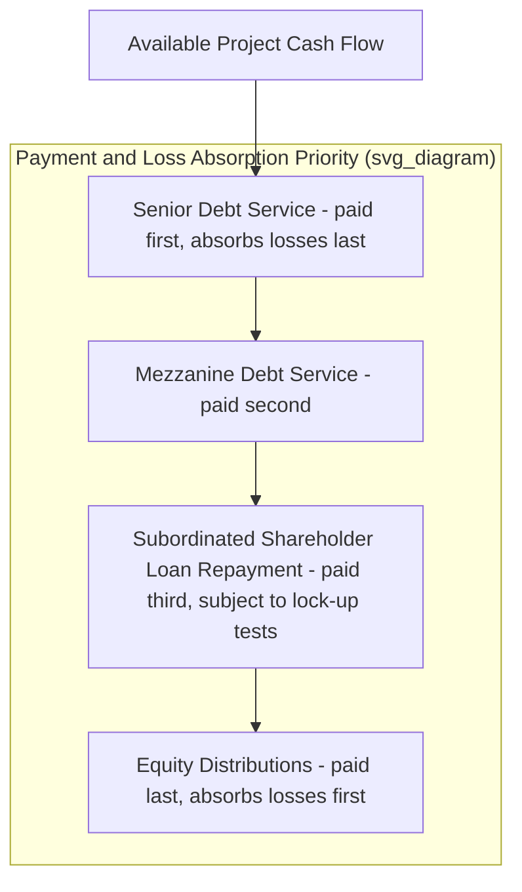

## Senior, Mezzanine, and Subordinated Debt Instruments

### Definition and Positioning within the Capital Structure

**Senior, mezzanine, and subordinated debt** represent distinct layers of the debt component of a PPP capital structure (see Capital Structure and Debt-to-Equity Ratios), differentiated primarily by their **priority ranking** — the order in which each layer's claims are satisfied from project cash flow and, upon enforcement, from security proceeds. Each layer trades a lower priority ranking for a higher expected return, reflecting the standard risk-return relationship in fixed-income instruments: junior claims bear first losses beyond what more senior claims can absorb, and are compensated accordingly.

$$\text{Expected Return: } K_{d,\text{senior}} < K_{d,\text{mezzanine}} < K_{d,\text{subordinated}} < K_{e,\text{equity}}$$

### Senior Debt: Characteristics and Function

**Key Points**

- **Highest priority claim**: Ranks first in both payment priority (cash flow waterfall — see Security Packages and Intercreditor Arrangements) and security enforcement proceeds among external creditors.
- **Lowest cost of capital**: Because it bears the least risk (protected by all subordinated/junior capital layers beneath it), senior debt carries the lowest interest margin of any external financing instrument in the structure.
- **Typical providers**: Commercial banks, institutional bondholders, ECAs, and DFIs (see Sponsors, Lenders, and the Project Finance Contractual Web; Role of Export Credit Agencies in PPP Risk Mitigation), often as a syndicate under a Common Terms Agreement.
- **Covenant intensity**: Senior debt typically carries the most extensive covenant package (minimum DSCR/LLCR thresholds, distribution lock-up tests, restrictions on additional indebtedness, change of control provisions), reflecting senior lenders' greater influence over SPV governance given their capital contribution scale and priority claim.
- **Typical instrument forms**: Term loan facilities (bank debt), project bonds (public or private placement), and ECA-guaranteed or ECA-funded tranches.

### Mezzanine Debt: Characteristics and Function

**Key Points**

- **Intermediate priority**: Ranks behind senior debt but ahead of subordinated shareholder loans and common equity in both payment priority and security enforcement proceeds.
- **Hybrid risk-return profile**: Priced meaningfully higher than senior debt to compensate for its subordinated position and thinner cash flow cushion (mezzanine debt service is only paid after full senior debt service, meaning mezzanine lenders absorb cash flow shortfalls before senior lenders do).
- **Structuring variations**: Mezzanine debt can be structured as straightforward subordinated loans, or with equity-like features such as warrants, equity kickers, or payment-in-kind (PIK) interest options (where interest can be deferred and capitalized rather than paid currently, preserving cash for senior debt service during periods of tight coverage).
- **Typical providers**: DFIs, specialized infrastructure mezzanine/credit funds, and increasingly institutional investors seeking enhanced yield relative to senior project debt while still benefiting from the project's contractual risk allocation architecture.
- **Standstill exposure**: Mezzanine lenders are typically subject to standstill provisions under the intercreditor agreement (see Security Packages and Intercreditor Arrangements), restricting their ability to take independent enforcement action for a defined period following a senior default.

### Subordinated Debt (Including Shareholder Loans): Characteristics and Function

**Key Points**

- **Lowest external creditor priority (or sponsor-provided)**: Subordinated debt in the strict external-lender sense ranks below mezzanine debt; **subordinated shareholder loans** (see Special Purpose Vehicle Structuring) are a distinct but related category, provided by sponsors themselves and typically ranking behind all external debt (senior and mezzanine) in payment priority.
- **Tax and repayment flexibility rationale**: As discussed in Special Purpose Vehicle Structuring, sponsors often structure part of their equity contribution as subordinated shareholder loans for interest deductibility (subject to thin-capitalization rules) and defined repayment schedule benefits relative to pure equity, even though from a risk-bearing perspective they function similarly to equity.
- **Deep subordination in enforcement**: In an insolvency or enforcement scenario, subordinated/shareholder debt is typically among the last claims paid before residual value (if any) flows to common equity holders.

### Comparative Summary Table

| Attribute | Senior Debt | Mezzanine Debt | Subordinated/Shareholder Debt |
| --- | --- | --- | --- |
| Payment priority | 1st | 2nd | 3rd (before equity) |
| Security enforcement priority | 1st | 2nd | 3rd (before equity) |
| Typical cost of capital | Lowest | Intermediate | Higher, approaching equity-like returns |
| Typical provider | Banks, bondholders, ECAs, DFIs | DFIs, mezzanine/credit funds, institutional investors | Sponsors |
| Covenant intensity | Highest | Moderate | Typically governed by intercreditor subordination terms rather than independent covenants |
| Loss absorption sequence | Absorbs losses last among debt | Absorbs losses before senior, after subordinated | Absorbs losses before mezzanine and senior |

### Capital Structure and Waterfall Positioning Diagram

### Intercreditor Mechanics Governing the Three Layers

As detailed in Security Packages and Intercreditor Arrangements, the relationship among senior, mezzanine, and subordinated creditors is governed by the intercreditor agreement, addressing:

- **Standstill periods**: Restricting mezzanine (and, where applicable, subordinated) lenders from independent enforcement action for a defined period following a senior payment default.
- **Turnover provisions**: Requiring any payment mistakenly or improperly received by a junior creditor out of priority order to be turned over to more senior creditors.
- **Payment blockage triggers**: Defining events (typically a senior default or breach of a senior financial covenant) that automatically suspend payments to mezzanine and subordinated creditors even before formal acceleration.
- **Voting/consent rights calibration**: Junior creditors typically receive information and consultation rights, but with more limited voting power over senior-level amendments and waivers, proportionate to their smaller capital contribution and subordinated risk position.

### Illustrative Numerical Example: Pricing Differential Across Layers

**Example**

Consider a hypothetical PPP financing with the following illustrative capital structure (figures are for illustration of the general risk-return relationship only, not derived from any specific transaction):

| Tranche | Amount | Illustrative Margin Structure | Rationale |
| --- | --- | --- | --- |
| Senior debt | $70mm | Lowest margin over base rate | First priority claim, longest track record of lender comfort in the sector |
| Mezzanine debt | $15mm | Meaningfully higher margin than senior, may include PIK component | Subordinated priority, thinner cash flow cushion |
| Subordinated shareholder loan | $10mm | Fixed coupon set with reference to sponsor's required equity-like return | Deeply subordinated, functions economically closer to equity |
| Common equity | $5mm | Highest expected return (project IRR target) | Residual claim, first-loss position |

[Inference] Actual pricing differentials between tranches in any real transaction depend on prevailing credit market conditions, the specific project's risk profile, tenor, and currency of each tranche, and cannot be generalized into fixed benchmark spreads; the table illustrates the ordinal relationship (senior cheaper than mezzanine cheaper than subordinated) rather than representing calculated market pricing.

### When Mezzanine Debt Is Used in PPP Structures

**Key Points**

Mezzanine debt is not present in every PPP capital structure; it is typically introduced when:

1. **Senior lenders' maximum gearing appetite is reached** but sponsors seek to increase overall leverage beyond what senior lenders alone will support, using mezzanine to bridge the gap between maximum senior debt capacity and the sponsors' desired equity contribution level (see Capital Structure and Debt-to-Equity Ratios).
2. **Sector or country risk profile constrains senior lender participation**, and mezzanine (often DFI-provided) serves a de-risking function analogous to, though structurally distinct from, first-loss facilities (see First-Loss Facilities and Blended Finance Structures) — absorbing intermediate risk to make the senior tranche attractive to conservative commercial lenders.
3. **Construction-phase risk is elevated**, and mezzanine lenders (often development-oriented institutions with higher risk tolerance) provide bridge-like capital during the highest-risk phase, sometimes refinanced out of the structure once the project reaches stable operations and senior debt terms improve.

### Refinancing Dynamics Across Debt Layers

Post-construction refinancing (see Special Purpose Vehicle Structuring and Capital Structure and Debt-to-Equity Ratios) frequently restructures the relative proportions of senior, mezzanine, and subordinated debt:

- **Mezzanine take-out**: A common refinancing pattern involves replacing higher-cost mezzanine debt with additional senior debt once the project has demonstrated stable operating performance, since the reduced risk profile post-construction often allows senior lenders to extend larger amounts at senior pricing than was achievable during the construction-risk period.
- **Rating upgrade potential**: Where the SPV has issued rated project bonds, transitioning away from higher-risk mezzanine layers toward a simpler, more senior-heavy structure can support rating agency upgrades, further reducing the project's blended cost of capital.
- **Gain-sharing implications**: As noted in Special Purpose Vehicle Structuring, refinancing gains achieved partly through de-risking the capital structure (including mezzanine take-out) are frequently subject to negotiated gain-sharing arrangements with the Grantor under modern concession agreement drafting practice.

### Related Topics

- Capital Structure and Debt-to-Equity Ratios
- Security Packages and Intercreditor Arrangements
- Non-Recourse and Limited-Recourse Financing Principles
- Special Purpose Vehicle Structuring
- First-Loss Facilities and Blended Finance Structures
- Role of Export Credit Agencies in PPP Risk Mitigation
- Payment-in-kind (PIK) interest structuring in subordinated debt
- Rating agency methodologies for multi-tranche project finance debt