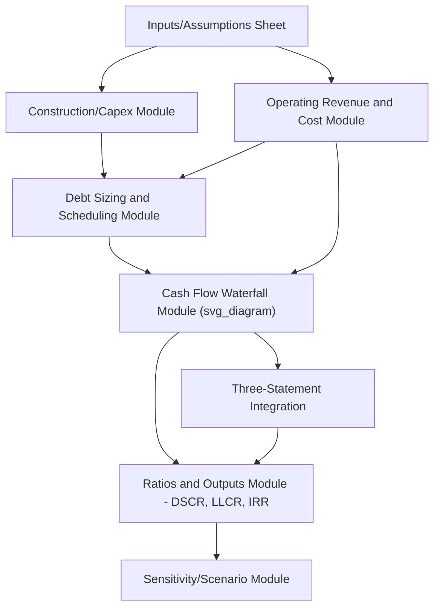
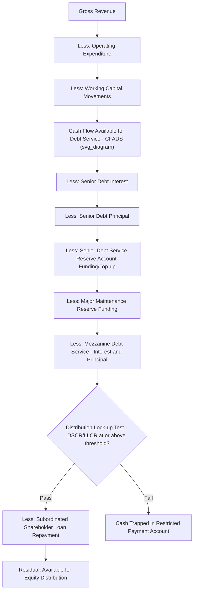

## Building a PPP Financial Model and Cash Flow Waterfall

### Definition and Central Role

A **PPP financial model** is the integrated quantitative representation of a project's projected revenues, costs, financing structure, and cash flows over the full concession/loan term, built to size debt, structure the cash flow waterfall, calculate coverage ratios, and project sponsor equity returns. It is the single artifact around which nearly every negotiation in a PPP transaction converges — the concession agreement's tariff mechanism, the EPC contract price, the O&M budget, the debt term sheet, and sponsor return expectations are all ultimately expressed and tested within the model. As discussed in Due Diligence Processes in Project Finance, the model's integrity and assumption reasonableness are subject to independent audit precisely because of this centrality.

### Standard Model Architecture

**Key Points**

A typical PPP financial model is organized into interlinked modules:

1. **Inputs/Assumptions sheet**: Centralizes all key assumptions (construction cost and schedule, revenue/demand forecasts, O&M costs, inflation/escalation indices, tax rates, financing terms) in a single location to enable consistent sensitivity testing without hunting for hard-coded values scattered throughout the model.
2. **Construction/Capex module**: Models the drawdown schedule of construction costs against the S-curve or milestone-based disbursement profile, interest during construction (IDC), and any construction contingency drawdown logic.
3. **Operating revenue and cost module**: Projects revenue (per the offtake/concession payment mechanism — availability payments, tariff/toll revenue, PPA capacity and energy payments) and operating costs (O&M, insurance, taxes, major maintenance/lifecycle capex) over the operating period.
4. **Debt sizing and scheduling module**: Calculates debt sizing per the methodology in Capital Structure and Debt-to-Equity Ratios, generates the amortization schedule, and calculates interest expense across each debt tranche (senior, mezzanine — see Senior, Mezzanine, and Subordinated Debt Instruments).
5. **Cash flow waterfall module**: Sequences cash flow allocation per the priority structure established in the intercreditor agreement (see Security Packages and Intercreditor Arrangements).
6. **Three-statement integration**: Links the operating model to a full income statement, balance sheet, and cash flow statement, ensuring internal consistency (e.g., depreciation feeding tax calculations, retained earnings reconciling to balance sheet equity).
7. **Ratios and outputs module**: Calculates DSCR, LLCR, Project IRR, Equity IRR, and other key metrics used by lenders and sponsors to evaluate the financing structure.
8. **Sensitivity/scenario module**: Enables stress testing of key variables (construction delay, cost overrun, revenue downside, interest rate movement) against the base case.

### The Cash Flow Waterfall: Detailed Mechanics

The **cash flow waterfall** is the sequential allocation logic that determines, in each period, how available project cash is distributed among competing claims, following the priority order established by the intercreditor agreement (see Security Packages and Intercreditor Arrangements) and typically structured as follows:

**CFADS (Cash Flow Available for Debt Service)** is the pivotal intermediate output — it represents the cash genuinely available to service all debt obligations after operating costs and working capital needs, and is the numerator in both key coverage ratio calculations:

$$DSCR_t = \frac{CFADS_t}{\text{Scheduled Debt Service}_t}$$

$$LLCR_t = \frac{\sum_{i=t}^{n} \frac{CFADS_i}{(1+r)^{i-t}}}{\text{Outstanding Debt Balance}_t}$$

Where $r$ is the discount rate (typically the senior debt interest rate or a blended cost of debt) and $n$ is the final maturity period.

### Reserve Accounts within the Waterfall

**Key Points**

- **Debt Service Reserve Account (DSRA)**: Typically funded to cover a defined number of future debt service payments (e.g., the next one or two payment periods), providing a liquidity buffer against short-term cash flow timing mismatches without triggering an immediate default.
- **Major Maintenance Reserve Account (MMRA)**: Funded over time to accumulate cash for large, periodic lifecycle capital expenditure (e.g., major overhauls in power plants, resurfacing in toll roads), smoothing what would otherwise be lumpy cash flow impacts in the periods such expenditure actually occurs.
- **Distribution/Restricted Payment Account**: Where the lock-up test fails, cash that would otherwise flow to equity is trapped in this account rather than released, preserving liquidity within the SPV until coverage ratios recover above the specified threshold.

### Model Circularity and Common Technical Challenges

**Key Points**

- **Interest-during-construction circularity**: Interest during construction is often capitalized into total project cost, which in turn affects the total debt amount required, which in turn affects the interest expense being calculated — a classic circular reference requiring either iterative calculation settings or a dedicated circularity-breaker mechanism (e.g., a copy-paste macro or a switch to convert formulas to hardcoded values temporarily) to maintain model stability.
- **Debt sizing circularity**: Where debt is sized to a target average or minimum DSCR, the debt amount depends on the debt service schedule, which depends on the debt amount — again requiring either goal-seek/iterative solving or an explicit sculpted repayment profile calculation.
- **Cash sweep mechanics**: Some structures include cash sweep provisions (directing excess cash flow above a certain coverage threshold toward accelerated debt repayment rather than equity distribution), which introduces additional interdependency between the repayment schedule and the cash flow available in each period.
- **Sculpted vs. level repayment profiles**: Many PPP financings use a "sculpted" debt repayment profile — principal repayments calibrated period-by-period to maintain a constant target DSCR given the project's projected revenue profile — rather than a level (equal installment) or annuity-style repayment, requiring iterative or goal-seek-based model construction.

### Sensitivity and Scenario Analysis

**Example**

A typical sensitivity/scenario testing matrix applied to a PPP financial model:

| Scenario | Variable Stressed | Typical Application |
| --- | --- | --- |
| Construction delay | Delay in Commercial Operations Date by X months | Tests DSRA adequacy and interest-during-construction cost impact |
| Cost overrun | Increase in capex by a defined percentage | Tests sponsor contingency funding and gearing headroom |
| Revenue downside | Reduction in demand/tariff revenue | Tests minimum DSCR resilience, particularly critical for merchant/demand-risk projects |
| Interest rate shock | Increase in floating reference rate | Tests hedging adequacy and DSCR sensitivity to unhedged exposure |
| Inflation/escalation variance | Deviation of actual inflation from assumed indexation | Tests real revenue/cost matching, particularly where revenue and cost escalation indices differ |
| Combined downside case | Multiple adverse variables simultaneously | Tests overall structural resilience under a severe but plausible combined stress |

[Inference] The specific severity and combination of stress scenarios applied in any given transaction reflect the individual lender group's credit policy and the specific sector/country risk profile, and there is no single universally standardized stress testing package applied uniformly across all PPP financings.

### Model Outputs Used in Negotiation and Structuring

**Key Points**

- **Debt sizing outputs** feed directly into Capital Structure and Debt-to-Equity Ratios negotiations, determining the maximum debt the project can support under agreed coverage ratio and gearing cap constraints.
- **Coverage ratio outputs** (minimum DSCR, average DSCR, LLCR) are compared against lender-required covenant thresholds to confirm the proposed financing structure is acceptable, or to identify the extent of restructuring (reduced gearing, additional reserves, credit enhancement) needed to close any gap.
- **Equity IRR outputs** are used by sponsors to evaluate whether the project meets their required return hurdle, and to structure bid pricing (tariff levels, availability payment requirements) during the competitive procurement phase.
- **Tariff/payment sizing**: In many PPP procurement processes, the financial model is used in reverse — solving for the minimum tariff or availability payment level required to achieve an acceptable sponsor IRR given a target capital structure — directly informing the bid price submitted to the Grantor.

### Model Governance and Version Control

**Key Points**

- **Model locking at Financial Close**: As discussed in Financial Close and Conditions Precedent, the financial model is typically "locked" as a Condition Precedent, establishing the agreed base case against which future covenant compliance and cash flow variance will be measured.
- **Actuals vs. base case tracking**: Post-financial-close, the model (or a dedicated monitoring/actuals model) is periodically updated with actual performance data, and variances against the locked base case are tracked and reported to lenders as part of ongoing covenant compliance certification.
- **Refinancing model updates**: Refinancing events (see Special Purpose Vehicle Structuring; Senior, Mezzanine, and Subordinated Debt Instruments) typically require substantial model rebuilding to reflect updated capital structure, revised debt terms, and any gain-sharing calculation mechanics required under the concession agreement.

### Related Topics

- Capital Structure and Debt-to-Equity Ratios
- Senior, Mezzanine, and Subordinated Debt Instruments
- Security Packages and Intercreditor Arrangements
- Non-Recourse and Limited-Recourse Financing Principles
- Due Diligence Processes in Project Finance
- Financial Close and Conditions Precedent
- Sculpted debt repayment and cash sweep mechanics
- Refinancing and gain-sharing mechanisms in concession agreements