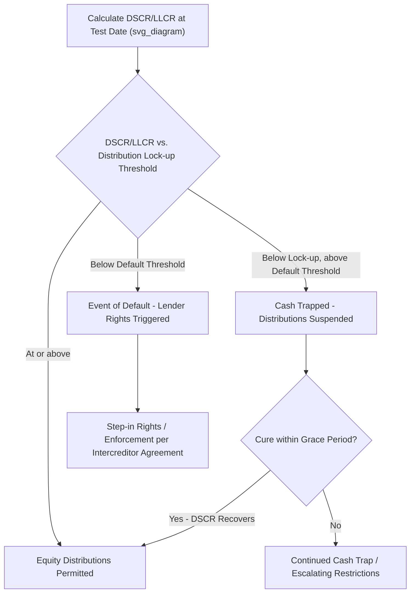

## Debt Service Coverage Ratios and Lender Covenants

### Definition and Central Function

**Debt Service Coverage Ratios (DSCR)** and related coverage metrics are the primary quantitative tools lenders use to assess a PPP project's ability to service its debt obligations from operating cash flow, and to establish the financial covenants that govern the SPV's conduct throughout the loan life. Because project finance lending is non-recourse or limited-recourse (see Non-Recourse and Limited-Recourse Financing Principles), coverage ratios substitute for the corporate credit metrics (e.g., interest coverage on a diversified balance sheet) that would apply in conventional corporate lending — they are calculated directly from the project's own Cash Flow Available for Debt Service (CFADS), as built into the financial model (see Building a PPP Financial Model and Cash Flow Waterfall).

### Core Coverage Ratio Definitions

**Key Points**

$$DSCR_t = \frac{CFADS_t}{\text{Scheduled Principal} + \text{Scheduled Interest in period } t}$$

$$LLCR_t = \frac{\sum_{i=t}^{n} \frac{CFADS_i}{(1+r)^{i-t}} + \text{Reserve Account Balances}}{\text{Outstanding Debt Principal at time } t}$$

$$PLCR = \frac{\sum_{i=1}^{n} \frac{CFADS_i}{(1+r)^{i}} + \text{Terminal/Residual Value}}{\text{Outstanding Debt Principal at time } 0}$$

Where:

- **DSCR (Debt Service Coverage Ratio)** measures single-period debt service coverage — the standard, most frequently monitored metric.
- **LLCR (Loan Life Coverage Ratio)** measures coverage across the remaining life of the loan on a present-value basis, capturing whether cumulative future cash flow (not just the current period) supports the outstanding debt balance.
- **PLCR (Project Life Coverage Ratio)** extends the same logic across the entire project/concession life (including any period beyond loan maturity), used primarily to assess overall project robustness and, sometimes, to inform equity return sustainability analysis rather than as a primary lending covenant.

A ratio above 1.0x indicates cash flow is sufficient to cover the relevant debt service obligation; a ratio below 1.0x indicates a shortfall requiring reserve drawdown, additional funding, or triggering a default, depending on the severity and the specific covenant structure.

### DSCR Variants Used in Practice

**Key Points**

- **Historic/Backward-looking DSCR**: Calculated using actual trailing-period CFADS, used for retrospective covenant compliance testing (e.g., at each semi-annual test date based on the preceding period's actual performance).
- **Forward-looking/Projected DSCR**: Calculated using the financial model's forward projection for an upcoming period, sometimes used in conjunction with historic DSCR to provide lenders both a backward confirmation and a forward-looking early warning signal.
- **Minimum DSCR**: The lowest projected DSCR across the entire loan tenor in the base case model — a key structuring metric used in debt sizing (see Building a PPP Financial Model and Cash Flow Waterfall), since lenders typically size debt to ensure the minimum DSCR across all periods remains above an acceptable threshold even in the base case, before any stress testing.
- **Average DSCR**: The arithmetic (or sometimes weighted) average DSCR across the loan tenor, used alongside minimum DSCR to assess overall structural robustness — a structure with an acceptable average but a very low minimum in a specific period may still be considered risky due to that period's thin cushion.

### Financial Covenant Structure Built Around Coverage Ratios

**Key Points on covenant tiers**:

1. **Distribution lock-up threshold**: The DSCR/LLCR level below which equity distributions are automatically suspended (cash trapped in a restricted account), acting as an early, less severe intervention point that preserves liquidity within the SPV without triggering a formal default.
2. **Cure/grace mechanisms**: Many structures allow a defined grace period or number of testing periods for DSCR to recover (a "cure period") before escalating to more severe consequences, recognizing that temporary cash flow dips (e.g., a delayed receivable, a one-off maintenance event) do not necessarily indicate structural project distress.
3. **Default threshold**: A lower DSCR/LLCR level (or sustained breach of the lock-up threshold beyond the cure period) constituting a formal Event of Default, triggering lender rights under the financing documents (potential acceleration, enforcement of security — see Security Packages and Intercreditor Arrangements).
4. **Equity cure rights**: Some financing documents permit sponsors to "cure" a covenant breach through an additional equity injection that restores the calculated DSCR/LLCR above the relevant threshold, avoiding default consequences — though such rights are typically limited in frequency and cumulative amount over the loan life to prevent perpetual reliance on sponsor bailouts rather than genuine project performance improvement.

### Illustrative Covenant Threshold Structure

**Example**

A simplified illustrative covenant tier structure (not derived from any specific transaction, since actual thresholds vary substantially by sector and risk profile as noted below):

| Test Level | Illustrative DSCR Threshold | Consequence |
| --- | --- | --- |
| Distribution lock-up | Below target base case minimum, but above default level | Equity distributions suspended, cash trapped |
| Cure period trigger | Sustained breach beyond one or two test periods | Sponsor equity cure option (if permitted) or escalation |
| Event of Default | Materially below lock-up threshold, or lock-up breach uncured | Acceleration rights, enforcement per intercreditor terms |

[Unverified] Actual DSCR threshold levels vary substantially depending on sector (availability-based projects generally support and are held to different threshold levels than demand-risk projects), jurisdiction, lender risk appetite, and prevailing credit market conditions at the time of financing; citing specific numerical threshold levels as generally applicable would misrepresent how deal-specific this structuring parameter actually is.

### Sector-Specific Coverage Ratio Considerations

**Key Points**

- **Availability-based projects** (e.g., social infrastructure, some toll roads with availability/shadow-toll structures) generally exhibit more stable, predictable CFADS profiles, allowing lenders to accept somewhat higher gearing and correspondingly set tighter (numerically lower but still comfortably above 1.0x) minimum DSCR thresholds relative to demand-risk projects, reflecting the lower cash flow volatility.
- **Demand/merchant-risk projects** (e.g., pure toll roads, merchant power plants) exhibit greater cash flow volatility, generally requiring lenders to demand higher minimum DSCR thresholds and/or lower gearing to build in a larger cushion against demand forecast error (see Building a PPP Financial Model and Cash Flow Waterfall for related sensitivity testing discussion).
- **Contracted revenue projects** (PPAs, take-or-pay offtake agreements) sit between these extremes, with coverage ratio requirements typically calibrated to the credit quality of the off-taker and the strength of the offtake contract's payment mechanism (see Role of Export Credit Agencies in PPP Risk Mitigation and Government Support Agreements and Letters of Comfort for related off-taker credit enhancement discussion).

### Coverage Ratios in Multi-Tranche Capital Structures

Where senior and mezzanine debt coexist (see Senior, Mezzanine, and Subordinated Debt Instruments), coverage ratios are typically calculated at multiple levels:

$$\text{Senior DSCR} = \frac{CFADS_t}{\text{Senior Debt Service}_t}$$

$$\text{Total (Senior + Mezzanine) DSCR} = \frac{CFADS_t}{\text{Senior Debt Service}_t + \text{Mezzanine Debt Service}_t}$$

Senior lenders typically focus primarily on Senior DSCR for their own covenant purposes, while the intercreditor agreement (see Security Packages and Intercreditor Arrangements) governs how a breach at either level interacts with payment blockage and standstill provisions affecting mezzanine and subordinated creditors.

### Non-Financial Covenants Complementing Coverage Ratios

**Key Points**

While coverage ratios are the central quantitative covenant, they are typically supplemented by qualitative/structural covenants that protect the integrity of the cash flow projections underlying the DSCR calculation itself:

- **Restrictions on additional indebtedness**: Preventing the SPV from raising additional debt that would dilute the cash flow available to service existing lenders without their consent.
- **Restrictions on asset disposals**: Preventing sale of material project assets that would undermine the project's cash-generating capacity.
- **Change of control restrictions**: Requiring lender consent before a material change in SPV ownership, since sponsor identity and capability can be relevant to project performance risk (particularly for strategic/industrial sponsors with operational involvement).
- **Insurance maintenance covenants**: Requiring the SPV to maintain insurance coverage consistent with what was assumed in the financial model, since a gap in insurance could expose CFADS to catastrophic, uninsured loss risk.
- **Reporting and information covenants**: Requiring periodic delivery of financial statements, covenant compliance certificates, and Independent Engineer reports (see Due Diligence Processes in Project Finance), enabling lenders to monitor actual performance against the locked base case model on an ongoing basis.

### Interaction with Government Support and Credit Enhancement Instruments

Coverage ratio resilience is directly affected by the presence of risk mitigation instruments discussed elsewhere in this course:

- **Government Support Agreements** (see Government Support Agreements and Letters of Comfort) that guarantee off-taker payment obligations reduce the probability of a CFADS shortfall driven by off-taker non-payment, supporting more favorable (lower) minimum DSCR thresholds than would otherwise be achievable.
- **First-loss facilities** (see First-Loss Facilities and Blended Finance Structures) do not directly alter the project-level DSCR calculation but reduce senior lenders' effective loss exposure in a downside scenario, which can translate into lenders accepting a lower minimum DSCR threshold given the additional cushion sitting beneath their claim in the capital structure.
- **ECA guarantees** (see Role of Export Credit Agencies in PPP Risk Mitigation) covering specific commercial or political risk categories can similarly support more favorable covenant calibration by removing specific tail-risk scenarios from the range of outcomes lenders must otherwise cover through DSCR headroom alone.

### Related Topics

- Building a PPP Financial Model and Cash Flow Waterfall
- Capital Structure and Debt-to-Equity Ratios
- Senior, Mezzanine, and Subordinated Debt Instruments
- Security Packages and Intercreditor Arrangements
- Non-Recourse and Limited-Recourse Financing Principles
- Government Support Agreements and Letters of Comfort
- Distribution lock-up and cash trap mechanics
- Equity cure rights in project finance covenant structures