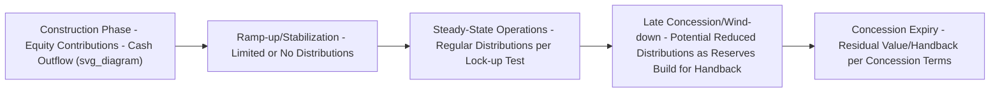

## Internal Rate of Return and Net Present Value Analysis for Equity Investors

### Definition and Purpose

**Internal Rate of Return (IRR)** and **Net Present Value (NPV)** are the two principal discounted cash flow metrics used by sponsors and financial investors to evaluate the attractiveness of a PPP equity investment. While these are standard corporate finance tools, their application in PPP/project finance carries specific structural nuances arising from the layered capital structure (see Capital Structure and Debt-to-Equity Ratios), the distribution lock-up mechanics of the cash flow waterfall (see Building a PPP Financial Model and Cash Flow Waterfall), and the long, often multi-decade investment horizons characteristic of infrastructure concessions.

### Core Definitions

**Key Points**

$$NPV = \sum_{t=0}^{n} \frac{CF_t}{(1+r)^t}$$

$$0 = \sum_{t=0}^{n} \frac{CF_t}{(1+IRR)^t}$$

Where $CF_t$ is the net cash flow to the investor in period $t$, $r$ is the investor's required discount rate (hurdle rate), and $n$ is the final period of the investment horizon. **IRR** is the discount rate at which the NPV of a cash flow stream equals zero — it represents the compound annual rate of return the investment is expected to generate given its specific timing and magnitude of cash inflows and outflows. **NPV**, calculated using an externally determined required rate of return, expresses the absolute value created (or destroyed) by the investment in present-value terms.

### Project IRR vs. Equity IRR: A Critical Distinction

**Key Points**

- **Project IRR**: Calculated on the pre-financing (unlevered) cash flow stream — total project cash inflows and outflows as if the project were financed entirely with equity, with no debt. This metric reflects the intrinsic economic return of the underlying asset, independent of capital structure choices.
- **Equity IRR**: Calculated on the post-financing (levered) cash flow stream actually received by equity holders — equity contributions (outflows) and distributions (inflows) after all debt service, reserve funding, and other waterfall priority payments (see Building a PPP Financial Model and Cash Flow Waterfall) have been satisfied.

Because debt is generally cheaper than the return equity investors require (see Capital Structure and Debt-to-Equity Ratios), leverage amplifies Equity IRR relative to Project IRR whenever the project performs at or above its base case — a standard financial leverage effect, but one made particularly consequential in project finance given the typically high gearing levels achievable relative to conventional corporate investments.

$$\text{Equity IRR} \approx \text{Project IRR} + \left(\text{Project IRR} - K_d\right) \times \frac{D}{E}$$

This is a simplified approximation illustrating the directional leverage relationship; [Inference] the actual Equity IRR in any specific transaction depends on the precise timing of debt drawdowns, repayment profile (including any sculpting or cash sweep mechanics — see Building a PPP Financial Model and Cash Flow Waterfall), and distribution lock-up constraints, which this simplified formula does not fully capture, so it should be treated as an illustrative approximation rather than a precise calculation method.

### Equity Cash Flow Profile Over the Concession Life

**Key Points on cash flow timing**:

- Equity typically experiences a significant **negative cash flow period during construction** (capital calls/contributions), followed by a **distribution lock-up period during ramp-up** while coverage ratios stabilize (see Debt Service Coverage Ratios and Lender Covenants), before entering a **steady-state distribution phase** during stabilized operations.
- The **timing** of cash flows matters as much as their magnitude for IRR calculation purposes, since IRR is highly sensitive to the discounting effect of early-period outflows versus later-period inflows — a project with identical total cash flows but earlier distributions will show a materially higher IRR than one with delayed distributions.

### Sponsor Exit Strategies and Their IRR Impact

**Key Points**

1. **Hold-to-maturity strategy**: Sponsor retains equity for the full concession term, capturing distributions throughout but bearing full exposure to long-term operational, regulatory, and residual value risk.
2. **Develop-to-sell/develop-to-core strategy**: Development-oriented sponsors (see Sponsors, Lenders, and the Project Finance Contractual Web) exit post-construction or shortly after operational stabilization, selling to longer-term financial investors (pension funds, infrastructure funds) seeking stable, de-risked cash flows — this strategy front-loads the sponsor's return timeline, typically producing a materially different (often higher, given the compressed holding period relative to captured value) IRR profile than a hold-to-maturity strategy, assuming a favorable exit valuation.
3. **Partial secondary sale**: Selling a partial equity stake while retaining a minority position, balancing early capital recycling against continued exposure to future distributions and refinancing gains (see Special Purpose Vehicle Structuring).

[Inference] The specific IRR outcome of any exit strategy depends entirely on achievable secondary market valuations at the time of exit, which in turn depend on prevailing infrastructure asset pricing, the project's demonstrated operating track record, and broader capital market conditions — none of which can be assumed or generalized in advance of an actual transaction.

### Illustrative Equity Cash Flow and IRR Example

**Example**

A simplified illustrative equity cash flow profile for a hypothetical availability-based PPP (figures illustrative only):

| Period | Equity Cash Flow | Description |
| --- | --- | --- |
| Year 0–2 (Construction) | Negative (capital contributions) | Equity funds its share of construction cost per the agreed drawdown schedule |
| Year 3 (Ramp-up) | Near zero or modest positive | Distribution lock-up partially binding while DSCR stabilizes |
| Year 4–24 (Steady-state operations) | Positive (regular distributions) | Distributions per the cash flow waterfall, subject to ongoing lock-up test compliance |
| Year 25 (Concession expiry) | Positive or zero (residual/handback) | Any residual value per concession terms; typically minimal for full-transfer BOT-type structures |

The Equity IRR is calculated by finding the discount rate that sets the NPV of this entire cash flow series (contributions as negative, distributions as positive) to zero.

### Sensitivity of Equity Returns to Model Assumptions

**Key Points**

Because Equity IRR sits at the bottom of the cash flow waterfall (see Building a PPP Financial Model and Cash Flow Waterfall) — receiving only the residual cash flow after all senior obligations are met — it is disproportionately sensitive to variance in underlying assumptions relative to debt-level metrics like DSCR:

- **Revenue/demand variance**: A relatively modest percentage shortfall in revenue can translate into a substantially larger percentage impact on Equity IRR, since debt service is a largely fixed prior claim that must be satisfied first, leaving equity to absorb a disproportionate share of any shortfall (a direct consequence of financial leverage operating in both directions).
- **Construction cost overruns**: Increase total equity required (if not absorbed by contingency or debt) and delay the onset of distributions, both of which compress Equity IRR.
- **Interest rate movements**: For any unhedged floating-rate debt exposure, rate increases raise debt service costs, directly reducing residual cash flow available for equity distribution.
- **Refinancing outcomes**: Successful refinancing at improved terms (see Senior, Mezzanine, and Subordinated Debt Instruments) can materially enhance Equity IRR by increasing the residual cash flow available for distribution, subject to any gain-sharing obligations owed to the Grantor.

### NPV Application: Investment Decision-Making

While IRR is the most commonly quoted metric in sponsor return discussions, **NPV** is often the more rigorous decision-making tool, particularly when comparing mutually exclusive investment opportunities or evaluating incremental structuring decisions:

**Key Points**

- **Ranking mutually exclusive projects**: Where a sponsor must choose between competing investment opportunities with different scale or cash flow timing profiles, NPV (using a consistent hurdle rate) avoids the scale-blindness problem inherent in IRR comparison alone, since IRR does not indicate the absolute magnitude of value created.
- **Reinvestment rate assumption issue**: IRR implicitly assumes interim cash flows are reinvested at the IRR itself, which can be an unrealistic assumption for very high-IRR projects; NPV avoids this issue by using an explicit, externally determined discount rate throughout.
- **Multiple IRR problem**: Where a cash flow series changes sign more than once (uncommon but possible in projects with significant late-life negative cash flows, such as major decommissioning or handback refurbishment obligations), the IRR equation can mathematically yield multiple solutions or no real solution, making NPV the more reliable metric in such cases.

### Hurdle Rate Determination

**Key Points**

Sponsors typically set required Equity IRR hurdle rates by reference to:

- **Risk-free rate plus a risk premium**: Building up from a relevant government bond yield, adding premiums for country/sovereign risk, sector-specific risk, construction-phase risk, and illiquidity, consistent with a Capital Asset Pricing Model (CAPM)-influenced approach, though pure CAPM beta-based calculation is less commonly used directly in unlisted infrastructure equity pricing than in public equity markets.
- **Comparable transaction benchmarking**: Reference to observed equity returns achieved (or targeted) in comparable recent PPP transactions in the same sector, country, and risk category.
- **Fund-specific return targets**: For institutional infrastructure funds, hurdle rates are often set with reference to the fund's own return mandate to its limited partners/investors, sometimes differentiated between core (lower-risk, lower-return), core-plus, and value-add/opportunistic infrastructure return bands.

[Unverified] Because hurdle rates and observed equity return levels vary substantially by sector, country risk profile, construction/operational risk phase, and prevailing capital market conditions at any given time, citing specific numerical hurdle rate benchmarks as generally representative would misstate how context-dependent this parameter actually is; readers should reference current market transaction data for the specific sector and jurisdiction under consideration.

### Related Topics

- Building a PPP Financial Model and Cash Flow Waterfall
- Capital Structure and Debt-to-Equity Ratios
- Debt Service Coverage Ratios and Lender Covenants
- Senior, Mezzanine, and Subordinated Debt Instruments
- Special Purpose Vehicle Structuring
- Sponsor exit strategies and secondary market infrastructure transactions
- Refinancing and gain-sharing mechanisms in concession agreements
- Weighted Average Cost of Capital in infrastructure valuation