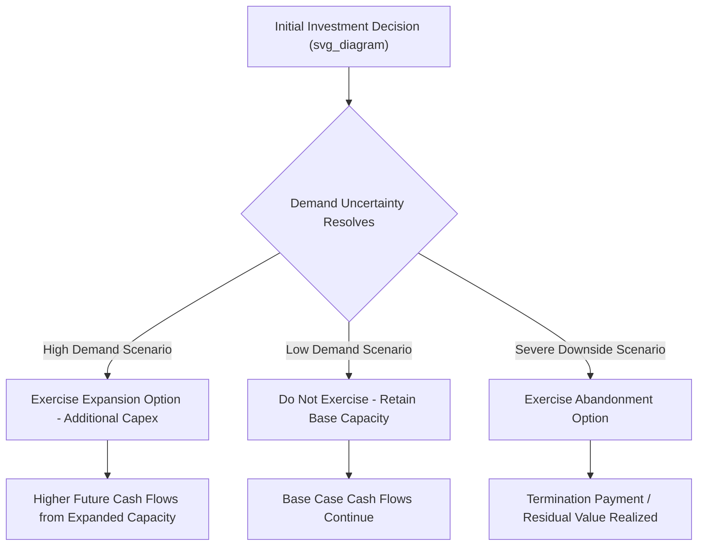

## Real Options Analysis in PPP Valuation

### Definition and Conceptual Foundation

**Real Options Analysis (ROA)** is a valuation and decision-making framework that extends option pricing theory — originally developed for financial derivatives — to the valuation of managerial flexibility embedded in real (physical/operational) investment decisions. In PPP economics, ROA addresses a structural limitation of standard discounted cash flow (DCF) analysis (see Internal Rate of Return and Net Present Value Analysis for Equity Investors): traditional NPV assumes a fixed, static investment and operating path, whereas PPP sponsors, lenders, and Grantors routinely hold **contingent decision rights** — options to expand, delay, abandon, or reconfigure a project in response to how uncertainty resolves over time — and these rights have measurable economic value that static DCF systematically ignores or undervalues.

### Why Standard NPV Undervalues PPP Flexibility

**Key Points**

- **Static assumption problem**: Conventional NPV analysis discounts a single, predetermined cash flow forecast, implicitly assuming management makes no adjustments in response to new information as the project unfolds — an assumption particularly unrealistic in PPPs given their long concession terms (often 20–30+ years) over which demand, technology, and regulatory conditions can change substantially.
- **Asymmetric payoff structures ignored**: Many contractual and physical features of PPPs create asymmetric payoffs — the ability to expand capacity if demand exceeds expectations, but not the obligation to do so if demand disappoints — which is precisely the payoff structure that option pricing theory was developed to value (analogous to a call option's asymmetric upside/downside).
- **Value of waiting/deferral**: Standard NPV analysis conducted at a single point in time (e.g., bid submission) does not naturally capture the value of an option to delay investment until uncertainty resolves, even though such deferral options are often explicitly or implicitly available in phased PPP structures.

$$NPV_{\text{static}} \neq NPV_{\text{static}} + \text{Option Value from Managerial Flexibility} = \text{Expanded NPV (eNPV)}$$

### Categories of Real Options Relevant to PPPs

**Key Points**

1. **Option to expand**: The right, but not the obligation, to increase project scale or capacity in response to higher-than-expected demand — common in phased toll road, port, or airport PPPs where initial capacity is deliberately sized conservatively with an expansion option built into the concession terms or physical design (e.g., land reservation for future lanes/terminals).
2. **Option to defer**: The right to delay investment commitment until uncertainty (regulatory, demand, technology cost) resolves further, relevant in competitive bidding processes where a sponsor might value the flexibility to defer financial close or construction commencement.
3. **Option to abandon**: The right to exit a project (sell equity, trigger a termination clause, or cease operations) if conditions deteriorate sufficiently, limiting downside exposure — relevant to how termination payment provisions (see Government Support Agreements and Letters of Comfort) are valued by both sponsors and lenders.
4. **Option to switch/reconfigure**: The right to alter operational parameters (e.g., fuel source flexibility in a power plant, alternative use conversion for certain infrastructure types) in response to changing input costs or regulatory conditions.
5. **Government's option in concession design**: The Grantor itself often holds embedded options — e.g., the right to extend or not extend a concession term, or to exercise a step-in/buy-back right — which affects how the concession's value is shared between public and private parties.

### Real Options Decision Tree Structure

### Binomial Lattice and Black-Scholes Analogy Approaches

**Key Points**

Two principal quantitative techniques are used to value real options, both adapted from financial option pricing theory:

- **Binomial lattice models**: Model the underlying uncertain variable (typically project value or demand) as evolving through discrete up/down movements over successive time steps, allowing the option value to be calculated by working backward from terminal payoffs through the decision tree, incorporating the optimal exercise decision at each node. This approach is generally more intuitive for practitioners and can more easily accommodate multiple, path-dependent options (e.g., an abandonment option available at several points alongside an expansion option) than closed-form solutions.
- **Black-Scholes-type closed-form approximations**: Adapting the original Black-Scholes options pricing formula (or its extensions) by treating project value as the "underlying asset," investment cost as the "strike price," and time to decision as the option's "time to expiry." [Unverified] The direct applicability of Black-Scholes-style closed-form solutions to real options is subject to ongoing methodological debate in the academic and practitioner literature, since several of the model's original assumptions (a tradable, continuously priced underlying asset; constant volatility; European-style single exercise) often fit financial options far better than the typically illiquid, irregularly exercisable, and difficult-to-continuously-value real assets found in infrastructure projects — practitioners commonly favor binomial lattice or simulation-based approaches specifically to work around these limitations.

$$\text{Illustrative Option Value (Black-Scholes-type analogy)}: C = S_0 N(d_1) - K e^{-rT} N(d_2)$$

Where $S_0$ represents the present value of expected project cash flows, $K$ represents the investment cost required to exercise the option (e.g., expansion capex), $T$ is the time until the decision must be made, $r$ is the risk-free rate, and $N(\cdot)$ is the cumulative standard normal distribution. [Inference] Applying this formula directly to a real infrastructure option requires estimating a volatility parameter for project value — a variable that, unlike a traded stock, has no directly observable market price series — and different practitioners commonly use different proxy estimation approaches (e.g., Monte Carlo-derived volatility of simulated project cash flows, or volatility from comparable listed infrastructure equities), meaning the resulting option value is sensitive to a modeling choice without a single universally agreed estimation standard.

### Practical Application: Toll Road Expansion Option Example

**Example**

Consider a toll road PPP designed with an initial two-lane configuration but with land reservation and structural provisions (e.g., wider bridge foundations) enabling a future expansion to four lanes:

- **Static NPV approach**: Would value the project based on a single traffic forecast, either assuming the expansion occurs at a predetermined date (potentially overvaluing the project if demand disappoints) or assuming it never occurs (potentially undervaluing the project if demand exceeds expectations and the sponsor profitably exercises the expansion right).
- **Real options approach**: Explicitly models the traffic demand uncertainty and values the sponsor's right to exercise the expansion only if traffic growth exceeds a threshold that justifies the additional capex — capturing the asymmetric payoff (upside captured if demand grows, no obligation to invest if it doesn't) that static NPV cannot represent.

[Inference] The magnitude of additional value captured through real options analysis relative to static NPV in any specific project depends heavily on the degree of underlying uncertainty and the genuine economic value of the flexibility embedded in the contractual and physical design — for a project with low uncertainty or with an expansion option of limited genuine economic value, the real options premium may be minimal, so ROA should be applied selectively rather than assumed to always materially change the valuation conclusion.

### Application to Concession Term Design and Bid Evaluation

**Key Points**

- **Value of concession extension options**: Where a concession agreement grants the SPV a right (but not obligation) to seek an extension upon meeting defined performance criteria, this constitutes a real option whose value should, in principle, be reflected in the sponsor's bid pricing and the Grantor's assessment of value-for-money — though [Unverified] in practice many PPP bid evaluation frameworks do not formally incorporate real options valuation methodology, relying instead on scenario-based sensitivity analysis of static NPV, and the extent of formal ROA adoption varies considerably across jurisdictions and procuring agencies.
- **Government's perspective on retained flexibility**: From the Grantor's side, retaining certain options (e.g., the right to terminate for convenience, subject to a termination payment — see Government Support Agreements and Letters of Comfort) has a cost, since sponsors will price the risk of that option being exercised into their required return or termination compensation terms; real options thinking helps frame the trade-off between public sector flexibility and the cost that flexibility imposes on private financing terms.
- **Minimum Revenue Guarantees as embedded options**: A Minimum Revenue Guarantee (MRG), where the Grantor commits to top up SPV revenue if actual demand falls below a specified floor, is structurally equivalent to the Grantor writing a put option to the sponsor — real options framing can help quantify the fiscal cost/contingent liability of such guarantees more rigorously than simple scenario analysis alone, linking directly to the contingent liability management themes discussed in Government Support Agreements and Letters of Comfort.

### Limitations and Practical Adoption Challenges

**Key Points**

- **Data and volatility estimation difficulty**: Unlike financial options, real options generally lack an observable, continuously traded market price for the underlying asset, making volatility estimation inherently more judgment-dependent and less standardized across practitioners.
- **Complexity and stakeholder communication challenges**: Real options methodology is mathematically more complex than standard DCF/NPV analysis, which can create communication and buy-in challenges when presenting valuation conclusions to boards, government evaluation committees, or lenders more accustomed to conventional DCF outputs.
- **Model risk from assumption sensitivity**: Because option value is highly sensitive to volatility and exercise condition assumptions, poorly calibrated real options models can produce misleadingly precise-looking valuations that do not, in fact, reflect materially more robust underlying analysis than a well-constructed scenario-based DCF sensitivity analysis.
- **Complementary rather than replacement use**: [Inference] In current PPP practice, real options analysis is more commonly used as a supplementary framework to inform strategic thinking about embedded flexibility and contract design, rather than as a wholesale replacement for the standard DCF/coverage ratio-based valuation and debt sizing methodology described in Building a PPP Financial Model and Cash Flow Waterfall and Internal Rate of Return and Net Present Value Analysis for Equity Investors, which remain the dominant tools actually used for financial close-stage debt sizing and equity return calculation.

### Related Topics

- Internal Rate of Return and Net Present Value Analysis for Equity Investors
- Building a PPP Financial Model and Cash Flow Waterfall
- Government Support Agreements and Letters of Comfort
- Minimum Revenue Guarantees and contingent liability valuation
- Concession term extension and renegotiation mechanisms
- Monte Carlo simulation techniques in infrastructure valuation
- Sensitivity and scenario analysis in project finance modeling
- Value-for-money assessment frameworks in PPP procurement