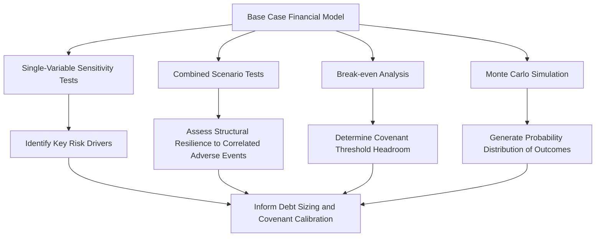
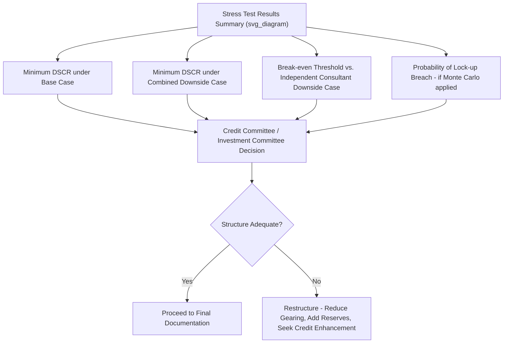

## Stress Testing and Scenario Modeling

### Definition and Purpose

**Stress testing and scenario modeling** in PPP financial structuring refers to the systematic process of varying key input assumptions in the financial model (see Building a PPP Financial Model and Cash Flow Waterfall) to assess how coverage ratios, equity returns, and overall project resilience respond to adverse or alternative conditions. Where a base case reflects the single most likely projection of project performance, stress testing deliberately explores less likely but plausible downside (and sometimes upside) outcomes, providing lenders and sponsors with a risk-adjusted understanding of the structure's robustness rather than relying on a single deterministic forecast.

### Rationale within Project Finance Risk Assessment

**Key Points**

- **Substitute for corporate credit history**: Because project finance lending is non-recourse or limited-recourse (see Non-Recourse and Limited-Recourse Financing Principles), lenders cannot rely on historical financial performance across a diversified corporate entity; stress testing the project's own projected cash flows against adverse scenarios is the primary tool for assessing whether the proposed capital structure and covenant package (see Debt Service Coverage Ratios and Lender Covenants) provide adequate protection.
- **Debt sizing validation**: Stress test results directly inform whether the debt sizing derived from the base case (see Capital Structure and Debt-to-Equity Ratios) remains prudent under a reasonable range of adverse outcomes, or whether additional gearing headroom, reserve funding, or credit enhancement (see First-Loss Facilities and Blended Finance Structures; Government Support Agreements and Letters of Comfort) is warranted.
- **Covenant threshold calibration**: The severity of stress scenarios a structure can withstand before breaching distribution lock-up or default thresholds directly shapes where those thresholds are set in the financing documents.
- **Rating agency and credit committee requirement**: Formal stress testing is typically a mandatory component of both internal lender credit approval processes and, where applicable, rating agency methodologies for project finance debt ratings.

### Categories of Stress Tests

**Key Points**

1. **Single-variable (univariate) sensitivity tests**: Isolate the impact of varying one input assumption at a time (e.g., construction cost, demand, interest rate) while holding all others at base case, allowing identification of which variables the project's financial performance is most sensitive to.
2. **Combined/multivariate scenario tests**: Vary multiple variables simultaneously to model a coherent adverse scenario (e.g., a combined construction delay and cost overrun, or a demand downside coinciding with an interest rate increase), reflecting that adverse events are often correlated rather than occurring in isolation.
3. **Break-even analysis**: Identifies the specific threshold level of a variable (e.g., the minimum traffic volume, or maximum cost overrun) at which the project's coverage ratios breach a critical covenant threshold, providing an intuitive "how much stress can this withstand" metric.
4. **Probabilistic/Monte Carlo simulation**: Rather than testing discrete scenarios, assigns probability distributions to key uncertain variables and runs a large number of simulated outcomes, generating a full distribution of possible coverage ratio and IRR outcomes rather than a small number of discrete point estimates.

### Common Variables Subjected to Stress Testing

**Key Points**

| Variable Category | Typical Stress Applied | Primary Risk Addressed |
| --- | --- | --- |
| Construction cost | Percentage cost overrun beyond contingency | Adequacy of sponsor contingency funding and gearing headroom |
| Construction schedule | Delay in Commercial Operations Date | DSRA adequacy, extended interest-during-construction, liquidated damages recovery sufficiency |
| Demand/revenue volume | Reduction from base case demand forecast | Minimum DSCR resilience, particularly for merchant/demand-risk projects |
| Tariff/pricing | Regulatory tariff reduction or delayed adjustment | Revenue predictability under regulatory/political risk |
| Interest rate | Increase in floating reference rate | Adequacy of hedging arrangements, unhedged exposure impact |
| Inflation/escalation | Divergence between revenue and cost escalation indices | Real margin compression from indexation mismatch |
| O&M cost | Increase in operating or major maintenance costs | Cost overrun absorption capacity within the cash flow waterfall |
| Currency (for cross-border financings) | Local currency depreciation against hard-currency debt | Currency mismatch risk where revenue and debt service are in different currencies |
| Off-taker/counterparty credit | Payment delay or default by off-taker | Reliance on payment support mechanisms (see Government Support Agreements and Letters of Comfort) |

### Break-Even Analysis: Illustrative Example

**Example**

A break-even stress test for a toll road PPP might be structured as follows: starting from the base case traffic forecast, the model incrementally reduces projected traffic volume until the minimum DSCR breaches the lock-up covenant threshold, identifying (for illustration) that the project can withstand a defined percentage reduction in traffic from base case before triggering a distribution lock-up, and a further defined reduction before triggering a formal Event of Default. This break-even threshold is then compared against the independent traffic consultant's assessed downside case (see Due Diligence Processes in Project Finance) to determine whether the structure provides adequate headroom relative to a credible pessimistic demand scenario.

[Inference] The specific break-even threshold considered acceptable by lenders varies by sector, the credibility and conservatism of the underlying demand forecast methodology, and the lender group's individual risk appetite; there is no single universal break-even margin considered acceptable across all PPP transactions.

### Combined Scenario Testing: Downside Case Construction

**Key Points**

A well-constructed **combined downside case** (sometimes called a "severe but plausible" scenario) typically layers several individually stressed variables that could realistically occur together, rather than each variable's most extreme individually-tested stress level (which, applied simultaneously, could represent an implausibly severe or even impossible combined scenario):

- A moderate construction delay (rather than the most extreme delay tested individually) combined with
- A moderate cost overrun (rather than the maximum individually-tested overrun) combined with
- A moderate demand shortfall in the initial operating years (reflecting a plausible slower-than-expected ramp-up)

This approach reflects the principle that correlated real-world adverse events rarely all manifest at their individually most extreme levels simultaneously, and that a combined scenario should represent a coherent, plausible narrative rather than a mechanically compounded worst-case-of-everything outcome that may not reflect any realistic risk pathway.

### Monte Carlo Simulation Approach

**Key Points**

- **Probability distribution assignment**: Rather than testing single-point scenarios, key uncertain variables (demand growth rate, construction cost, interest rates) are assigned probability distributions (e.g., normal, triangular, or empirically-derived distributions based on historical comparable data) reflecting the range and likelihood of possible outcomes.
- **Iterative simulation**: The model is run thousands of times, each iteration drawing random values from the assigned distributions, generating a full distribution of possible DSCR, LLCR, and Equity IRR outcomes rather than a handful of discrete scenarios.
- **Probability-weighted risk metrics**: Outputs can include metrics such as the probability of DSCR breaching the lock-up threshold in any given period, or the probability of the project achieving a minimum acceptable Equity IRR, providing a more nuanced risk picture than deterministic scenario testing alone.
- **Correlation modeling**: Sophisticated Monte Carlo approaches incorporate correlation assumptions between variables (e.g., construction cost overruns and schedule delays are often positively correlated), avoiding the unrealistic assumption of fully independent variable behavior.

[Unverified] The practical adoption of full Monte Carlo simulation varies considerably across PPP markets and transaction sizes — some lender groups and rating agencies require or extensively use probabilistic simulation, while many transactions, particularly in markets with less developed project finance practice or smaller deal sizes, rely primarily on deterministic scenario and sensitivity testing without full probabilistic modeling; the extent of adoption should not be assumed uniform across all PPP contexts.

### Stress Testing Output Presentation

### Interaction with Credit Enhancement and Risk Mitigation Instruments

**Key Points**

Stress test results directly inform decisions about whether and how much credit enhancement is warranted:

- Where stress testing reveals inadequate headroom against off-taker payment risk, this may justify pursuing a Government Support Agreement covering off-taker payment shortfalls (see Government Support Agreements and Letters of Comfort).
- Where stress testing reveals thin coverage under combined construction risk scenarios, this may support the case for additional first-loss or mezzanine capital to absorb early-stage risk (see First-Loss Facilities and Blended Finance Structures; Senior, Mezzanine, and Subordinated Debt Instruments).
- Where currency stress testing reveals material unhedged exposure, this may prompt structuring of local-currency financing or currency hedging facilities as part of the overall risk mitigation package (see Role of Export Credit Agencies in PPP Risk Mitigation for related ECA local-currency financing discussion).

### Common Limitations and Critiques of Stress Testing Practice

**Key Points**

- **Historical data limitations**: Especially for novel technologies, new markets, or first-of-a-kind project structures, historical data to calibrate realistic stress magnitudes or probability distributions may be limited or entirely absent, requiring greater reliance on expert judgment and comparable-market benchmarking.
- **Correlation blind spots**: Poorly constructed combined scenarios may fail to capture genuine correlations between variables (e.g., a systemic economic downturn simultaneously affecting demand, interest rates, and currency values), potentially understating true combined downside risk.
- **False precision risk**: Detailed quantitative stress testing outputs can create an impression of analytical rigor that exceeds the genuine reliability of the underlying input assumptions, particularly for long-dated, multi-decade projections where the compounding uncertainty of assumptions many years into the future is substantial. [Inference] This is a widely recognized limitation of long-horizon financial modeling generally, though the specific degree to which it affects the practical usefulness of any given PPP stress test depends on the quality and evidentiary basis of the underlying input assumptions in that specific model.

### Related Topics

- Building a PPP Financial Model and Cash Flow Waterfall
- Debt Service Coverage Ratios and Lender Covenants
- Capital Structure and Debt-to-Equity Ratios
- Due Diligence Processes in Project Finance
- First-Loss Facilities and Blended Finance Structures
- Government Support Agreements and Letters of Comfort
- Monte Carlo simulation methodology in infrastructure finance
- Real Options Analysis in PPP Valuation