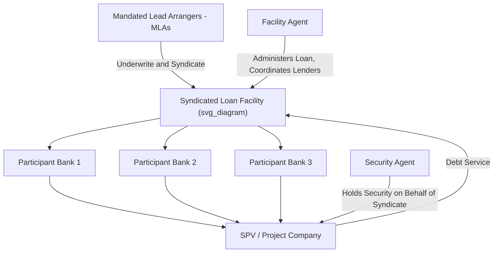

## Commercial Bank Lending for Infrastructure Projects

### Definition and Role within PPP Capital Markets

**Commercial bank lending** refers to debt financing provided by regulated deposit-taking banks to PPP/infrastructure projects, historically the dominant source of senior debt in project finance globally (see Senior, Mezzanine, and Subordinated Debt Instruments). Commercial banks typically participate through **syndicated loan structures**, pooling capital from multiple institutions to fund a single large transaction that would exceed any individual bank's internal exposure limits, and provide financing across both the construction and operational phases of a project, though their relative role has evolved substantially due to post-financial-crisis regulatory changes discussed below.

### Structural Role in the Capital Stack

Commercial banks primarily supply:

- **Construction-phase term loans**: The highest-risk phase (see Due Diligence Processes in Project Finance), where banks' relationship-based credit assessment, ability to conduct intensive drawdown monitoring (via Independent Engineer certification), and flexibility to negotiate bespoke covenant packages make them better suited than institutional bond investors, who generally prefer lower construction-phase risk.
- **Revolving credit facilities and working capital lines**: Shorter-term, more flexible facilities supporting operational liquidity needs that are less suited to long-term fixed-rate bond structures.
- **Letters of credit and guarantee facilities**: Supporting equity bridge loans (see Special Purpose Vehicle Structuring; Capital Structure and Debt-to-Equity Ratios), performance bonds, and DSRA guarantee alternatives (cash-collateralized letters of credit substituting for a fully funded Debt Service Reserve Account).
- **Hedging counterparty services**: Providing interest rate and currency swaps to manage the risk exposures discussed in Building a PPP Financial Model and Cash Flow Waterfall and Stress Testing and Scenario Modeling.

### Syndication Structures and Roles

**Key Points**

1. **Mandated Lead Arranger (MLA)**: The bank(s) appointed by the SPV/sponsors to structure, underwrite, and syndicate the loan, typically taking the largest individual exposure and earning arrangement fees for the role.
2. **Underwriting vs. best-efforts syndication**: In an **underwritten deal**, the MLA(s) commit to fund the full facility amount themselves and then sell down participations to other banks, bearing the risk that syndication proves difficult; in a **best-efforts/club deal**, a group of banks jointly commits from the outset without a single underwriter bearing full placement risk — the choice affects execution certainty and pricing.
3. **Facility Agent**: Administers the loan post-signing (payment processing, covenant compliance monitoring, information distribution to the syndicate), acting as the operational point of contact between the SPV and the lender group.
4. **Security Agent**: Holds the security package (see Security Packages and Intercreditor Arrangements) on behalf of the syndicate, acting only on instructions from the requisite lender majority per the intercreditor agreement.
5. **Club deals vs. broad syndication**: Smaller or more specialized transactions may be structured as a "club deal" among a limited number of relationship banks with shared risk appetite, avoiding the cost and complexity of broad syndication to a large, more heterogeneous lender group.

### Regulatory Constraints Shaping Commercial Bank Participation

**Key Points**

- **Basel III/IV capital adequacy requirements**: Long-tenor, illiquid project finance loans require banks to hold proportionally more regulatory capital against them compared to shorter-duration or more liquid assets, increasing the effective cost to banks of holding long-dated infrastructure debt on their balance sheets and incentivizing shorter-tenor lending, syndication/distribution strategies, or a shift toward fee-generating arranger roles rather than long-term balance sheet retention.
- **Net Stable Funding Ratio (NSFR) and liquidity coverage requirements**: Basel III liquidity rules penalize funding long-dated assets with shorter-dated liabilities, creating a structural incentive for banks to limit the tenor of infrastructure loans they retain on balance sheet, often shorter than the full concession term, necessitating refinancing risk management (see Senior, Mezzanine, and Subordinated Debt Instruments for related refinancing dynamics discussion).
- **Large exposure limits**: Regulatory and internal risk limits on exposure to a single borrower or sector constrain how much any individual bank can commit to a single large infrastructure transaction, reinforcing the need for syndication.
- **Sector and country risk appetite variation**: Individual banks' internal risk policies and regulatory home-country capital treatment can vary in their willingness to lend into specific sectors (e.g., varying appetite for merchant power or emerging market infrastructure) or jurisdictions, affecting the achievable lender pool and pricing for any given transaction.

[Inference] The precise degree to which these regulatory factors constrain bank tenor and pricing in any specific transaction depends on the individual banks' current capital position, funding cost, and regulatory jurisdiction, and general statements about regulatory impact should not be read as predicting outcomes for any specific deal.

### Mini-Perm and Refinancing Structures

**Key Points**

A structural response to bank tenor constraints is the **mini-perm structure**, where commercial banks provide debt with a shorter maturity (e.g., typically well short of the full concession term) than the underlying asset's economic or concession life, with the explicit expectation that the debt will be refinanced (via capital markets issuance, extended bank facilities, or institutional debt) at or before the mini-perm's maturity date, once construction risk has passed and the project has an established operating track record.

- **Hard mini-perm**: Includes a hard maturity date with limited or no extension mechanism, creating genuine refinancing risk if market conditions are unfavorable at the maturity date.
- **Soft mini-perm**: Includes cash sweep mechanisms and step-up margins that incentivize (but do not strictly require) refinancing by a target date, providing more flexibility if market conditions are temporarily unfavorable, while still preserving lender expectation of eventual take-out.

This structure directly connects to the refinancing dynamics discussed in Senior, Mezzanine, and Subordinated Debt Instruments and Special Purpose Vehicle Structuring, where post-construction refinancing is a standard feature of the PPP capital structure lifecycle rather than an exceptional event.

### Pricing Structure of Commercial Bank Debt

**Key Points**

Commercial bank loan pricing in project finance typically comprises:

$$\text{All-in Cost of Debt} = \text{Base Rate (e.g., SOFR/relevant reference rate)} + \text{Credit Margin} + \text{Fees (amortized)}$$

- **Credit margin**: Reflects the project's specific risk profile (construction vs. operational phase, sector, country risk, gearing level), often stepping down over the loan life as construction risk passes and the project establishes an operating track record (a "margin ratchet" or "margin step-down" mechanism), and conversely sometimes stepping up in mini-perm structures approaching the refinancing date to incentivize timely refinancing.
- **Arrangement/upfront fees**: Paid to the Mandated Lead Arranger(s) for structuring and underwriting the facility, typically calculated as a percentage of the committed facility amount.
- **Commitment fees**: Charged on undrawn portions of the facility during the construction drawdown period, compensating lenders for capital held available but not yet earning interest margin.
- **Agency fees**: Ongoing fees paid to the Facility Agent and Security Agent for their administrative roles throughout the loan life.

### Commercial Bank Due Diligence Focus Areas

Consistent with the broader due diligence framework discussed in Due Diligence Processes in Project Finance, commercial bank credit committees place particular emphasis on:

- **Sponsor track record and financial capacity**: Even in a non-recourse structure, banks assess sponsor experience and capacity to fund cost overruns or provide committed equity support (see Non-Recourse and Limited-Recourse Financing Principles), since sponsor quality remains a meaningful (if indirect) credit factor.
- **EPC contractor and O&M operator credit quality**: Particularly relevant given the reliance on these counterparties' performance guarantees within the back-to-back contract matching structure (see Sponsors, Lenders, and the Project Finance Contractual Web).
- **Relationship and repeat-business considerations**: Commercial banks with established relationships with particular sponsors or in particular markets may apply somewhat different risk-adjusted pricing or covenant flexibility reflecting the value of an ongoing banking relationship, distinct from purely transactional institutional capital market investors.

### Coordination with Other Financing Sources

**Key Points**

Commercial bank tranches frequently sit alongside other financing sources discussed elsewhere in this course within a single transaction's capital structure:

- **With ECA-backed tranches**: Commercial banks often provide the commercial risk-bearing portion of a buyer credit facility where an ECA provides a guarantee (see Role of Export Credit Agencies in PPP Risk Mitigation), or fund alongside separate ECA direct-lending tranches under a Common Terms Agreement.
- **With DFI/MDB tranches**: Commercial banks sometimes participate as "B-loan" lenders alongside an MDB's own "A-loan," benefiting from the MDB's preferred creditor status treatment and de-risking effect even though the commercial bank does not directly hold that status itself — a structure historically used to mobilize commercial capital into higher-risk emerging market transactions (see First-Loss Facilities and Blended Finance Structures for related blended finance mobilization discussion).
- **With capital markets/bond financing**: In some structures, commercial bank debt funds the construction phase (leveraging banks' drawdown monitoring capability) with an expectation of refinancing into project bonds post-completion (leveraging institutional investors' preference for lower-risk, longer-duration operational-phase cash flows) — a natural application of the mini-perm structure described above.

### Related Topics

- Senior, Mezzanine, and Subordinated Debt Instruments
- Security Packages and Intercreditor Arrangements
- Capital Structure and Debt-to-Equity Ratios
- Due Diligence Processes in Project Finance
- Role of Export Credit Agencies in PPP Risk Mitigation
- First-Loss Facilities and Blended Finance Structures
- Basel III/IV regulatory capital treatment of project finance exposures
- Institutional investors and project bond markets in infrastructure finance