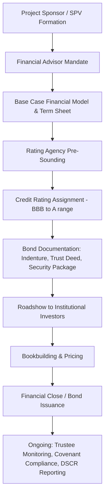
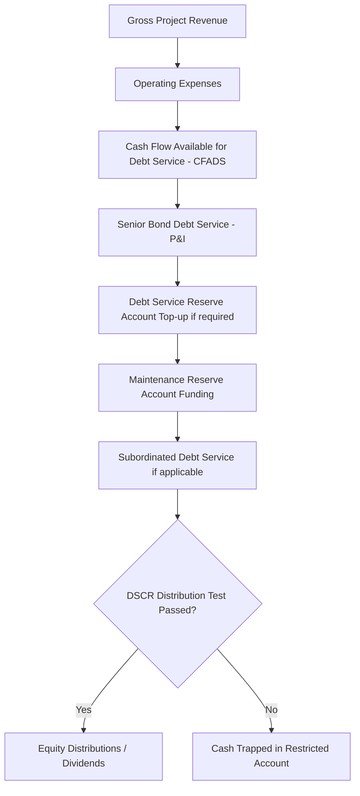

## Project Bonds and Infrastructure Debt Capital Markets

### Overview

Project bonds are debt securities issued by a special purpose vehicle (SPV) to finance a specific infrastructure or PPP project, secured against the project's assets and cash flows rather than the balance sheet of a corporate sponsor. They represent one of the principal channels through which infrastructure projects tap the debt capital markets (DCM) rather than relying solely on commercial bank loans. Infrastructure debt capital markets encompass the broader ecosystem of instruments, investors, intermediaries, and structures used to raise long-term debt finance for infrastructure, including project bonds, infrastructure loans that are later securitized, private placements, and hybrid instruments.

### Rationale for Project Bonds in PPP Finance

**Key Points**

- Bank loan capacity for long-tenor infrastructure debt contracted structurally after the 2008 Global Financial Crisis due to Basel III capital and liquidity requirements, which penalize long-duration illiquid assets held on bank balance sheets.
- Institutional investors (pension funds, insurance companies, sovereign wealth funds) hold long-dated liabilities and seek matching long-dated, stable-yield assets, making infrastructure project bonds a natural asset-liability match.
- Bonds can achieve longer tenors (20–30+ years) than typical bank debt (7–15 years, though increasingly extended via mini-perm structures), reducing refinancing risk for the project.
- Public bond markets can offer more competitive pricing for well-structured, investment-grade project risk once construction risk is passed or mitigated.

### Bank Debt vs. Project Bonds: Comparative Structure

| Dimension | Bank Loans | Project Bonds |
| --- | --- | --- |
| Typical tenor | 7–15 years (mini-perm) | 20–35 years (matches concession life) |
| Flexibility during construction | High (drawdown schedules, waivers, amendments negotiable) | Low (bondholders dispersed, consent processes slow) |
| Investor base | Commercial banks, development finance institutions (DFIs) | Pension funds, insurers, asset managers, sovereign wealth funds |
| Pricing basis | Floating rate + margin (SOFR/EURIBOR + spread) | Fixed rate, often inflation-linked |
| Covenant monitoring | Active, relationship-based | Passive, indenture/trust-deed based |
| Suitability | Construction-phase, greenfield risk | Operational-phase, brownfield/refinancing |

### Typical Structuring Approach: Wrapped vs. Unwrapped Bonds

**Monoline-Wrapped Bonds** (historically significant, largely dormant post-2008)

Bond principal and interest payments were insured by a monoline financial guarantee insurer (e.g., Ambac, MBIA, FSA), allowing the bond to carry the insurer's AAA rating rather than the underlying project's rating. This model collapsed after the 2008 crisis when monoline insurers themselves suffered rating downgrades.

**Unwrapped (Direct Rating) Bonds** (current dominant model)

The bond is rated on the project's own credit quality, typically BBB to A category, based on:

- Contracted revenue stability (availability payments or minimum revenue guarantees)
- Counterparty creditworthiness (grantor/offtaker rating)
- Structural credit enhancements (reserve accounts, step-in rights, cash sweeps)

### Structural Credit Enhancement Mechanisms

**Key Points**

- **Debt Service Reserve Account (DSRA):** Cash-funded or letter-of-credit-backed reserve, typically covering 6–12 months of debt service, drawn upon in a shortfall.
- **Cash Sweep / Cash Trap:** Excess cash flow above a target Debt Service Coverage Ratio (DSCR) is trapped and used to prepay bonds, accelerating amortization when the project outperforms.
- **Step-in Rights:** Contractual rights allowing lenders/bondholders (via a security trustee) to replace the project company or a defaulting subcontractor to preserve project continuity.
- **Independent Engineer / Technical Advisor:** Provides periodic certification of construction progress and operational performance to bondholders through the trustee.
- **Maintenance Reserve Account (MRA):** Funded ahead of major lifecycle maintenance (e.g., pavement overlay on toll roads) to avoid deferred capex undermining asset condition.

### Debt Service Coverage Ratio (DSCR) and Sizing

Bond sizing is typically governed by the minimum and average DSCR over the debt tenor:

$$DSCR_t = \frac{CFADS_t}{DS_t}$$

Where $CFADS_t$ is Cash Flow Available for Debt Service in period $t$, and $DS_t$ is scheduled debt service (principal + interest) in period $t$.

Rating agencies and bondholders typically require:

- Minimum DSCR of 1.20x–1.40x for availability-based PPPs (lower volatility)
- Minimum DSCR of 1.40x–1.60x+ for demand-risk projects (toll roads, merchant power)
- Loan Life Coverage Ratio (LLCR) and Project Life Coverage Ratio (PLCR) are also assessed:

$$LLCR = \frac{PV(CFADS_{t \to maturity})}{Outstanding\ Debt_t}$$

### Bond Structuring Timeline and Process

### Construction Risk and the "Wrapped Construction" Problem

**Key Points**

- Bond investors are typically construction-risk-averse due to dispersed holdings and limited ability to actively manage distress compared to a syndicate of relationship banks.
- Common mitigation structures:
  - **Bank-bond hybrid (mini-perm-to-bond refinancing):** Banks finance construction; bonds refinance at commercial operations date (COD), transferring completion risk away from bond investors.
  - **Wrapped construction bonds:** A monoline or multilateral guarantee (e.g., partial credit guarantee from a DFI) covers construction-phase risk within the bond structure itself.
  - **Certified turnkey EPC contracts:** Fixed-price, date-certain EPC contracts with liquidated damages provisions reduce completion risk sufficiently for bonds to be issued pre-completion (used in some project bond markets, e.g., certain Canadian P3 bonds).

### Key Global Infrastructure Bond Markets

**North America**

Canadian P3 market is notable for bonds issued at financial close (construction-inclusive), aided by strong EPC wrap structures and a mature institutional investor base (pension funds such as CPPIB, CDPQ). US Private Activity Bonds (PABs) provide tax-exempt financing for qualifying infrastructure PPPs, and Build America Bonds-style structures have periodically supported municipal infrastructure debt.

**Europe**

UK PF2 and earlier PFI projects utilized both bank debt and bond financing; European Investment Bank (EIB) project bond credit enhancement (PBCE) initiative supported subordinated tranches to lift senior bond ratings.

**Asia-Pacific**

Masala bonds (Indian rupee-denominated, offshore-issued) and onshore Indian infrastructure bonds via NBFCs like IIFCL; Australian PPP market strongly bond-financed given deep superannuation fund investor base.

**Emerging Markets**

Project bonds are less common due to shallower institutional investor bases, currency risk, and lower sovereign/sub-sovereign ratings; multilateral development banks (MDBs) and DFIs often provide partial credit guarantees or first-loss tranches to catalyze local currency bond markets.

### Green, Social, and Sustainability-Linked Infrastructure Bonds

**Key Points**

- **Green Bonds:** Proceeds ring-fenced for eligible green projects (renewable energy, low-carbon transport, water/wastewater) per frameworks such as the ICMA Green Bond Principles.
- **Social Bonds:** Proceeds fund projects with positive social outcomes (affordable housing, hospitals, schools) under ICMA Social Bond Principles.
- **Sustainability-Linked Bonds (SLBs):** Coupon step-ups/step-downs tied to achievement of pre-defined Key Performance Indicators (KPIs), rather than use-of-proceeds restriction.
- Second-party opinions (SPOs) from providers (e.g., Sustainalytics, ISS ESG) are commonly obtained to validate framework alignment. [Inference: growth trajectory and market share of labeled bonds within infrastructure DCM specifically may vary meaningfully by year and region; consult current market data for precise figures.]

### Inflation-Linked Project Bonds

Many availability-payment PPPs feature inflation-indexed payment mechanisms (e.g., tied to CPI/RPI), making inflation-linked bonds a natural liability match for insurers with inflation-linked pension liabilities (common in UK PFI bond structures). Coupon and/or principal adjusts with a reference index:

$$Payment_t = Payment_0 \times \frac{Index_t}{Index_0}$$

### Credit Rating Agency Methodologies

Rating agencies (S&P Global Ratings, Moody's, Fitch) apply project finance-specific criteria distinct from corporate ratings, generally assessing:

- Revenue risk (availability-based, demand-based, or merchant/market)
- Counterparty/offtaker credit quality (often capping the project rating near the grantor's rating for availability deals)
- Operations phase risk (O&M contractor track record, technology risk)
- Structural protections (covenant package, reserve accounts, distribution tests)
- Refinancing risk (for mini-perm or bullet structures)

[Unverified: exact current rating agency criteria documents are periodically revised; practitioners should consult the latest published methodology from the specific agency for a live transaction.]

### Illustrative Cash Flow Waterfall for Bond-Financed PPP

### Worked Example: Sizing a Project Bond

**Example**

A toll road SPV forecasts average annual CFADS of $85 million over a 25-year concession. The rating agency requires a minimum DSCR of 1.45x on a fully amortizing, level-debt-service basis at an assumed coupon of 5.5%.

Maximum annual debt service:

$$DS_{max} = \frac{CFADS}{DSCR_{min}} = \frac{85}{1.45} \approx \$58.6\ million$$

Using the level-annuity debt sizing formula for a 25-year bond at 5.5%:

$$Debt = DS_{max} \times \frac{1 - (1+r)^{-n}}{r} = 58.6 \times \frac{1 - (1.055)^{-25}}{0.055} \approx \$780\ million$$

This gives an approximate maximum bond issuance size of $780 million, subject to further stress testing (downside traffic scenarios, interest rate sensitivity, and rating agency haircuts). [Inference: this is a simplified illustrative calculation; actual bond sizing incorporates sculpted (non-level) debt service profiles matched to seasonal/cyclical revenue patterns, sensitivity/downside cases, and agency-specific stress assumptions.]

### Investor Base and Distribution Mechanics

**Key Points**

- **Primary market placement:** Private placement (Reg S / 144A in the US context) is common for infrastructure bonds given the specialized, buy-and-hold institutional investor base, avoiding full public registration costs.
- **Club deals vs. broadly syndicated:** Some infrastructure bonds are placed with a small club of insurers/pension funds under negotiated terms closer to a loan (sometimes called "private placement notes" or "USPP" — US Private Placements).
- **Secondary market liquidity:** Generally thin; most institutional holders buy-and-hold to match long-dated liabilities, reducing mark-to-market trading activity relative to corporate bonds.

### Risks Specific to Infrastructure/Project Bonds

**Key Points**

- **Refinancing risk:** Bullet or mini-perm bond structures maturing before full amortization require refinancing at uncertain future market conditions.
- **Interest rate risk:** Fixed-rate bonds expose the issuer to opportunity cost if rates fall, and expose the project to negative carry if proceeds are drawn before construction needs arise (partially mitigated via forward-starting or delayed-draw structures).
- **Event risk:** Force majeure, regulatory change, or counterparty default (e.g., offtaker credit deterioration) can impair bond debt service capacity.
- **Currency risk:** Cross-border bond issuance in hard currency against local-currency project revenues creates FX mismatch, mitigated via currency hedges, local-currency bond issuance, or partial risk guarantees from MDBs.
- **Concentration/liquidity risk in secondary markets:** Limits price discovery and can widen bid-ask spreads if a holder needs to exit.

### Role of Multilateral and Development Finance Institutions

**Key Points**

- **Partial Credit Guarantees (PCGs):** Cover a portion of scheduled debt service, improving the bond's credit rating to attract institutional investors (e.g., World Bank, ADB, IFC guarantee programs).
- **Political Risk Insurance / Guarantees:** MIGA and similar agencies provide cover against expropriation, currency inconvertibility, and breach of contract by government counterparties, indirectly supporting bond issuance in emerging markets.
- **B-Bond / Co-financing structures:** MDBs anchor a portion of financing to catalyze broader institutional investor participation ("halo effect").

### Comparison: Project Bonds vs. Securitization of Infrastructure Loan Portfolios

| Feature | Single-Project Bond | Infrastructure Loan Securitization (CLO-style) |
| --- | --- | --- |
| Underlying asset | One project's cash flows | Pool of multiple infrastructure loans |
| Diversification | None (single-name risk) | Diversified across sectors/geographies |
| Rating basis | Individual project credit quality | Pool-level analysis, tranching, subordination |
| Market maturity | Well-established | Smaller, more niche market for infrastructure specifically |

### Practical Structuring Checklist

**Next Steps**

- **Assess revenue risk profile:** Determine whether the project is availability-based, demand-based, or hybrid, as this drives both feasible tenor and required DSCR.
- **Engage rating agencies early:** Pre-sounding sessions before formal mandate help calibrate structure to target rating.
- **Design the reserve account package:** Size DSRA and MRA based on independent technical advisor input on maintenance lifecycle needs.
- **Evaluate wrapped vs. unwrapped feasibility:** Confirm availability and cost of credit enhancement (monoline, MDB guarantee) versus direct market pricing.
- **Model refinancing scenarios:** Stress-test mini-perm-to-bond refinancing under adverse interest rate and credit spread environments.
- **Structure the security package:** Ensure step-in rights, direct agreements with the grantor, and trustee/security agent arrangements are enforceable under the governing law.
- **Plan investor distribution strategy:** Decide between public bond issuance, Reg S/144A private placement, or club USPP placement based on deal size and investor appetite.

**Related Topics**

- Availability Payment Mechanisms and Revenue Risk Allocation in PPPs
- Debt Service Coverage Ratios and Financial Covenant Design
- Monoline Insurance and Credit Wrap Structures (Historical and Current Use)
- Mini-Perm Financing and Refinancing Risk in Project Finance
- Multilateral Development Bank Guarantee Instruments (PCG, PRG, MIGA)
- Green, Social, and Sustainability-Linked Bond Frameworks (ICMA Principles)
- Rating Agency Methodologies for Project Finance (S&P, Moody's, Fitch)
- Inflation-Linked Debt Structures in Availability-Based PPPs
- Institutional Investor Asset-Liability Matching Strategies (Pension Funds, Insurers)
- Currency and Political Risk Mitigation in Emerging Market Infrastructure Bonds