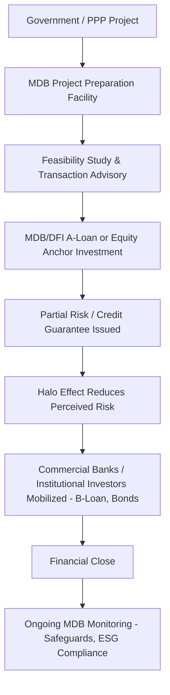

## Role of Multilateral and Bilateral Development Finance Institutions

### Overview

Multilateral Development Banks (MDBs) and Bilateral Development Finance Institutions (DFIs) are official-sector entities that provide debt, equity, guarantees, and technical assistance to infrastructure and PPP projects, particularly in markets where private capital alone is insufficient due to elevated risk perceptions, long tenors required, or nascent capital markets. They serve both a direct financing function and a catalytic function, crowding in private institutional capital that would not otherwise participate.

### Institutional Taxonomy

**Key Points**

- **Multilateral Development Banks (MDBs):** Owned by multiple sovereign member states; provide sovereign and non-sovereign (private sector) financing. Examples: World Bank Group (IBRD, IDA), Asian Development Bank (ADB), African Development Bank (AfDB), Inter-American Development Bank (IDB), European Bank for Reconstruction and Development (EBRD), European Investment Bank (EIB), Asian Infrastructure Investment Bank (AIIB), New Development Bank (NDB).
- **Bilateral DFIs:** Owned by a single sovereign government, typically mandated to support private sector development in emerging markets aligned with the home country's development and commercial interests. Examples: US International Development Finance Corporation (DFC), UK's British International Investment (BII), Germany's DEG, France's Proparco, Netherlands' FMO, Japan's JICA/JBIC.
- **Multilateral Private Sector Arms:** Dedicated private-sector-facing subsidiaries within MDB groups. Examples: International Finance Corporation (IFC, part of World Bank Group), ADB's Private Sector Operations Department, AfDB's Private Sector window.
- **Export Credit Agencies (ECAs):** Distinct from DFIs but often co-financing infrastructure — provide financing/guarantees tied to procurement of home-country goods/services (e.g., UK Export Finance, US EXIM Bank, Japan's NEXI).

### Core Instruments Deployed

**Key Points**

- **Senior Debt (A-Loans):** Direct MDB/DFI lending from the institution's own balance sheet, typically at concessional or near-market rates depending on the institution's mandate and the country's income classification.
- **Syndicated/Mobilized Debt (B-Loans):** Commercial bank or institutional debt syndicated alongside the MDB's A-loan, benefiting from the MDB's preferred creditor status halo and, in some structures, formal risk participation.
- **Equity and Quasi-Equity:** Direct equity stakes or subordinated/mezzanine instruments, often taken by IFC, EBRD, or bilateral DFIs to strengthen a project's capital structure and signal credibility to other investors.
- **Guarantees:**
  - *Partial Credit Guarantees (PCGs):* Cover a defined portion of debt service (principal and/or interest) for a specified period, improving the credit profile of project bonds or loans.
  - *Partial Risk Guarantees (PRGs):* Cover default caused specifically by government or public entity non-performance of contractual obligations (e.g., non-payment under a PPA, expropriation).
  - *Political Risk Insurance (PRI):* Covers investors/lenders against currency inconvertibility, expropriation, breach of contract, and war/civil disturbance (e.g., MIGA, bilateral ECA political risk products).
- **Technical Assistance and Grant Funding:** Project preparation facilities, feasibility studies, transaction advisory support, and capacity building for government counterparties (e.g., PPIAF, various MDB-administered trust funds).
- **Local Currency Financing:** Some DFIs (e.g., TCX Fund, certain IFC and EBRD facilities) provide local-currency loans or hedging to mitigate currency mismatch risk for projects with local-currency revenues.

### The "Preferred Creditor Status" Concept

**Key Points**

- MDBs are generally treated by sovereign borrowers as preferred creditors, meaning their claims are serviced ahead of other external creditors even during a sovereign debt crisis or restructuring, based on longstanding practice rather than a formal legal doctrine.
- This status is not codified in a single binding international treaty; it derives from convention, shareholder backing, and the practical necessity for distressed sovereigns to maintain access to MDB concessional financing.
- Preferred creditor status contributes to the "halo effect," whereby co-financing or B-loan participation alongside an MDB reduces perceived risk for private lenders, even though the private tranche itself typically does not carry the same preferred status. [Inference: the strength of the halo effect and the degree of risk reduction actually observed varies by country, instrument, and market conditions, and is not a guaranteed credit enhancement in a legal sense.]

### Catalytic/Mobilization Role in PPP Finance

### Project Preparation Facilities (PPFs)

**Key Points**

- PPFs provide grant or concessional funding to governments for early-stage project development costs: feasibility studies, environmental and social impact assessments, legal and transaction advisory fees, and procurement support.
- Rationale: many PPPs fail to reach financial close due to poor upstream preparation; PPFs aim to improve the "bankability" of the project pipeline before private capital is solicited.
- Examples: Public-Private Infrastructure Advisory Facility (PPIAF), Global Infrastructure Facility (GIF), various regional MDB-administered project preparation funds.
- Some PPFs operate on a "success fee" or cost-recovery basis, recouping preparation costs from the project company at financial close.

### Environmental, Social, and Governance (ESG) Safeguards Role

**Key Points**

- MDBs and DFIs typically apply their own environmental and social (E&S) performance standards to financed projects, which often exceed local regulatory requirements in emerging markets (e.g., IFC Performance Standards, World Bank Environmental and Social Framework, Equator Principles which are themselves modeled on IFC standards).
- Commercial banks adopting the Equator Principles reference IFC Performance Standards as the benchmark for categorizing and managing E&S risk in project finance, indirectly extending MDB safeguard influence into private bank lending practices.
- MDB involvement in a PPP transaction often necessitates additional due diligence timelines and compliance costs but can improve long-term social license to operate and reduce stakeholder/community risk.

### Risk Mitigation Instrument Comparison

| Instrument | Risk Covered | Typical Provider | Effect on Project |
| --- | --- | --- | --- |
| Partial Risk Guarantee (PRG) | Government/public counterparty non-performance | World Bank, ADB, AfDB | Enables private debt where sovereign risk is the binding constraint |
| Partial Credit Guarantee (PCG) | Portion of scheduled debt service (any cause) | World Bank, regional MDBs | Improves bond/loan credit rating, extends tenor |
| Political Risk Insurance (PRI) | Expropriation, currency inconvertibility, war, breach of contract | MIGA, bilateral ECAs, private PRI market | Protects equity/debt investors in cross-border projects |
| Currency Hedging Facility | FX mismatch between hard-currency debt and local revenue | TCX Fund, IFC, EBRD | Reduces currency risk without requiring local capital markets depth |
| Liquidity/Standby Facility | Temporary cash flow shortfalls | Various DFIs | Bridges short-term revenue volatility (e.g., ramp-up risk) |

### Blended Finance Structures

**Key Points**

- Blended finance combines concessional (below-market) capital from DFIs, donors, or philanthropic sources with commercial capital to improve the overall risk-return profile of a project to a level acceptable to private investors.
- Common structural approaches:
  - **First-loss tranches:** Concessional capital absorbs initial losses in a layered capital structure, protecting more senior commercial tranches.
  - **Concessional pricing on subordinated debt:** Below-market rate junior debt improves blended cost of capital and DSCR headroom for senior lenders.
  - **Guarantee-based credit enhancement:** As described above, using donor or DFI capital to backstop specific risks rather than provide direct funding.
- The OECD DAC Blended Finance Principles and DFI Working Group frameworks provide guidance on ensuring blended finance is applied with minimum concessionality necessary to mobilize private capital (avoiding market distortion). [Inference: the degree to which "minimum concessionality" is consistently applied in practice is debated among practitioners and varies across institutions and transactions.]

### Case Illustration: Typical Structuring Pattern for an Emerging Market PPP

**Example**

A greenfield toll road PPP in a lower-middle-income country faces a sub-investment-grade sovereign rating, limiting access to long-tenor commercial bond financing. A layered structure might be:

1. IFC or regional MDB provides a senior A-loan (own-account) for a portion of debt, alongside equity co-investment to signal credibility.
2. A World Bank Partial Risk Guarantee covers default risk arising specifically from government non-payment under the availability payment mechanism, addressing the binding sovereign counterparty risk.
3. Commercial banks provide a B-loan syndicated alongside the MDB, benefiting from preferred creditor halo effects and the PRG coverage on government payment risk.
4. A bilateral ECA provides financing tied to procurement of home-country construction equipment/technology.
5. A PPF (e.g., PPIAF-supported) funded the original feasibility study and transaction advisory work that brought the project to market.

This layering allows the project to reach financial close despite risk factors that would otherwise deter purely private capital. [Inference: this is an illustrative composite structure; actual deal structures vary considerably based on country, sector, and prevailing institutional programs active at the time.]

### Criticisms and Limitations

**Key Points**

- **Crowding-out concern:** Some critics argue MDB/DFI participation, particularly on favorable terms, can crowd out rather than crowd in private capital if not carefully structured, undermining local capital market development.
- **Transaction complexity and timelines:** Multiple-institution financing structures increase documentation complexity, conditions precedent, and time to financial close relative to single-lender bank financing.
- **Additionality debate:** Ongoing debate exists over whether DFI/MDB involvement is genuinely additional (financing projects that would not otherwise proceed) versus subsidizing projects that could have been financed commercially. [Speculation: quantifying additionality rigorously across a large portfolio remains methodologically contested in the development finance literature.]
- **Concessionality vs. market distortion trade-off:** Excessive concessionality can distort market pricing signals and discourage private sector entry into a sector or country over the longer term.

### Comparative Snapshot: Selected Institutions and Typical Mandates

| Institution | Type | Typical Focus |
| --- | --- | --- |
| World Bank Group (IBRD/IDA/IFC/MIGA) | Multilateral | IBRD/IDA: sovereign lending; IFC: private sector debt/equity; MIGA: political risk insurance |
| Asian Development Bank (ADB) | Multilateral (regional) | Sovereign and non-sovereign infrastructure financing in Asia-Pacific |
| European Investment Bank (EIB) | Multilateral (regional) | EU policy-aligned infrastructure, climate, and PPP financing |
| EBRD | Multilateral (regional) | Transition economies, private sector-oriented |
| US DFC | Bilateral | US foreign policy-aligned private sector investment, debt and equity, political risk insurance |
| DEG / Proparco / FMO | Bilateral | Private sector development financing aligned with Germany/France/Netherlands development policy |
| JICA / JBIC | Bilateral | Japan-aligned infrastructure financing and export-linked investment |

### Practical Implications for PPP Transaction Structuring

**Next Steps**

- **Engage MDB/DFI early in project preparation:** Their involvement in feasibility and structuring phases can materially affect bankability and downstream financing costs.
- **Map risk allocation to appropriate instrument:** Match specific identified risks (government payment risk, currency risk, political risk) to the corresponding guarantee or insurance product rather than defaulting to generic concessional debt.
- **Anticipate extended timelines:** Build realistic financial close timelines accounting for MDB internal approval processes, safeguard compliance reviews, and board-level sign-offs.
- **Evaluate concessionality trade-offs:** Assess whether blended finance structuring is genuinely necessary for bankability or whether it risks displacing available commercial capital.
- **Coordinate multi-institution documentation:** Anticipate common terms agreements, intercreditor arrangements, and harmonized security packages when multiple MDBs/DFIs and commercial lenders co-finance a single project.

**Related Topics**

- Project Bonds and Infrastructure Debt Capital Markets
- Partial Risk and Partial Credit Guarantee Structuring
- Blended Finance and First-Loss Capital Structures
- Political Risk Insurance and MIGA Coverage Mechanics
- Equator Principles and IFC Performance Standards in Project Finance
- Project Preparation Facilities and Transaction Advisory Support
- Sovereign Risk and Preferred Creditor Status in Emerging Market Financing
- Export Credit Agency Financing in Infrastructure Procurement
- Local Currency Financing and Currency Risk Mitigation Facilities (e.g., TCX Fund)
- Additionality and Impact Measurement in Development Finance