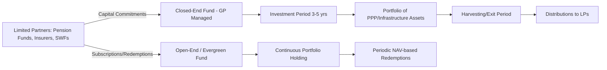

## Institutional Investors, Pension Funds, and Infrastructure Funds

### Overview

Institutional investors — pension funds, insurance companies, sovereign wealth funds, and endowments — have become a major source of long-term capital for infrastructure and PPP projects, typically deploying capital either directly (direct investment programs) or indirectly through dedicated infrastructure funds managed by specialist asset managers. Their participation is driven by a structural need to match long-dated liabilities with long-dated, stable-yield assets, and by infrastructure's historically low correlation with traditional equity and bond markets.

### Why Infrastructure Attracts Institutional Capital

**Key Points**

- **Asset-liability matching:** Pension funds and insurers hold long-duration liabilities (decades-long pension payout obligations or annuity commitments) and seek assets with similarly long, predictable cash flow profiles.
- **Inflation linkage:** Many PPP/infrastructure revenue mechanisms (availability payments, regulated asset base tariffs, toll escalation clauses) are explicitly or implicitly linked to inflation indices, providing a natural hedge against inflation-linked pension liabilities.
- **Diversification benefits:** Infrastructure cash flows are often less correlated with public equity market cycles, particularly for availability-based or regulated-monopoly assets with demand largely insulated from economic cycles.
- **Yield premium over government bonds:** Infrastructure debt and equity have historically offered a yield premium relative to comparable-duration government or investment-grade corporate bonds, compensating for illiquidity and structural complexity.
- **Stable, contracted cash flows:** Long-term concession agreements, PPAs, and availability payment contracts provide revenue visibility over multi-decade horizons uncommon in most other asset classes.

### Investor Typology and Access Routes

| Investor Type | Typical Access Route | Risk/Return Appetite |
| --- | --- | --- |
| Large pension funds (e.g., Canadian model: CPPIB, CDPQ, OMERS, OTPP) | Direct investment, co-investment, fund commitments | Core to core-plus; increasingly direct control-stake investing |
| Mid-sized pension funds | Fund-of-funds, commingled infrastructure funds | Core to value-add |
| Insurance companies | Direct debt/private placement, infrastructure debt funds | Predominantly debt/senior, favoring long duration and inflation linkage |
| Sovereign wealth funds (e.g., GIC, ADIA, QIA, Temasek) | Direct co-investment, large-ticket equity stakes | Core to opportunistic, often large single-asset positions |
| Endowments and foundations | Fund commitments (smaller allocations) | Diversified, typically smaller check sizes |

### The "Canadian Model" of Direct Infrastructure Investment

**Key Points**

- Large Canadian public pension funds pioneered a direct investment model, building substantial internal teams of infrastructure investment professionals rather than relying primarily on external fund managers, reducing fee drag and enabling direct control or significant minority stakes in assets.
- This model typically involves taking large, concentrated positions in high-quality infrastructure assets (airports, toll roads, utilities, ports) with active asset management involvement post-acquisition, rather than passive fund-style exposure.
- The model has been influential globally, with several other large pension funds (e.g., in Australia, the Netherlands, and parts of the Middle East) building similar internal direct investment capabilities. [Inference: the extent to which smaller or mid-sized pension funds can replicate this model is generally constrained by scale economics, since direct investment teams require substantial fixed cost investment to justify against fund-level allocations.]

### Fund Structures for Indirect Investment

**Closed-End Infrastructure Funds**

Fixed-life vehicles (typically 10–15 years, sometimes with extension options) raising committed capital from limited partners (LPs), deployed by a general partner (GP) over an investment period (typically 3–5 years), followed by a harvesting/exit period. Management fees typically charged on committed or invested capital, with carried interest (performance fee, commonly around 20% above a hurdle rate) payable to the GP upon exceeding a preferred return threshold.

**Open-End (Evergreen) Infrastructure Funds**

Perpetual-life vehicles allowing periodic subscriptions and redemptions, increasingly popular for core infrastructure strategies where investors seek long-duration exposure without the fund's own finite life mismatching the underlying assets' economic life. Valuation and liquidity management (redemption gates, notice periods) are structurally important design features.

**Fund Structure Comparison**

### Risk-Return Segmentation of Infrastructure Strategies

**Key Points**

- **Core:** Operational, contracted or regulated assets with low demand risk (e.g., availability-payment PPPs, regulated utilities); target returns typically in the mid-to-high single digits (net IRR), with low leverage and long hold periods.
- **Core-Plus:** Modest operational or market risk exposure (e.g., contracted assets with some re-contracting or volume risk); target returns moderately above core.
- **Value-Add:** Assets requiring operational improvement, expansion, re-contracting, or moderate development risk; higher target returns with correspondingly higher risk and often higher leverage.
- **Opportunistic:** Greenfield development, merchant risk exposure, or turnaround situations; highest target return band, often equity-return expectations comparable to private equity (mid-teens IRR or higher). [Inference: precise return bands vary by market cycle, geography, and manager; figures cited in industry materials should be treated as indicative rather than fixed benchmarks.]

### Infrastructure Debt Funds

**Key Points**

- Distinct vehicle type focused specifically on senior or subordinated infrastructure debt origination or secondary market purchase, rather than equity ownership.
- Appeals particularly to insurance companies seeking long-duration, investment-grade-equivalent credit exposure with a yield premium over comparable corporate bonds, often to match annuity or long-term liability books.
- Some structured as "buy-to-hold" strategies replicating bank-style direct lending, while others focus on secondary market trading of existing infrastructure loans/bonds.
- Basel III-driven bank deleveraging from long-tenor infrastructure lending (discussed in the context of project bonds) has directly expanded the addressable market for infrastructure debt funds as an alternative source of primary debt origination.

### Co-Investment Structures

**Key Points**

- Co-investment allows LPs in a fund to invest directly alongside the fund (typically on a no-fee or reduced-fee, no-carry basis) in specific transactions, increasing effective exposure to preferred deals while reducing blended fee drag.
- Increasingly used by large institutional investors to build direct investment experience and relationships incrementally before transitioning toward a more direct investment model (a common evolutionary pathway from fund investor to direct investor).
- Co-investment allocation is typically discretionary and relationship-dependent, often favoring larger, more sophisticated LPs with dedicated internal teams capable of conducting rapid due diligence alongside the GP.

### Fee and Governance Considerations

| Structure | Typical Management Fee | Typical Carried Interest | Governance |
| --- | --- | --- | --- |
| Closed-end fund | ~1.0%–1.5% of committed/invested capital | ~15%–20% above hurdle (commonly 7–8%) | LP Advisory Committee; limited LP control over individual deals |
| Open-end/evergreen fund | Similar or slightly lower ongoing fee | Sometimes structured differently (e.g., performance fee on NAV growth) | Governance via investor committees; redemption terms critical |
| Direct/co-investment | Reduced or no management fee | Reduced or no carry | Direct governance rights, board seats, veto rights possible |
| Direct investment (in-house team) | Internal cost only (no external fee) | None | Full governance control commensurate with equity stake |

[Inference: specific fee terms vary significantly by manager, vintage, and negotiating leverage of the LP; the ranges above reflect commonly cited industry norms rather than universal figures.]

### Due Diligence Considerations for Institutional Investors

**Key Points**

- **Revenue risk classification:** Distinguishing availability-based, regulated, contracted-demand, and merchant-risk revenue structures, each carrying materially different risk profiles.
- **Counterparty credit quality:** Assessing the creditworthiness of the offtaker/grantor (government entity, utility, or corporate counterparty) underpinning contracted cash flows.
- **Regulatory and political risk:** Evaluating stability of the regulatory framework (particularly for regulated asset base utilities) and political risk in the host jurisdiction.
- **Asset lifecycle and capex risk:** Reviewing maintenance capex schedules, technology obsolescence risk (particularly relevant for energy transition-exposed assets), and residual value assumptions at concession/asset-life end.
- **ESG and impact considerations:** Increasingly integrated into underwriting given both regulatory disclosure requirements (e.g., in jurisdictions with mandatory sustainability reporting) and LP-level ESG mandates.
- **Currency and jurisdictional risk:** For cross-border investments, assessing FX exposure, repatriation restrictions, and legal enforceability of contractual rights.

### Illustrative Institutional Allocation Pathway

**Example**

A mid-sized pension fund with a growing infrastructure allocation might progress through the following stages over a multi-year period:

1. Initial exposure via commitments to diversified closed-end infrastructure funds (blind-pool, multi-manager approach) to gain broad sector/geography diversification.
2. Selective co-investment participation alongside preferred GPs in specific transactions to increase net exposure and reduce blended fees.
3. Development of an internal infrastructure team capable of evaluating direct opportunities and conducting enhanced due diligence on co-investments.
4. Gradual transition toward direct or largely-direct investment in core assets, retaining fund commitments primarily for specialized strategies (e.g., emerging market infrastructure, value-add/opportunistic exposure) where in-house capability remains limited.

[Inference: this represents a commonly observed evolutionary pattern among larger institutional investors rather than a universal or prescribed sequence; actual allocation strategy depends heavily on fund size, governance structure, and risk appetite.]

### Market Structure and Fundraising Trends

**Key Points**

- Infrastructure as an asset class has grown substantially in aggregate assets under management (AUM) over the past two decades, evolving from a niche alternative allocation to a distinct strategic asset class within many institutional portfolios.
- Fundraising has periodically concentrated among a smaller number of large, established managers ("flight to scale"), particularly during periods of market uncertainty, though this pattern fluctuates by cycle. [Unverified: current fundraising concentration levels and precise AUM figures change frequently; consult up-to-date industry data (e.g., from Preqin, Infrastructure Investor, or similar data providers) for current-period statistics.]
- Energy transition-related infrastructure (renewables, grid modernization, storage, and increasingly digital infrastructure such as data centers and fiber networks) has represented a growing share of new infrastructure fundraising activity in recent years. [Inference: the relative share of these sub-sectors within total infrastructure fundraising is subject to change and should be verified against current market reports rather than treated as static.]

### Practical Implications for PPP Sponsors and Advisors

**Next Steps**

- **Understand the investor's access route:** Structure transaction size, governance rights, and information disclosure appropriate to whether the counterparty is a direct investor, co-investor, or fund-level LP.
- **Align revenue structure with investor risk appetite:** Core-oriented institutional investors will generally require availability-based or strongly contracted revenue structures; demand-risk or greenfield development structures may require value-add or opportunistic capital instead.
- **Anticipate extended due diligence for direct/large-ticket investors:** Large pension funds and sovereign wealth funds conducting direct investment typically apply extensive in-house due diligence processes comparable to or exceeding traditional bank credit processes.
- **Consider phased capital structures:** Combining early-stage bank/DFI debt with later-stage institutional refinancing (post-construction, post-ramp-up) can align each capital source with the risk phase it is best suited to bear.
- **Monitor ESG disclosure expectations:** Prepare for increasingly standardized ESG data requests from institutional investors, particularly those subject to their own regulatory sustainability disclosure obligations.

**Related Topics**

- Project Bonds and Infrastructure Debt Capital Markets
- Role of Multilateral and Bilateral Development Finance Institutions
- Availability Payment Mechanisms and Revenue Risk Allocation in PPPs
- Infrastructure Asset Valuation and Discounted Cash Flow Approaches
- Regulated Asset Base (RAB) Models in Utility Infrastructure
- ESG Integration and Sustainable Finance Frameworks in Infrastructure
- Secondary Market Transactions and Infrastructure Asset Recycling
- Currency and Political Risk Mitigation in Cross-Border Infrastructure Investment
- Fund Governance Structures: LP Advisory Committees and Co-Investment Rights
- Energy Transition and Digital Infrastructure as Emerging Asset Sub-Classes