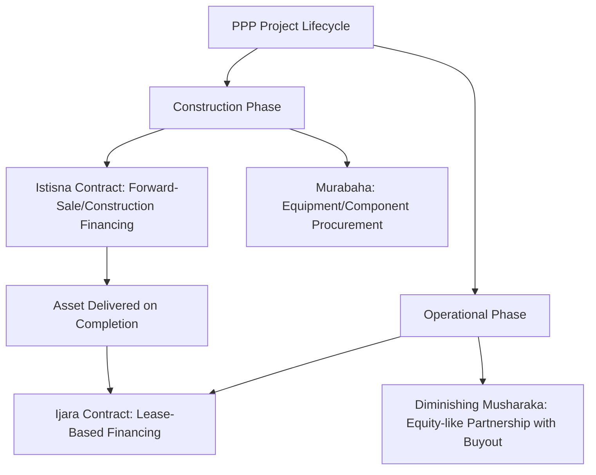
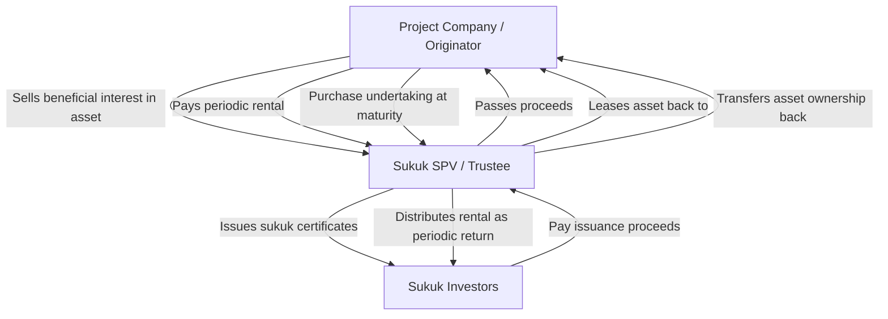

## Islamic Finance Structures for PPPs

### Overview

Islamic finance structures for Public-Private Partnerships (PPPs) apply Shariah-compliant financial contracts to infrastructure project financing, avoiding elements prohibited under Islamic jurisprudence — principally interest (riba), excessive uncertainty (gharar), and speculative/gambling-like transactions (maysir). Islamic project finance shares substantial structural common ground with conventional non-recourse project finance, since both rely on identifiable, asset-backed cash flows rather than pure credit-based lending — a natural alignment given that Shariah-compliant finance generally requires a tangible underlying asset or identifiable economic activity.

### Foundational Shariah Principles

**Key Points**

- **Prohibition of Riba (Interest):** Fixed, predetermined interest on money lent is prohibited; returns to capital providers must instead derive from a share of profit, a rental payment, or a mark-up on an underlying asset transaction.
- **Prohibition of Gharar (Excessive Uncertainty):** Contracts must clearly define subject matter, price, and delivery terms; ambiguous or highly speculative contractual terms are impermissible.
- **Prohibition of Maysir (Gambling/Speculation):** Pure speculative gain unconnected to productive economic activity or genuine risk-sharing is prohibited.
- **Asset-Backing Requirement:** Financial transactions should generally be linked to real, tangible assets or identifiable economic activity rather than pure money-for-money exchange.
- **Risk-Sharing Principle:** Capital providers are expected to share in the genuine commercial risk of the underlying venture, rather than earning a guaranteed return regardless of asset performance.

### Core Islamic Finance Contract Structures Used in PPPs

**Ijara (Lease-Based Financing)**

The financier (or a special purpose vehicle acting on behalf of sukuk holders) purchases or holds title to the underlying asset and leases it to the project company for a defined rental payment stream. Ijara is among the most common structures for infrastructure PPPs given its close structural analogy to operating/finance lease arrangements already familiar in conventional project finance.

**Istisna (Construction/Manufacturing Contract)**

A forward-sale contract in which the financier commissions construction of an asset (e.g., a power plant or toll road) to be delivered at a future date at an agreed price, often paid in installments during construction. Commonly combined with Ijara in an "Istisna-Ijara" structure: Istisna finances the construction phase, and upon completion the asset transitions into an Ijara lease structure for the operational phase.

**Murabaha (Cost-Plus Sale)**

A sale contract in which the financier purchases an asset or equipment and resells it to the project company at a disclosed cost-plus-margin price, payable on a deferred basis. More commonly used for equipment or component financing within a broader project structure than as the primary financing vehicle for an entire infrastructure asset.

**Musharaka (Partnership/Joint Venture)**

A profit-and-loss sharing partnership in which multiple parties (e.g., the project sponsor and Islamic financiers) contribute capital and share profits according to a pre-agreed ratio, while losses are shared strictly in proportion to capital contribution. Diminishing Musharaka structures are common in infrastructure, whereby the financier's equity stake is progressively bought out by the project company over time through periodic payments, combining profit distribution with capital repayment.

**Mudaraba (Profit-Sharing Trust Financing)**

A partnership in which one party (rab-ul-mal) provides capital and the other (mudarib) provides management expertise, with profits shared per a pre-agreed ratio and losses borne by the capital provider (absent misconduct/negligence by the manager). Less commonly used as the primary structure for infrastructure PPPs relative to Ijara and Istisna-Ijara.

### Structure Selection by Project Phase

### Sukuk: Islamic Project Bonds

**Key Points**

- Sukuk are Shariah-compliant certificates representing an undivided beneficial ownership interest in an underlying asset, usufruct (right to use), or a specific investment activity — structurally distinct from conventional bonds, which represent a pure debt obligation.
- **Ijara Sukuk:** The most common sukuk structure for infrastructure; certificate holders collectively own (via a special purpose vehicle, typically termed a "sukuk SPV" or trustee) an interest in a leased asset and receive rental payments as periodic distributions, analogous economically to bond coupons.
- **Al-Istithmar/Wakala Sukuk:** Certificate holders appoint an agent (wakil) to invest proceeds in a pool of Shariah-compliant assets or activities on their behalf, distributing returns generated by the underlying investments.
- **Hybrid Sukuk:** Combine multiple underlying contract types (e.g., a mix of Ijara and Murabaha receivables) within a single sukuk structure to diversify the underlying asset pool.
- Sukuk require an identifiable underlying asset or pool of assets/rights to which certificate holders have genuine ownership exposure, distinguishing them in principle from conventional asset-backed securities, though the degree of true risk transfer in practice has been a subject of ongoing Shariah scholarly debate. [Inference: the extent of genuine asset risk transfer versus debt-like guaranteed-return characteristics varies across specific sukuk issuances and has been a recurring point of scrutiny among Shariah boards and academics.]

### Typical Ijara Sukuk Structure for a PPP Asset

### Shariah Governance and Compliance Process

**Key Points**

- **Shariah Supervisory Board (SSB):** A panel of qualified Islamic scholars reviews and approves the structure, underlying contracts, and documentation of a transaction for Shariah compliance before issuance.
- **Fatwa Issuance:** The SSB issues a fatwa (religious ruling/opinion) confirming the structure's compliance, typically required before financial close or sukuk issuance.
- **Ongoing Shariah Audit:** Some structures require periodic post-issuance Shariah compliance audits to confirm continued adherence throughout the asset's operational life, particularly relevant for long-tenor infrastructure structures.
- **Cross-Jurisdictional Variation:** Shariah interpretation varies by school of jurisprudence (madhhab) and by regional/institutional Shariah board practice; a structure approved in one jurisdiction (e.g., Malaysia) may face different scrutiny or require modification for acceptance in another (e.g., GCC markets), given differing standard-setting bodies and scholarly traditions. [Unverified: specific points of divergence between jurisdictions evolve as standard-setting bodies (e.g., AAOIFI, and national Shariah advisory councils) update guidance; practitioners should confirm current standards for the specific jurisdictions involved in a transaction.]

### Standard-Setting Bodies

**Key Points**

- **AAOIFI (Accounting and Auditing Organization for Islamic Financial Institutions):** Publishes Shariah standards, accounting standards, and governance standards widely referenced (though not universally mandatory) across Islamic finance markets, including standards specifically addressing sukuk structures.
- **IFSB (Islamic Financial Services Board):** Issues prudential and risk management standards for Islamic financial institutions, relevant to how Islamic banks and financiers assess and capitalize project finance exposures.
- National-level Shariah advisory councils (e.g., Bank Negara Malaysia's Shariah Advisory Council) provide jurisdiction-specific guidance that may take precedence within that market.

### Comparative Structure: Islamic vs. Conventional PPP Financing

| Dimension | Conventional Financing | Islamic Financing |
| --- | --- | --- |
| Return to capital provider | Interest (fixed or floating rate) | Rental (Ijara), profit share (Musharaka/Mudaraba), or mark-up (Murabaha/Istisna) |
| Underlying requirement | Credit-based lending; asset backing not required | Requires identifiable underlying asset, usufruct, or economic activity |
| Risk-sharing | Lender risk generally limited to counterparty credit/default risk | Capital provider may share genuine commercial/asset performance risk depending on structure (particularly Musharaka/Mudaraba) |
| Governance/approval | Standard corporate/lending approval processes | Requires Shariah Supervisory Board approval and fatwa issuance |
| Documentation | Loan agreements, bond indentures | Ijara/Istisna/Musharaka contracts, purchase/lease undertakings, sukuk trust deeds |
| Typical bond-equivalent | Conventional project bond | Sukuk (Ijara, Wakala, or hybrid) |

### Combining Islamic and Conventional Tranches (Hybrid Financing)

**Key Points**

- Many large PPP transactions in markets with active Islamic finance sectors (e.g., Malaysia, GCC countries, Indonesia, Pakistan, Turkey) utilize hybrid capital structures combining a conventional loan/bond tranche with a parallel Shariah-compliant tranche (sukuk or Islamic facility), broadening the accessible investor base.
- Structuring hybrid deals requires careful intercreditor arrangements to ensure equivalent security and priority treatment between conventional lenders and sukuk/Islamic facility holders, since the underlying legal form of claims differs (beneficial ownership interest vs. direct debt claim) even where commercial terms are aligned.
- Documentation complexity increases relative to a purely conventional or purely Islamic structure, given the need to reconcile two distinct legal and religious compliance frameworks within a single security and payment waterfall.

### Illustrative Example: Istisna-Ijara Financing for a Power Plant PPP

**Example**

A government awards a build-operate-transfer (BOT) contract for a power plant to a project company. To finance construction using Islamic structures:

1. During construction, an Istisna contract is used: the Islamic financier (or sukuk SPV on behalf of investors) commits to pay the project company/EPC contractor in installments as construction milestones are achieved, in exchange for eventual delivery of the completed asset.
2. Upon commercial operations date (COD), the asset is transferred into an Ijara structure: the financier (via the SPV) holds beneficial ownership and leases the plant back to the project company.
3. The project company pays periodic rental payments (structured to approximate a conventional debt service schedule in economic terms) over the operational period.
4. A purchase undertaking obligates the project company to acquire full ownership of the asset at the end of the lease term (or upon specified trigger events), mirroring the economic effect of full loan amortization in a conventional structure.

[Inference: this represents a commonly used composite structure pattern (Istisna-Ijara) rather than a single universally standardized template; specific contractual mechanics vary by Shariah board and jurisdiction.]

### Key Markets for Islamic PPP and Infrastructure Finance

**Key Points**

- **Malaysia:** One of the most developed sukuk markets globally, with an established regulatory and Shariah governance framework supporting infrastructure sukuk issuance, including for PPP/toll road and utility projects.
- **GCC Countries (Saudi Arabia, UAE, Qatar, Bahrain, Kuwait):** Active sukuk issuance for infrastructure, energy, and PPP projects, often combined with conventional tranches in large-scale projects.
- **Indonesia:** Growing sukuk market including sovereign and project-linked issuances supporting infrastructure development.
- **Pakistan, Turkey, and select African markets:** Increasing use of Islamic structures for infrastructure financing, often supported by Islamic multilateral institutions.
- **Islamic Development Bank (IsDB) Group:** A multilateral institution providing Shariah-compliant financing (Istisna, Ijara, Murabaha-based facilities) specifically for infrastructure and development projects in member countries, functioning analogously to a conventional MDB but exclusively through Islamic contract structures.

### Practical Structuring Considerations

**Next Steps**

- **Engage Shariah advisors early:** Shariah Supervisory Board review should be integrated into the transaction timeline from initial structuring, as late-stage structural changes to achieve compliance can be costly and time-consuming.
- **Select contract structure by project phase:** Match Istisna to construction-phase financing needs and Ijara to operational-phase financing, using a combined Istisna-Ijara structure where a single financing spans both phases.
- **Assess investor base and market access:** Determine whether a pure Islamic structure, pure conventional structure, or hybrid dual-tranche structure best matches the target investor base and desired financing size.
- **Plan for cross-jurisdictional Shariah consistency:** For multi-jurisdictional transactions or syndications, confirm the transaction structure is acceptable to Shariah boards or standards in all relevant investor jurisdictions, referencing AAOIFI standards as a common baseline where applicable.
- **Align legal and Shariah documentation:** Ensure conventional-style security, step-in rights, and intercreditor protections are properly reflected within the Islamic contractual framework (e.g., via purchase undertakings, lease assignment provisions) to preserve equivalent lender/investor protections.

**Related Topics**

- Project Bonds and Infrastructure Debt Capital Markets
- Role of Multilateral and Bilateral Development Finance Institutions
- Institutional Investors, Pension Funds, and Infrastructure Funds
- Sukuk Market Structuring and AAOIFI Shariah Standards
- Diminishing Musharaka Structures in Long-Term Asset Financing
- Hybrid Conventional-Islamic Tranche Structuring and Intercreditor Arrangements
- Islamic Development Bank (IsDB) Group Financing Instruments
- Build-Operate-Transfer (BOT) Contract Structuring in PPPs
- Cross-Border Shariah Compliance Variation and AAOIFI vs. National Standards
- Risk-Sharing Principles and Their Implications for Project Risk Allocation