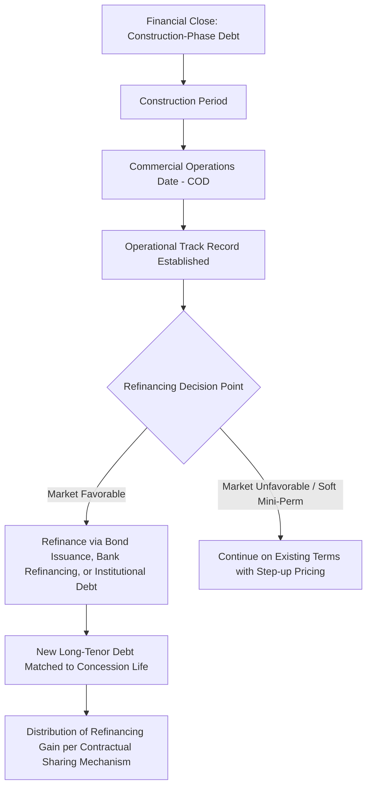

## Refinancing PPP Transactions After Construction Completion

### Overview

Refinancing after construction completion is a widely used technique in PPP finance whereby the original construction-phase financing (typically higher-cost bank debt reflecting construction risk) is replaced, once the project reaches commercial operations, with new debt priced to reflect the materially lower risk profile of an operational, cash-generating asset. The reduction in risk upon reaching operational status — with construction risk retired and a demonstrated operating track record beginning to accrue — frequently allows for improved pricing, extended tenor, and/or increased leverage, generating a financial gain often referred to as "refinancing gain."

### Rationale: Why Refinancing Occurs Post-Construction

**Key Points**

- **Risk profile shift:** Construction risk (cost overrun, delay, technical failure to achieve completion) is the single largest risk category priced into initial financing; once construction is complete and the asset is operating to specification, this risk is eliminated, materially reducing the project's overall risk profile.
- **Pricing differential:** Lenders/investors in construction-phase debt demand a risk premium for construction risk; post-completion, that premium is no longer warranted, creating a pricing arbitrage opportunity if the debt can be replaced or restructured.
- **Investor base broadening:** As discussed in relation to project bonds and institutional investors, many long-duration, lower-risk-appetite capital sources (insurance companies, certain pension fund strategies, infrastructure debt funds) prefer to invest in operational rather than construction-stage assets, expanding the potential refinancing investor base beyond the original construction-phase bank lenders.
- **Capital structure optimization:** Refinancing may enable increased leverage (higher gearing) once cash flow stability is demonstrated, potentially extracting additional value for equity sponsors without necessarily worsening the project's serviceability.
- **Tenor extension:** Replacing mini-perm bank debt (constructed to a shorter maturity, e.g., 7–10 years) with bond or institutional debt matched more closely to the full concession term reduces future refinancing risk.

### The Mini-Perm Structure and Refinancing Trigger

**Key Points**

- A "mini-perm" is a financing structure with a shorter contractual maturity (commonly 5–10 years) than the full project/concession life, structured with the explicit expectation that the debt will be refinanced at or before maturity, typically once operational stability is established.
- **Hard mini-perm:** The loan matures on the specified date, requiring the borrower to refinance (or face default/enforcement) regardless of market conditions at that time — placing genuine refinancing risk on the project company.
- **Soft mini-perm:** The loan technically has a longer legal maturity but includes strong economic incentives to refinance at an earlier target date (e.g., margin step-ups, cash sweep mechanisms accelerating post-target-date amortization), giving the borrower more flexibility if market conditions are unfavorable at the target refinancing date.

### Refinancing Structuring Timeline

### Refinancing Gain: Definition and Calculation Approach

**Key Points**

- Refinancing gain arises from the difference between the net present value of debt service obligations under the original financing structure and under the new (typically lower-cost, and/or higher-leverage) refinancing structure.
- In many PPP contractual frameworks (particularly UK PFI-derived standard contracts and similar models adopted internationally), the grantor/public authority has a contractual right to share in refinancing gains, reflecting the principle that risk transfer priced into the original deal (partly borne implicitly by the public sector through the overall project cost) should not accrue entirely to private equity sponsors when that risk subsequently proves lower than originally priced.

A simplified refinancing gain calculation can be expressed as:

$$Gain = PV(DS_{original}) - PV(DS_{new}) - Transaction\ Costs$$

Where $PV(DS_{original})$ is the present value of the remaining debt service under the original financing terms (discounted at an agreed discount rate, often the original project discount rate or blended cost of capital), and $PV(DS_{new})$ is the present value of debt service under the new financing terms.

### Refinancing Gain Sharing Mechanisms

| Mechanism | Description |
| --- | --- |
| Fixed percentage split | Grantor and sponsor share the calculated gain according to a pre-agreed fixed percentage (e.g., 50/50), as commonly specified in standard PFI/PPP contract templates |
| Sliding scale based on gearing increase | Sharing percentage varies depending on the extent of leverage increase, sometimes with higher public-sector shares where the sponsor extracts significant additional leverage-driven equity distributions |
| Threshold-based sharing | Gains below a specified threshold accrue entirely to the sponsor (to preserve incentive to refinance and pursue efficiency), with sharing applying only above the threshold |
| No contractual sharing | In jurisdictions/contract forms without a refinancing gain-sharing clause, the full benefit accrues to the private sponsor, subject to any general contractual consent requirements from the grantor |

[Inference: the prevalence of specific mechanisms varies significantly by jurisdiction and contract vintage; UK-originated PFI/PPP standard contracts have historically been more prescriptive on refinancing gain-sharing than many other jurisdictions' PPP frameworks, though practice elsewhere has evolved over time and should be confirmed against the specific applicable contract and jurisdiction.]

### Grantor Consent and Contractual Consultation Requirements

**Key Points**

- Most PPP contracts require prior notification to, and often consent from, the grantor/public authority before a material refinancing occurs, given the direct impact on risk allocation, gain-sharing calculations, and potentially on the security package affecting step-in rights.
- Consent processes typically involve a defined notice period and a mechanism for the grantor to review the proposed refinancing structure, verify the gain calculation methodology, and confirm any consequential changes to direct agreements or step-in arrangements.
- Some contracts explicitly restrict certain refinancing structures (e.g., limiting further leverage increases beyond a specified gearing cap) even where an overall gain-sharing mechanism exists, to protect the public interest in maintaining adequate equity-at-risk incentives for asset performance.

### Refinancing Structures and Their Trade-offs

**Term-Loan-to-Bond Refinancing**

Replacing bank mini-perm debt with a project bond matched to the remaining concession term. Benefits from the broader institutional investor base and typically longer achievable tenor, discussed in detail under project bond structuring; requires an achievable credit rating and sufficient issuance size to justify bond transaction costs.

**Bank-to-Bank Refinancing**

Replacing the original construction-phase bank syndicate with a new bank facility priced for operational risk, potentially from a different lender group (including specialist infrastructure debt funds acting in a loan-like capacity). Retains greater flexibility (waiver/amendment processes) relative to bond structures but may not achieve the same tenor extension.

**Institutional Private Placement Refinancing**

Refinancing via direct private placement with insurance companies or infrastructure debt funds, often achieving bond-like tenor and inflation-linked structuring benefits without the full public bond issuance process and associated costs — a middle path between bank refinancing and public/144A bond issuance.

**Equity Recapitalization (Leverage Increase)**

Rather than (or in addition to) simply replacing debt at similar leverage, sponsors may increase total leverage at refinancing, extracting a special dividend/distribution to equity holders funded by the incremental debt proceeds. This increases financial risk (lower post-refinancing DSCR headroom) in exchange for equity value extraction, and is a common trigger for gain-sharing disputes or scrutiny given the direct equity benefit involved.

### Refinancing Comparison Table

| Approach | Typical Tenor Achieved | Investor Base | Relative Complexity | Typical Trigger Context |
| --- | --- | --- | --- | --- |
| Bond refinancing | Long (matched to concession) | Institutional (pension, insurance, asset managers) | High (rating process, documentation, roadshow) | Larger transactions with sufficient scale for bond issuance costs |
| Bank-to-bank refinancing | Moderate (extended mini-perm) | Commercial banks, debt funds | Moderate | Smaller transactions, or where flexibility is prioritized |
| Institutional private placement | Long | Insurance companies, infrastructure debt funds | Moderate-High | Mid-to-large transactions seeking bond-like terms without public issuance |
| Equity recapitalization | Varies (often paired with above) | N/A (capital structure change) | Moderate-High (grantor scrutiny likely) | Sponsor-driven value extraction post-stabilization |

### Rating Agency and DSCR Implications at Refinancing

**Key Points**

- Refinancing often triggers a fresh assessment of the project's operational track record against original base case projections, informing the DSCR and rating levels achievable in the new structure.
- If leverage is increased at refinancing, minimum and average DSCR levels under the new debt structure will typically be tighter than under the original financing, requiring careful stress testing (downside scenarios on demand, opex, and lifecycle capex) to confirm the new structure remains resilient.
- For availability-based PPPs, achieving a strong operational track record (e.g., minimal unavailability deductions/performance point deductions) can materially support the case for both tenor extension and leverage increase at refinancing.

### Illustrative Example: Refinancing Gain Calculation

**Example**

A toll road PPP reaches COD with construction-phase bank debt priced at a margin of 3.25% over the reference rate on a 10-year mini-perm structure. Two years into operations, with a stable traffic track record established, the sponsor refinances via a 25-year project bond priced with an effective all-in cost approximately 150 basis points lower than the remaining bank debt cost, and with leverage increased modestly given the demonstrated cash flow stability.

If the present value of debt service under the original bank structure (remaining term) is calculated at $620 million, and the present value of debt service under the new bond structure (inclusive of the higher principal amount from increased leverage) is calculated at $540 million, with transaction costs of $8 million:

$$Gain = 620 - 540 - 8 = \$72\ million$$

If the underlying PPP contract specifies a 50/50 gain-sharing mechanism, approximately $36 million would be payable or creditable to the grantor (commonly structured as a lump-sum payment, a reduction in future availability payments, or a combination), with the remaining $36 million retained by the sponsor. [Inference: this is a simplified illustrative calculation; actual gain calculations involve more granular discounting conventions, tax adjustments, and treatment of transaction costs as specified in the particular contract's refinancing gain-sharing clause.]

### Risks and Considerations in Post-Construction Refinancing

**Key Points**

- **Market timing risk:** For hard mini-perm structures, an unfavorable interest rate or credit spread environment at the mandatory refinancing date can significantly increase the project's cost of capital or, in stressed scenarios, threaten the ability to refinance at all.
- **Over-leveraging risk:** Aggressive leverage increases at refinancing to maximize equity extraction can leave insufficient DSCR headroom to absorb subsequent downside performance, increasing the probability of future covenant breach or distress.
- **Grantor relationship risk:** Disputes over gain-sharing calculation methodology (particularly discount rate selection and treatment of transaction costs) can create friction in the broader sponsor-grantor relationship if not addressed through clear contractual mechanics.
- **Rating volatility:** A refinancing that increases leverage may result in a lower achieved credit rating than the original financing, even though absolute risk (construction risk retirement) has decreased, due to the offsetting effect of higher leverage on coverage ratios.

### Practical Structuring Checklist

**Next Steps**

- **Review contractual refinancing provisions early:** Confirm notice periods, consent requirements, and the specific gain-sharing formula and discount rate methodology specified in the underlying PPP/concession agreement well ahead of the intended refinancing date.
- **Establish a robust operational track record:** Strong, well-documented performance data (availability/performance deductions, traffic/demand outturns versus base case) materially strengthens the refinancing case with new lenders/investors and rating agencies.
- **Model multiple refinancing scenarios:** Compare bond, bank, and institutional private placement routes under current market conditions, alongside sensitivity analysis on leverage increase levels and resulting DSCR headroom.
- **Engage the grantor proactively:** Early, transparent engagement on the proposed refinancing structure and gain-sharing calculation can reduce approval friction and consent timeline risk.
- **Stress test the new capital structure:** Confirm the refinanced structure remains resilient under downside operating scenarios, not solely under the current-period base case, particularly where leverage has increased.

**Related Topics**

- Project Bonds and Infrastructure Debt Capital Markets
- Institutional Investors, Pension Funds, and Infrastructure Funds
- Debt Service Coverage Ratios and Financial Covenant Design
- Mini-Perm Financing Structures and Construction-to-Term Debt Transition
- Availability Payment Mechanisms and Performance Deduction Regimes
- Grantor Step-in Rights and Direct Agreements in PPP Contracts
- Equity Returns and Distribution Waterfalls in PPP Structures
- Rating Agency Methodologies for Project Finance
- Risk Allocation Principles in PPP Contract Design
- Secondary Market Transactions and Infrastructure Asset Recycling