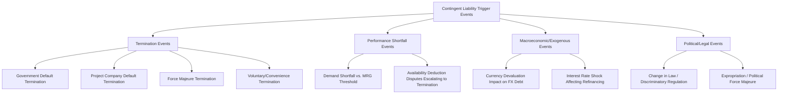
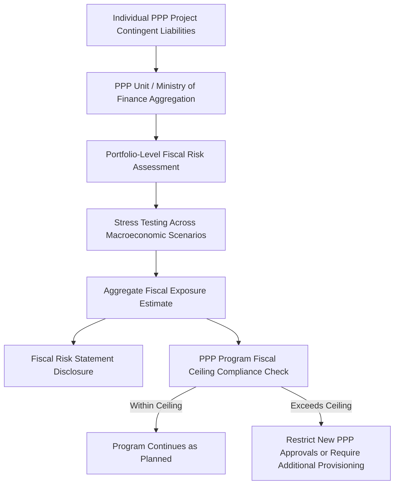

## Explicit and Implicit Contingent Liabilities in PPP Contracts

### Overview

Contingent liabilities in PPP contracts are potential financial obligations of the government (grantor) that are triggered by uncertain future events rather than arising as certain, scheduled payments. They represent one of the central fiscal risk management challenges in PPP programs, because unlike direct fiscal expenditure, contingent liabilities are often not fully reflected in headline budget or public debt figures at the time a PPP contract is signed, creating a risk of fiscal exposure crystallizing unexpectedly in future budget periods. The IMF and World Bank framework distinguishes contingent liabilities primarily along two dimensions: explicit versus implicit, and direct versus indirect (a related but distinct classification concerning whether the obligation arises from contract or from moral/political expectation).

### Classification Framework

**Key Points**

- **Explicit liabilities:** Legally defined obligations arising from a specific contractual clause, law, or statute, where the government's potential obligation is identifiable and (at least in principle) quantifiable in advance.
- **Implicit liabilities:** Obligations that are not contractually or legally defined but that the government may feel politically, socially, or morally compelled to honor if a project fails, based on public expectation, precedent, or the perceived need to preserve essential public services.
- **Direct liabilities:** Obligations that arise from certain, foreseen events (e.g., a scheduled availability payment) — often used in the broader fiscal risk taxonomy but relevant here mainly for contrast, since scheduled availability payments are typically treated as direct fiscal expenditure rather than contingent liability.
- **Indirect/Contingent liabilities:** Obligations that arise only if a specified uncertain event occurs (default, early termination, force majeure, demand shortfall below a guaranteed threshold, etc.).

### Contingent Liability Classification Matrix

|  | Explicit | Implicit |
| --- | --- | --- |
| **Direct** | Government-issued guarantee on project debt, explicit minimum revenue guarantee | Not typically applicable in this quadrant |
| **Contingent** | Termination compensation payments, PRG-triggered payments under legally defined events | Government bailout of a failing PPP to maintain essential services (e.g., water, transport) absent contractual obligation to do so |

[Inference: this matrix follows the widely referenced IMF/World Bank fiscal risk taxonomy (originally associated with work by Hana Polackova Brixi and others); exact terminology and quadrant boundaries are sometimes adapted or expanded in specific national fiscal risk management frameworks.]

### Common Explicit Contingent Liabilities in PPP Contracts

**Key Points**

- **Termination compensation payments:** Contractually defined payments owed by the government to the project company (and/or its lenders) upon early termination of the PPP contract, with the amount typically varying based on the cause of termination (government default, project company default, force majeure, or voluntary termination/change in law).
- **Minimum Revenue Guarantees (MRGs):** In demand-risk PPPs (e.g., toll roads), a contractual commitment by the government to top up project revenue if actual traffic/demand falls below a specified guaranteed threshold, common historically in several Latin American and Asian toll road programs.
- **Exchange rate guarantees:** Commitments to compensate the project company (or cover debt service) for adverse currency movements affecting foreign-currency-denominated debt service on a project with local-currency revenues.
- **Partial Risk Guarantees issued or counter-guaranteed by government:** Where a multilateral PRG requires a government counter-guarantee, the sovereign assumes a contingent liability to the multilateral institution in the event the PRG is called.
- **Force majeure compensation clauses:** Contractual provisions requiring government compensation (extension of term, direct payment, or debt service cover) upon occurrence of specified force majeure events, particularly "political force majeure" events (war, expropriation, change in law) as distinct from "natural force majeure."
- **Debt service guarantees / step-in financing obligations:** Explicit contractual commitments to cover debt service or provide standby financing under specified default or shortfall scenarios.
- **Change in law compensation:** Contractual provisions compensating the project company for the financial impact of discriminatory or project-specific legal/regulatory changes enacted after contract signing.

### Common Implicit Contingent Liabilities in PPP Contracts

**Key Points**

- **"Too essential to fail" service continuity pressure:** Governments often face strong political and social pressure to intervene (via bailout, renegotiation, or effective nationalization) if a PPP delivering an essential public service (water supply, urban transit, hospitals) approaches financial collapse, even absent any contractual obligation to do so.
- **Reputational and market access considerations:** Allowing a high-profile PPP to fail without any government support can damage the broader PPP program's credibility with future private investors and lenders, creating an implicit incentive to intervene even where not contractually required.
- **Renegotiation pressure following adverse events:** Project companies facing financial distress (e.g., due to unforeseen cost overruns, demand shortfalls, or macroeconomic shocks) frequently seek contract renegotiation; governments may concede more favorable terms than originally contracted to avoid project failure, effectively realizing an unbudgeted fiscal cost.
- **Sub-sovereign and state-owned enterprise (SOE) contingent exposure:** Where a sub-national government or SOE is the contracting authority, the national government may face implicit pressure to backstop the sub-sovereign's obligations if the sub-sovereign entity itself faces fiscal distress, even without an explicit sovereign guarantee.
- **Political cost of asset degradation:** If a concessionaire underinvests in maintenance approaching contract expiry (asset-stripping behavior) or a distressed operator reduces service quality, the government may face implicit pressure to fund remediation to avoid public service disruption, regardless of contractual handback condition provisions.

### Trigger Event Taxonomy

### Measurement and Valuation Challenges

**Key Points**

- **Quantification difficulty:** Unlike direct fiscal expenditure, contingent liabilities require probabilistic estimation of both the likelihood of the triggering event and the magnitude of the resulting obligation, both of which are inherently uncertain and often poorly modeled in early PPP appraisal stages.
- **Valuation approaches commonly referenced in fiscal risk literature:**
  - *Expected value / actuarial approach:* Estimating the probability-weighted expected cost across possible trigger scenarios.
  - *Contingent claims / option-pricing approach:* Treating certain guarantees (e.g., minimum revenue guarantees) as analogous to financial options (e.g., a put option on project revenue) and applying option-pricing techniques (e.g., adaptations of Black-Scholes-type models) to estimate fair value.
  - *Value-at-Risk (VaR) / stress-testing approach:* Modeling a portfolio of PPP contingent liabilities under stress scenarios (e.g., macroeconomic downturn, exchange rate shock) to estimate potential aggregate fiscal exposure at a given confidence level.
- **Implicit liability quantification:** Given the absence of a defined contractual trigger, implicit liabilities are typically assessed qualitatively (e.g., through fiscal risk statements identifying "watch list" projects) rather than through formal actuarial valuation, though some advanced fiscal risk management frameworks attempt scenario-based estimation. [Inference: methodological consensus on quantifying implicit liabilities is considerably less developed than for explicit liabilities, given their inherently non-contractual and probabilistic political nature.]

### Illustrative Option-Pricing-Style Framing for a Minimum Revenue Guarantee

**Example**

A toll road MRG commits the government to compensate the project company if actual annual toll revenue falls below a guaranteed threshold $R_{min}$. This can be conceptually framed as the government having implicitly written a put option on project revenue:

$$Payout = \max(R_{min} - R_{actual},\ 0)$$

Where $R_{actual}$ is realized annual toll revenue. The expected fiscal cost to government over the guarantee period can then be approximated as the probability-weighted sum of this payout function across the distribution of possible revenue outcomes, analogous to option valuation techniques used in financial markets. [Inference: while this framing is a useful conceptual and analytical tool referenced in the fiscal risk management literature, precise option-pricing model application to MRG valuation requires careful adaptation given traffic/demand risk does not follow the same statistical assumptions (e.g., geometric Brownian motion) typically used for financial asset price modeling; practitioners generally treat model output as indicative rather than precise.]

### Fiscal Reporting and Disclosure Frameworks

**Key Points**

- **IMF Fiscal Transparency Code and Manual on Government Finance Statistics (GFS):** Provide guidance on classification and disclosure of contingent liabilities, including PPP-related exposures, within government fiscal reporting frameworks.
- **IPSAS (International Public Sector Accounting Standards) — IPSAS 32 (Service Concession Arrangements):** Governs the grantor-side accounting treatment of service concession arrangements, informing when and how PPP-related assets, liabilities, and associated contingent exposures should be recognized in public sector financial statements.
- **Fiscal Risk Statements:** A growing number of countries publish periodic fiscal risk statements (often alongside the annual budget) disclosing quantified and qualitative contingent liability exposure from PPPs and other sources, following practices promoted by the IMF and World Bank as part of broader public financial management (PFM) reform agendas.
- **PPP-specific fiscal commitment registers/ceilings:** Some countries maintain a centralized register of PPP-related fiscal commitments and contingent liabilities, sometimes subject to an aggregate fiscal ceiling or budget appropriation requirement (e.g., requiring contingent liabilities to be counted against an overall PPP program fiscal risk limit) to prevent unconstrained accumulation of off-balance-sheet-style exposure. [Unverified: the specific design and enforcement rigor of such registers/ceilings varies considerably by country and evolves with PFM reform initiatives; current country-specific practice should be verified against the applicable national framework.]

### Comparative Table: Explicit vs. Implicit Liabilities — Management Implications

| Dimension | Explicit Liabilities | Implicit Liabilities |
| --- | --- | --- |
| Legal basis | Defined in contract/statute | No legal obligation; arises from political/social expectation |
| Quantifiability | More tractable (defined trigger and, often, formula) | Difficult (no defined trigger or formula) |
| Budgetary disclosure | Can be disclosed as a contingent liability note/register entry | Rarely formally disclosed; addressed via qualitative risk narrative at best |
| Risk mitigation approach | Contractual risk allocation, caps, guarantee fees, provisioning | Program-level reputational/political risk management, transparent renegotiation policies |
| Typical fiscal management tool | Contingent liability registers, provisioning reserves, guarantee ceilings | Fiscal risk statements (qualitative), governance safeguards on renegotiation |

### Risk Mitigation and Management Approaches

**Key Points**

- **Guarantee fees/premiums:** Charging the project company a fee for explicit guarantees (analogous to an insurance premium) to at least partially compensate the government for the contingent risk assumed, and to discourage excessive reliance on guarantees in project structuring.
- **Caps and thresholds on guarantee exposure:** Structuring MRGs, termination compensation formulas, and other guarantees with defined caps to limit maximum government exposure rather than open-ended commitments.
- **Provisioning/reserve funds:** Some fiscal frameworks require budgetary provisioning (setting aside funds against expected contingent liability calls) based on actuarial or probabilistic estimates, improving fiscal preparedness if liabilities crystallize.
- **Centralized PPP unit oversight:** Dedicated PPP units within ministries of finance are commonly tasked with contingent liability assessment, monitoring, and reporting across the PPP portfolio, providing a centralized point of fiscal risk aggregation rather than leaving assessment solely to individual contracting authorities.
- **Robust risk allocation at contract design stage:** Allocating risks to the party best able to manage them (a foundational PPP risk allocation principle) reduces the likelihood of both explicit guarantee triggers and implicit renegotiation pressure arising from poorly allocated risk.
- **Transparent renegotiation frameworks:** Establishing clear, pre-defined processes and criteria for contract renegotiation reduces the ad hoc, politically-driven nature of implicit liability crystallization and improves fiscal predictability.

### Portfolio-Level Fiscal Risk Aggregation

### Practical Implications for Fiscal Risk Managers

**Next Steps**

- **Establish a comprehensive contingent liability register:** Systematically catalog all explicit guarantee-type clauses across the PPP portfolio, including termination compensation formulas, MRGs, and change-in-law provisions, with periodic re-estimation of exposure.
- **Develop portfolio-level stress testing capability:** Move beyond single-project analysis to assess aggregate fiscal exposure under correlated stress scenarios (e.g., a macroeconomic downturn simultaneously affecting demand across multiple demand-risk PPPs).
- **Institutionalize guarantee fee/premium policy:** Where guarantees are extended, apply a consistent, risk-based fee methodology to both compensate for risk assumed and discourage moral hazard in project structuring.
- **Build implicit liability awareness into program governance:** Even though implicit liabilities resist formal quantification, maintain qualitative "watch lists" of politically or socially sensitive projects where renegotiation or bailout pressure risk is elevated.
- **Strengthen upfront risk allocation practices:** Prioritize risk allocation principles that minimize reliance on open-ended guarantees, reducing both explicit fiscal exposure and the conditions that give rise to implicit liability pressure.
- **Align disclosure practices with international standards:** Reference IMF Fiscal Transparency Code and IPSAS 32 guidance to structure contingent liability disclosure within national fiscal reporting.

**Related Topics**

- Termination Payment Mechanisms and Compensation Formulas in PPP Contracts
- Minimum Revenue Guarantees and Demand Risk Allocation
- PPP Fiscal Risk Statements and Contingent Liability Registers
- IPSAS 32 and Grantor-Side Accounting for Service Concession Arrangements
- Role of Multilateral and Bilateral Development Finance Institutions (Partial Risk Guarantees)
- Renegotiation Frameworks and Governance Safeguards in PPP Contracts
- Value-for-Money Assessment and Public Sector Comparator Methodology
- Change in Law and Political Force Majeure Compensation Clauses
- PPP Unit Design and Centralized Fiscal Oversight Functions
- Debt Sustainability Analysis and PPP-Related Off-Balance-Sheet Exposure