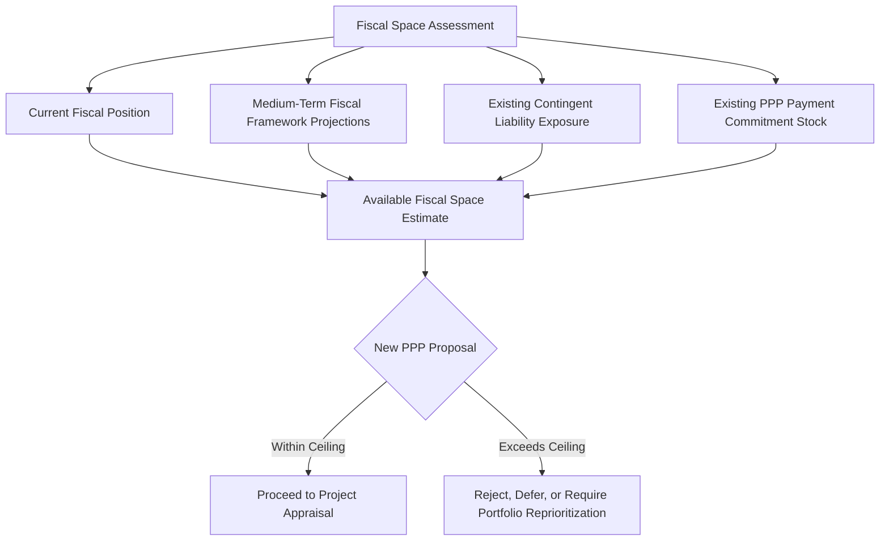

## Fiscal Space and Affordability Ceilings for PPP Programs

### Overview

Fiscal space refers to the room within a government's budget and overall fiscal position to accommodate additional spending — including PPP-related payment obligations — without jeopardizing fiscal sustainability, debt sustainability, or macroeconomic stability. Affordability ceilings are policy or regulatory limits imposed on the aggregate volume of PPP-related fiscal commitments a government (at national or sub-national level) may undertake, designed to prevent PPP programs from generating unsustainable future budgetary pressure even where individual projects appear affordable in isolation.

### Why Affordability Ceilings Are Necessary

**Key Points**

- **Off-balance-sheet accumulation risk:** Because many PPPs (particularly under certain accounting treatments) do not appear as government debt at inception, there is a structural risk that governments approve a large volume of PPPs without a portfolio-level view of cumulative future payment obligations, effectively building up a "hidden" long-term fiscal commitment.
- **Multi-year budget rigidity:** Availability payments and other PPP-related contractual payments typically extend 20–30 years and are largely non-discretionary once signed, progressively reducing the fiscal flexibility of future governments to reallocate spending in response to changing priorities or fiscal shocks.
- **Fiscal illusion incentive:** Because PPPs can (depending on accounting classification and political framing) appear to deliver infrastructure without immediate budgetary impact, there is an inherent political incentive to over-utilize PPPs relative to conventional public investment, particularly where short-term fiscal space for direct capital expenditure is constrained — a dynamic frequently discussed in the PPP fiscal risk literature as a driver of poor project selection.
- **Debt sustainability linkage:** Even where PPP payment obligations are not classified as government debt under national accounting standards, their long-term fixed payment character has debt-like characteristics from a fiscal sustainability perspective, warranting inclusion in broader debt sustainability analysis (DSA).

### Fiscal Space Assessment Framework

### Common Affordability Ceiling Metrics

**Key Points**

- **PPP payments as a percentage of total revenue:** A common ceiling metric caps aggregate annual PPP-related payment obligations (availability payments, guarantee calls, etc.) at a specified percentage of total government revenue (commonly cited illustrative ranges in international practice fall roughly in the low-to-mid single digits, though the specific applicable threshold varies substantially by country and evolves over time). [Unverified: specific percentage thresholds vary by country and period; consult the current applicable national PPP fiscal policy framework for precise figures rather than relying on generalized international benchmarks.]
- **PPP payments as a percentage of total public investment/capital budget:** Ceiling framed relative to the capital budget rather than total revenue, reflecting PPPs' role as a substitute for conventional public capital expenditure.
- **PPP payments as a percentage of GDP:** A macro-level ceiling metric assessing PPP-related fiscal commitments relative to the size of the overall economy, often used in cross-country comparative fiscal risk assessments.
- **Net Present Value (NPV) of aggregate future PPP commitments relative to a fiscal ceiling:** Rather than assessing annual payment flows alone, some frameworks require the discounted present value of all future contracted PPP payments (across the full portfolio) to remain below a specified ceiling relative to GDP or revenue, capturing the full long-term commitment rather than just near-term budget impact.
- **Sub-sovereign/sectoral sub-ceilings:** Some frameworks apply additional sub-ceilings by sector (e.g., transport, health, education) or by sub-national government level, preventing concentration risk within a single sector or jurisdiction even where the aggregate national ceiling is respected.

### Illustrative Ceiling Calculation

**Example**

A government establishes a policy ceiling limiting aggregate annual PPP-related payment obligations (across the entire portfolio) to 5% of total government revenue in any given fiscal year. If projected government revenue for the coming fiscal year is $40 billion, the maximum permissible aggregate PPP payment obligation for that year would be:

$$Ceiling_{annual} = 0.05 \times \$40\ billion = \$2\ billion$$

If the existing PPP portfolio already commits the government to $1.6 billion in payments for that fiscal year, only $400 million in additional annual payment capacity would be available for new PPP approvals reaching operational payment status in that year — requiring careful sequencing of new project approvals against the projected build-up of existing portfolio payment obligations over time, since payments typically only commence once each respective project reaches commercial operations. [Inference: this is a simplified illustrative calculation; actual ceiling frameworks typically require multi-year projection of the full portfolio's payment profile, not merely a single-year snapshot, given the staggered commencement of payment obligations across projects at different stages of development.]

### Portfolio-Level Payment Profile Modeling

**Key Points**

- Effective affordability ceiling management requires projecting the full multi-year payment profile of the existing PPP portfolio (not just the current year), since new PPPs approved today will generate payment obligations commencing only once construction is complete, potentially years in the future.
- A common analytical output is a portfolio "commitment profile" chart showing cumulative committed annual payments (existing plus proposed new projects) against the affordability ceiling threshold across a multi-year (often 10–20+ year) horizon, identifying future years where the ceiling may be breached even if current-year commitments remain within limits.
- Layering of new projects' payment commencement dates must be actively managed to avoid "bunching" of large payment increases in future years, which can otherwise occur if multiple large PPPs happen to reach commercial operations around the same time.

### Interaction with Debt Sustainability Analysis (DSA)

**Key Points**

- The IMF and World Bank's Debt Sustainability Framework (DSF), applied particularly in low-income and developing countries, increasingly incorporates PPP-related fiscal commitments and contingent liabilities into broader public debt sustainability assessments, reflecting recognition that PPP payment obligations carry debt-like fiscal risk even when not formally classified as government debt.
- Some national frameworks require PPP-related contingent liabilities and committed payment obligations to be explicitly reflected in medium-term debt management strategy (MTDS) documents and fiscal risk statements, ensuring PPP exposure is not assessed in isolation from the government's overall debt and borrowing plans.
- Statistical treatment under the Government Finance Statistics Manual (GFSM) and European System of Accounts (ESA, for EU member states) determines whether a specific PPP is recorded on- or off-government-balance-sheet based on risk allocation criteria (broadly, whether construction, availability, and demand risk are substantively transferred to the private party); this classification affects headline government debt and deficit figures but does not eliminate the underlying fiscal sustainability relevance of the payment commitment. [Inference: the precise application of on/off-balance-sheet classification criteria (e.g., under ESA 2010 rules in the EU context) involves detailed technical assessment specific to each contract's risk allocation, and general statements about classification should not be treated as a substitute for a project-specific statistical treatment assessment.]

### Institutional Governance Mechanisms for Enforcing Ceilings

**Key Points**

- **Centralized PPP unit gatekeeping:** A dedicated PPP unit or fiscal risk unit within the ministry of finance is commonly tasked with verifying that a proposed new PPP project remains within the applicable affordability ceiling before granting fiscal approval, functioning as a control point distinct from the sector ministry proposing the project.
- **Multi-stage approval gates:** Affordability assessment is often required at multiple stages of the project cycle (e.g., at project concept/pre-feasibility, at business case approval, and again at financial close) to capture the effect of cost or structuring changes that may have occurred since initial approval.
- **Legislative or cabinet-level ceiling authority:** In some jurisdictions, the affordability ceiling itself (or material changes to it) requires legislative approval or cabinet-level sign-off, providing a higher-level political check on the overall scale of PPP fiscal commitment accumulation.
- **Annual/periodic ceiling review and adjustment:** Ceilings are typically reviewed periodically (e.g., annually, alongside the budget cycle) to reflect updated fiscal projections, ensuring the ceiling remains a meaningful constraint rather than a static, outdated figure.

### Comparative Table: Ceiling Metric Trade-offs

| Metric | Strength | Limitation |
| --- | --- | --- |
| % of total revenue | Directly ties PPP burden to fiscal capacity | Revenue volatility (e.g., commodity-dependent economies) can cause ceiling headroom to fluctuate significantly year to year |
| % of capital budget | Reflects PPP as substitute for direct public investment | May understate overall fiscal burden if capital budget itself is small relative to total spending |
| % of GDP | Facilitates cross-country comparison; smooths for economic cycle to some extent | Less directly tied to actual budget execution capacity in a given fiscal year |
| NPV of total future commitments vs. ceiling | Captures full long-term exposure, not just near-term flows | Requires robust long-term forecasting and an agreed discount rate methodology; more technically demanding to compute and communicate |

### Risks of Poorly Designed or Unenforced Ceilings

**Key Points**

- **Ceiling circumvention via reclassification:** Political or fiscal pressure to proceed with a politically important project can create incentives to structure a PPP in a manner that technically avoids ceiling classification (e.g., through creative risk allocation intended primarily to achieve off-balance-sheet treatment) rather than genuine risk transfer, undermining the ceiling's fiscal risk management purpose.
- **Ceiling too loose to be binding:** A ceiling set at an overly generous threshold provides limited genuine fiscal discipline, functioning more as a formality than an effective constraint.
- **Ceiling too rigid, discouraging genuinely value-adding projects:** Excessively conservative ceilings may prevent fiscally sound, high-value infrastructure investment, particularly in the early stages of PPP program development before a track record is established, though this must be balanced against the fiscal illusion risk described above. [Inference: calibrating an appropriately binding-but-not-overly-restrictive ceiling level involves country-specific judgment and is not a matter of a single objectively correct threshold.]
- **Lack of enforcement mechanism:** A ceiling that exists in policy documents but lacks a genuine institutional gatekeeping mechanism (e.g., no ministry of finance veto power over non-compliant projects) is unlikely to meaningfully constrain program growth in practice.

### Practical Implications for PPP Program Management

**Next Steps**

- **Develop a multi-year portfolio payment projection model:** Build and regularly update a model projecting the full future payment profile of the existing PPP portfolio, incorporating realistic assumptions on construction timelines for projects not yet operational.
- **Select and formally adopt an appropriate ceiling metric:** Choose a ceiling metric (or combination of metrics) suited to the country's fiscal structure and data availability, ensuring the chosen metric is genuinely trackable with available fiscal data.
- **Institutionalize gatekeeping authority:** Ensure the ministry of finance or equivalent central fiscal authority holds genuine veto power over new PPP approvals that would breach the affordability ceiling, rather than a purely advisory role.
- **Integrate ceiling compliance into the DSA and MTDS process:** Ensure PPP-related fiscal commitments are visible within, and consistent with, the broader debt sustainability analysis and medium-term debt management strategy.
- **Guard against classification-driven structuring:** Establish independent statistical/accounting review of proposed risk allocation structures to confirm genuine risk transfer, rather than accepting risk allocation designed primarily to achieve favorable balance sheet classification.
- **Review and recalibrate ceilings periodically:** Reassess ceiling thresholds on a regular cycle aligned with the budget process, incorporating updated fiscal projections and portfolio performance data.

**Related Topics**

- Explicit and Implicit Contingent Liabilities in PPP Contracts
- Debt Sustainability Analysis and PPP-Related Off-Balance-Sheet Exposure
- On-Balance-Sheet vs. Off-Balance-Sheet Classification under ESA/GFSM Standards
- PPP Fiscal Risk Statements and Contingent Liability Registers
- PPP Unit Design and Centralized Fiscal Oversight Functions
- Value-for-Money Assessment and Public Sector Comparator Methodology
- Medium-Term Debt Management Strategy (MTDS) and Fiscal Planning
- Availability Payment Mechanisms and Long-Term Budget Commitments
- Project Selection and Prioritization in Public Investment Management
- Sub-National PPP Fiscal Risk and Sub-Sovereign Borrowing Frameworks