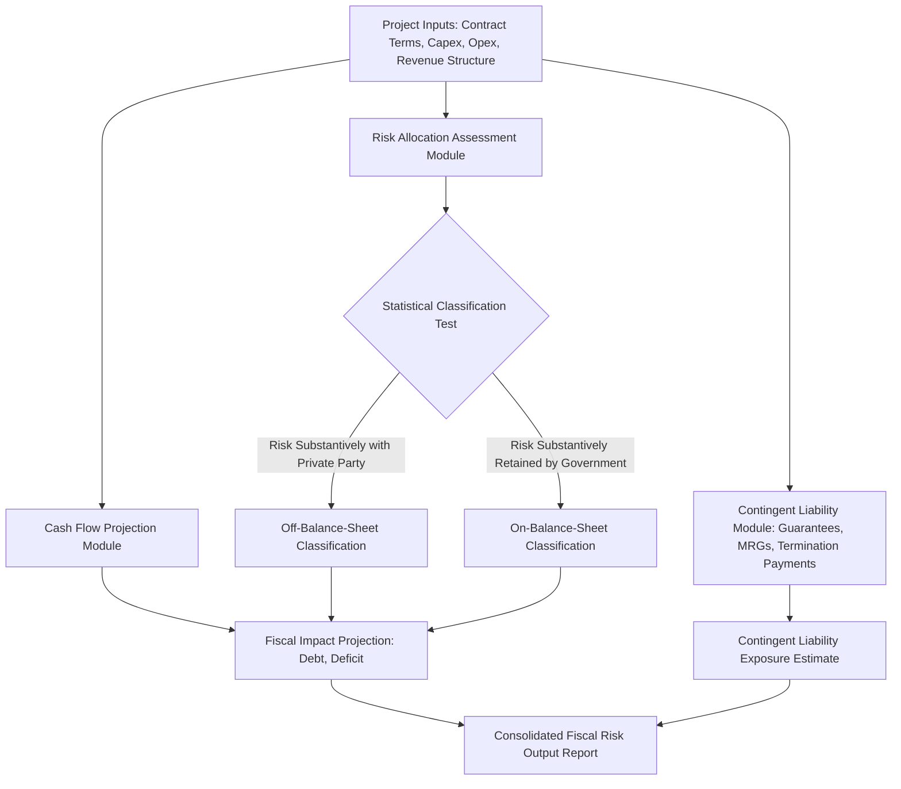

## The IMF-World Bank PPP Fiscal Risk Assessment Model

### Overview

The PPP Fiscal Risk Assessment Model (PFRAM) is a quantitative analytical tool jointly developed by the International Monetary Fund and the World Bank to help government officials assess the potential fiscal costs and risks arising from PPP projects. It is designed to support ministries of finance and PPP units in evaluating the macro-fiscal implications of individual PPP projects, including their impact on government debt, deficit, and contingent liability exposure, using an Excel-based modeling framework informed by IMF Government Finance Statistics (GFS) and European System of Accounts (ESA)-consistent statistical classification principles.

### Purpose and Intended Use

**Key Points**

- **Ex-ante project assessment:** PFRAM is primarily designed for use before contract signing, allowing fiscal authorities to assess the projected fiscal impact of a proposed PPP project during appraisal, alongside (not as a replacement for) value-for-money and public sector comparator analysis.
- **Statistical classification support:** The model assists users in determining whether a specific PPP project is likely to be classified as government debt (on-balance-sheet) or not (off-balance-sheet) under GFS/ESA statistical principles, based on the substantive allocation of construction, availability, and demand risk between the public and private parties.
- **Fiscal projection generation:** PFRAM generates projected impacts on key fiscal aggregates — government debt, deficit/fiscal balance, and contingent liability exposure — over the life of the project, incorporating the project's specific cash flow and risk allocation structure.
- **Capacity-building tool:** PFRAM is explicitly positioned by the IMF and World Bank as a capacity-building and analytical support tool for government officials, rather than a mandatory compliance or approval instrument; its outputs are intended to inform, not replace, government decision-making and existing national fiscal management processes. [Unverified: the current official positioning, version, and specific intended-use guidance for PFRAM should be verified against the latest IMF/World Bank publications, as such tools are periodically updated and refined.]

### Conceptual Architecture

### Core Input Categories

**Key Points**

- **Project and contract characteristics:** Contract type (availability-based, demand-based/toll, hybrid), concession/contract term, construction period, and capital expenditure schedule.
- **Revenue and payment mechanism structure:** Whether government makes direct availability payments, whether the project relies on user charges/tolls, and whether any minimum revenue guarantee or similar demand-risk mitigation mechanism applies.
- **Risk allocation matrix inputs:** Detailed responses regarding which party bears construction risk (cost overrun, delay), availability/performance risk, and demand risk — the core inputs driving the statistical (on/off-balance-sheet) classification assessment.
- **Guarantee and contingent support instrument details:** Specification of any explicit guarantees (minimum revenue guarantees, termination payment formulas, debt guarantees, exchange rate guarantees) including trigger conditions and, where applicable, caps.
- **Macro-fiscal baseline data:** Government revenue, GDP, and existing debt stock projections, providing the denominator context against which the project's fiscal impact is assessed (e.g., as a percentage of GDP or revenue).

### Statistical Classification Logic (GFS/ESA-Consistent Approach)

**Key Points**

- The classification approach embedded in PFRAM draws on the same broad risk-based principles used in ESA 2010 (applied within the EU statistical framework) and the IMF's Government Finance Statistics Manual, under which a PPP asset is generally recorded on the government's balance sheet if the government bears the majority of relevant project risks (predominantly construction risk, combined with either availability or demand risk), and off the government's balance sheet if these risks are substantively transferred to the private party.
- The model is intended to provide an indicative classification assessment based on the risk allocation inputs provided by the user; it does not replace formal statistical classification determinations made by national statistical authorities (e.g., Eurostat for EU member states) or auditors, which apply detailed case-specific technical criteria beyond the model's simplified risk-scoring approach. [Inference: PFRAM's classification output should be treated as an indicative planning and screening tool rather than a definitive statistical ruling, given that actual national statistical classification processes often involve more granular, contract-specific legal and accounting analysis than a standardized model input framework can fully capture.]

### Core Outputs

**Key Points**

- **Projected government cash flow impact:** Year-by-year projection of direct government payments (e.g., availability payments) over the contract term, showing the shape and magnitude of the annual fiscal burden.
- **Debt and deficit impact estimates:** Estimated effect of the project on headline government debt and deficit/fiscal balance figures, differentiated by whether the project is classified as on- or off-balance-sheet.
- **Contingent liability exposure summary:** Quantified or scenario-based estimates of potential fiscal exposure arising from guarantees, minimum revenue guarantees, and termination payment provisions under various trigger scenarios.
- **Affordability context indicators:** Outputs often expressed relative to macro-fiscal aggregates (percentage of GDP, percentage of government revenue) to support affordability ceiling assessment as discussed in the broader fiscal risk management context.
- **Sensitivity/scenario outputs:** Depending on the model version, outputs may include scenario variations (e.g., demand shortfall scenarios triggering MRG payments) to illustrate a range of possible fiscal outcomes rather than a single deterministic projection.

### Illustrative Simplified Use Case

**Example**

A ministry of finance is evaluating a proposed availability-based hospital PPP with a 25-year operating term following a 3-year construction period. Using a PFRAM-style analytical approach, the ministry would:

1. Input the construction cost schedule, the proposed annual availability payment formula (including any inflation indexation), and the contract term.
2. Input risk allocation responses confirming the private party bears construction cost overrun and delay risk, and that a substantial portion of the availability payment is subject to deduction for performance/availability shortfalls (relevant to the risk-transfer classification test).
3. Review the model's indicative statistical classification output (e.g., off-balance-sheet, subject to confirmation by the national statistical authority) and the projected annual availability payment profile.
4. Assess the projected annual payment profile against the country's affordability ceiling (e.g., as a percentage of health sector or total capital budget) to confirm the project fits within existing fiscal space, incorporating this project's payments into the broader portfolio payment profile alongside existing PPP commitments.
5. Use the contingent liability module output to assess exposure under a termination scenario (e.g., government default triggering a termination payment calculated per the contract formula) as an input to the government's overall contingent liability register.

[Inference: this represents an illustrative, generalized application sequence consistent with the model's stated purpose; specific input screens, module names, and exact output formats depend on the particular version of the tool and should be confirmed against the current official PFRAM user guide and template.]

### Relationship to Other Fiscal Risk Management Tools

| Tool/Framework | Primary Focus | Relationship to PFRAM |
| --- | --- | --- |
| Public Sector Comparator (PSC) / Value-for-Money Assessment | Compares PPP vs. conventional procurement cost-effectiveness | Complementary — PSC addresses value-for-money; PFRAM addresses fiscal risk/affordability, typically used alongside rather than as a substitute |
| Debt Sustainability Analysis (DSA/DSF) | Assesses overall sovereign debt sustainability | PFRAM outputs (debt/deficit impact) can feed into broader DSA as an input on PPP-related exposure |
| Fiscal Risk Statements | Portfolio/government-wide fiscal risk disclosure | PFRAM can generate project-level inputs that feed into aggregate fiscal risk statement disclosures |
| National Contingent Liability Registers | Tracking of guarantee-type exposures across government | PFRAM's contingent liability module can inform individual project entries in a national register |
| ESA 2010 / GFSM Statistical Manuals | Formal statistical classification rules | PFRAM operationalizes a simplified, indicative application of these underlying statistical principles |

### Strengths and Limitations

**Key Points**

- **Strength — standardization and accessibility:** Provides a relatively accessible, standardized Excel-based framework that does not require highly specialized econometric or actuarial modeling capability, supporting broader capacity-building objectives in countries with less-developed PPP fiscal risk management infrastructure.
- **Strength — early integration of fiscal risk into project appraisal:** Encourages fiscal risk consideration at the project appraisal stage rather than only after contract signing, when renegotiation leverage is diminished.
- **Limitation — simplified risk-scoring approach:** As a standardized tool, the model's risk allocation and classification assessment necessarily simplifies what can be highly complex, contract-specific legal and commercial risk allocation arrangements, potentially producing an indicative classification that differs from the eventual formal statistical determination.
- **Limitation — dependent on input quality:** Like any model, output quality is fundamentally dependent on the accuracy and realism of user-provided inputs (cost estimates, demand projections, risk allocation characterization); optimistic or inaccurate inputs will produce misleadingly favorable fiscal risk assessments.
- **Limitation — does not replace legal/contractual review:** The model's output regarding contingent liability exposure is only as precise as the extent to which contractual guarantee and termination provisions are accurately translated into model inputs; complex or ambiguous contractual formulas may not be fully captured in a standardized modeling template. [Inference: as with most standardized fiscal modeling tools, the gap between model simplification and contract-specific complexity is a general and widely acknowledged limitation of this type of tool rather than a criticism unique to PFRAM specifically.]

### Institutional Context and Complementary IMF/World Bank Guidance

**Key Points**

- PFRAM is generally situated within a broader suite of IMF and World Bank PPP-related guidance materials, including the World Bank's PPP Reference Guide, IMF technical assistance on fiscal risk management, and joint IMF-World Bank work on PPP fiscal implications more broadly.
- Use of PFRAM is often supported through IMF and World Bank technical assistance missions and capacity-building programs delivered to member country ministries of finance and PPP units, particularly in developing and emerging market economies building out formal PPP fiscal risk management frameworks. [Unverified: the current scope, delivery format, and country coverage of associated technical assistance programs change over time; consult current IMF/World Bank technical assistance program documentation for up-to-date details.]

### Practical Implications for Fiscal Risk Managers

**Next Steps**

- **Integrate PFRAM-style analysis into the project appraisal gate:** Require a fiscal risk assessment consistent with PFRAM's analytical approach as a mandatory input before granting fiscal approval for a proposed PPP, alongside value-for-money assessment.
- **Validate indicative classification with national statistical authorities:** Treat the model's on/off-balance-sheet classification output as preliminary, seeking formal confirmation from the relevant national statistical authority (or Eurostat, for EU member states) before relying on the classification for budget planning purposes.
- **Stress test key input assumptions:** Given output sensitivity to input quality, run the model under conservative and optimistic demand, cost, and macro-fiscal scenarios rather than relying on a single base-case projection.
- **Feed outputs into the broader contingent liability register and affordability ceiling assessment:** Ensure PFRAM-style project-level outputs are systematically incorporated into the government's portfolio-level fiscal risk aggregation processes rather than treated as a standalone, project-specific exercise.
- **Build internal capacity for ongoing model use:** Invest in training for ministry of finance and PPP unit staff to apply the model consistently and critically across the PPP project pipeline, recognizing its role as a decision-support tool requiring informed interpretation rather than a fully automated output.

**Related Topics**

- Explicit and Implicit Contingent Liabilities in PPP Contracts
- Fiscal Space and Affordability Ceilings for PPP Programs
- On-Balance-Sheet vs. Off-Balance-Sheet Classification under ESA/GFSM Standards
- Value-for-Money Assessment and Public Sector Comparator Methodology
- Debt Sustainability Analysis and PPP-Related Off-Balance-Sheet Exposure
- PPP Fiscal Risk Statements and Contingent Liability Registers
- PPP Unit Design and Centralized Fiscal Oversight Functions
- World Bank PPP Reference Guide and Related Toolkits
- Minimum Revenue Guarantees and Demand Risk Allocation
- Termination Payment Mechanisms and Compensation Formulas in PPP Contracts