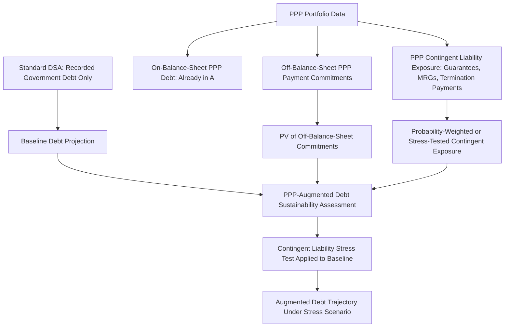

## Debt Sustainability Analysis Incorporating PPP Exposure

### Overview

Debt Sustainability Analysis (DSA) is the standard analytical framework used by the IMF, World Bank, and national fiscal authorities to assess whether a country's current and projected borrowing trajectory is sustainable over the medium to long term. Incorporating PPP exposure into DSA means explicitly accounting for the debt-like fiscal characteristics of PPP payment obligations and contingent liabilities within debt projections, even where such obligations are not formally classified as government debt under national accounting standards, in order to avoid understating a country's true fiscal risk profile.

### Why Standard DSA Can Understate Fiscal Risk Without PPP Adjustment

**Key Points**

- **Statistical classification gap:** As discussed in relation to on/off-balance-sheet treatment, many PPPs are classified as off-balance-sheet under GFS/ESA-consistent risk-based statistical rules, meaning their long-term payment obligations do not appear in headline government debt figures even though they carry debt-like fixed payment characteristics.
- **Long-tenor, largely non-discretionary commitments:** PPP availability payments and similar contracted obligations typically extend 20–30 years and are largely fixed regardless of the government's future fiscal circumstances, functionally resembling debt service obligations from a cash-flow-commitment perspective even where not counted as debt in accounting terms.
- **Contingent liability crystallization risk:** Guarantees, minimum revenue guarantees, and termination payment provisions represent potential future debt-like obligations that standard DSA frameworks, if not specifically adjusted, may not adequately capture.
- **Cross-country comparability distortion:** Two countries with similar underlying fiscal commitments could show materially different headline debt ratios purely due to differing PPP accounting classification practices, undermining the comparability and reliability of standard DSA metrics unless PPP exposure is separately assessed.

### IMF-World Bank Debt Sustainability Framework (DSF) Context

**Key Points**

- The IMF and World Bank jointly operate the Debt Sustainability Framework for Low-Income Countries (LIC-DSF), and the IMF separately applies DSA methodologies for market-access and program countries, both increasingly incorporating explicit guidance on treatment of PPP-related and other contingent liability exposure.
- Under the LIC-DSF, PPP-related and other contingent liabilities are addressed partly through the "contingent liability stress test," a standardized shock applied to the debt projection baseline to assess resilience to the crystallization of previously unrecognized liabilities (which may include PPP-related exposure alongside financial sector and SOE-related risks).
- Some DSA frameworks incorporate a supplementary or memorandum-item presentation showing the present value of PPP commitments alongside headline debt figures, allowing analysts to view both the formally classified debt figure and a broader "augmented" fiscal commitment picture. [Unverified: the specific technical design and current terminology of contingent liability stress tests and PPP-related adjustments within IMF/World Bank DSA methodology are periodically revised; consult the current IMF/World Bank DSA guidance notes for precise, up-to-date methodological specifications.]

### Conceptual Framework: From Standard DSA to PPP-Augmented DSA

### Key Adjustment Techniques

**Key Points**

- **Present value (PV) inclusion of off-balance-sheet commitments:** Calculating the present value of contracted future PPP payment obligations (using an appropriate discount rate, often the government's marginal borrowing rate or a rate consistent with the DSA's broader discounting conventions) and presenting this alongside, or in some analytical approaches added to, the standard debt stock for a fuller risk picture.
- **Contingent liability stress testing:** Applying a standardized shock (e.g., a specified percentage-of-GDP increase in debt) to the baseline DSA projection to simulate the crystallization of contingent liabilities, including PPP-related guarantees, and assessing the resulting impact on debt sustainability indicators (e.g., debt-to-GDP trajectory, gross financing needs).
- **Scenario-based sensitivity analysis:** Rather than (or in addition to) a single deterministic adjustment, running the DSA under alternative scenarios reflecting different assumptions about PPP guarantee crystallization probability and magnitude, informed by the contingent liability valuation approaches discussed in the broader fiscal risk management context.
- **Fiscal risk matrix cross-referencing:** Using a fiscal risk matrix (explicit/implicit, direct/contingent, as discussed previously) to ensure all categories of PPP-related exposure are systematically considered for inclusion in the augmented DSA, rather than only the most easily quantifiable explicit liabilities.

### Illustrative Augmented DSA Presentation

**Example**

A country's standard DSA projects government debt-to-GDP reaching 55% in five years under the baseline scenario, considered sustainable relative to the country's assessed debt-carrying capacity. A supplementary PPP-augmented analysis might show:

| Metric | Baseline DSA | PPP-Augmented View |
| --- | --- | --- |
| Recorded government debt (% GDP), Year 5 | 55% | 55% (unchanged; PPPs off-balance-sheet) |
| PV of off-balance-sheet PPP payment commitments (% GDP) | Not shown | +6% |
| Estimated PPP contingent liability exposure under stress scenario (% GDP) | Not shown | +3% |
| "Augmented" debt-equivalent metric, Year 5 | 55% | ~64% |

This does not mean the government's officially recorded debt figure changes, but it provides fiscal risk managers and external stakeholders (rating agencies, multilateral lenders) with a fuller picture of the government's aggregate long-term fiscal commitment profile, informing more conservative fiscal planning. [Inference: this is an illustrative composite example for explanatory purposes; actual augmented DSA outputs depend heavily on country-specific PPP portfolio composition, discount rate assumptions, and the specific stress test parameters applied, and should not be read as representative of any particular country's actual fiscal position.]

### Relationship to Fiscal Space and Affordability Ceilings

**Key Points**

- PPP-augmented DSA and affordability ceiling frameworks are closely complementary: affordability ceilings typically operate at the level of individual project approval and portfolio-level annual/NPV payment limits, while PPP-augmented DSA provides the macro-level sustainability lens confirming that even a portfolio remaining within affordability ceilings does not, in aggregate, threaten broader debt sustainability when combined with the country's other debt and contingent liability exposures.
- A well-functioning affordability ceiling framework can be understood as an operational mechanism for keeping the PPP program consistent with the fiscal space identified through DSA, translating a macro-level sustainability constraint into project-level approval discipline.

### Gross Financing Needs (GFN) Considerations

**Key Points**

- Beyond debt-to-GDP ratios, DSA frameworks place significant emphasis on gross financing needs (GFN) — the total amount a government must raise in a given period to cover both new financing requirements and maturing debt/obligations — as a key sustainability indicator, particularly relevant to near-term liquidity/rollover risk.
- PPP-related payment obligations, while not typically "financing needs" in the same sense as maturing debt principal, nonetheless compete for the same budgetary resources; a large annual availability payment obligation effectively reduces the fiscal space available to meet other financing and expenditure needs, and can be incorporated into an augmented GFN-style analysis for a fuller liquidity risk picture. [Inference: formal incorporation of PPP payment flows directly into standard GFN calculations (as opposed to debt stock-based augmented metrics) is a less standardized practice across DSA frameworks and may be handled differently depending on the specific analytical approach adopted by a given country or institution.]

### Rating Agency and Market Perspective

**Key Points**

- Sovereign credit rating agencies (S&P Global Ratings, Moody's, Fitch) increasingly incorporate assessment of PPP-related contingent liabilities and off-balance-sheet commitments into their broader sovereign credit risk analysis, recognizing that formal accounting classification does not eliminate underlying fiscal risk from a credit perspective.
- Where PPP portfolios are large relative to the size of the economy or government budget, insufficiently transparent or poorly managed PPP-related fiscal risk can be a factor in sovereign rating assessments, even absent a formal debt reclassification, reinforcing the practical relevance of PPP-augmented fiscal analysis beyond purely domestic policy purposes. [Unverified: the specific weight given to PPP-related exposure in any given rating action depends on the particular agency's methodology and the specific country context; general statements should not be read as predicting outcomes for a specific sovereign rating.]

### Data and Institutional Requirements

**Key Points**

- **Comprehensive PPP portfolio database:** Effective PPP-augmented DSA requires a complete, centrally maintained database of all PPP contracts, including payment formulas, guarantee terms, and contract maturity dates — typically maintained by a central PPP unit or ministry of finance fiscal risk function.
- **Coordination between debt management and PPP oversight functions:** Since DSA is typically conducted by a debt management office or macro-fiscal unit while PPP contract data resides with a separate PPP unit, effective PPP-augmented DSA requires strong inter-departmental data-sharing and coordination arrangements.
- **Consistent discount rate and valuation methodology:** Ensuring the discount rates and valuation approaches used for PPP present value calculations are methodologically consistent with those used elsewhere in the DSA framework, to avoid introducing spurious comparability issues between PPP-related and other debt-like exposures.

### Practical Implications for Fiscal Risk Managers

**Next Steps**

- **Establish a centralized PPP data feed into the DSA process:** Ensure the debt management office or macro-fiscal unit conducting DSA has systematic, timely access to comprehensive PPP portfolio data, including guarantee terms and payment schedules, from the responsible PPP unit.
- **Adopt a consistent PPP present value and stress-testing methodology:** Align PPP-related present value calculations and contingent liability stress test parameters with the broader DSA framework's discounting and stress-testing conventions.
- **Produce a supplementary PPP-augmented DSA presentation:** Where feasible, present an augmented debt sustainability view alongside the standard DSA output, providing decision-makers and external stakeholders with a fuller fiscal risk picture without necessarily altering formal debt accounting classification.
- **Integrate findings into affordability ceiling calibration:** Use PPP-augmented DSA findings to inform and periodically recalibrate the country's PPP affordability ceiling framework, ensuring consistency between project-level approval discipline and macro-level sustainability assessment.
- **Communicate proactively with rating agencies and multilateral partners:** Where a PPP-augmented view materially differs from headline debt figures, consider proactive disclosure and explanation to credit rating agencies and multilateral lending partners to support informed external assessment.

**Related Topics**

- Explicit and Implicit Contingent Liabilities in PPP Contracts
- Fiscal Space and Affordability Ceilings for PPP Programs
- The IMF-World Bank PPP Fiscal Risk Assessment Model (PFRAM)
- On-Balance-Sheet vs. Off-Balance-Sheet Classification under ESA/GFSM Standards
- IMF-World Bank Low-Income Country Debt Sustainability Framework (LIC-DSF)
- Gross Financing Needs and Sovereign Liquidity Risk Assessment
- Sovereign Credit Rating Methodologies and Contingent Liability Treatment
- PPP Fiscal Risk Statements and Contingent Liability Registers
- Medium-Term Debt Management Strategy (MTDS) and Fiscal Planning
- PPP Unit Design and Centralized Fiscal Oversight Functions