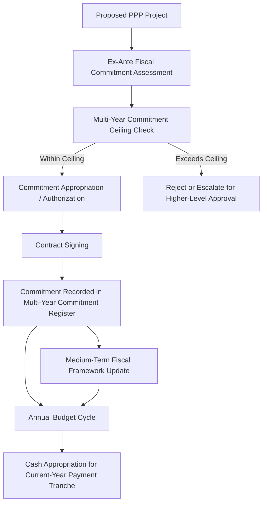

## Budgeting and Multi-Year Commitment Controls for PPPs

### Overview

Budgeting and multi-year commitment controls for PPPs refer to the public financial management (PFM) mechanisms that ensure a government's long-term contractual payment obligations under PPP contracts are properly recognized, authorized, and integrated into annual and medium-term budget processes. Because PPPs create legally binding payment commitments that extend far beyond a single annual budget cycle — often 20 to 30 years — conventional annual, cash-basis budget systems (designed around single-year appropriations) are structurally ill-suited to capturing and controlling this form of fiscal commitment without specific adaptation.

### The Core Budgeting Challenge

**Key Points**

- **Multi-year vs. annual appropriation mismatch:** Traditional budget systems authorize spending on an annual basis, whereas a PPP contract signed today creates a legal payment obligation for every year of its term; without a specific multi-year commitment control mechanism, there is a structural risk that future budgets are presented with PPP payments as a fait accompli, with no meaningful annual appropriation discretion.
- **Commitment vs. cash accounting timing gap:** A PPP contract represents a "commitment" (a binding future obligation) at the moment of signing, but under cash-basis budgeting, no fiscal impact is recorded until actual cash payments begin — often years later, once construction is complete — creating a visibility gap between contractual commitment and budgetary recognition.
- **Cross-administration/cross-electoral-cycle commitment:** PPP payment obligations typically span multiple electoral cycles and changes in government, raising questions about the appropriate constitutional/legal basis for one government to bind future governments to multi-decade payment obligations, which different countries address through varying legal and institutional mechanisms.
- **Sectoral budget silo risk:** Where PPPs are approved and contracted by individual sector ministries or sub-national entities without centralized visibility, the aggregate multi-year commitment across the whole-of-government portfolio may not be systematically tracked or controlled.

### Multi-Year Commitment Control Framework

### Key Institutional Mechanisms

**Key Points**

- **Multi-year commitment appropriation/authorization:** Some PFM legal frameworks require a specific legislative or executive authorization for the full multi-year value (or present value) of a proposed PPP contract before signing, distinct from the annual cash appropriation that follows in each subsequent budget year — providing an upfront, whole-of-life check on the commitment rather than only incremental annual reviews.
- **Commitment control systems (CCS):** Public financial management information systems that record and track outstanding contractual commitments (including multi-year PPP obligations) separately from actual cash disbursements, allowing fiscal authorities to monitor total committed exposure across the portfolio at any point in time, not only realized cash payments to date.
- **Medium-Term Expenditure Framework (MTEF) integration:** Incorporating projected PPP payment obligations into the government's medium-term (typically 3–5 year rolling) expenditure framework, ensuring sector ministries' medium-term budget ceilings explicitly reflect committed PPP payment obligations rather than treating them as separate from mainstream budget planning.
- **Standing/mandatory appropriation mechanisms:** In some jurisdictions, PPP availability payments (once a contract is validly signed) are treated as a standing or mandatory charge on the budget (similar to debt service), reducing (though not necessarily eliminating) annual appropriation discretion in exchange for providing lenders and project companies with greater payment certainty — a design choice with direct implications for project financeability versus budgetary flexibility.
- **Parliamentary/legislative oversight of large PPP commitments:** Requiring legislative scrutiny or approval for PPP contracts above a specified materiality threshold, providing a democratic accountability check on major multi-year commitments before they are finalized.

### Commitment Register Design

**Key Points**

- A dedicated multi-year PPP commitment register (often maintained by the PPP unit or ministry of finance, and potentially integrated with the broader contingent liability register discussed in earlier fiscal risk topics) should typically capture, for each contract: total contract value, annual payment schedule (including inflation-indexation mechanics), contract start/end dates, and any embedded contingent/guarantee provisions.
- The register serves multiple purposes: informing affordability ceiling compliance checks (as discussed previously), supporting DSA and fiscal risk statement inputs, and providing the basis for annual budget cycle appropriation requests tied to each project's scheduled payment tranche for that year.
- Effective registers are typically updated in real time as new contracts are signed, existing contracts are amended/renegotiated, or contracts reach termination/expiry, rather than being reconstructed periodically from scratch.

### Illustrative Multi-Year Commitment Profile

**Example**

A government's PPP commitment register might show the following simplified projected annual payment profile (in $ millions) for its existing portfolio of five signed availability-based PPPs, as construction phases complete and payment obligations phase in:

| Fiscal Year | Project A | Project B | Project C | Project D | Project E | Total Committed |
| --- | --- | --- | --- | --- | --- | --- |
| Year 1 | 40 | 0 | 0 | 0 | 0 | 40 |
| Year 2 | 40 | 25 | 0 | 0 | 0 | 65 |
| Year 3 | 40 | 25 | 60 | 0 | 0 | 125 |
| Year 4 | 40 | 25 | 60 | 35 | 0 | 160 |
| Year 5 | 40 | 25 | 60 | 35 | 50 | 210 |

This type of multi-year visualization allows fiscal authorities to identify the trajectory of total committed obligations well in advance, informing both affordability ceiling compliance monitoring and the sequencing of any additional new PPP approvals to avoid unsustainable "bunching" of payment increases in future years. [Inference: this is an illustrative, simplified composite example for explanatory purposes only, and does not represent actual figures from any specific country's PPP portfolio.]

### Interaction with Annual Budget Appropriation

**Key Points**

- Even where a multi-year commitment has been authorized at contract signing, most PFM frameworks still require the specific cash amount due in each individual fiscal year to be included in that year's annual budget appropriation, providing an additional (though typically more limited, given the prior binding contractual commitment) layer of annual budgetary visibility and formal appropriation.
- Where PPP payments are treated as a standing/mandatory charge rather than subject to full annual appropriation discretion, budget documentation typically still requires clear disclosure of the amount and legal basis of the charge, preserving transparency even where discretionary control is reduced.
- Failure to appropriate the required annual cash amount for a validly contracted PPP payment obligation would typically constitute a breach of contract by the government, potentially triggering termination or compensation provisions — reinforcing why upfront multi-year commitment discipline (rather than relying on annual appropriation as the primary control point) is generally considered the more effective control mechanism.

### Comparative Table: Budgeting Approaches to PPP Commitments

| Approach | Description | Strength | Limitation |
| --- | --- | --- | --- |
| Pure annual cash budgeting (no multi-year control) | PPP payments appear in the budget only in the year cash is disbursed | Simple, consistent with traditional cash-basis budgeting | No upfront visibility or control at point of contract signing; risk of unconstrained accumulation |
| Multi-year commitment appropriation | Formal authorization of total/PV commitment required at signing, in addition to annual cash appropriation | Provides upfront whole-of-life fiscal discipline | Requires more sophisticated PFM legal framework and institutional capacity |
| Standing/mandatory charge treatment | PPP payments treated similarly to debt service, largely outside annual discretionary appropriation | Enhances payment certainty for lenders/investors, supporting financeability | Reduces future government's annual budgetary flexibility |
| MTEF-integrated commitment tracking | PPP commitments explicitly reflected within rolling medium-term expenditure ceilings | Aligns PPP commitments with broader medium-term fiscal planning discipline | Requires robust, well-functioning MTEF process already in place |

### Sub-National and Decentralized Commitment Control Challenges

**Key Points**

- Where sub-national governments (states, provinces, municipalities) have authority to enter PPP contracts independently, national-level multi-year commitment controls may not automatically capture sub-national PPP commitments, creating a potential blind spot in whole-of-government fiscal risk visibility unless specific sub-national reporting and consolidation mechanisms are established.
- Some countries address this through mandatory sub-national PPP reporting to a national PPP unit or ministry of finance, and/or through sub-national borrowing/commitment ceiling frameworks that explicitly incorporate PPP-related multi-year obligations alongside conventional sub-national debt limits.
- Weak sub-national PFM capacity can be a particular risk factor, as smaller or less-resourced sub-national entities may lack the technical capability to properly assess and control multi-year PPP commitments even where a nominal reporting requirement exists. [Inference: the degree to which sub-national PPP commitment control frameworks are effectively enforced in practice varies substantially by country and level of PFM institutional maturity, and general statements should not be assumed to apply uniformly across all decentralized systems.]

### Practical Implications for PFM and PPP Practitioners

**Next Steps**

- **Establish or strengthen a centralized multi-year PPP commitment register:** Ensure a single, authoritative, regularly updated register captures the full projected payment profile of all signed PPP contracts across the government portfolio.
- **Require formal multi-year commitment authorization at contract signing:** Where not already in place, advocate for a legal/institutional requirement that significant PPP contracts receive explicit authorization for their full multi-year (or present value) commitment, not merely reliance on subsequent annual appropriations.
- **Integrate PPP commitments into the MTEF process:** Ensure sector ministry medium-term expenditure ceilings explicitly reflect existing PPP payment obligations, preventing double-counting or under-allocation in medium-term budget planning.
- **Extend commitment control to sub-national entities:** Establish mandatory sub-national PPP reporting and consolidation mechanisms to ensure whole-of-government visibility over aggregate multi-year PPP exposure.
- **Align commitment controls with affordability ceilings and DSA:** Ensure the multi-year commitment register directly feeds the affordability ceiling compliance process and PPP-augmented debt sustainability analysis discussed elsewhere in this fiscal risk management framework.
- **Build capacity for standing charge vs. discretionary appropriation trade-off analysis:** Support policymakers in understanding the financeability benefits versus fiscal flexibility costs of treating PPP payments as standing charges rather than fully discretionary annual appropriations.

**Related Topics**

- Explicit and Implicit Contingent Liabilities in PPP Contracts
- Fiscal Space and Affordability Ceilings for PPP Programs
- Debt Sustainability Analysis Incorporating PPP Exposure
- The IMF-World Bank PPP Fiscal Risk Assessment Model (PFRAM)
- Medium-Term Expenditure Framework (MTEF) Design and Implementation
- PPP Unit Design and Centralized Fiscal Oversight Functions
- Sub-National PPP Fiscal Risk and Sub-Sovereign Borrowing Frameworks
- PPP Fiscal Risk Statements and Contingent Liability Registers
- Legislative and Parliamentary Oversight of Public Investment Commitments
- On-Balance-Sheet vs. Off-Balance-Sheet Classification under ESA/GFSM Standards