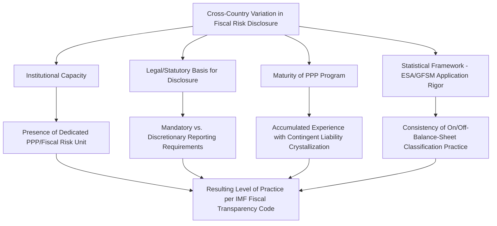

## Comparative Country Practice in Fiscal Risk Disclosure

### Overview

Comparative country practice in fiscal risk disclosure examines how different governments have institutionalized the identification, valuation, and public reporting of PPP-related fiscal risks and contingent liabilities. While the IMF's Fiscal Transparency Code (FTC) provides a common international benchmark, actual implementation varies substantially across countries in maturity, legal basis, and technical sophistication. A small number of pioneering countries — most frequently cited in the World Bank and IMF literature as reference cases — developed relatively advanced practices earlier than most peers, while systematic evaluation work has identified common gaps that persist across the broader international sample.

### The IMF Fiscal Transparency Code as the Comparative Benchmark

**Key Points**

- The IMF's Fiscal Transparency Code is structured around pillars including fiscal reporting, fiscal forecasting and budgeting, and fiscal risk analysis and management, providing a structured framework against which country practice can be assessed and compared. [IMF](https://www.imf.org/external/np/fad/trans/fiscal.pdf)
- The IMF conducts Fiscal Transparency Evaluations (FTEs) using this Code as the assessment methodology, scoring countries on a scale where a score of 1 represents compliance with a basic level of practice and higher scores representing more advanced practice. [International Monetary Fund](https://www.imf.org/-/media/files/publications/pp/2023/english/ppea2023034.pdf)
- Fiscal Transparency Evaluation reports covering countries across all continents — including Peru, Kenya, Portugal, and the Philippines — have specifically addressed PPP-related fiscal transparency, reflecting the extent to which PPP disclosure has become a standard component of these assessments. [World Bank](https://ppp.worldbank.org/public-private-partnership/applicable-all-sectors/fiscal-accounting-and-reporting-ppps)
- The IMF's guidance distinguishes basic from advanced practice specifically with respect to PPPs: beyond annual disclosure of government rights, obligations, and other exposures under PPP contracts, more advanced practice involves disclosing expected annual receipts and payments over the life of contracts and imposing a legal limit on accumulated obligations. [International Monetary Fund](https://www.imf.org/-/media/files/publications/pp/2023/english/ppea2023034.pdf)

### Common Cross-Country Gaps Identified by IMF Evaluations

**Key Points**

- Analysis of a large sample of published Fiscal Transparency Evaluations found common gaps across countries in the disclosure of public liabilities outside the budgetary central government balance sheet, including government guarantees and liabilities of public corporations and PPPs, indicating that PPP-related disclosure weaknesses are a widespread rather than isolated phenomenon. [International Monetary Fund](https://www.imf.org/-/media/files/publications/pp/2023/english/ppea2023034.pdf)
- Relative performance on fiscal transparency evaluations differs systematically by income group, consistent with the broader pattern that fiscal transparency practice tends to be more developed in higher-income, higher-capacity states, though this is a general tendency rather than a strict rule. [International Monetary Fund](https://www.imf.org/-/media/files/publications/pp/2023/english/ppea2023034.pdf)
- [Inference: the specific magnitude of these gaps and their evolution over time depend on the particular sample and period of evaluations reviewed; practitioners seeking current comparative standing for a specific country should consult that country's most recent published FTE directly rather than relying on cross-sectional summaries from a given point in time.]

### Reference Case: Chile

**Key Points**

- Since 2007, Chile's Budget Directorate (Dirección de Presupuestos, DIPRES) within the Ministry of Finance has published an annual contingent liabilities report, which initially presented information on contingent liabilities from revenue and exchange rate guarantees related to PPPs and has since been expanded to cover other types of government contingent liability. [World Bank](https://ppp.worldbank.org/public-private-partnership/applicable-all-sectors/fiscal-accounting-and-reporting-ppps)
- Chile's valuation of PPP-related contingent liabilities is updated on an ongoing basis across all PPP projects and reported in this annual contingent liabilities report, which includes a description of the techniques used to analyze and value guarantees extended to PPP projects. [World Bank](https://ppp.worldbank.org/public-private-partnership/assessing-fiscal-implications)
- Chile is one of three countries examined in detail in a widely referenced World Bank comparative study; this study found that Chile, alongside Australia and South Africa, relies on careful project preparation, competitive bidding, and review of proposed PPPs by a specialized unit in the Ministry of Finance, and that good practice more broadly includes multi-stage review by ministry of finance PPP and fiscal management experts, quantification of contingent liabilities where this is likely to influence the decision to incur them, and publication of PPP contracts and summary descriptions of their financial implications. [PPIAF](https://www.ppiaf.org/documents/1919)[PPIAF](https://www.ppiaf.org/documents/1919)

### Reference Case: Australia and South Africa

**Key Points**

- Australia and South Africa, together with Chile, are the subject of a detailed World Bank/PPIAF study on how governments manage contingent liabilities relating to early contract termination and to debt and revenue guarantees arising from PPPs, reflecting their status as relatively early and well-documented adopters of structured contingent liability management practice. [World Bank PPP Legal Resource Center](https://ppp.worldbank.org/library/managing-contingent-liabilities-public-private-partnerships-practice-australia-chile-and-south-africa)
- The comparative study's key recommendation for governments seeking to replicate this practice — including those with less administrative capacity — centers on institutionalizing multi-stage ministry of finance review, selective quantification of contingent liabilities, and public disclosure of contract terms and their financial implications, rather than necessarily replicating the full technical sophistication of the most advanced adopters. [PPIAF](https://www.ppiaf.org/documents/1919)

### Reference Case: Colombia and Peru

**Key Points**

- Colombia was an early mover in formalizing contingent liability management specifically in a PPP/infrastructure context, with its Ministry of Finance and Public Credit publishing a specific framework document on contingent liabilities in the mid-2000s. [Ppp-certification](https://ppp-certification.com/ppp-certification-guide/182-identifying-and-quantifying-fiscal-commitments-ppp-project)
- Peru's Ministry of Finance has published a methodology for valuing contingent liabilities under PPPs, following a broadly similar institutional logic to the Chilean model of a published, standing valuation methodology rather than ad hoc case-by-case assessment. [World Bank](https://ppp.worldbank.org/public-private-partnership/assessing-fiscal-implications)
- These Latin American cases are frequently cited together in the literature as demonstrating that structured contingent liability valuation and disclosure practice is not confined to high-income OECD economies, though [Inference: the operational depth and consistency of implementation across the full PPP portfolio in each country may vary and would need to be confirmed against each country's most current published reports for an up-to-date comparative assessment].

### Cautionary Case: Portugal

**Key Points**

- Portugal illustrates the fiscal risk materialization that can occur where PPP-related fiscal transparency lags behind the scale of contingent exposure taken on. An IMF Fiscal Transparency Evaluation found that Portugal's overall exposure to contingent liabilities reached up to 122 percent of GDP between 2012 and 2013, an exceptionally high figure highlighting the scale contingent exposure can reach without adequate prior visibility. [IMF](https://www.imf.org/external/pubs/ft/scr/2014/cr14306.pdf)
- The evaluation found there was no systematic focus on long-term sustainability analysis in Portugal at that time, and more broadly that reporting of fiscal risks was in its infancy despite numerous initiatives undertaken in preceding years. [IMF](https://www.imf.org/external/pubs/ft/scr/2014/cr14306.pdf)[IMF](https://www.imf.org/external/pubs/ft/scr/2014/cr14306.pdf)
- Many of the problems Portugal experienced during its fiscal crisis derived from poor information on fiscal developments and reporting; debt increased rapidly in part due to the inclusion of sectors previously excluded from general government figures under the ESA 95 statistical framework, particularly state-owned enterprises and PPPs, and large regional government and PPP contingent liabilities were realized during this period, alongside expenditure arrears that had not previously been systematically tracked. [IMF](https://www.imf.org/external/pubs/ft/scr/2014/cr14306.pdf)[IMF](https://www.imf.org/external/pubs/ft/scr/2014/cr14306.pdf)
- This case is widely cited in the fiscal risk management literature as a cautionary example of the consequences of weak PPP-related fiscal risk disclosure combining with a broader sovereign fiscal crisis, reinforcing the rationale for the disclosure practices described in the reference cases above.

### Comparative Summary Table

| Country/Case | Distinguishing Feature | Institutional Basis |
| --- | --- | --- |
| Chile | Annual published contingent liabilities report since 2007, with an explicit public valuation methodology | DIPRES (Budget Directorate), Ministry of Finance |
| Australia | Structured multi-stage ministry of finance PPP review; frequently cited comparative reference case | Ministry of Finance PPP review function |
| South Africa | Structured multi-stage ministry of finance PPP review; frequently cited comparative reference case | National Treasury PPP oversight |
| Colombia | Early formal contingent liabilities policy framework document | Ministry of Finance and Public Credit |
| Peru | Published methodology for valuing PPP contingent liabilities | Ministry of Economy and Finance |
| Portugal | Cautionary case: high realized contingent liability exposure (up to 122% of GDP, 2012–13) linked to weak prior disclosure | Subject of IMF Fiscal Transparency Evaluation |

[Inference: this table synthesizes findings from the specific studies and evaluation reports cited above, primarily reflecting practice as documented at the time of those respective publications; current-day practice in each country may have evolved since, and a fully current comparative assessment would require consulting each country's most recent published fiscal risk statement or IMF FTE.]

### Common Elements of More Advanced Country Practice

**Key Points**

- **Specialized institutional review capacity:** The most frequently cited reference cases share a common institutional feature — a specialized unit within the Ministry of Finance responsible for reviewing proposed PPPs — rather than leaving fiscal risk assessment to the contracting sector ministry alone. [PPIAF](https://www.ppiaf.org/documents/1919)
- **Published, standing valuation methodology:** Rather than case-by-case, ad hoc contingent liability assessment, more advanced practice (as in Chile and Peru) involves publishing a general methodology applied consistently across the PPP portfolio, improving both internal analytical consistency and external transparency.
- **Regular, periodic public reporting:** An annual (rather than one-off or purely internal) contingent liabilities report, in the Chilean model, institutionalizes disclosure as an ongoing accountability mechanism rather than a one-time exercise tied only to individual project approval.
- **Contract-level and summary financial disclosure:** Publication of PPP contracts themselves, alongside summary descriptions of their financial implications, represents a more advanced transparency practice than aggregate reporting alone, enabling external scrutiny of individual project terms. [PPIAF](https://www.ppiaf.org/documents/1919)

### Structural Drivers of Cross-Country Variation

### Practical Implications for Countries Developing Disclosure Practice

**Next Steps**

- **Benchmark against the IMF Fiscal Transparency Code:** Use the FTC's basic-to-advanced practice spectrum specifically as it relates to PPPs as a structured self-assessment framework, rather than starting from an unstructured or purely internal review process.
- **Study the Chilean annual reporting model as an implementation template:** Consider adapting Chile's approach of a standing, published methodology combined with an annual public contingent liabilities report, scaled to the country's own institutional capacity.
- **Establish or strengthen a specialized ministry of finance PPP review function:** Follow the common institutional pattern identified across Australia, Chile, and South Africa of dedicated technical review capacity distinct from the contracting sector ministry.
- **Treat the Portuguese case as a cautionary benchmark:** Use Portugal's experience of rapid, poorly anticipated contingent liability crystallization as a reference point for the fiscal cost of delayed or underdeveloped disclosure practice, reinforcing the case for proactive institutional investment in this area.
- **Verify current country-specific practice before relying on comparative claims:** Given that country practice evolves and this summary reflects specific historical studies and evaluation reports, confirm any specific country's current disclosure practice against its most recently published fiscal risk statement or IMF Fiscal Transparency Evaluation before using it as a live policy reference.

**Related Topics**

- Explicit and Implicit Contingent Liabilities in PPP Contracts
- Fiscal Space and Affordability Ceilings for PPP Programs
- The IMF-World Bank PPP Fiscal Risk Assessment Model (PFRAM)
- Debt Sustainability Analysis Incorporating PPP Exposure
- Budgeting and Multi-Year Commitment Controls for PPPs
- IMF Fiscal Transparency Code and Fiscal Transparency Evaluations
- On-Balance-Sheet vs. Off-Balance-Sheet Classification under ESA/GFSM Standards
- PPP Unit Design and Centralized Fiscal Oversight Functions
- Sovereign Fiscal Crises and the Role of Off-Balance-Sheet Liabilities (Portugal Case Study)
- Contingent Liability Valuation Methodologies in Practice (Chile, Peru Models)