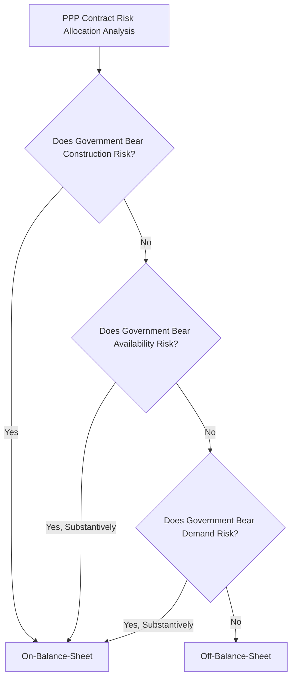

## On-Balance-Sheet versus Off-Balance-Sheet Classification

### Overview

On-balance-sheet versus off-balance-sheet classification determines whether a PPP-financed asset and its associated liability are recorded on the government's balance sheet and counted toward headline government debt and deficit statistics, or whether the asset is instead treated as belonging to the private partner, with government payments recorded as a service purchase rather than debt-financed capital expenditure. This classification question sits at the intersection of statistical methodology, public sector accounting standards, and risk allocation analysis, and has significant practical consequences for how a PPP's fiscal impact is measured and reported.

### Core Classification Principle: Risk and Rewards Transfer

**Key Points**

- The dominant classification approach across major statistical and accounting frameworks is a risk-based test: if the substantive risks and rewards of ownership of the underlying asset are transferred to the private party, the asset (and corresponding liability, if debt-financed by the private party) is kept off the government's balance sheet; if the government retains the substantive risks, the asset is recorded on the government's balance sheet.
- This principle is applied somewhat differently across the main frameworks in use internationally — most notably the European System of Accounts (ESA, applied within the EU statistical system, principally ESA 2010) and the IMF's Government Finance Statistics Manual (GFSM) on the statistical/national-accounts side, versus IPSAS 32 (Service Concession Arrangements) on the public sector financial reporting/accounting side — though all share the same underlying conceptual foundation of risk-based assessment.
- Classification is determined on a project-by-project basis; there is no single blanket rule that all PPPs of a given contract type (e.g., all availability-based PPPs) are automatically classified the same way, since the specific contractual risk allocation of each individual project is decisive.

### ESA 2010 Approach (EU Statistical Framework)

**Key Points**

- Under the ESA 2010 framework applied by Eurostat and EU member state national statistical institutes, the central classification test focuses on which party bears the majority of: (i) construction risk, and (ii) either availability risk or demand risk (with the government's exposure to at least one of these two risk categories, in addition to construction risk, generally required for on-balance-sheet classification).
- **Construction risk** relates to cost overruns, technical/design failure, and delays in completing the asset; if the government does not routinely compensate the private party for these events (beyond limited, clearly justified exceptions such as genuine government-caused delay), construction risk is considered transferred to the private party.
- **Availability risk** relates to the private party's exposure to reduced payment if it fails to deliver the contracted volume or quality of service (e.g., through performance/availability deduction mechanisms); if payment deductions are not merely symbolic but can materially affect the private party's revenue and profitability, availability risk is considered transferred.
- **Demand risk** relates to the private party's exposure to variation in usage/demand for the asset (e.g., toll road traffic); if the private party's revenue genuinely varies with demand without government compensation for shortfalls, demand risk is considered transferred.
- If the government bears construction risk, or bears neither availability nor demand risk in a manner sufficient to transfer via the contract, Eurostat guidance points toward on-balance-sheet classification of the asset and associated debt.

### GFSM/IMF Approach

**Key Points**

- The IMF's Government Finance Statistics Manual applies a broadly analogous risk-based logic to that of ESA 2010, reflecting substantial methodological alignment between the two frameworks, given both derive from the same underlying System of National Accounts (SNA) conceptual foundation.
- GFSM-based classification is used more broadly across IMF member countries globally (including outside the EU), providing the statistical basis for government finance statistics reporting to the IMF and for inputs into debt sustainability analysis frameworks.
- [Inference: while ESA 2010 and GFSM share a common conceptual basis, jurisdiction-specific interpretive guidance and practical application (e.g., through Eurostat's specific PPP-focused guidance manual versus IMF technical assistance interpretations) can result in some difference in how the same underlying risk allocation facts are classified in practice; a project's classification should not be assumed identical across frameworks without specific verification.]

### Statistical Classification Decision Logic

### IPSAS 32: Grantor-Side Accounting Treatment

**Key Points**

- IPSAS 32 (Service Concession Arrangements: Grantor) governs how the government, as grantor, should recognize a service concession asset and corresponding liability in its own accrual-based financial statements, applicable in jurisdictions that have adopted IPSAS-based public sector accounting standards.
- Under IPSAS 32, the grantor recognizes the service concession asset on its balance sheet if it controls or regulates what services the operator must provide with the asset, to whom, and at what price, and also controls any significant residual interest in the asset at the end of the arrangement — a control-based test distinct from, though related in spirit to, the risk-based tests used in ESA/GFSM statistical classification.
- Where the asset is recognized under IPSAS 32, the grantor recognizes a corresponding liability, measured either as a financial liability (if the grantor has an unconditional obligation to pay the operator, e.g., a pure availability payment structure) or as a grant of a right to the operator to earn revenue from third-party users (e.g., in a toll/demand-risk structure), reflecting the two-model approach embedded in the standard.
- IPSAS 32 (a control-based accounting standard) and ESA/GFSM (risk-based statistical frameworks) can, in some cases, produce different classification outcomes for the same project, since accounting control criteria and statistical risk-transfer criteria are conceptually related but not identical tests; a government may therefore find a given PPP treated differently under its accrual financial statements (IPSAS-based) than under its national accounts/statistical reporting (ESA/GFSM-based). [Unverified: the frequency and typical direction of such divergence across a broad sample of real-world projects has not been comprehensively quantified in a way that would support a general claim about how often this occurs; this should be assessed on a case-by-case basis for any specific project.]

### Comparative Framework Table

| Framework | Governing Body/Context | Core Test | Primary Use |
| --- | --- | --- | --- |
| ESA 2010 | Eurostat / EU member states | Risk-based: construction risk + availability or demand risk | National accounts, EU fiscal surveillance (deficit/debt rules) |
| GFSM | IMF / global | Risk-based, analogous to ESA | Government finance statistics, DSA inputs, cross-country comparison |
| IPSAS 32 | International Public Sector Accounting Standards Board / adopting jurisdictions | Control-based: control over service provision, pricing, and significant residual interest | Grantor accrual financial statements |

### Illustrative Classification Scenarios

**Example**

Consider three simplified project structures and their likely classification outcomes under a risk-based (ESA/GFSM-style) approach:

1. **Fully availability-based toll-free highway PPP** with a fixed-price, date-certain EPC contract (transferring construction risk) and a payment mechanism that materially deducts payment for unavailability or substandard performance (transferring availability risk), with no government cost-overrun compensation clauses: likely **off-balance-sheet**, since both construction risk and availability risk are substantively transferred.
2. **Toll road PPP with a government minimum revenue guarantee** covering a high proportion (e.g., 90%) of projected traffic revenue, such that the private party's actual revenue variability is minimal in practice: likely **on-balance-sheet**, since demand risk is not substantively transferred despite the private party nominally bearing "demand risk" in name, because the guarantee neutralizes most of the actual risk exposure.
3. **Availability-based hospital PPP with a cost-overrun sharing mechanism** obligating government to cover a significant share of construction cost overruns beyond a specified threshold: likely **on-balance-sheet**, since construction risk is not substantively retained by the private party, regardless of how the availability payment mechanism itself is structured.

[Inference: these are simplified illustrative scenarios to demonstrate the application logic; actual classification determinations require detailed, project-specific technical analysis by the relevant national statistical authority or auditor, and should not be inferred solely from a general contract-type label such as "availability-based" or "demand-risk."]

### Practical and Fiscal Policy Implications of Classification

**Key Points**

- **Headline debt/deficit impact:** On-balance-sheet classification adds the capital cost of the asset to government debt (typically at the point of construction) and may affect the government deficit figure in the year(s) of construction expenditure recognition, with implications for fiscal rule compliance (e.g., EU Stability and Growth Pact deficit/debt thresholds for member states).
- **Political economy of classification-driven structuring:** Because off-balance-sheet classification can appear to allow infrastructure delivery without an immediate headline debt/deficit impact, there is a well-documented risk (discussed in the broader fiscal risk management literature) that PPPs are structured — or even selected as a procurement route in the first place — primarily to achieve favorable statistical treatment rather than because genuine risk transfer or value-for-money considerations support that structure.
- **Divergence from underlying fiscal risk:** As emphasized in relation to debt sustainability analysis, a PPP's statistical classification does not itself eliminate the underlying fiscal risk associated with the project; an off-balance-sheet PPP with weak risk transfer in substance (even if formally satisfying classification tests) can still generate significant contingent liability exposure for government, reinforcing the importance of fiscal risk assessment tools like PFRAM independent of the formal classification outcome.
- **EU fiscal surveillance relevance:** For EU member states, ESA 2010-based classification has direct relevance to compliance with EU fiscal rules (deficit and debt ratios relative to GDP), creating a particularly strong incentive within that specific context to understand and, in some documented historical cases, to actively manage classification outcomes through contract design.

### Role of National Statistical Authorities and Auditors

**Key Points**

- Formal classification determinations are generally made by the relevant national statistical institute (for ESA/GFSM statistical purposes) — with Eurostat providing oversight and methodological guidance for EU member states — or by external/government auditors (for IPSAS-based accounting purposes), rather than by the contracting government ministry or the private party itself.
- Given the potential for classification-driven structuring incentives described above, independent statistical/audit review functions serve an important safeguard role in ensuring that risk allocation as documented in the contract reflects genuine economic substance rather than a structure engineered primarily to achieve a desired accounting or statistical outcome.
- Some countries have integrated a formal ex-ante classification assessment step into their PPP project approval process (potentially informed by tools such as PFRAM, as discussed earlier in this course), seeking early indicative statistical guidance before contract signing to avoid the fiscal and reputational risk of an unexpected post-signing reclassification.

### Practical Structuring Considerations

**Next Steps**

- **Assess risk allocation for genuine economic substance, not formal labeling:** Ensure contractual risk transfer provisions (construction, availability, demand) reflect real, material financial consequences for the private party rather than nominal risk allocation that is substantially neutralized by guarantees or compensation mechanisms.
- **Seek early indicative classification guidance:** Engage the national statistical authority (or, for EU member states, seek guidance consistent with Eurostat's PPP-specific guidance manual) at the project design stage rather than only after contract signing, reducing the risk of unexpected reclassification.
- **Distinguish accounting (IPSAS) from statistical (ESA/GFSM) classification needs:** Recognize that a project may require separate assessment for grantor financial statement purposes and for national accounts/statistical purposes, and that these processes, tests, and potentially outcomes are not automatically identical.
- **Avoid classification as the primary driver of contract structure:** Prioritize genuine value-for-money and risk allocation efficiency in contract design, using classification analysis as an important input to fiscal planning rather than as the primary determinant of contract structure.
- **Integrate classification outcomes into broader fiscal risk assessment:** Regardless of formal on/off-balance-sheet outcome, ensure the project is also assessed through contingent liability, affordability ceiling, and debt sustainability analysis frameworks, since classification alone does not capture the full fiscal risk picture.

**Related Topics**

- Explicit and Implicit Contingent Liabilities in PPP Contracts
- Debt Sustainability Analysis Incorporating PPP Exposure
- The IMF-World Bank PPP Fiscal Risk Assessment Model (PFRAM)
- IPSAS 32 and Grantor-Side Accounting for Service Concession Arrangements
- ESA 2010 and Eurostat Guidance on PPP Statistical Treatment
- EU Stability and Growth Pact Fiscal Rules and PPP Classification Incentives
- Risk Allocation Principles in PPP Contract Design
- Minimum Revenue Guarantees and Demand Risk Allocation
- Fiscal Space and Affordability Ceilings for PPP Programs
- Comparative Country Practice in Fiscal Risk Disclosure