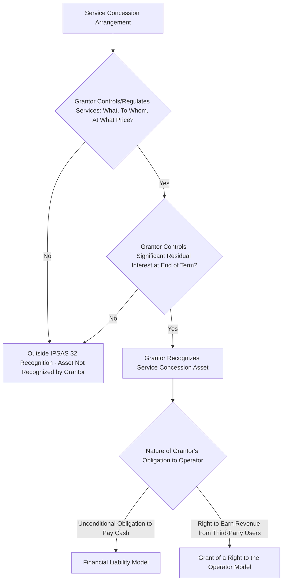

## IPSAS 32 and Service Concession Arrangements

### Overview

IPSAS 32 (Service Concession Arrangements: Grantor) is the International Public Sector Accounting Standard governing how a government or public sector entity acting as grantor should account for a service concession arrangement — the accrual accounting standard most directly applicable to PPPs from the public sector (grantor) side of the transaction. It was issued by the International Public Sector Accounting Standards Board (IPSASB) to address a previously unregulated area of public sector accounting, providing a mirror-image counterpart to IFRIC 12 (Service Concession Arrangements), which governs the operator's (private party's) accounting treatment under International Financial Reporting Standards.

### Scope and Definition of a Service Concession Arrangement

**Key Points**

- IPSAS 32 defines a service concession arrangement as a contract between a grantor (a public sector entity) and an operator (a private or public sector entity) in which the operator uses a service concession asset to provide a public service on behalf of the grantor for a specified period, in return for the right to receive compensation.
- The standard applies specifically to arrangements involving an asset used to provide a public service — covering the great majority of infrastructure PPPs (roads, hospitals, schools, utilities, water/wastewater systems) — rather than to all forms of government contracting with private entities generally.
- IPSAS 32 focuses specifically on the grantor's accounting treatment; the operator's own accounting (if the operator is a private sector entity applying IFRS) is instead addressed by IFRIC 12, meaning a single PPP transaction is typically analyzed under two related but formally separate standards depending on which party's financial statements are being prepared.

### The Core Recognition Test: Control-Based Approach

**Key Points**

- IPSAS 32 requires the grantor to recognize a service concession asset (and a corresponding liability) on its balance sheet if both of the following control conditions are met:
  1. The grantor controls or regulates what services the operator must provide with the asset, to whom, and at what price; **and**
  2. The grantor controls — through ownership, beneficial entitlement, or otherwise — any significant residual interest in the asset at the end of the arrangement's term.
- This is fundamentally a **control-based test**, distinct from the risk-based tests applied under ESA 2010 and GFSM for statistical classification purposes (discussed in the broader on-balance-sheet/off-balance-sheet classification context); a grantor may therefore recognize an asset under IPSAS 32 even in circumstances where the same project might be classified off-balance-sheet under statistical risk-transfer criteria, since the two frameworks test conceptually different things (control over service delivery and residual value, versus transfer of risk).
- The control test does not require the grantor to have physical possession or day-to-day operational control of the asset during the concession term — indeed, the private operator typically has full operational control during this period — but rather focuses on the grantor's regulatory/contractual control over the nature, pricing, and beneficiaries of the service, and its rights over the asset's value at the end of the arrangement.

### IPSAS 32 Recognition Decision Logic

### Asset Recognition and Measurement

**Key Points**

- Where the recognition criteria are met, the grantor recognizes the service concession asset at its fair value, in accordance with the general principles of IPSAS 17 (Property, Plant, and Equipment) or other relevant asset-recognition IPSAS standards, adapted for the service concession context.
- If the asset was an existing public sector asset already recognized by the grantor prior to the arrangement (e.g., an existing road being upgraded and operated under a concession), the grantor reclassifies the asset as a service concession asset and continues to apply the relevant existing measurement basis, rather than derecognizing and re-recognizing it at a new fair value.
- If the asset is a new asset constructed by the operator specifically for the arrangement, the grantor recognizes the asset at its fair value upon the point at which control (as defined above) is established — generally reflecting the construction cost incurred, since this typically approximates fair value for a newly constructed, purpose-built asset at completion.
- Subsequent measurement (depreciation, impairment) of the recognized service concession asset generally follows the same principles as for other public sector property, plant, and equipment recognized by the grantor under the applicable IPSAS framework.

### Corresponding Liability Recognition: The Two Models

**Financial Liability Model**

Applied where the grantor has an unconditional obligation to pay the operator cash or another financial asset for the service concession asset — most directly applicable to purely availability-based PPPs where government makes contracted availability payments regardless of third-party usage. Under this model, the grantor recognizes a financial liability corresponding to the recognized asset, and subsequent availability payments are apportioned between:

- Repayment of the liability (analogous to principal repayment on a loan), and
- A finance charge/interest expense component, and
- A service payment component reflecting the operator's compensation for ongoing operations and maintenance services rendered.

**Grant of a Right to the Operator Model**

Applied where the grantor does not have an unconditional obligation to pay cash, but instead grants the operator the right to charge and collect revenue directly from third-party users of the service (e.g., toll road users) — applicable to demand-risk/user-pays PPP structures. Under this model, the grantor recognizes the corresponding credit not as a financial liability but as deferred revenue or a similar liability representing the value of the right granted to the operator, released to the grantor's statement of financial performance over the concession term in a systematic manner reflecting the pattern in which the grantor benefits from the arrangement.

**Hybrid Arrangements**

Many real-world PPPs combine elements of both models (e.g., a partial availability payment supplementing partial toll/user revenue); IPSAS 32 requires the grantor to separate the arrangement into its component parts and apply the financial liability model to the portion involving an unconditional payment obligation and the grant-of-a-right model to the portion involving third-party revenue collection rights, recognizing each component separately according to its respective nature.

### Comparative Table: Financial Liability vs. Grant of a Right Models

| Feature | Financial Liability Model | Grant of a Right to the Operator Model |
| --- | --- | --- |
| Trigger condition | Unconditional grantor obligation to pay cash/financial asset | Operator's right to charge and collect revenue from third-party users |
| Corresponding credit recognized | Financial liability | Deferred revenue / liability representing granted right |
| Typical applicable PPP type | Availability-based PPPs | Demand-risk / user-pays (toll-type) PPPs |
| Payment apportionment | Split between liability repayment, finance charge, and service payment | Recognized as revenue over the concession term reflecting the pattern of benefit |
| Analogy | Similar in economic substance to a finance lease-type liability | Similar in economic substance to deferred revenue recognition |

### Illustrative Example: Applying the Financial Liability Model

**Example**

A government enters an availability-based hospital PPP. The operator constructs the hospital facility (construction cost $300 million) and operates/maintains it over a 25-year concession term in exchange for a fixed annual availability payment, subject to deductions for unavailability or substandard performance. The government controls what clinical support/facilities-management services must be provided, to whom (patients within its public health system), and effectively controls pricing (via the availability payment structure), and title to the hospital reverts to government at no additional cost at the end of the 25-year term (satisfying the residual interest condition).

Under IPSAS 32:

1. The grantor recognizes a service concession asset of $300 million (the hospital building) upon completion/commencement of operations.
2. The grantor recognizes a corresponding financial liability of $300 million, since the availability payment represents an unconditional obligation to pay.
3. Each subsequent annual availability payment is apportioned into: (a) a portion reducing the outstanding liability, (b) a finance charge reflecting the implicit interest cost embedded in the payment structure, and (c) a service payment portion reflecting compensation for facilities-management and maintenance services, which is expensed as incurred rather than treated as debt service.

[Inference: this is a simplified illustrative example; actual apportionment calculations require detailed identification of the implicit discount rate and the specific service components embedded in the availability payment formula, typically requiring actuarial or financial modeling support during implementation, and precise treatment can vary based on the specific contractual payment mechanism.]

### Relationship to IFRIC 12 (Operator-Side Accounting)

**Key Points**

- IFRIC 12 (Service Concession Arrangements), issued under IFRS, governs how the private operator recognizes and measures its rights and obligations under the same arrangement, applying broadly mirror-image concepts (financial asset model versus intangible asset model, corresponding to the grantor's financial liability versus grant-of-a-right models respectively).
- Where the operator has an unconditional contractual right to receive cash from the grantor (mirroring the grantor's financial liability model), the operator recognizes a financial asset; where the operator's right to compensation instead depends on collecting revenue directly from users (mirroring the grantor's grant-of-a-right model), the operator recognizes an intangible asset (a right to charge users) rather than the underlying infrastructure asset itself.
- This structural symmetry between IPSAS 32 and IFRIC 12 was intentional in the standards' development, aiming to provide a coherent framework applicable to both sides of the same transaction; however, since IPSAS 32 applies specifically to public sector grantors and IFRIC 12 to IFRS-applying operators, a fully symmetric application in practice depends on both parties actually applying these respective standards (which is not universal, given that IPSAS adoption varies significantly by jurisdiction).

### Adoption Status and Jurisdictional Variation

**Key Points**

- IPSAS 32 applies only in jurisdictions that have adopted IPSAS (or a nationally adapted version of IPSAS) as their public sector accounting framework; many governments globally continue to apply cash-basis accounting or nationally developed accrual accounting standards that may not directly incorporate IPSAS 32's specific service concession recognition criteria.
- Jurisdictions that have not adopted full accrual-based IPSAS may instead address service concession disclosure through other mechanisms (e.g., notes to cash-basis financial statements, or through the statistical/ESA-GFSM classification processes discussed separately), meaning IPSAS 32 recognition and the on/off-balance-sheet statistical classification discussed elsewhere are not universally applied together within the same country's overall public reporting framework. [Unverified: the specific current list and extent of IPSAS 32 adoption across countries changes as jurisdictions progress with public sector accounting reform; consult current IPSASB or relevant national accounting standard-setter publications for up-to-date adoption status for a specific jurisdiction.]

### Interaction with Statistical (ESA/GFSM) Classification

**Key Points**

- As discussed in the broader on-balance-sheet/off-balance-sheet classification context, IPSAS 32's control-based test and ESA 2010/GFSM's risk-based test are conceptually distinct, and can in principle produce divergent classification outcomes for the same underlying project.
- A government applying both IPSAS-based accrual accounting for its financial statements and ESA/GFSM-based statistical reporting for national accounts and fiscal surveillance purposes may therefore need to manage and reconcile potentially different treatments of the same PPP asset and liability across these two distinct reporting frameworks, requiring careful coordination between the accounting and statistics functions within government.
- This dual-framework complexity reinforces the importance of a well-coordinated public financial management architecture, in which the accounting standard-setting function (typically within the ministry of finance's accounting/treasury operations) and the statistical classification function (typically the national statistical institute) maintain clear communication regarding PPP treatment under their respective frameworks.

### Practical Implementation Considerations

**Next Steps**

- **Establish a systematic screening process for new PPPs against IPSAS 32 criteria:** Assess control over service specification/pricing and residual interest at the earliest practical project development stage, rather than only at the point of preparing annual financial statements.
- **Build capacity for financial liability apportionment calculations:** Ensure accounting staff or external advisors have the technical capability to correctly apportion availability payments between liability repayment, finance charge, and service payment components under the financial liability model.
- **Coordinate between accounting and statistical functions:** Establish clear internal processes to manage and explain, where necessary, any divergence between IPSAS 32 recognition outcomes and ESA/GFSM statistical classification outcomes for the same project.
- **Maintain a service concession asset register:** Given the typically long duration and financial complexity of these arrangements, maintain a dedicated register tracking recognized service concession assets and liabilities, their measurement basis, and their apportionment schedules over the full concession term.
- **Monitor evolving IPSASB guidance:** As with most accounting standards, IPSASB periodically reviews and may issue amendments or additional guidance on IPSAS 32 application; maintain awareness of the current authoritative version and any related interpretive guidance when applying the standard to new or complex arrangements.

**Related Topics**

- On-Balance-Sheet versus Off-Balance-Sheet Classification
- Explicit and Implicit Contingent Liabilities in PPP Contracts
- Debt Sustainability Analysis Incorporating PPP Exposure
- ESA 2010 and Eurostat Guidance on PPP Statistical Treatment
- IFRIC 12 and Operator-Side Accounting for Service Concession Arrangements
- Availability Payment Mechanisms and Revenue Risk Allocation in PPPs
- Budgeting and Multi-Year Commitment Controls for PPPs
- Comparative Country Practice in Fiscal Risk Disclosure
- PPP Unit Design and Centralized Fiscal Oversight Functions
- Public Sector Accounting Reform and Accrual Accounting Adoption