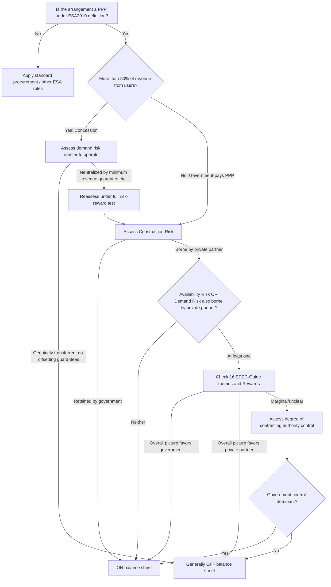

## Eurostat ESA2010 Statistical Treatment of PPPs

### Overview

Eurostat's statistical treatment of Public-Private Partnerships (PPPs) determines whether the assets built and operated under a PPP contract are recorded **on** or **off** the government's balance sheet under the European System of Accounts 2010 (ESA 2010). This classification is not an accounting technicality alone — it directly determines whether the capital cost of the infrastructure counts against a Member State's Maastricht deficit and debt ratios in the year of construction, or is instead spread across the life of the contract as it would be for a private investment. Because of this fiscal consequence, ESA2010 statistical treatment has become one of the most closely scrutinized aspects of PPP structuring in the European Union.

The legal basis is a Regulation adopted by all Member States, and the concepts and definitions of the fiscal indicators (deficit and debt) used in the Excessive Deficit Procedure (EDP) and for the purposes of the Stability and Growth Pact (SGP) are based on ESA 2010. Because ESA 2010's structure is consistent with the worldwide System of National Accounts (2008 SNA), the same underlying logic (economic ownership determined by risk-bearing) appears — with local variations — in the IMF's Government Finance Statistics Manual (GFSM 2014) as well. [HM Revenue and Customs](https://www.wired-gov.net/wg/news.nsf/articles/Launch+of+the+EPECEurostat+Guide+to+the+Statistical+Treatment+of+PublicPrivate+Partnerships+30092016152000?open=)[HM Revenue and Customs](https://www.wired-gov.net/wg/news.nsf/articles/Launch+of+the+EPECEurostat+Guide+to+the+Statistical+Treatment+of+PublicPrivate+Partnerships+30092016152000?open=)

### Why Statistical Treatment Matters

**Key Points**

- PPP construction creates an infrastructure asset that must be financed by someone, and national accounting rules must decide who is deemed to "own" that asset for statistical purposes.
- In ESA 2010, investment is recorded as gross fixed capital formation (GFCF), which constitutes expenditure and directly affects a Member State's budget deficit or surplus in the year it is recorded. [HM Revenue and Customs](https://www.wired-gov.net/wg/news.nsf/articles/Launch+of+the+EPECEurostat+Guide+to+the+Statistical+Treatment+of+PublicPrivate+Partnerships+30092016152000?open=)
- If a PPP asset is classified **on** government balance sheet, the government is treated as if it had procured and financed the asset directly: the full capital value is recorded as government GFCF (and government debt) during construction, hitting the deficit and debt ratios immediately.
- If classified **off** balance sheet, the government's fiscal accounts only reflect the periodic service/availability payments made to the private partner over the life of the contract, smoothing the fiscal impact over decades instead of concentrating it in the construction years.
- Governments were often attracted to PPPs specifically because financing could be recorded either on or off balance sheet, which made Eurostat's classification rules a focal point of policy debate, especially where PPPs were used partly to manage headline deficit and debt numbers rather than purely for value-for-money reasons. [HM Revenue and Customs](https://www.wired-gov.net/wg/news.nsf/articles/Launch+of+the+EPECEurostat+Guide+to+the+Statistical+Treatment+of+PublicPrivate+Partnerships+30092016152000?open=)

### Legal and Guidance Framework

The framework rests on a layered hierarchy of documents, from the binding legal act down to practitioner-oriented interpretive guidance:

1. **ESA 2010 Regulation** — the base legal act, though it contains only a few paragraphs directly addressing PPPs (ESA 2010 paragraphs such as 2.38, 20.309, and 20.316–20.318). It establishes the general principle of "economic ownership" based on risk and reward, but does not provide detailed operational tests. [imf](https://www.imf.org/external/pubs/ft/gfs/gfsac/meetings/2017/pdf/Vaughan4.3.pdf)
2. **Manual on Government Deficit and Debt (MGDD)** — Eurostat's implementing manual, which provides further explanations through more specific rules on the classification of the assets (and corresponding liabilities) as to whether they should be included in the national or government balance sheet. The MGDD is periodically updated (notable editions include MGDD 2013, MGDD 2016, and later consolidations); it is the MGDD, not the base Regulation, that supplies the detailed three-risk test discussed below. [Ppp-certification](https://ppp-certification.com/ppp-certification-guide/122-eurostat-standards-esa2010)
3. **EPEC–Eurostat "Guide to the Statistical Treatment of PPPs" (2016)** — prepared jointly by the European PPP Expertise Centre (EPEC) and Eurostat to help stakeholders better understand the impact of PPPs on government balance sheets, explaining how the features of typical PPP contracts influence "on" or "off" balance sheet classification. The Guide applies only to projects achieving financial close after its publication date, and to projects varied after publication where the variation itself alters the balance of risk and/or reward under the contract. Eurostat regards the Guide as complementing, interpreting, and clarifying its existing publications and opinions rather than superseding the MGDD. [A guide to the statistical treatment of PPPs (EPEC 2016) | Public Private Partnership +2](https://ppp.worldbank.org/library/guide-statistical-treatment-ppps-epec-2016)
4. **Eurostat clarification notes and case-by-case opinions** — supplementary notes issued on specific emerging issues (e.g., a clarification note on the application of PPP rules that national statistical authorities may formally decide whether to adopt), plus Eurostat's country-specific advance opinions on individual transactions. [Statisticsauthority](https://uksa.statisticsauthority.gov.uk/wp-content/uploads/2023/02/NSCASE-23-03-New-Public-Private-Partnerships-.pdf)

[Inference] Because MGDD editions are periodically revised and Eurostat issues transaction-specific opinions that are not always publicly consolidated, practitioners should always verify which version of the MGDD and which Guide edition is in force at the time a given contract reaches financial close, since a later revision generally does not apply retroactively unless the contract itself is subsequently varied in a way that alters risk/reward.

### Defining a "PPP" for Statistical Purposes

Eurostat defines a Public-Private Partnership as a long-term contractual arrangement between a government entity (the "grantor") and a partner entity (the "operator," usually private), mainly used for infrastructure development, where the partner is responsible for building, operating, and maintaining the infrastructure asset designed to deliver a public service. In exchange for the services received, the government entity pays regular fees to the non-government partner following construction of the asset. [HM Revenue and Customs](https://www.wired-gov.net/wg/news.nsf/articles/Launch+of+the+EPECEurostat+Guide+to+the+Statistical+Treatment+of+PublicPrivate+Partnerships+30092016152000?open=)[HM Revenue and Customs](https://www.wired-gov.net/wg/news.nsf/articles/Launch+of+the+EPECEurostat+Guide+to+the+Statistical+Treatment+of+PublicPrivate+Partnerships+30092016152000?open=)

Before applying the risk tests, the Guide's methodology requires establishing that the arrangement is, in fact, a "PPP" in the ESA sense — i.e., a long-term arrangement involving construction/major renovation of a specific fixed asset, joint control or shared risk-reward, and the delivery of a public service — as opposed to, for example, an outright privatization, a simple public procurement contract, or a short-term service contract with no significant capital asset involved.

### The Two Broad PPP Categories: Concessions vs. Government-Pays PPPs

ESA2010 statistical treatment splits PPPs into two broad categories based on the *source of revenue*, and this distinction is the first major fork in the classification logic:

**Concessions (user-pays PPPs)**

- Defined as a Design, Build, Finance, Operate and Maintain (DBFOM) contract where more than 50 percent of the revenues come from user-payments (e.g., tolls, fares). [Ppp-certification](https://ppp-certification.com/ppp-certification-guide/122-eurostat-standards-esa2010)
- Eurostat treats concessions as generally more readily classified off balance sheet, primarily because the project company is considered to bear the majority of commercial (i.e., demand) risk. [ScienceDirect](https://www.sciencedirect.com/topics/economics-econometrics-and-finance/government-finance-statistics)
- Under ESA principles, user-pays PPPs are generally treated as being off the government balance sheet. [Ppp-certification](https://ppp-certification.com/ppp-certification-guide/122-eurostat-standards-esa2010)

**Availability-based / government-pays PPPs**

- Defined as any PPP-type transaction where more than 50 percent of revenues come from the public budget rather than users — this is often what Eurostat refers to simply as "PPPs" in narrower usage. [Ppp-certification](https://ppp-certification.com/ppp-certification-guide/122-eurostat-standards-esa2010)
- The focus of ESA regulations is specifically on government-pays PPPs, since these are the transactions where the risk of an artificial "off-balance-sheet" classification for fiscal-avoidance purposes is highest. [Ppp-certification](https://ppp-certification.com/ppp-certification-guide/122-eurostat-standards-esa2010)
- These contracts require the full three-risk assessment described below, because the government, not end-users, is the counterparty bearing the payment obligation.

[Inference] The 50% revenue threshold functions as a screening rule to decide which detailed test regime applies (concession rules vs. the full risk-and-reward test), rather than as a standalone determinant of final balance-sheet treatment; a government-pays PPP is not automatically "on balance sheet," and a concession is not automatically guaranteed "off balance sheet" if government support (guarantees, minimum revenue guarantees, etc.) effectively neutralizes the user's demand-risk transfer.

### The Core Test: Risk and Reward (Economic Ownership)

ESA2010's approach is based on risks (and rewards) and "economic ownership": assets are considered "on balance sheet" for government if government bears the majority of the relevant risks. The requirement to consider rewards in addition to risks in assessing statistical treatment of PPPs was explicitly introduced by ESA 2010 (a refinement compared to the earlier ESA95 framework, which focused more narrowly on risk alone). [imf](https://www.imf.org/external/pubs/ft/gfs/gfsac/meetings/2017/pdf/Vaughan4.3.pdf)[European Investment Bank](https://www.eib.org/files/publications/thematic/epec_eurostat_statistical_guide_en.pdf)

For a PPP to be recorded off government balance sheet, the majority of the risks and rewards have to be borne by the private partner. The MGDD organizes this assessment around three principal risk categories: [HM Revenue and Customs](https://www.wired-gov.net/wg/news.nsf/articles/Launch+of+the+EPECEurostat+Guide+to+the+Statistical+Treatment+of+PublicPrivate+Partnerships+30092016152000?open=)

**1. Construction Risk**

- Covers risks relating to the design, build, and delivery phase of the asset: cost overruns, late delivery, non-compliance with specifications, and technical/regulatory risks during construction.
- This includes items such as schedule uncertainty, subsurface conditions, construction safety, coordination with adjacent projects, and quality assurance issues that materially affect whether the asset is delivered on time and on budget. [arxiv](https://arxiv.org/pdf/2311.14203)
- For the private partner to be considered to bear construction risk, it must generally absorb cost overruns and delays without automatic compensation from government, and must not receive payment (or must receive only very limited payment) until the asset is actually delivered and functioning to specification.

**2. Availability Risk**

- Covers whether the asset, once built, is actually made available to the required quality and performance standard throughout the operational phase.
- The private partner bears availability risk if its payments from government are genuinely reduced (via deductions/penalties) for periods of non-availability or sub-standard performance, and if those deductions are material enough to meaningfully affect the operator's revenue — not merely symbolic penalty clauses.
- Where deduction mechanisms are capped, easily avoided, or insignificant relative to overall project cash flow, Eurostat treats availability risk as not genuinely transferred.

**3. Demand Risk (Volume/Usage Risk)**

- The risk that project revenues will be lower or higher than expected because demand for the output is lower or higher than expected. [World Bank PPP Legal Resource Center](https://ppp.worldbank.org/identifying-risks)
- Significant demand-risk transfer should be considered with caution and generally reserved for cases where the operator has real tools to influence demand — for example, control over pricing or service marketing in a toll or fare-based project. In social infrastructure projects, where higher usage is not a policy objective for government, demand/volume risk transfer is typically not appropriate and is usually retained by government — which is precisely why most availability-based social-infrastructure PPPs rely on the construction/availability risk pairing rather than demand risk. [Ppp-certification](https://ppp-certification.com/ppp-certification-guide/121-revenue-risk-%E2%80%93-demand-or-volume-risk3)[Ppp-certification](https://ppp-certification.com/ppp-certification-guide/121-revenue-risk-%E2%80%93-demand-or-volume-risk3)

**The Governing Rule (MGDD Three-Risk Test)**

Off-balance-sheet treatment is conditional on the concessionaire/private operator bearing at least one of construction risk, availability risk, or demand risk, as governed by MGDD Chapter VI. In practice, the most common qualifying combination for availability-based PPPs is: [Lisboneconomics](https://www.lisboneconomics.com/pdfs/pt-infrastructure-economic-impact.pdf)

$$\text{Off-balance-sheet} \iff \text{Private partner bears Construction Risk} \; \land \; (\text{Availability Risk} \lor \text{Demand Risk})$$

If government effectively retains **both** availability risk and demand risk (or retains construction risk itself, e.g., through cost-overrun guarantees), the asset is generally classified **on** the government's balance sheet regardless of contractual labels.

**Rewards, Beyond Risk**

Because ESA2010 also requires assessment of rewards, Eurostat additionally examines features such as: sharing of refinancing gains, allocation of residual/terminal asset value, upside-sharing mechanisms, and whether government retains disproportionate benefit from the asset's performance. For example, the fact that a contract gives government a 60% share of refinancing gains may or may not be relevant to classification depending on which version of the Rules (MGDD 2013 vs. MGDD 2016) was in force at the time the contract reached financial close — illustrating that the reward dimension is evaluated against the specific rules edition applicable to that contract's financial close date. [European Investment Bank](https://www.eib.org/files/publications/thematic/epec_eurostat_statistical_guide_en.pdf)

### The 16 Themes of the EPEC-Eurostat Guide

Having established that a project is a "PPP," the Guide considers 16 key thematic areas that apply across PPPs generally, rather than being tied to specific national contract templates, in recognition that contract drafting approaches vary across EU Member States. For each theme, the Guide indicates — using a color/italics coding convention attributed to Eurostat's own comments — whether an approach that points toward on-balance-sheet treatment is of VERY HIGH, HIGH, or MODERATE importance, or whether it is sufficient on its own to trigger on-balance-sheet recording. [CMS](https://cms.law/en/gbr/legal-updates/ESA10-The-New-Guidance)[European Investment Bank](https://www.eib.org/files/publications/thematic/epec_eurostat_statistical_guide_en.pdf)

While the 16 themes cover many contract-specific mechanics (e.g., step-in rights, termination compensation, refinancing, insurance proceeds, force majeure, government funding contributions, and change-in-law provisions), they all ultimately feed back into the underlying three-risk-plus-reward test. Where the overall picture from these themes is marginal, Eurostat looks additionally at the degree of the contracting authority's control over the facility to reach a final determination. [ScienceDirect](https://www.sciencedirect.com/topics/economics-econometrics-and-finance/government-finance-statistics)

[Inference] Because government funding contributions (capital grants, subsidized loans, or guarantees covering a large share of project cost) reduce the private partner's exposure to construction and demand risk, the Guide treats the proportion of public funding as one of the more heavily weighted individual themes — though the exact weighting is fact-specific and Eurostat does not publish a fixed numerical funding threshold analogous to the 50% revenue test for concessions.

### Government Guarantees, Refinancing, and Contract Variations

Several recurring structuring issues receive close scrutiny under the framework:

- **Government guarantees**: if a sovereign guarantee on the concessionaire's debt becomes necessary to make a project financeable, that guarantee can itself be treated by Eurostat as sitting on the government's books, separate from the balance-sheet question for the underlying asset. [Lisboneconomics](https://www.lisboneconomics.com/pdfs/pt-infrastructure-economic-impact.pdf)
- **Minimum revenue/traffic guarantees**: where government commits to compensate the operator if actual demand falls below a floor, this substantially undermines genuine demand-risk transfer and can push a nominally user-pays concession toward on-balance-sheet treatment.
- **Contract variations after financial close**: if a contractual change made after the original financial close directly alters the balance of risk and reward (or the nature or control of the relevant parties) in a way that would change the statistical treatment, the treatment must be reassessed under the Rules as they stand at the time the change is made — meaning a PPP can migrate from off- to on-balance-sheet status (or vice versa) mid-contract if its risk allocation is materially amended. [CMS](https://cms.law/en/gbr/legal-updates/ESA10-The-New-Guidance)
- **Financial distress reclassification**: if a demand shortfall or negative concessionaire NPV triggers a State capital top-up or a concession-term extension, Eurostat may reclassify part of the capital expenditure as government debt even mid-stream, illustrating that off-balance-sheet status secured at financial close is not permanently fixed if subsequent government interventions effectively re-assume risk. [Lisboneconomics](https://www.lisboneconomics.com/pdfs/pt-infrastructure-economic-impact.pdf)

### Worked Illustrative Example

**Example**

Consider a hypothetical availability-based hospital PPP:

- Total construction cost: €500 million, financed by a private special-purpose vehicle (SPV) using project debt and equity.
- The SPV is responsible for design, build, and 25-year facilities-management/maintenance of the hospital.
- The government pays a monthly "unitary charge" once the hospital opens.
- The contract includes: (a) liquidated damages payable by the SPV for late completion (construction risk retained by SPV); (b) a payment-deduction mechanism where the unitary charge is materially reduced — potentially to zero — for any ward or department that is unavailable or fails performance/quality standards (availability risk retained by SPV); (c) no revenue at all tied to patient volumes (no demand-risk transfer, which is appropriate here since patient volume is a policy variable, not something the SPV controls).

**Analysis**: The SPV bears construction risk (cost overruns/delays are its own responsibility) and availability risk (payment deductions are real and material). Because it bears at least construction risk plus one of the other two risk categories, and because government does not fund a majority of construction cost or guarantee against cost overruns, this combination is generally consistent with **off-balance-sheet** treatment — the hospital asset would not be recorded as government GFCF at construction, and only the unitary charge payments would appear in the government's annual expenditure accounts, split conceptually between an interest/finance-cost component and a service-charge component.

**Contrast**: If the same contract instead capped availability deductions at a low percentage of the unitary charge (making the penalty immaterial) and government provided a capital grant covering 60% of construction cost, Eurostat would likely conclude the private partner does not genuinely bear the majority of risk and reward, and the asset would be recorded **on** government balance sheet — with the full €500 million effectively hitting government GFCF and debt during the construction period.

### Interaction with Fiscal Rules (EDP and SGP)

Construction under PPP contracts creates liabilities or debt for government, since the assets must be financed somehow, and this financing can be recorded either on or off the government balance sheet. This is why the statistical treatment question is inseparable from EU fiscal surveillance: [HM Revenue and Customs](https://www.wired-gov.net/wg/news.nsf/articles/Launch+of+the+EPECEurostat+Guide+to+the+Statistical+Treatment+of+PublicPrivate+Partnerships+30092016152000?open=)

- **Excessive Deficit Procedure (EDP)**: the concepts and definitions of the deficit and debt indicators used under the EDP are based on ESA 2010, so an on-balance-sheet PPP directly worsens the reported deficit-to-GDP and debt-to-GDP ratios monitored under the EDP. [HM Revenue and Customs](https://www.wired-gov.net/wg/news.nsf/articles/Launch+of+the+EPECEurostat+Guide+to+the+Statistical+Treatment+of+PublicPrivate+Partnerships+30092016152000?open=)
- **Stability and Growth Pact (SGP)**: the same ESA2010-based figures feed the SGP's compliance thresholds (commonly cited reference values of 3% of GDP for deficit and 60% of GDP for debt), so a large PPP program classified on-balance-sheet can materially affect a Member State's assessed compliance.
- This dynamic is precisely why PPPs became important in the EDP context, and why Eurostat rules — perceived by many stakeholders as an obstacle to infrastructure delivery — generated so much debate, particularly around implementation of the Investment Plan for Europe. [HM Revenue and Customs](https://www.wired-gov.net/wg/news.nsf/articles/Launch+of+the+EPECEurostat+Guide+to+the+Statistical+Treatment+of+PublicPrivate+Partnerships+30092016152000?open=)

### National Implementation Examples

The UK's national accounts apply ESA(2010) rules, and because the UK has historically used many PPPs (chiefly under its Private Finance Initiative, PFI, program), it has been a significant contributor to the development of ESA and MGDD guidance in this area. The UK Office for National Statistics (ONS) first began publishing PPP-related statistical data in 2006, and has noted practical coverage challenges, including that some PPPs are not centrally supported and some projects are old enough that consistent data sourcing is difficult, and that data prepared for financial reporting purposes uses a different accounting basis than data prepared for statistical purposes. [www.imf.org +2](https://www.imf.org/external/pubs/ft/gfs/gfsac/meetings/2017/pdf/Vaughan4.3.pdf)

[Unverified] Specific up-to-date UK, Portuguese, or other Member State PPP portfolio statistics (e.g., current totals of on- vs. off-balance-sheet PPP stock) were not verified in this response and should be checked against the relevant national statistical office or Eurostat's latest government finance statistics releases if current figures are required.

### Comparison: ESA2010/MGDD vs. IMF GFSM 2014

| Dimension | Eurostat ESA2010 / MGDD | IMF GFSM 2014 |
| --- | --- | --- |
| Core principle | Risk-and-reward-based "economic ownership" | Broadly similar risk/reward-based ownership concept |
| Level of detail | Extensive, granular assessment of risk and reward to determine asset ownership (MGDD Section 6.4) | Less prescriptive in describing which specific risks and rewards determine the economic owner |
| Coverage areas needing more clarity | — | Government funding, government guarantees, termination clauses, government influence over asset/service terms, and government rewards |
| Legal status | Binding EU Regulation adopted by all Member States | Statistical manual guidance, not a binding legal instrument |
| Primary user base | EU Member States (feeds EDP/SGP compliance) | IMF member countries globally |

[Inference] Because GFSM 2014 is less prescriptive than the MGDD, non-EU jurisdictions applying GFSM-based rules may have more room for judgment in PPP classification, but this also means less predictability for practitioners compared to the more codified (if still complex) ESA2010/MGDD/EPEC-Guide framework.

### Classification Decision Flow (Diagram)

### Risk Allocation Matrix (SVG Diagram)

<svg xmlns="http://www.w3.org/2000/svg" viewBox="0 0 760 380" font-family="Arial, sans-serif">
<text x="380" y="28" text-anchor="middle" font-size="18" font-weight="bold" fill="#1a1a2e">ESA2010 Three-Risk Allocation Matrix (svg_diagram)</text>
<rect x="20" y="55" width="220" height="40" fill="#2c3e50" />
<text x="130" y="80" text-anchor="middle" font-size="14" fill="#ffffff" font-weight="bold">Risk Category</text>
<rect x="240" y="55" width="250" height="40" fill="#2c3e50" />
<text x="365" y="80" text-anchor="middle" font-size="14" fill="#ffffff" font-weight="bold">Borne by Private Partner</text>
<rect x="490" y="55" width="250" height="40" fill="#2c3e50" />
<text x="615" y="80" text-anchor="middle" font-size="14" fill="#ffffff" font-weight="bold">Borne by Government</text>
<rect x="20" y="95" width="220" height="60" fill="#eef2f7" stroke="#c0c8d4" />
<text x="130" y="130" text-anchor="middle" font-size="13" fill="#1a1a2e">Construction Risk</text>
<rect x="240" y="95" width="250" height="60" fill="#d4edda" stroke="#a3d9b1" />
<text x="365" y="118" text-anchor="middle" font-size="12" fill="#1a1a2e">Cost overruns/delays absorbed</text>
<text x="365" y="136" text-anchor="middle" font-size="12" fill="#1a1a2e">by SPV; no compensation</text>
<rect x="490" y="95" width="250" height="60" fill="#f8d7da" stroke="#e6a5ab" />
<text x="615" y="118" text-anchor="middle" font-size="12" fill="#1a1a2e">Cost-overrun guarantees or</text>
<text x="615" y="136" text-anchor="middle" font-size="12" fill="#1a1a2e">automatic compensation clauses</text>
<rect x="20" y="155" width="220" height="60" fill="#eef2f7" stroke="#c0c8d4" />
<text x="130" y="190" text-anchor="middle" font-size="13" fill="#1a1a2e">Availability Risk</text>
<rect x="240" y="155" width="250" height="60" fill="#d4edda" stroke="#a3d9b1" />
<text x="365" y="178" text-anchor="middle" font-size="12" fill="#1a1a2e">Material payment deductions for</text>
<text x="365" y="196" text-anchor="middle" font-size="12" fill="#1a1a2e">non-performance/downtime</text>
<rect x="490" y="155" width="250" height="60" fill="#f8d7da" stroke="#e6a5ab" />
<text x="615" y="178" text-anchor="middle" font-size="12" fill="#1a1a2e">Capped or symbolic deductions;</text>
<text x="615" y="196" text-anchor="middle" font-size="12" fill="#1a1a2e">payments largely guaranteed</text>
<rect x="20" y="215" width="220" height="60" fill="#eef2f7" stroke="#c0c8d4" />
<text x="130" y="250" text-anchor="middle" font-size="13" fill="#1a1a2e">Demand Risk</text>
<rect x="240" y="215" width="250" height="60" fill="#d4edda" stroke="#a3d9b1" />
<text x="365" y="238" text-anchor="middle" font-size="12" fill="#1a1a2e">Revenue directly tied to usage;</text>
<text x="365" y="256" text-anchor="middle" font-size="12" fill="#1a1a2e">no minimum revenue guarantee</text>
<rect x="490" y="215" width="250" height="60" fill="#f8d7da" stroke="#e6a5ab" />
<text x="615" y="238" text-anchor="middle" font-size="12" fill="#1a1a2e">Minimum revenue/traffic guarantee</text>
<text x="615" y="256" text-anchor="middle" font-size="12" fill="#1a1a2e">or fixed government payment</text>
<rect x="20" y="290" width="720" height="70" fill="#fff3cd" stroke="#f0d68a" />
<text x="380" y="313" text-anchor="middle" font-size="13" font-weight="bold" fill="#5a4a1a">MGDD Rule: OFF-balance-sheet requires private partner to bear</text>
<text x="380" y="333" text-anchor="middle" font-size="13" font-weight="bold" fill="#5a4a1a">Construction Risk AND (Availability Risk OR Demand Risk)</text>
<text x="380" y="351" text-anchor="middle" font-size="11" fill="#5a4a1a">Plus: overall Rewards assessment and, if marginal, degree of government control</text>
</svg>

### Common Pitfalls and Structuring Risks

**Key Points**

- **Over-reliance on contractual labels**: calling a payment mechanism a "penalty" or "deduction" does not by itself transfer risk; Eurostat looks at whether the mechanism is *material* in practice, not merely present on paper.
- **Latent government guarantees**: implicit or informal expectations that government will "step in" if the SPV fails financially can undermine risk transfer even without an explicit guarantee clause, particularly for socially essential infrastructure (hospitals, schools) where a service cannot simply be discontinued.
- **High public funding ratios**: large capital grants or subsidized financing from government reduce the private partner's real financial exposure to construction and demand risk, weighting the overall assessment toward on-balance-sheet.
- **Refinancing gain-sharing structured to favor government too heavily**: depending on which MGDD edition applies, disproportionate government upside-sharing on refinancing can be treated as evidence government retains reward, reinforcing an on-balance-sheet conclusion.
- **Treating financial-close classification as permanent**: a subsequent contract variation that itself changes the balance of risk and reward requires re-assessment under the Rules in force at the time of the variation, so classification is not fixed for the life of the contract if the deal is later renegotiated. [CMS](https://cms.law/en/gbr/legal-updates/ESA10-The-New-Guidance)
- **Confusing accounting purposes**: data prepared for financial reporting (e.g., under IFRS for the private operator) is not on the same basis as data prepared for statistical/ESA purposes, so a PPP being "off" the operator's own IFRS balance sheet, or vice versa, does not determine its ESA2010 government classification. [imf](https://www.imf.org/external/pubs/ft/gfs/gfsac/meetings/2017/pdf/Vaughan4.3.pdf)

[Speculation] As governments increasingly explore blended finance and guarantee-heavy PPP structures to attract private capital for green and digital infrastructure, it is plausible that Eurostat will need to issue further clarification notes addressing how partial public guarantees on green bonds or EU-level co-financing (e.g., through InvestEU or the Recovery and Resilience Facility) interact with the three-risk test — but no such consolidated guidance was confirmed as finalized within the sources reviewed for this response.

### Practical Implications for PPP Structuring

**Next Steps** (for a public authority structuring a new PPP)

1. Determine early — ideally at the business-case stage — whether the intended revenue model makes the project a concession (user-pays) or a government-pays PPP, since this determines which test regime applies.
2. Draft payment-deduction and performance-regime clauses so that availability-risk transfer is *quantitatively material*, not merely nominal, if availability risk is intended to satisfy the risk test.
3. Minimize automatic government compensation for cost overruns, delays, or demand shortfalls unless those guarantees are a deliberate, disclosed trade-off against on-balance-sheet treatment.
4. Model the fiscal impact under **both** on- and off-balance-sheet scenarios during project appraisal, since Eurostat's final view may only be confirmed close to or after financial close.
5. Consult the current MGDD edition and the EPEC-Eurostat Guide's 16 themes systematically, and where the case is finely balanced, seek an informal or formal Eurostat view before contract signature.
6. Build contract-variation review procedures so that any future amendment is checked against risk/reward-transfer implications before execution, to avoid inadvertent reclassification.

### Related Topics

- Manual on Government Deficit and Debt (MGDD) — detailed chapter-by-chapter risk assessment methodology
- Excessive Deficit Procedure (EDP) and Stability and Growth Pact (SGP) mechanics
- Government Finance Statistics Manual (GFSM 2014) and IMF treatment of PPPs
- Availability payment mechanisms and payment-deduction (performance) regimes in PPP contracts
- Value-for-Money (VfM) assessment and Public Sector Comparator methodology
- Contingent liabilities and government guarantees in PPP fiscal risk management
- Refinancing gain-sharing mechanisms in PPP contracts
- National PPP unit practices (UK PFI/PF2 legacy, national statistical office treatment)
- Fiscal risk reporting frameworks for PPP portfolios (IMF PPP Fiscal Risk Assessment Model — PFRAM)
- Economic ownership vs. legal ownership distinctions in national accounting