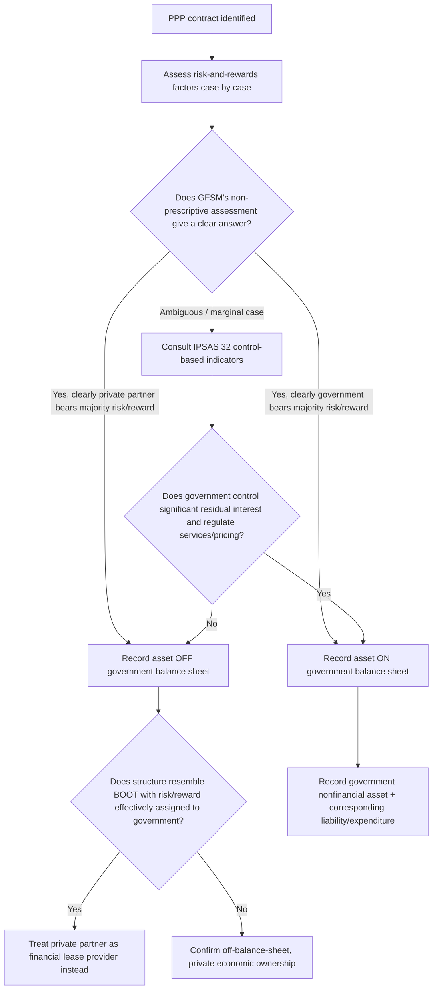

## Government Finance Statistics Manual Treatment of PPPs

### Overview

The Government Finance Statistics Manual (GFSM), published by the International Monetary Fund, is the internationally recognized statistical reporting framework aimed at helping national authorities strengthen their capacity to formulate fiscal policy and monitor fiscal developments. The current edition, **GFSM 2014**, describes the macroeconomic statistical framework (the "GFS framework") used worldwide — including by non-EU countries that do not fall under Eurostat's ESA2010 jurisdiction — to determine how Public-Private Partnership (PPP) assets and liabilities should be recorded in government accounts. The GFS framework provides a basis for analyzing public investment while offering a "common language" that fiscal analysts can use to develop a consistent approach to complex government operations, of which PPPs are a prime example.

Unlike ESA2010, which is a binding EU legal Regulation, GFSM 2014 is descriptive statistical guidance rather than law: it is not possible to prescribe rules applicable to every PPP-type arrangement, so GFSM 2014 instead presents considerations intended to guide the determination of which party is the economic owner of the asset(s) during and at the end of the PPP contract period.

### Institutional Position and Relationship to Other Statistical Manuals

GFSM 2014 sits within a family of harmonized international statistical manuals:

- **2008 System of National Accounts (2008 SNA)** — the overarching global framework, adopted under the joint responsibility of the United Nations, the IMF, and other multilateral bodies, of which GFSM 2014 is a specialized application.
- **Balance of Payments and International Investment Position Manual, 6th edition (BPM6)** — the companion manual for cross-border/external transactions, which references PPPs mainly through Annex III on determining economic ownership of PPP-related assets and through provisions on direct investment.
- **Public Sector Debt Statistics: Guide for Compilers and Users (PSDS Guide)** — provides additional numeric examples on different PPP recording treatments (referenced at PSDS Guide paragraphs 4.123–4.126).
- **ESA 2010 / MGDD (EU-specific)** — the parallel, more prescriptive EU framework used by EU Member States instead of GFSM 2014 for their primary statistical reporting, though many EU countries also report supplementary GFSM/IMF-Yearbook-compliant data.

GFSM 2014 supports compilation of internationally comparable statistics for the general government sector, the public sector, and their subsectors, and is applicable to all types of economies regardless of the institutional or legal structure of a country's government, the sophistication of its statistical development, its financial accounting system, or the extent of public ownership of for-profit entities.

### The Core Principle: Risk-and-Rewards Approach to Economic Ownership

GFSM 2014's PPP guidance is built around the same fundamental statistical concept used in the 2008 SNA and ESA2010: **economic ownership** determined by a **risk-and-rewards approach**, rather than legal title. This is explicitly distinguished from the accounting-standard alternative:

- The International Public Sector Accounting Standards Board (IPSASB)'s Handbook of International Public Sector Accounting Pronouncements uses a **"control approach"** to determine asset ownership.
- Statistical international standards — including the 2008 SNA and GFSM 2014 — instead use the **"risk and rewards approach."**
- This risk-and-rewards approach was adopted specifically because, at the time these manuals were developed, no accounting standard existed yet that was designed for PPPs.

**Key Points**

- GFSM 2014's Annex III (Determining the Economic Ownership of PPP-Related Assets, referenced via Box A4.4) recognizes broadly similar categories of risk to those used under ESA 2010 and MGDD 2016 — construction, availability/performance, and demand/market risk are all considered relevant.
- The manual explicitly states that it is not possible to prescribe rules applicable to every PPP arrangement; instead it offers guiding considerations for compilers to apply case-by-case.
- The relative importance of each risk/reward factor bears on the overall determination of economic ownership, meaning the assessment is holistic and fact-specific rather than mechanical.

### GFSM 2014 vs. ESA2010/MGDD: The Central Distinction

This is the single most important comparative point in this topic area, and it explains why GFSM-based reporting and ESA2010-based reporting can diverge for the very same PPP contract:

| Dimension | GFSM 2014 (IMF) | ESA 2010 / MGDD (Eurostat) |
| --- | --- | --- |
| Underlying principle | Risk-and-rewards approach to economic ownership | Risk-and-rewards approach to economic ownership |
| Prescriptiveness | **Less prescriptive** — does not specify which risks/rewards are determinative, or in what combination | **Highly prescriptive** — MGDD sets out a detailed three-risk test (construction, availability, demand) with explicit combination rules |
| Legal status | Statistical manual / guidance, non-binding | Binding EU Regulation with detailed implementing manual |
| Case-by-case flexibility | High — "each case needs to be considered on its merits" | Lower — Eurostat applies consistent criteria and can issue binding country-specific opinions |
| World agreement | No worldwide statistical consensus yet on PPP treatment; both SNA and GFSM remain non-prescriptive on this point | Represents the EU's own codified interpretation, viewed as the most detailed available globally |
| Alternative determination tool referenced | IPSAS 32 (service concession arrangements) as a possible way of determining the economic owner | Not typically referenced; MGDD's own risk test is authoritative |

Because there is no worldwide agreement yet among statisticians on the treatment of PPPs, the SNA and the GFSM based on it are currently non-prescriptive on this specific question — in contrast to the EU's much more detailed and codified ESA2010/MGDD approach.

### The IPSAS 32 Reference Point

A distinguishing feature of GFSM 2014's PPP guidance is that it explicitly points compilers toward the International Public Sector Accounting Standards Board's IPSAS 32 (Service Concession Arrangements: Grantor) guidelines for the recognition and measurement of a service contract, as one possible way of determining the economic owner, in the absence of GFSM's own prescriptive test.

- IPSAS 32 is consistent with International Financial Reporting Standards (IFRS) treatment of similar arrangements.
- This creates an important practical bridge: a country using GFSM 2014 for its statistical reporting may lean on accounting-standard concepts (control-based, via IPSAS 32) to fill the gap left by GFSM's own less-prescriptive risk-and-rewards framework — even though, at the conceptual level, statistical standards are supposed to use a risk-and-rewards approach while accounting standards use a control approach.
- [Inference] This blending of a control-oriented accounting standard (IPSAS 32) into a nominally risk-and-rewards statistical framework is likely one reason GFSM-based and ESA2010-based classifications of the same PPP contract can produce different balance-sheet outcomes for the same transaction, since IPSAS 32's control test and the MGDD's risk test do not always point to the same conclusion.

### Practical Consequence: Divergent National Reporting

Because GFSM 2014 and ESA 2010 embody different degrees of prescriptiveness, a country's official public accounts can differ depending on which framework a given publication follows:

- The UK provides a documented example: the Office for National Statistics (ONS) compiles its primary public sector finances statistics in accordance with ESA 2010, not GFSM 2014, but has separately worked toward publishing data fully compliant with the IMF's GFS framework (partly in response to recommendations from an IMF fiscal transparency evaluation).
- The UK's Whole of Government Accounts (WGA), prepared on an IFRS/IPSAS-consistent accounting basis, records **more PPPs and concessions on the government's balance sheet** than are recorded on-balance-sheet in the UK's ESA2010-based public sector finances statistics.
- Because of this divergence, some national statistical offices have chosen to additionally report, within the GFS/IMF-Yearbook-compliant framework, those PPPs and concessions that are recorded on-balance-sheet under the WGA — providing users with a wider measure of debt in terms of both coverage and valuation than the ESA2010 figures alone would show.
- Resulting differences between GFSM 2014 and ESA 2010 aggregates from these coverage differences typically manifest as a larger recorded value of non-financial assets (from bringing more PPP assets on-balance-sheet) offset by corresponding differences in expenditure and loan-flow classifications (and hence net borrowing).

This illustrates a broader point: the same underlying PPP portfolio can generate materially different headline government debt and deficit figures purely as a function of *which statistical manual* a country applies, even where both manuals nominally use a "risk and rewards" concept.

### GFSM 2014's Treatment in External/Direct Investment Statistics

The BPM6-based external statistics framework has a specific gap relevant to PPPs:

- None of the international statistical standards currently include references for the statistical treatment of PPPs specifically under Direct Investment (DI) classification, despite user demand for such guidance.
- The BPM6 Compilation Guide does, however, address the related area of production sharing agreements (PSAs) and touches on direct investment considerations in this space.
- Where a PPP structure resembles a Build-Own-Operate-Transfer (BOOT) scheme, it could be determined that the risks and rewards of ownership rest with government, in which case the private partner would instead be treated as a provider of a **financial lease** to government rather than as the economic owner of the asset — a classification with its own distinct statistical consequences (recording a financial liability/loan-type instrument rather than the underlying nonfinancial asset transaction).
- Additional numeric guidance on different treatment arrangements is provided in the PSDS Guide (paragraphs 4.123–4.126) and in GFSM 2014 itself (paragraphs A4.64–A4.65), with Annex III of the relevant IMF guidance reproducing general principles for recording PPPs in external debt statistics.

### Worked Illustrative Example

**Example**

Consider a toll-road concession in a non-EU country that reports under GFSM 2014:

- A private concessionaire builds and operates the toll road for 30 years, collecting toll revenue directly from users, with no minimum revenue guarantee from government.
- Under GFSM 2014's less-prescriptive approach, the compiler must assess, case by case, whether the concessionaire genuinely bears sufficient risk and reward (construction cost risk, toll/demand risk, and residual asset value risk) to be treated as the economic owner.
- Because GFSM 2014 does not supply a rigid combination rule (unlike MGDD's explicit "construction risk AND (availability risk OR demand risk)" formulation), the compiler may reasonably reference IPSAS 32's control-based test as a cross-check: does government control the significant residual interest in the asset at the end of the arrangement, and does it regulate or control the services the operator must provide and to whom?
- If IPSAS 32's control indicators point toward government (e.g., government sets toll prices, dictates who must be served, and retains any significant residual interest), the WGA-style accounting treatment would likely record the asset on-balance-sheet even if a parallel risk-and-rewards-only reading under GFSM might have been more ambiguous.
- **Conclusion for this example**: the same toll-road contract could plausibly be classified off-balance-sheet under a narrow GFSM risk-and-rewards reading, yet on-balance-sheet under the IPSAS 32 control lens that GFSM 2014 itself invites compilers to consult — illustrating why GFSM-based national reporting can vary more than ESA2010-based reporting for economically similar deals.

### Ongoing Update to GFSM 2014

**Key Points**

- The IMF Statistics Department has launched an update process for GFSM 2014, targeting completion by December 2027.
- This update follows related updates to the 2008 SNA and to BPM6, both targeted for a March 2025 release, with the aim of harmonizing GFSM 2014 with those revised companion manuals.
- Stated objectives of the update include harmonization with other statistical standards to ensure consistency in common areas of guidance, and meeting user needs by providing additional guidance and clarity for evolving fiscal policy — a category under which more prescriptive PPP guidance would plausibly fall, given the manual's long-acknowledged lack of specificity in this area.
- Governance for the update includes the IMF's Government Finance Statistics Advisory Committee (GFSAC), a group of experts from across IMF regions; in September 2024, following global consultation, GFSAC endorsed the two framework documents guiding the update's research program, which is being carried out through two workstreams.

[Unverified] Whether the GFSM update will introduce a more prescriptive, MGDD-style risk test specifically for PPPs (as opposed to retaining the current case-by-case, less-prescriptive approach) was not confirmed in the sources reviewed for this response; this would need to be verified against IMF GFSAC workstream publications closer to the 2027 target completion date.

### Related PPP-Specific IMF Tools

Beyond the GFSM's classification guidance itself, the IMF maintains complementary tools relevant to PPP fiscal risk assessment that compilers and fiscal risk managers often use alongside GFSM 2014 classification work:

- **PPP Fiscal Risk Assessment Model (P-FRAM)** — a tool (developed jointly by the IMF and World Bank) for quantifying the potential fiscal costs and risks arising from PPP projects, complementing but distinct from the balance-sheet classification question addressed in GFSM 2014 itself.
- **IMF Government Finance Statistics (GFS) Database** — the IMF provides government finance statistics for a large number of reporting countries, containing annual statistics on government revenue, expense, transactions in assets and liabilities, and stocks of assets and liabilities, compiled from data that member countries report annually, which is where GFSM-classified PPP data ultimately feeds into cross-country fiscal comparisons.

### Classification Decision Flow Under GFSM 2014 (Diagram)

### GFSM 2014 vs. ESA2010 Reporting Divergence (SVG Diagram)

<svg xmlns="http://www.w3.org/2000/svg" viewBox="0 0 760 320" font-family="Arial, sans-serif">
<text x="380" y="26" text-anchor="middle" font-size="17" font-weight="bold" fill="#1a1a2e">Same PPP Portfolio, Different Statistical Outcomes (svg_diagram)</text>
<rect x="40" y="55" width="300" height="34" fill="#2c3e50" />
<text x="190" y="78" text-anchor="middle" font-size="13" fill="#ffffff" font-weight="bold">ESA 2010 / MGDD (EU, prescriptive)</text>
<rect x="420" y="55" width="300" height="34" fill="#2c3e50" />
<text x="570" y="78" text-anchor="middle" font-size="13" fill="#ffffff" font-weight="bold">GFSM 2014 (IMF, non-prescriptive)</text>
<rect x="40" y="99" width="300" height="70" fill="#eef2f7" stroke="#c0c8d4" />
<text x="190" y="122" text-anchor="middle" font-size="12" fill="#1a1a2e">Fixed 3-risk test:</text>
<text x="190" y="140" text-anchor="middle" font-size="12" fill="#1a1a2e">Construction AND</text>
<text x="190" y="158" text-anchor="middle" font-size="12" fill="#1a1a2e">(Availability OR Demand)</text>
<rect x="420" y="99" width="300" height="70" fill="#eef2f7" stroke="#c0c8d4" />
<text x="570" y="122" text-anchor="middle" font-size="12" fill="#1a1a2e">Case-by-case weighting;</text>
<text x="570" y="140" text-anchor="middle" font-size="12" fill="#1a1a2e">may reference IPSAS 32</text>
<text x="570" y="158" text-anchor="middle" font-size="12" fill="#1a1a2e">control indicators</text>
<rect x="40" y="179" width="300" height="55" fill="#d4edda" stroke="#a3d9b1" />
<text x="190" y="202" text-anchor="middle" font-size="12" fill="#1a1a2e">Result: Fewer PPPs classified</text>
<text x="190" y="220" text-anchor="middle" font-size="12" fill="#1a1a2e">on-balance-sheet (narrower coverage)</text>
<rect x="420" y="179" width="300" height="55" fill="#f8d7da" stroke="#e6a5ab" />
<text x="570" y="202" text-anchor="middle" font-size="12" fill="#1a1a2e">Result: More PPPs classified</text>
<text x="570" y="220" text-anchor="middle" font-size="12" fill="#1a1a2e">on-balance-sheet (e.g., UK WGA)</text>
<rect x="40" y="250" width="680" height="55" fill="#fff3cd" stroke="#f0d68a" />
<text x="380" y="273" text-anchor="middle" font-size="12" font-weight="bold" fill="#5a4a1a">Same underlying PPP portfolio can show a larger non-financial asset base and</text>
<text x="380" y="291" text-anchor="middle" font-size="12" font-weight="bold" fill="#5a4a1a">different debt/deficit aggregates purely due to which manual is applied</text>
</svg>

### Common Pitfalls in Applying GFSM 2014

**Key Points**

- **Assuming GFSM 2014 provides a rule as specific as MGDD's**: because GFSM explicitly states it cannot prescribe rules for every arrangement, compilers who mechanically import the MGDD's three-risk test without adaptation may misrepresent how their own jurisdiction's classification was actually reached.
- **Ignoring the IPSAS 32 cross-check**: skipping the control-based accounting perspective GFSM 2014 itself references can lead to inconsistency between a country's statistical (GFS) reporting and its whole-of-government accounting (WGA-style) reporting for the same contracts.
- **Overlooking BOOT-style reclassification to financial lease**: treating every PPP as a binary "on/off nonfinancial asset" question, when in some structures (particularly BOOT-type arrangements where government effectively bears risk/reward) the correct GFSM treatment is to record the private partner as a financial lease provider instead.
- **Treating GFS and ESA2010 figures as interchangeable**: because coverage and methodology differ, comparing a GFSM-reported debt figure directly against an ESA2010-reported figure for the same country without adjustment can produce a misleading impression of fiscal position.
- **Missing the direct-investment/external-debt gap**: PPP treatment under Direct Investment classification in BPM6 remains an acknowledged gap in the international standards, so cross-border PPP financing structures may require bespoke judgment beyond what any single manual specifies.

[Inference] Given the stated GFSM update objectives around harmonization and additional clarity, and given that PPP treatment is one of the more frequently cited areas where GFSM 2014 is "less prescriptive" than its EU counterpart, it is reasonably likely (though not confirmed) that PPP-specific guidance will be a substantive discussion item within the GFSM update's research workstreams before the targeted 2027 completion.

### Related Topics

- Eurostat ESA2010 statistical treatment of PPPs and the MGDD three-risk test (comparative framework)
- IPSAS 32 — Service Concession Arrangements: Grantor (control-based recognition standard)
- 2008 System of National Accounts (2008 SNA) — overarching global statistical framework
- Balance of Payments and International Investment Position Manual (BPM6) and PPP treatment under Direct Investment
- Public Sector Debt Statistics: Guide for Compilers and Users (PSDS Guide)
- Whole of Government Accounts (WGA) and IFRS-consistent public sector accounting
- IMF-World Bank PPP Fiscal Risk Assessment Model (P-FRAM)
- Financial lease classification of BOOT (Build-Own-Operate-Transfer) PPP structures
- National statistical office dual reporting practices (ESA2010 primary vs. GFS supplementary)
- Contingent liability disclosure and fiscal risk reporting for PPP portfolios