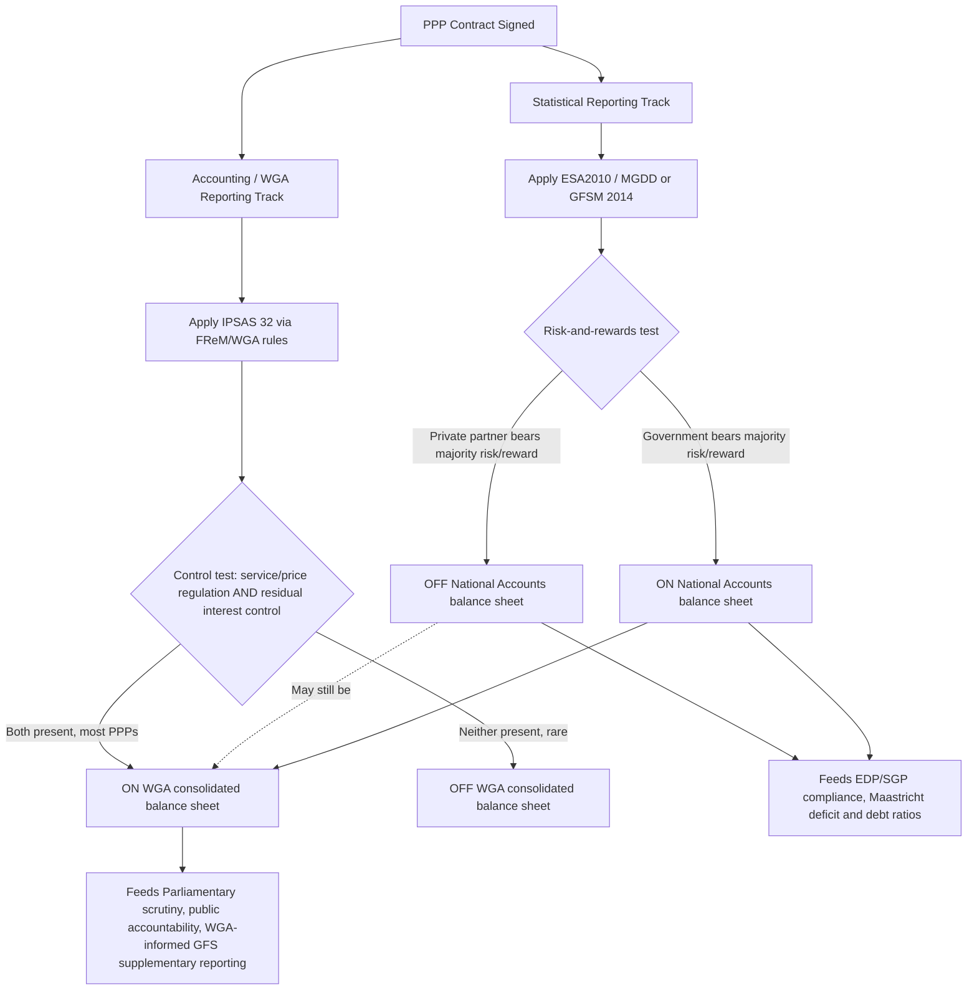

## Whole-of-Government Accounts and Consolidated Reporting

### Overview

Whole-of-Government Accounts (WGA) is a form of consolidated financial reporting that presents the entire public sector of a country as if it were a single accounting entity, using accrual-based, IFRS/IPSAS-consistent accounting standards rather than the national-accounts (ESA2010/GFSM) statistical framework. The UK's WGA is the most frequently cited global example: it is a consolidated set of financial statements for the UK public sector, consolidating the audited accounts of thousands of organizations — including central government departments, local authorities, devolved administrations, the health service, academies, and public corporations — to produce a comprehensive, accounts-based picture of the fiscal position in a given year.

Within the "Public Accounting and Statistical Treatment of PPPs" chapter, WGA and consolidated reporting matter specifically because they represent an **accounting-standard-based alternative view** of PPP balance-sheet treatment, distinct from (and sometimes materially different from) the **statistical-standard-based view** produced under ESA2010/MGDD or GFSM 2014.

### Purpose and Coverage

**Key Points**

- WGA aims to enable Parliament and the public to better understand and scrutinize how taxpayers' money is spent, by presenting public finances in a framework familiar to the commercial and accountancy professions, thereby increasing transparency and accessibility of fiscal information.
- WGA complements the National Accounts figures produced by the national statistical office (in the UK, the Office for National Statistics) by providing a parallel set of financial statements based on standards familiar to users of private-sector accounts.
- Coverage has expanded substantially over time: the UK's WGA originally consolidated over 1,500 organizations when first published; more recent editions (e.g., 2023–24) consolidate over 10,000 bodies across the whole of the public sector, including central government departments, local authorities, devolved administrations, the NHS, academy schools, and public corporations.
- The UK Treasury defines "Whole of Government" broadly as a group of entities that appears to exercise functions of a public nature, or is entirely or substantially funded from public money — a coverage test that is inherently likely to be broader than a narrowly defined "general government sector" boundary used in national accounts.
- WGA is one of the most comprehensive sets of audited consolidated accounts published globally.

### Standard Components of a WGA

A typical Whole-of-Government Accounts publication includes:

1. **Consolidated Statement of Revenue and Expenditure** — the accruals-based income statement for the whole public sector.
2. **Consolidated Statement of Financial Position** — the balance sheet showing public sector assets and liabilities, including non-financial assets (such as PPP infrastructure where recognized) and financial liabilities.
3. **Consolidated Cash Flow Statement** — reconciling accrual results to actual cash movements across the consolidated entity.
4. **Statement on Internal Control** — governance-related disclosure on the control environment underpinning the consolidated figures.

WGA makes visible a number of metrics that are otherwise difficult to calculate from departmental-level accounts alone, such as the net public service pension liability, the government's commitments under Private Finance Initiative (PFI)/PPP contracts, total provisions, and contingent liabilities.

### Accounting Basis: IFRS Adapted for the Public Sector

WGA is based on adopted International Financial Reporting Standards (IFRS) — the accounting system used internationally by the private sector — as adapted or interpreted for the public sector context, making its presentation similar to private-sector company accounts. In the UK specifically:

- WGA is prepared in accordance with IFRS and the **Government Financial Reporting Manual (FReM)**, which adapts IFRS requirements for the UK public-sector context.
- This IFRS-based, accruals approach was developed drawing on International Public Sector Accounting Standards (IPSAS) concepts, reflecting the fact that IPSAS itself is substantially converged with IFRS in most areas relevant to asset/liability recognition.

### The PPP-Relevant Accounting Standard: IPSAS 32

The single most important accounting standard for PPP balance-sheet treatment within a WGA-style framework is **IPSAS 32 (Service Concession Arrangements: Grantor)**. This standard is central to why WGA-style consolidated accounts often classify more PPPs on-balance-sheet than parallel statistical (ESA2010/GFSM) reporting does.

**IPSAS 32's Core Test: Control, Not Risk-and-Rewards**

- IPSAS 32 describes service concession arrangements as long-term contracts between a government (the grantor) and a private party (the operator), whereby the operator uses a public asset (such as a prison, airport, or water pipeline) to provide a public service for a specified period on behalf of the government.
- Both **government-pays** and **user-pays** PPP contracts are covered by IPSAS 32 — unlike the ESA2010 approach, which applies materially different test regimes depending on the revenue source.
- IPSAS 32 states that a contract should have consequences for the government's balance sheet (in terms of recognized debt) if it exhibits two cumulative control characteristics:
  1. **The government controls or regulates** what services the operator must provide with the asset, to whom it must provide them, and at what price; **and**
  2. **The government controls any significant residual interest** in the asset at the end of the arrangement term.
- Most PPPs meet both of these criteria — which is precisely why, under IPSAS 32, most PPPs are expected to have an impact on aggregate public debt as recorded under an accounting-standard consolidation such as WGA, even where the same contract might be assessed as off-balance-sheet under the ESA2010/MGDD risk-and-rewards test.
- At the end of the contract term, when the asset is handed back to government, there should be no debt remaining and the residual value of the non-financial asset is recognized at that point on the government's books.

**Why This Produces a Different Outcome Than ESA2010/MGDD or GFSM 2014**

This is the crux of the divergence documented across public accounting practice:

| Framework | Core Test | Typical Effect on PPP Classification |
| --- | --- | --- |
| ESA2010 / MGDD | Risk-and-rewards (construction, availability, demand risk) | Narrower on-balance-sheet coverage — many availability/user-pays PPPs qualify off-balance-sheet if risk is genuinely transferred |
| GFSM 2014 | Risk-and-rewards, non-prescriptive, may reference IPSAS 32 | Variable — depends on how much weight compilers give the IPSAS 32 cross-check |
| IPSAS 32 / WGA (accounting) | Control (regulation of service/price + control of residual interest) | Broader on-balance-sheet coverage — most PPPs meeting the control test are recognized regardless of risk transfer |

As documented in UK practice: under the WGA, **more PPPs and concessions are recorded on the government's balance sheet than are recorded on-balance-sheet in the parallel public sector finances statistics** (which follow ESA2010). This is a direct, empirically observed consequence of IPSAS 32's control-based test being structurally more likely to capture PPPs on-balance-sheet than the ESA2010/MGDD risk-and-rewards test.

### Reconciling Statistical and Accounting Views: A Dual-Reporting Response

Because these two views diverge, some jurisdictions have adopted a dual-reporting practice:

- A country may decide to additionally report, within its GFS/IMF-Yearbook-compliant statistical publication, those PPPs and concessions that are recorded on-balance-sheet in the WGA — even though they might not meet the narrower ESA2010 on-balance-sheet test — in order to give statistical users a wider view of the public sector.
- This wider view typically manifests as: a larger recorded value of non-financial assets (from bringing more PPP assets onto the statistical balance sheet), which is offset by corresponding adjustments to expenditure and loan-flow classifications, ultimately producing differences in net borrowing between the ESA2010 aggregate and the GFS/WGA-informed aggregate.
- [Inference] This dual-reporting approach functions as a practical compromise: it preserves the EU's mandated ESA2010 reporting for EDP/SGP compliance purposes while giving domestic and international users (rating agencies, parliamentary scrutiny bodies, the IMF) a fuller, more conservative picture of contingent and recognized public-sector exposure to PPP commitments.

### Governance and Standard-Setting Bodies

- **Financial Reporting Advisory Board (FRAB)** — in the UK, an independent body that reviews and advises on the government's accounting standards, including ongoing WGA production issues (timeliness, scope, consolidation methodology).
- **HM Treasury** — produces WGA and maintains the FReM that adapts IFRS for UK public-sector reporting.
- **IPSASB (International Public Sector Accounting Standards Board)** — issues IPSAS 32 and the broader suite of IPSAS standards used (in full or as a reference point) by many countries preparing WGA-style consolidated accounts, even those not formally IPSAS-compliant.
- **EPSAS (European Public Sector Accounting Standards) initiative** — a longer-running European Commission/Eurostat-led project examining whether EU Member States should adopt harmonized accrual-based public-sector accounting standards; a EPSAS issue paper on consolidation of financial statements has specifically examined how existing frameworks (IPSAS, IFRS, national accounting rules, EU Accounting Directives, and ESA2010/MGDD where relevant) each treat consolidation to a whole-of-government or sub-sector level, and how the "notion of control" should be applied consistently.

[Inference] Because EPSAS work explicitly cross-references both accounting-standard consolidation practices (IPSAS/IFRS) and the ESA2010/MGDD statistical framework, it is a natural forum where the long-standing risk-and-rewards-vs-control divergence for PPPs could eventually be addressed at the EU level — though as of the sources reviewed, EPSAS remains a harmonization initiative rather than a binding standard, and no confirmed timeline for full EU-wide EPSAS adoption was found.

### Other IPSAS Standards Relevant to Consolidated PPP Reporting

Beyond IPSAS 32 itself, a broader set of IPSAS standards governs the recognition and measurement of stocks (assets/liabilities) relevant to comprehensive PPP-related consolidated reporting, including:

- **IPSAS 11** — Construction Contracts
- **IPSAS 12** — Inventories
- **IPSAS 13** — Leases
- **IPSAS 16** — Investment Property
- **IPSAS 17** — Property, Plant and Equipment
- **IPSAS 19** — Provisions, Contingent Liabilities and Contingent Assets (directly relevant to disclosing PPP-related contingent exposures, such as termination compensation or guarantee calls, even where the underlying asset itself is off-balance-sheet)
- **IPSAS 21 / 26** — Impairment of Assets
- **IPSAS 25** — Employee Benefits
- **IPSAS 28, 29, 30** — Financial Instruments
- **IPSAS 31** — Intangible Assets
- **IPSAS 32** — Service Concession Arrangements: Grantor (the primary PPP standard, discussed above)

Standards dealing with cash flows relevant to this reporting include **IPSAS 2** (Cash Flow Statement) and the **Cash Basis IPSAS** (for jurisdictions not yet on full accrual accounting).

### Worked Illustrative Example

**Example**

Consider a government-pays school-building PPP (availability payment structure) that has been assessed as **off-balance-sheet** under ESA2010/MGDD because the private operator genuinely bears construction risk and material availability-deduction risk.

**Applying IPSAS 32 to the same contract for WGA purposes:**

- Does government control or regulate what services the operator must provide, to whom, and at what price? — Yes: the contract specifies exact facilities-management service levels, the schools that must be served, and the unitary charge formula is fixed by contract terms government negotiated.
- Does government control the significant residual interest in the asset at the end of the arrangement? — Yes: at contract expiry, the school building transfers to government at little or no additional payment, and government has effectively controlled the asset's ultimate disposition throughout.
- **Conclusion under IPSAS 32**: both control criteria are met, so the asset **is recognized on the government's balance sheet** for WGA purposes, with a corresponding liability recognized (typically split between a financial liability component, akin to a loan, and a service component reflecting the ongoing facilities-management payments).
- **Net effect**: the same physical school building and the same underlying contract is **off-balance-sheet** in the country's ESA2010-based National Accounts (relevant to EDP/SGP compliance) but **on-balance-sheet** in the country's WGA (relevant to Parliamentary/public accountability scrutiny) — both figures being simultaneously correct under their respective, differently-purposed frameworks.

### Practical and Governance Challenges in WGA Production

**Key Points**

- **Timeliness**: WGA production for very large, complex consolidations (10,000+ entities in the UK case) has faced persistent delays — for example, later publication timelines than the pre-pandemic norm of publication by the summer recess the year after the balance sheet date, with recovery plans tracked by oversight bodies such as the Public Accounts Committee.
- **Non-coterminous reporting dates**: misalignment of financial reporting periods between different consolidated entities (e.g., academy schools versus central government departments) creates comparability risks and complicates the consolidation process.
- **Structural reorganization risk**: large-scale public-sector reorganizations (such as local government reorganization into unitary authorities) can disrupt established consolidation groupings and require transitional accounting arrangements.
- **Complex long-term liabilities**: WGA includes large and complex long-term liabilities — public service pension liabilities being a leading example — that can be difficult for readers to interpret owing to significant sensitivity to discount-rate assumptions, a challenge structurally similar to (though distinct from) PPP-related liability valuation sensitivity.
- **Data submission delays from consolidated entities**: late submission of data by entities material to the overall consolidation is a recurring operational risk that can delay the entire publication.

### WGA / Consolidated Reporting vs. Statistical Reporting: Structural Comparison Diagram

### Consolidated Reporting Architecture (SVG Diagram)

<svg xmlns="http://www.w3.org/2000/svg" viewBox="0 0 760 380" font-family="Arial, sans-serif">
<text x="380" y="26" text-anchor="middle" font-size="17" font-weight="bold" fill="#1a1a2e">Whole-of-Government Accounts Consolidation Structure (svg_diagram)</text>
<rect x="290" y="50" width="180" height="40" fill="#1a1a2e" />
<text x="380" y="75" text-anchor="middle" font-size="13" fill="#ffffff" font-weight="bold">Whole-of-Government Accounts</text>
<line x1="380" y1="90" x2="150" y2="130" stroke="#888" stroke-width="1.5" />
<line x1="380" y1="90" x2="300" y2="130" stroke="#888" stroke-width="1.5" />
<line x1="380" y1="90" x2="460" y2="130" stroke="#888" stroke-width="1.5" />
<line x1="380" y1="90" x2="610" y2="130" stroke="#888" stroke-width="1.5" />
<rect x="80" y="130" width="140" height="45" fill="#eef2f7" stroke="#c0c8d4" />
<text x="150" y="157" text-anchor="middle" font-size="11" fill="#1a1a2e">Central Govt Depts</text>
<rect x="230" y="130" width="140" height="45" fill="#eef2f7" stroke="#c0c8d4" />
<text x="300" y="157" text-anchor="middle" font-size="11" fill="#1a1a2e">Local Authorities</text>
<rect x="390" y="130" width="140" height="45" fill="#eef2f7" stroke="#c0c8d4" />
<text x="460" y="157" text-anchor="middle" font-size="11" fill="#1a1a2e">Health Service / NHS</text>
<rect x="540" y="130" width="140" height="45" fill="#eef2f7" stroke="#c0c8d4" />
<text x="610" y="157" text-anchor="middle" font-size="11" fill="#1a1a2e">Public Corporations</text>
<rect x="60" y="200" width="640" height="50" fill="#fff3cd" stroke="#f0d68a" />
<text x="380" y="230" text-anchor="middle" font-size="12" font-weight="bold" fill="#5a4a1a">Consolidation applies IFRS (via FReM) + IPSAS 32 control test to each entity's PPP contracts</text>
<rect x="60" y="270" width="300" height="90" fill="#d4edda" stroke="#a3d9b1" />
<text x="210" y="295" text-anchor="middle" font-size="12" font-weight="bold" fill="#1a1a2e">Consolidated Statement of</text>
<text x="210" y="312" text-anchor="middle" font-size="12" font-weight="bold" fill="#1a1a2e">Financial Position</text>
<text x="210" y="332" text-anchor="middle" font-size="11" fill="#1a1a2e">PPP assets/liabilities recognized</text>
<text x="210" y="349" text-anchor="middle" font-size="11" fill="#1a1a2e">where IPSAS 32 control met</text>
<rect x="400" y="270" width="300" height="90" fill="#d4edda" stroke="#a3d9b1" />
<text x="550" y="295" text-anchor="middle" font-size="12" font-weight="bold" fill="#1a1a2e">Consolidated Rev/Exp,</text>
<text x="550" y="312" text-anchor="middle" font-size="12" font-weight="bold" fill="#1a1a2e">Cash Flow, Internal Control</text>
<text x="550" y="332" text-anchor="middle" font-size="11" fill="#1a1a2e">Discloses PFI/PPP commitments,</text>
<text x="550" y="349" text-anchor="middle" font-size="11" fill="#1a1a2e">pension liabilities, contingent liabilities</text>
</svg>

### Common Pitfalls and Interpretive Risks

**Key Points**

- **Conflating WGA figures with National Accounts figures**: because both are "official" government financial publications, non-specialist readers may wrongly assume they should show the same PPP debt totals; the two frameworks use fundamentally different recognition tests (control vs. risk-and-rewards) and are not designed to reconcile automatically.
- **Assuming off-balance-sheet ESA2010 treatment means no accounting recognition anywhere**: a PPP kept off the national accounts balance sheet for Maastricht purposes may still be fully recognized as a liability in WGA, meaning "off-balance-sheet" claims made in a purely statistical context can be misleading if extended to imply the exposure is invisible in all public reporting.
- **Underestimating consolidation complexity**: with thousands of constituent entities, PPP-related figures embedded in departmental or local-authority-level accounts can be inconsistently classified or measured before consolidation, requiring active quality assurance during the WGA compilation process.
- **Discount-rate sensitivity spillover**: because WGA aggregates large long-duration liabilities (pensions, and by extension long-tenor PPP financial liabilities), readers should be cautious about interpreting year-on-year WGA balance-sheet swings without checking whether they reflect discount-rate revaluation rather than genuine changes in underlying PPP commitments.
- **Timeliness lag reducing decision-usefulness**: given multi-year publication delays experienced in some WGA cycles, users relying on WGA for current PPP exposure assessment should cross-check against more frequently updated in-year departmental or Treasury PPP/PFI commitment disclosures.

[Speculation] Given ongoing EPSAS harmonization discussions and continued academic and IMF interest in reconciling accounting-standard and statistical-standard treatments of PPPs, it is plausible that future guidance will attempt to formally bridge the IPSAS 32 control test and the ESA2010/MGDD risk-and-rewards test — but no finalized cross-framework reconciliation standard was confirmed as adopted in the sources reviewed for this response.

### Related Topics

- IPSAS 32 (Service Concession Arrangements: Grantor) — detailed recognition and measurement requirements
- Eurostat ESA2010 statistical treatment of PPPs and the MGDD three-risk test (contrast framework)
- Government Finance Statistics Manual (GFSM 2014) treatment of PPPs (contrast framework)
- European Public Sector Accounting Standards (EPSAS) harmonization initiative
- UK Government Financial Reporting Manual (FReM) and IFRS adaptation for the public sector
- Contingent liability and provisions disclosure (IPSAS 19) for PPP portfolios
- Public sector pension liability accounting and discount-rate sensitivity
- Fiscal transparency evaluations (IMF) and public financial management reform
- Consolidation boundary-setting: "control" concept in public-sector group accounting
- Private Finance Initiative (PFI) legacy contract reporting in the UK