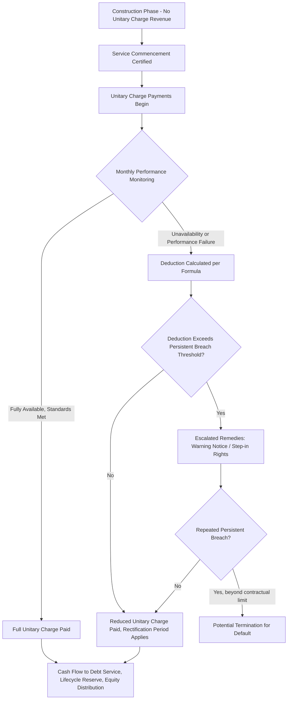

## Availability Payment Structures

### Overview

An availability payment structure is a PPP payment mechanism in which the public authority (the "grantor") pays the private partner (the "operator" or Special Purpose Vehicle, SPV) a periodic fee — typically monthly or quarterly — contingent on the asset being made available to the required standard of quality and performance, rather than on the volume of end-users or demand for the underlying service. This structure decouples the operator's revenue from usage risk and ties it instead to the operator's own delivery performance: completing construction on time and to specification, then maintaining the asset's operational readiness and service quality throughout the contract term.

Availability payments are the dominant payment mechanism for **social infrastructure PPPs** — schools, hospitals, prisons, government office buildings, courts — where demand for the underlying public service is a policy variable controlled by government (e.g., how many patients are referred, how many students are enrolled) rather than something the private operator can influence or should be incentivized to maximize.

### Core Mechanics

**Key Points**

- Payment begins only once the asset (or a defined phase/unit of it) reaches "service commencement" or "actual completion" — no revenue accrues to the operator during construction, which is the primary mechanism transferring construction risk to the private partner.
- The full contracted unitary charge is earned only when the asset is 100% available and performing to specified quality standards; deviations trigger deductions.
- Payments are typically structured to cover: (a) recovery of capital investment and financing costs (debt service and equity return), and (b) ongoing operating and lifecycle maintenance costs — often disclosed separately in financial models even though paid as a single "unitary charge" to the operator.
- The mechanism is demand-agnostic: whether the hospital treats 50 or 500 patients per day, or whether the school enrolls 200 or 800 students, the unitary charge (absent capacity-related contract amendments) does not change, because the operator is being paid for making the *capacity* available, not for the *volume* of usage.

### The Unitary Charge

The "unitary charge" (sometimes called "availability fee" or "service payment") is the single periodic payment made by the grantor to the operator, and is called "unitary" because it bundles together compensation for multiple distinct services (capital recovery, hard facilities management, soft facilities management/lifecycle costs) into one combined payment stream, even though the underlying financial model decomposes it for analytical and deduction purposes.

**Typical composition of a unitary charge:**

| Component | Purpose | Deduction-Sensitive? |
| --- | --- | --- |
| Senior debt service | Repays project debt principal and interest | Partially — severe/prolonged unavailability can threaten debt service coverage |
| Equity return | Compensates investors for capital and risk | Yes — deductions reduce distributable cash to equity first, in most structures |
| Lifecycle/major maintenance reserve | Funds periodic renewal (roof replacement, equipment refresh) | Generally protected, since underfunding it creates future availability risk |
| Hard FM (facilities management) | Building fabric maintenance, mechanical/electrical systems | Directly tied to deduction mechanism |
| Soft FM (where bundled) | Cleaning, security, catering, grounds maintenance | Directly tied to deduction mechanism |

$$\text{Unitary Charge (period)} = \text{Base Charge} - \text{Availability Deductions} - \text{Performance Deductions} + \text{Indexation Adjustment}$$

### The Payment Deduction Mechanism

The deduction mechanism is the operational core of the entire structure — it is what makes the payment genuinely "performance-based" rather than a disguised fixed annuity, and (as discussed under Eurostat's ESA2010 framework) it is precisely the mechanism Eurostat scrutinizes to determine whether availability risk has been genuinely transferred.

**Design Principles**

1. **Unavailability deductions**: apply when all or part of the asset is not available for its intended use (e.g., a ward closed, a classroom unusable, a prison wing offline). Deductions are usually calculated as a proportion of the daily/period unitary charge attributable to the unavailable area or function, often scaled by the criticality of that area.
2. **Performance deductions**: apply when the asset is technically "available" but service quality falls below specified standards (e.g., temperature control failures, response-time breaches for maintenance requests, cleanliness failures) without necessarily rendering the area unusable.
3. **Persistent/repeated failure escalation**: many contracts include escalating deduction multipliers or additional remedies (warning notices, step-in rights, ultimately termination for persistent default) if the same failure recurs beyond a defined threshold within a rolling period.
4. **Rectification periods**: operators are typically given a defined period to rectify a fault before deductions begin to accrue, and deductions may cease once rectification is achieved, though some frameworks apply deductions retroactively to the point of failure.
5. **Caps and floors**: many contracts cap the maximum deduction achievable in a single period (to preserve project financeability, since senior lenders require a minimum revenue floor to service debt) — but Eurostat's ESA2010 assessment specifically checks whether such caps are set low enough to render the deduction mechanism immaterial, which would undermine genuine risk transfer.

**Example**

A 300-bed hospital PPP with a monthly unitary charge of $2,000,000 might structure deductions as follows:

- The hospital has 10 clinical zones, each notionally weighted based on criticality (e.g., operating theatres weighted at 3x a general ward).
- If an operating theatre (weight 3) is unavailable for 5 consecutive days in a 30-day month, and total zone-weight points sum to 40, the deduction might be calculated as:

$$\text{Deduction} = \text{Base Charge} \times \frac{\text{Weight} \times \text{Days Unavailable}}{\text{Total Weight Points} \times \text{Days in Period}}$$

$$\text{Deduction} = \$2{,}000{,}000 \times \frac{3 \times 5}{40 \times 30} = \$2{,}000{,}000 \times 0.0125 = \$25{,}000$$

If deductions in a given month exceed a contractually defined threshold (say, 20% of the base charge), a "persistent breach" mechanism may be triggered, escalating contract remedies beyond a simple payment reduction.

### Comparison: Availability Payments vs. Demand/Revenue-Based Payments

| Dimension | Availability Payment | Demand-Based (User-Pays/Toll) |
| --- | --- | --- |
| Revenue driver | Asset performance and availability | Usage volume (traffic, ridership, patronage) |
| Typical sectors | Schools, hospitals, prisons, government buildings, some roads | Toll roads, some transit, airports, some water utilities |
| Demand risk holder | Grantor (government) retains demand risk | Operator (private partner) bears demand risk |
| ESA2010 risk basis for off-balance-sheet | Construction risk + Availability risk | Construction risk + Demand risk |
| Revenue volatility for operator | Lower — smoother, deduction-driven variance | Higher — tied to economic cycles, competing infrastructure, behavior change |
| Financing implications | Generally easier/cheaper to finance (lower revenue volatility) | Often requires higher risk premium, demand studies, sometimes minimum revenue guarantees |
| Suitability | Social infrastructure with policy-controlled demand | Infrastructure where usage is market-driven and operator can influence/benefit from volume |

### Construction-Phase Risk Transfer

**Key Points**

- No payment (or, in some structures, only a small milestone-linked capital contribution) is made until the asset achieves service commencement — this is the primary lever for transferring **construction risk** under an availability structure, since the operator bears the full cost of construction delay through lost/delayed revenue.
- Liquidated damages clauses often run in parallel: if the operator misses agreed milestone dates, it may owe liquidated damages to the grantor in addition to not yet earning unitary charge revenue.
- Some contracts include partial/phased service commencement (e.g., a multi-building school campus) allowing partial unitary charge payments to begin as discrete, certified-complete phases become available — this requires careful contract drafting to avoid diluting the "no revenue until availability" principle in a way that could concern statistical reviewers assessing genuine risk transfer.

### Indexation and Inflation Adjustment

Availability payment unitary charges are typically indexed to protect the operator's real revenue (and by extension its ability to service debt) against inflation, while also protecting the grantor from paying more than a fair real value over the contract term.

- Common indexation bases include a Consumer Price Index (CPI) or a weighted blend of indices reflecting the underlying cost structure (e.g., a construction cost index component alongside a general inflation index for FM/labor-heavy cost components).
- Indexation is often applied only to the operating-cost-related portion of the unitary charge, while the debt-service portion may be fixed (if financed with fixed-rate debt) or itself indexed (if financed with index-linked debt, common in some jurisdictions for long-tenor infrastructure debt).
- [Inference] The specific indexation mechanism chosen has second-order effects on the ESA2010 rewards assessment, since an indexation formula that consistently favors one party over long horizons could be scrutinized as an indicator of imbalanced reward-sharing, though this is a secondary consideration relative to the primary risk tests.

### Financial Model Integration

Availability payment structures are underpinned by a detailed financial model that links construction cost, financing structure, and the unitary charge schedule to ensure the project is bankable:

### Availability Payment Waterfall (SVG Diagram)

<svg xmlns="http://www.w3.org/2000/svg" viewBox="0 0 760 400" font-family="Arial, sans-serif">
<text x="380" y="26" text-anchor="middle" font-size="17" font-weight="bold" fill="#1a1a2e">Unitary Charge Cash Flow Waterfall (svg_diagram)</text>
<rect x="280" y="50" width="200" height="40" fill="#1a1a2e" />
<text x="380" y="75" text-anchor="middle" font-size="13" fill="#ffffff" font-weight="bold">Base Unitary Charge</text>
<line x1="380" y1="90" x2="380" y2="115" stroke="#888" stroke-width="1.5" />
<polygon points="375,115 385,115 380,125" fill="#888" />
<rect x="230" y="125" width="300" height="40" fill="#f8d7da" stroke="#e6a5ab" />
<text x="380" y="150" text-anchor="middle" font-size="12" fill="#1a1a2e">Less: Availability + Performance Deductions</text>
<line x1="380" y1="165" x2="380" y2="190" stroke="#888" stroke-width="1.5" />
<polygon points="375,190 385,190 380,200" fill="#888" />
<rect x="230" y="200" width="300" height="40" fill="#d4edda" stroke="#a3d9b1" />
<text x="380" y="225" text-anchor="middle" font-size="12" fill="#1a1a2e">= Net Unitary Charge Received</text>
<line x1="380" y1="240" x2="150" y2="270" stroke="#888" stroke-width="1.5" />
<line x1="380" y1="240" x2="380" y2="270" stroke="#888" stroke-width="1.5" />
<line x1="380" y1="240" x2="610" y2="270" stroke="#888" stroke-width="1.5" />
<rect x="60" y="270" width="180" height="55" fill="#eef2f7" stroke="#c0c8d4" />
<text x="150" y="292" text-anchor="middle" font-size="11" font-weight="bold" fill="#1a1a2e">1. Senior Debt</text>
<text x="150" y="309" text-anchor="middle" font-size="11" fill="#1a1a2e">Service (First Priority)</text>
<rect x="290" y="270" width="180" height="55" fill="#eef2f7" stroke="#c0c8d4" />
<text x="380" y="292" text-anchor="middle" font-size="11" font-weight="bold" fill="#1a1a2e">2. Operating Costs +</text>
<text x="380" y="309" text-anchor="middle" font-size="11" fill="#1a1a2e">Lifecycle Reserve</text>
<rect x="520" y="270" width="180" height="55" fill="#eef2f7" stroke="#c0c8d4" />
<text x="610" y="292" text-anchor="middle" font-size="11" font-weight="bold" fill="#1a1a2e">3. Equity Distribution</text>
<text x="610" y="309" text-anchor="middle" font-size="11" fill="#1a1a2e">(Residual, Last Priority)</text>
<rect x="60" y="345" width="640" height="45" fill="#fff3cd" stroke="#f0d68a" />
<text x="380" y="372" text-anchor="middle" font-size="12" font-weight="bold" fill="#5a4a1a">Deductions hit equity distribution first — the mechanism that gives availability risk real teeth</text>
</svg>

### Structuring Considerations for Public Authorities

**Next Steps** (for a grantor designing an availability payment mechanism)

1. Calibrate deduction weightings to reflect genuine service criticality (e.g., an operating theatre should carry materially higher deduction weight than a storage room) so the mechanism incentivizes the right operator behavior.
2. Set deduction caps, if used, at a level that preserves financeability without becoming so low that Eurostat or equivalent statistical reviewers would view the mechanism as immaterial.
3. Define clear, objective, and independently verifiable availability/performance criteria in the contract's service specification and payment mechanism schedule, minimizing subjective grantor discretion that could create later disputes.
4. Build in a persistent-breach escalation ladder (warning notices → step-in rights → termination for default) so that chronic underperformance has consequences beyond a recurring, absorbable financial deduction.
5. Align indexation methodology with the underlying cost structure of the operator's obligations to avoid embedding a structural real-terms advantage or disadvantage to either party over a multi-decade contract term.
6. Ensure payment mechanism drafting is stress-tested against the ESA2010/MGDD risk-transfer criteria (or equivalent national framework) before financial close, since a mechanism perceived as symbolic can jeopardize intended off-balance-sheet treatment.

### Common Pitfalls

**Key Points**

- **Deduction caps set too low**: undermines both operator performance incentives and the statistical credibility of risk transfer.
- **Overly complex deduction formulas**: excessive granularity or ambiguity in the payment mechanism schedule creates high transaction costs in monthly performance monitoring and disputes, sometimes outweighing the marginal precision gained.
- **Weak independent verification/monitoring regime**: if the grantor lacks robust, resourced contract-monitoring capability, deduction assessments can become inconsistent, contested, or effectively unenforced in practice — eroding the real-world risk transfer regardless of what the contract says on paper.
- **Persistent breach thresholds set too high**: allows chronic low-level underperformance to continue indefinitely without triggering meaningful remedy escalation.
- **Ignoring lifecycle/major maintenance underfunding risk**: if deductions or operator financial distress lead to deferred lifecycle maintenance, availability risk can resurface later in the contract term as major asset components fail prematurely, creating a "second-generation" fiscal risk for government even under a well-designed initial mechanism.

[Inference] Because availability deductions typically hit the equity distribution layer of the cash flow waterfall first (after debt service and reserve funding), the incentive intensity of the deduction regime on day-to-day operator behavior is strongly shaped by how much "cushion" exists between contracted revenue and the debt-service/reserve floor — a thinly capitalized, highly leveraged SPV may behave differently under stress than a well-capitalized one, even facing an identical deduction schedule.

### Related Topics

- Performance-based contracting and key performance indicator (KPI) design in PPPs
- Eurostat ESA2010 availability risk criteria and materiality thresholds
- Financial close and construction-phase risk allocation in PPP contracts
- Lifecycle/major maintenance reserve accounts and asset handback standards
- Step-in rights and lender direct-agreement mechanics in PPP default scenarios
- Termination compensation regimes for default, voluntary termination, and force majeure
- Shadow toll and hybrid demand/availability payment mechanisms
- Contract monitoring and independent certifier roles in PPP performance regimes
- Refinancing gain-sharing mechanisms in availability-based PPPs
- Indexation methodology design (CPI vs. construction cost indices) in long-term contracts