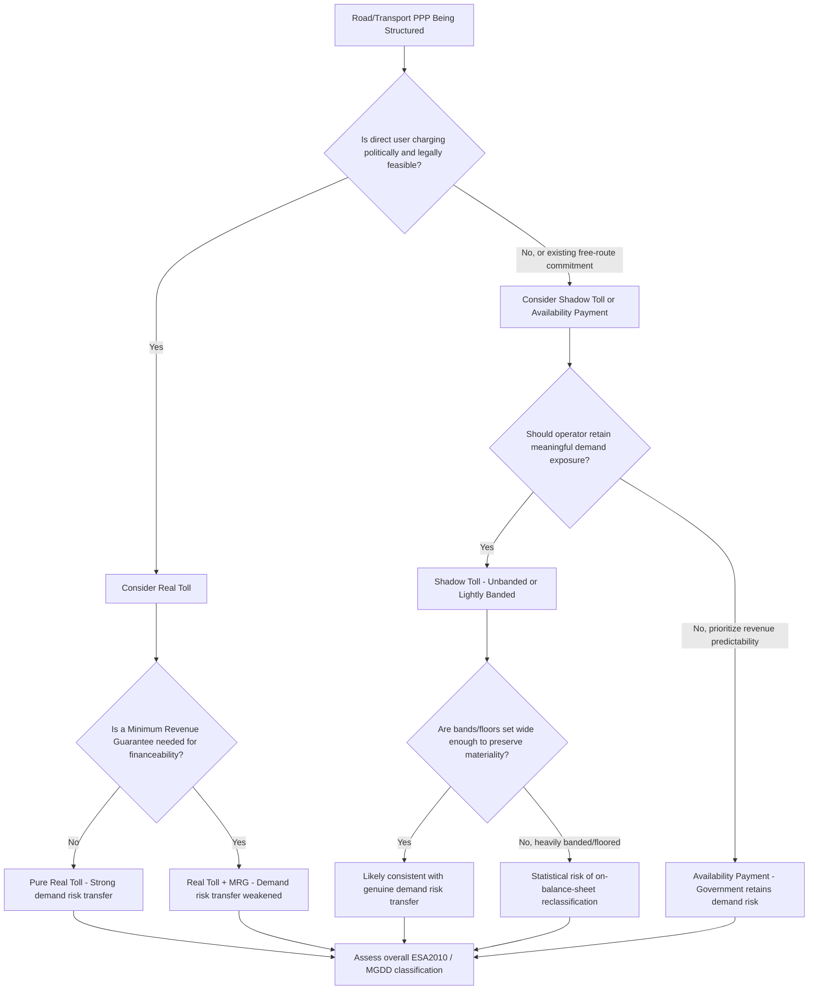

## Real Tolls, Shadow Tolls, and User-Charge Mechanisms

### Overview

Real tolls, shadow tolls, and user-charge mechanisms are payment structures in PPP infrastructure contracts where the operator's revenue is linked, in whole or in part, to the volume of usage of the underlying asset — most commonly a road, bridge, tunnel, or similar transport facility. Unlike availability payment structures, where revenue depends on the asset being available and performing to standard regardless of usage, these mechanisms tie compensation to how much the asset is actually used, which introduces **demand risk** as a central element of the payment design. The choice between a real toll, a shadow toll, or a hybrid mechanism has significant implications for who bears demand risk, how the project is financed, its political acceptability, and its statistical treatment under frameworks such as Eurostat's ESA2010.

### Real Tolls

**Definition and Mechanics**

A real toll (also called a "hard toll" or "direct toll") is a charge paid directly by the end-user of the facility to the operator (or to a toll-collection intermediary remitting to the operator) at the point of use — for example, a driver paying a toll to cross a bridge or use a section of motorway. The operator's revenue is a direct function of traffic volume and the toll tariff schedule:

$$\text{Toll Revenue (period)} = \sum_{i} (\text{Traffic Volume}_i \times \text{Toll Rate}_i)$$

where $i$ indexes vehicle classes (e.g., cars, light commercial vehicles, heavy goods vehicles), each typically charged at a different rate.

**Key Points**

- Real tolls place demand/volume risk squarely on the private operator: if traffic is lower than forecast (due to economic downturn, fuel price changes, a competing free route, or overly optimistic traffic modeling), the operator's revenue falls with no compensation from government (absent a separate guarantee mechanism).
- Because the user directly pays for use, real tolls are the mechanism most consistent with a "concession" under Eurostat's ESA2010 classification (a DBFOM contract where more than 50% of revenues come from user-payments), which is generally more readily classified off-government-balance-sheet.
- Toll rate-setting is usually governed by contract-specified formulas or regulatory caps (e.g., indexed to CPI, or subject to a maximum real increase per year), since unconstrained pricing power by a private monopoly operator over an essential transport corridor raises public-interest and political concerns.
- Real tolls face political-acceptability challenges, particularly where a previously free or lower-cost route is converted to tolling, or where toll increases outpace public tolerance — this has historically led to contract renegotiations, toll freezes, or even project cancellations in various jurisdictions.
- Modern real-toll schemes increasingly use free-flow / open-road tolling (electronic transponders or license-plate recognition) rather than physical toll booths, reducing collection costs and traffic delay, though this raises data-privacy and enforcement (unpaid-toll collection) considerations distinct from the payment-mechanism economics itself.

### Shadow Tolls

**Definition and Mechanics**

A shadow toll is a payment mechanism where the government (not the end-user) pays the operator a per-vehicle (or per-vehicle-band) fee based on actual traffic volume using the facility, while the facility itself remains free at the point of use for the traveling public. The "toll" is thus paid by the grantor "in the shadow" of the traffic, rather than collected directly from users.

$$\text{Shadow Toll Payment (period)} = \sum_{i} (\text{Traffic Volume}_i \times \text{Shadow Toll Rate}_i)$$

This formula looks structurally similar to the real-toll formula, but the **payer** is fundamentally different: government, not the motorist.

**Key Points**

- Shadow tolls were historically popular (particularly in the UK's early PFI road programs and in Portugal's SCUT — "Sem Custo para o Utilizador," meaning "without cost to the user" — motorway program) as a way to attract private capital to road infrastructure while avoiding the political unpopularity of direct user tolling.
- Because government, not users, bears the payment obligation, shadow tolls are classified under ESA2010 as government-pays PPPs (more than 50% of revenue from the public budget), which means the full three-risk test (construction, availability, demand) must be applied rather than the more favorable concession treatment.
- Under a shadow toll, demand risk can be transferred to the operator in principle (since payment still varies with actual traffic volume), but Eurostat and national statisticians scrutinize whether this transfer is genuine or whether banding structures, minimum payment guarantees, or traffic-band caps effectively neutralize it.
- **Banded shadow toll structures** are common: the per-vehicle rate is tiered, often decreasing as traffic volume increases within defined bands, to cap the operator's upside (and the government's payment exposure) at very high traffic levels, and sometimes to provide a minimum payment floor at very low traffic levels. Overly generous floors or overly compressed bands can be read by statisticians as evidence that demand risk transfer is not material.
- Shadow tolls have a documented history of costly fiscal outcomes in some jurisdictions: Portugal's SCUT program, where demand risk was largely retained by the State through the shadow-toll design, produced substantial contingent and eventually realized fiscal costs when traffic and the associated payment obligations proved larger than initially budgeted, contributing to renegotiation pressures during subsequent fiscal consolidation periods.
- Shadow tolls have declined in popularity in several markets in favor of availability payment mechanisms for new road PPPs, partly because of this fiscal-risk experience and partly because availability payments are simpler to forecast and monitor.

### User-Charge Mechanisms More Broadly

Beyond classic real and shadow tolls, several related and hybrid user-charge mechanisms appear across PPP road, rail, and utility contracts:

**1. Open-Access / Multi-Operator Regimes**

- A regulatory framework permitting multiple operators to run services on the same infrastructure (most common in rail), where the infrastructure PPP operator charges access fees to multiple train operating companies rather than (or in addition to) collecting fares from end passengers directly. Spain's open-access rail regime (multiple operators competing on shared high-speed lines since 2020) and conditional frameworks under discussion elsewhere in Europe illustrate this model.
- In this structure, the "user" from the infrastructure operator's perspective is the train operating company, not the traveling public directly, which changes both the revenue-risk profile (dependent on operator competition and access-charge regulation) and the statistical classification considerations.

**2. Minimum Revenue Guarantees (MRGs)**

- A government commitment to compensate the operator (fully or partially) if actual toll/fare revenue falls below a contractually defined floor. MRGs are a demand-risk mitigation tool commonly layered onto real-toll concessions to improve financeability, but they directly undermine the genuineness of demand-risk transfer for ESA2010 purposes — a real-toll concession with a generous MRG may be reclassified toward government-pays treatment or fail the demand-risk test even though it is nominally a "concession."

**3. Availability-Demand Hybrids**

- Some contracts blend a base availability payment (covering a floor of debt service and fixed costs) with a variable demand-linked component (real toll, shadow toll, or revenue-share above a threshold), intended to balance financeability with genuine risk transfer. The ESA2010 assessment of such hybrids depends on the materiality of the demand-linked component relative to the total revenue.

**4. Revenue-Sharing / Clawback Mechanisms**

- Where actual toll revenue substantially exceeds base-case forecasts, some contracts include a government revenue-share or "clawback" above a defined threshold, addressing public concerns about excess windfall profits to a private concessionaire on an essential public asset. This is a "rewards" consideration directly relevant to the ESA2010 reward-sharing assessment discussed under the broader risk-and-reward test.

### Comparative Summary Table

| Mechanism | Who Pays Operator | Who Bears Demand Risk | Free at Point of Use? | Typical ESA2010 Category | Political Sensitivity |
| --- | --- | --- | --- | --- | --- |
| Real toll (no MRG) | End-user directly | Private operator | No | Concession (user-pays) | High — direct visible charge |
| Real toll + Minimum Revenue Guarantee | End-user + Government (top-up) | Shared / largely retained by government | No | Contested — may fail demand-risk test | Moderate-High |
| Shadow toll (unbanded) | Government, per-vehicle | Private operator (if genuine) | Yes | Government-pays PPP, demand-risk-based | Low (hidden from user) but high long-run fiscal risk |
| Shadow toll (banded, capped) | Government, per-vehicle, capped | Shared / risk of being deemed non-material | Yes | Government-pays PPP, scrutinized | Low visible, but statistical risk |
| Availability payment (road) | Government, fixed regardless of traffic | Government | Yes (if free) or user pays separately | Government-pays PPP, availability-risk-based | Low |
| Open-access charge | Train/transport operating companies | Infrastructure operator (subject to regulated access charges) | N/A (B2B charge) | Varies by regulatory design | Low direct, but regulatory complexity |

### Worked Illustrative Example

**Example**

A 40 km motorway PPP is being structured. Government considers three design options:

**Option A — Pure Real Toll**: Motorists pay $0.15/km for cars, $0.35/km for heavy goods vehicles, collected via free-flow electronic tolling. No government payment. Forecast average daily traffic (ADT) of 25,000 vehicles/day underpins the operator's financial model.

- *Outcome*: If actual ADT comes in at 18,000 (a 28% shortfall versus forecast, e.g., due to a global fuel-price shock), the operator absorbs the full revenue shortfall; debt service coverage ratios weaken, potentially triggering lender covenant discussions, but government's budget is unaffected. This is consistent with genuine demand-risk transfer and concession-style off-balance-sheet treatment.

**Option B — Shadow Toll, Unbanded**: Motorway is toll-free to users; government pays the operator $0.20 per vehicle-km based on actual traffic, with no cap.

- *Outcome*: If ADT is 28% above forecast (e.g., due to a competing route's closure diverting traffic), government's payment obligation rises proportionally and directly hits the budget — the opposite fiscal exposure direction compared to Option A, since here it is government, not the operator, exposed to demand risk in monetary terms even though the operator theoretically "bears" demand risk in revenue-variability terms.

**Option C — Shadow Toll, Heavily Banded with Floor**: Government pays a high per-vehicle rate for the first 15,000 vehicles/day, a much lower rate for the next 10,000, and a guaranteed minimum payment equivalent to 12,000 vehicles/day regardless of actual traffic.

- *Outcome*: The minimum payment floor and steep banding mean the operator's revenue is largely insulated from demand fluctuations across a wide range of plausible traffic outcomes. A statistical reviewer applying the ESA2010 three-risk test would likely conclude that demand risk has **not** been genuinely or materially transferred under this design, pushing the classification toward on-balance-sheet treatment despite the contract's shadow-toll label — illustrating that contract nomenclature does not determine statistical outcome; the actual materiality of risk transfer does.

### Decision Flow for Mechanism Selection

### Toll Mechanism Revenue Flow Comparison (SVG Diagram)

<svg xmlns="http://www.w3.org/2000/svg" viewBox="0 0 760 340" font-family="Arial, sans-serif">
<text x="380" y="26" text-anchor="middle" font-size="17" font-weight="bold" fill="#1a1a2e">Real Toll vs. Shadow Toll: Who Pays and Who Bears Risk (svg_diagram)</text>

<text x="190" y="55" text-anchor="middle" font-size="14" font-weight="bold" fill="`#1a1a2e`">Real Toll</text>

<rect x="80" y="70" width="80" height="45" fill="`#eef2f7`" stroke="`#c0c8d4`" />

<text x="120" y="97" text-anchor="middle" font-size="11" fill="`#1a1a2e`">Motorist</text>

<line x1="160" y1="92" x2="220" y2="92" stroke="`#1a1a2e`" stroke-width="2" marker-end="url(#arrow)" />

<text x="190" y="82" text-anchor="middle" font-size="10" fill="`#1a1a2e`">Direct Payment</text>

<rect x="220" y="70" width="80" height="45" fill="`#d4edda`" stroke="`#a3d9b1`" />

<text x="260" y="97" text-anchor="middle" font-size="11" fill="`#1a1a2e`">Operator</text>

<text x="190" y="135" text-anchor="middle" font-size="11" fill="`#1a1a2e`">Demand shortfall → Operator revenue falls</text>

<text x="190" y="152" text-anchor="middle" font-size="11" fill="`#1a1a2e`">Government budget unaffected</text>

<text x="570" y="55" text-anchor="middle" font-size="14" font-weight="bold" fill="`#1a1a2e`">Shadow Toll</text>

<rect x="460" y="70" width="80" height="45" fill="`#eef2f7`" stroke="`#c0c8d4`" />

<text x="500" y="97" text-anchor="middle" font-size="11" fill="`#1a1a2e`">Motorist</text>

<text x="500" y="128" text-anchor="middle" font-size="9" fill="#888">(drives free)</text>

<rect x="600" y="70" width="80" height="45" fill="`#f8d7da`" stroke="`#e6a5ab`" />

<text x="640" y="97" text-anchor="middle" font-size="11" fill="`#1a1a2e`">Government</text>

<line x1="640" y1="115" x2="640" y2="145" stroke="`#1a1a2e`" stroke-width="2" marker-end="url(#arrow)" />

<line x1="500" y1="115" x2="500" y2="130" stroke="#888" stroke-width="1" stroke-dasharray="3,3" />

<line x1="500" y1="130" x2="600" y2="145" stroke="#888" stroke-width="1" stroke-dasharray="3,3" />

<text x="570" y="128" text-anchor="middle" font-size="9" fill="#888">traffic volume data</text>

<rect x="600" y="145" width="80" height="45" fill="`#d4edda`" stroke="`#a3d9b1`" />

<text x="640" y="172" text-anchor="middle" font-size="11" fill="`#1a1a2e`">Operator</text>

<text x="570" y="215" text-anchor="middle" font-size="11" fill="`#1a1a2e`">Demand surge → Government payment rises</text>

<text x="570" y="232" text-anchor="middle" font-size="11" fill="`#1a1a2e`">Direct budget exposure to traffic volume</text>

<rect x="60" y="260" width="640" height="60" fill="#fff3cd" stroke="#f0d68a" />
<text x="380" y="283" text-anchor="middle" font-size="12" font-weight="bold" fill="#5a4a1a">Same underlying traffic-linked formula, opposite fiscal exposure direction —</text>
<text x="380" y="301" text-anchor="middle" font-size="12" font-weight="bold" fill="#5a4a1a">real tolls insulate government; shadow tolls expose government to traffic upside</text>
</svg>

### Common Pitfalls

**Key Points**

- **Overly optimistic traffic forecasts**: a recurring, well-documented failure mode across both real-toll and shadow-toll projects globally — inflated demand projections at financial close have led to widespread renegotiation, distress, or termination when actual usage undershoots forecasts, regardless of which payment mechanism was chosen.
- **Minimum revenue guarantees that quietly convert a "concession" into a government-pays PPP economically**: government may believe it has transferred demand risk via a real-toll concession structure while an MRG has, in substance, retained most of that risk on the public balance sheet.
- **Shadow toll banding that appears to transfer risk on paper but is neutralized by floors and caps**: as illustrated in the worked example above, statistical scrutiny focuses on the materiality of actual risk transfer, not contract labels.
- **Political-economy mismatch**: choosing real tolls where user tolerance for direct charges is low (especially on previously free routes) can generate sustained political and legal challenges, sometimes resulting in forced renegotiation or toll freezes that themselves alter the risk allocation originally priced into the financing.
- **Underestimating long-run fiscal exposure of shadow tolls**: because shadow-toll payment obligations scale with traffic growth over long contract tenors (often 25–30+ years), even a well-designed shadow-toll scheme can generate escalating government payment obligations if traffic growth substantially exceeds base-case assumptions, as documented in some national programs' fiscal outcomes.
- **Conflating "revenue variability" with "risk transfer" in statistical assessment**: a shadow-toll operator's revenue may be highly variable month-to-month, yet if government has effectively guaranteed a floor close to expected traffic, that variability does not equate to material demand-risk transfer in the ESA2010 sense.

[Inference] Because both real-toll and shadow-toll mechanisms are highly sensitive to the accuracy of long-horizon traffic demand forecasting, and because forecasting error has historically been asymmetric (with a documented tendency toward over-optimism at financial close across many international road PPP programs), governments and lenders increasingly favor independent, adversarially-reviewed traffic studies and conservative base-case assumptions regardless of which specific user-charge mechanism is ultimately selected.

### Related Topics

- Eurostat ESA2010 demand-risk criteria and the concession vs. government-pays PPP distinction
- Availability payment structures (contrast payment mechanism)
- Traffic and demand forecasting methodology and optimism bias in infrastructure appraisal
- Minimum revenue guarantees and government contingent liability management
- Free-flow / open-road electronic tolling technology and enforcement
- Portugal's SCUT motorway program as a shadow-toll fiscal case study
- Refinancing and revenue-sharing (clawback) mechanisms in toll concessions
- Open-access rail regimes and infrastructure access-charge regulation
- Renegotiation triggers and contract variation risk in demand-sensitive PPPs
- Public acceptability and political economy of user-charging in infrastructure