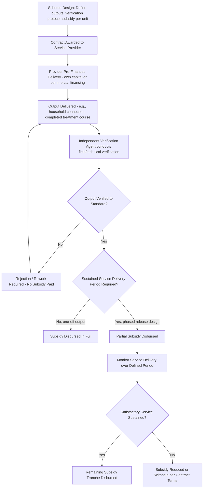

## Output-Based Aid and Subsidy Design

### Overview

Output-Based Aid (OBA) is a form of results-based financing (RBF) designed to extend access to infrastructure and social services — particularly for low-income or otherwise underserved populations — by linking the disbursement of public or donor subsidy funds to the achievement of specified, independently verified outputs, rather than to inputs, activities, or spending plans. Under OBA, service delivery is contracted out to a third-party provider, public or private, who is responsible for pre-financing the project and is only reimbursed with subsidy funds after the agreed services or outputs have been delivered and independently verified. OBA has been successfully applied across most infrastructure sectors (water, electricity connections, telecommunications, sanitation) as well as social sectors (health, education).

Within a broader PPP payment-mechanism framework, OBA subsidy design shares important conceptual DNA with availability payments and performance-based contracting generally: payment is contingent on verified delivery, not merely on effort or expenditure. However, OBA is distinguished by its explicit poverty-targeting and market-development objectives, and by its institutional home in donor-supported and multilateral development contexts (most prominently the World Bank Group's Global Partnership on Output-Based Aid, GPOBA, now operating under the broader Global Partnership for Results-Based Approaches, GPRBA).

### Core Design Principle: Minimum Necessary Subsidy

**Key Points**

- It is a basic principle of OBA design that the government (or subsidy-providing entity) should seek to pay the **minimum subsidy necessary** to call forth provision of the desired services — the subsidy should be calibrated to close the gap between what is commercially viable for a provider and what is needed to make the service affordable/accessible to the target population, no more.
- This principle has direct implications for competitive design: where an incumbent service provider already exists in a market, there is a real risk of infringing this minimum-subsidy principle, since regulatory overlap may mean the provider effectively gets paid twice for the same service (once through existing tariffs or cross-subsidies, and again through the new OBA subsidy), and limited competition may mean OBA payments end up higher than strictly necessary.
- The presence of an incumbent makes OBA scheme design more difficult but does not make it impossible — structured decision-making processes exist to work through how to introduce OBA competitively or fairly even in markets with an existing dominant provider.
- [Inference] The minimum-subsidy principle functions analogously to a value-for-money test in PPP procurement more broadly: it is the mechanism by which OBA design tries to avoid becoming an open-ended transfer to providers and instead remains a targeted, efficient bridge between commercial viability and social/development objectives.

### The Three Structural Pillars of OBA

**1. Contracting Out Service Delivery**

Service delivery is contracted to a third party — which can be a private firm, a public utility, an NGO, or another public-private partnership arrangement — who takes on responsibility for actually delivering the defined output (e.g., a household electricity connection, a functioning water tap, a completed course of vaccinations).

**2. Pre-Financing by the Service Provider**

The service provider is responsible for pre-financing the project — that is, the provider must fund the upfront capital or delivery cost itself (through its own working capital, commercial bank financing, or equity) before receiving any subsidy reimbursement. This pre-financing requirement is what transfers meaningful delivery risk to the provider: if outputs are not achieved or not verified, the provider does not recover its costs.

**3. Reimbursement Only After Independent Verification**

The provider is reimbursed with subsidy funds only after the services have been delivered and **independently verified** — this verification step is the linchpin of the entire OBA model, since without credible, arm's-length confirmation that outputs actually occurred to the required standard, the "results-based" nature of the financing would collapse into an ordinary reimbursement-on-claim arrangement.

### Institutional Framework: GPOBA / GPRBA

- The **Global Partnership on Output-Based Aid (GPOBA)** — now operating under the broader umbrella of the **Global Partnership for Results-Based Approaches (GPRBA)** — is a World Bank Group-housed partnership of donors and international organizations working together to support delivery of basic services in developing countries via OBA and related RBF mechanisms.
- GPOBA/GPRBA funding has historically been open to applications from international financial institutions, bilateral donors, NGOs, public and private infrastructure operators, and national and local governments.
- Activities are organized into complementary functions: **Technical Assistance** (supporting the design, implementation, and evaluation of individual OBA schemes) and **Dissemination** (facilitating identification and sharing of lessons learned across OBA schemes globally).
- GPOBA/GPRBA also maintains a project database ("OBA Data") enabling detailed analysis of project design features — including risk transfer characteristics and performance outcomes such as number of beneficiaries reached — across the accumulated portfolio of Bank-supported OBA projects.

### Independent Verification: Mechanics and Governance

Independent verification is the design element that makes OBA fundamentally different from ordinary grant-funded subsidy programs, and it deserves close technical attention.

**Key Points**

- Verification protocols are the specific procedures used to certify that contracted outputs have actually been achieved to the agreed standard — these protocols are typically defined in detail at the design stage of the OBA scheme, before any service delivery begins.
- The role is typically performed by an **Independent Verification Agent (IVA)**, which can be an audit firm, an NGO or civil-society representative, a qualified individual consultant, or a government agency, with the appropriate choice depending on the specific project and country context.
- IVA teams most often combine technical sector expertise (e.g., engineering, for infrastructure connection verification) with financial audit expertise, since verification typically needs to confirm both the physical/technical reality of the output and the financial claim being made against it.
- The independent verification process, when properly integrated into the project cycle, helps combine monitoring and quality control functions into a single mechanism that also triggers subsidy disbursement — making verification simultaneously a quality-assurance tool and a payment-triggering event.
- **Phased subsidy release tied to sustained service delivery**: in many schemes, rather than releasing the full subsidy on a single verification event, the subsidy is phased in after verification of a certain number of months of *satisfactory* service delivery — this design guards against a provider connecting a household or completing a nominal output once, then abandoning ongoing service quality, since sustained performance over a defined period is required before full payment is triggered.
- **Technology-enabled verification**: modern verification approaches increasingly use real-time data-collection technology, allowing program managers to access information and visualize where verification is taking place, and to catch data-quality or process errors quickly before they become systematic across a large program.
- Finding qualified verification teams has generally not been a major operational challenge across the GPOBA portfolio, though in a small number of projects a shortage of qualified verification agents did contribute to implementation delays.

### The Typical OBA Verification and Payment Cycle

### Subsidy Design Considerations

**Targeting and Eligibility**

- OBA subsidies are typically targeted at defined beneficiary populations (e.g., low-income households, specific geographic areas lacking existing service), requiring an eligibility verification component alongside the output-verification component.
- Subsidy design must decide whether the subsidy **complements** the required user contribution (partial subsidy, with users still paying a reduced fee) or **replaces** it entirely (full subsidy, free service to the end beneficiary) — this choice affects both the total subsidy budget required and the incentive structure for sustainable long-term service uptake (fully free services can sometimes reduce beneficiaries' sense of ownership or willingness to pay for maintenance, a consideration OBA designers weigh against affordability objectives).

**Access to Finance Considerations**

- Because service providers must pre-finance delivery before receiving subsidy reimbursement, access to working capital or commercial financing is a critical, sometimes binding constraint — particularly for smaller service providers who may lack the balance-sheet capacity to fund delivery pending verification and disbursement.
- Larger private or public-private partnership arrangements extending from an existing network have tended to fund their OBA operations from their own working capital or arranged bank financing; how this scales for smaller providers, or for OBA programs implemented at much larger scale, has been an area of ongoing attention within GPOBA's own Access to Finance analysis.
- Some scheme designs partially mitigate this constraint by advancing or phasing in a portion of the subsidy prior to full output completion — though this necessarily dilutes the pure "pay only after verified output" principle and must be balanced against the resulting increase in program risk (subsidy paid before the output is fully confirmed).

**Institutional Capacity and Financial Mechanics Assessment**

GPOBA-associated diagnostic tools for assessing OBA suitability in a given sector/context typically examine two key areas:

1. **Institutional Capacity and Arrangements** — the institutional set-up and how relevant institutions (regulators, verification agents, contracting authorities) can support the OBA scheme's design and operation.
2. **Financial Mechanics** — the underlying sector's ability to financially support the scheme, including whether tariff structures, cross-subsidy arrangements, and public funding commitments are sufficient and sustainable to meet the financing requirements of the OBA design over time.

### Worked Illustrative Example

**Example**

Consider an OBA scheme designed to expand household electricity connections in an underserved rural region, modeled on real-world GPOBA-supported programs (e.g., grid-connection subsidy programs in East Africa):

- **Objective**: Connect 250,000 rural households to the national electricity grid.
- **Contracted provider**: The national electric power utility (or a licensed private distribution operator).
- **Subsidy structure**: A per-connection subsidy (e.g., a fixed amount per household connected) that bridges the gap between the utility's actual connection cost (which may be commercially unviable to recover from low-income rural customers through tariffs alone) and what the utility can sustainably charge.
- **Pre-financing**: The utility funds the upfront capital cost of extending distribution lines, transformers, and household connections using its own capital or commercial financing, without waiting for subsidy reimbursement.
- **Verification**: An Independent Verification Agent conducts field visits to confirm that each claimed household connection physically exists, is energized, and meets defined technical standards (e.g., proper metering, safety compliance).
- **Payment trigger**: Subsidy is disbursed to the utility per verified connection, and — in some program designs — an additional tranche may be tied to demonstrating the connection remains active and the household is being billed and served after a defined number of months, guarding against connections being reported but not genuinely sustained.
- **Complementary objective bundling**: some such programs bundle the connection subsidy with a complementary output (e.g., distribution of energy-efficient compact fluorescent lamps, CFLs, to connected households), simultaneously supporting the primary access objective and a secondary energy-conservation objective, with the combined package verified as a single bundled output.

### Comparison: OBA vs. Traditional Input-Based Subsidy vs. Availability Payment

| Dimension | Traditional Input-Based Subsidy | Output-Based Aid (OBA) | Availability Payment (PPP) |
| --- | --- | --- | --- |
| Payment trigger | Expenditure/activity performed (e.g., materials purchased, staff hired) | Verified delivery of a specific, pre-defined output | Asset available and performing to standard |
| Who bears delivery/completion risk | Government/donor (funds released regardless of ultimate outcome) | Service provider (pre-finances; reimbursed only on verified output) | Private operator (no revenue until service commencement) |
| Verification intensity | Typically limited to expenditure/financial audit | Substantial — independent, often technical, field verification | Substantial — ongoing performance monitoring against KPIs |
| Typical use context | General public service delivery, budget support | Targeted access expansion for underserved populations, often donor-funded | Long-term infrastructure concessions, typically government/national budget-funded |
| Time horizon | Often annual/short-cycle | Project-based, often one-off connection/output achievement, sometimes with sustained-service tranches | Long-term, often 20–30+ years |
| Primary objective | Service continuity/input funding | Poverty-targeted access expansion, market development, aid effectiveness | Infrastructure delivery and lifecycle asset management |

### OBA Program Design Flow (SVG Diagram)

<svg xmlns="http://www.w3.org/2000/svg" viewBox="0 0 760 360" font-family="Arial, sans-serif">
<text x="380" y="26" text-anchor="middle" font-size="17" font-weight="bold" fill="#1a1a2e">OBA Subsidy Design Architecture (svg_diagram)</text>
<rect x="40" y="55" width="200" height="55" fill="#2c3e50" />
<text x="140" y="78" text-anchor="middle" font-size="12" fill="#ffffff" font-weight="bold">1. Define Output</text>
<text x="140" y="96" text-anchor="middle" font-size="11" fill="#ffffff">(e.g., verified connection)</text>
<rect x="280" y="55" width="200" height="55" fill="#2c3e50" />
<text x="380" y="78" text-anchor="middle" font-size="12" fill="#ffffff" font-weight="bold">2. Set Minimum Subsidy</text>
<text x="380" y="96" text-anchor="middle" font-size="11" fill="#ffffff">(gap-filling, not full-cost)</text>
<rect x="520" y="55" width="200" height="55" fill="#2c3e50" />
<text x="620" y="78" text-anchor="middle" font-size="12" fill="#ffffff" font-weight="bold">3. Contract Provider</text>
<text x="620" y="96" text-anchor="middle" font-size="11" fill="#ffffff">(public or private)</text>
<line x1="240" y1="82" x2="280" y2="82" stroke="#888" stroke-width="1.5" marker-end="url(#arrow2)" />
<line x1="480" y1="82" x2="520" y2="82" stroke="#888" stroke-width="1.5" marker-end="url(#arrow2)" />
<rect x="40" y="140" width="200" height="55" fill="#f8d7da" stroke="#e6a5ab" />
<text x="140" y="163" text-anchor="middle" font-size="12" fill="#1a1a2e" font-weight="bold">4. Provider Pre-Finances</text>
<text x="140" y="181" text-anchor="middle" font-size="11" fill="#1a1a2e">(bears delivery risk)</text>
<rect x="280" y="140" width="200" height="55" fill="#d4edda" stroke="#a3d9b1" />
<text x="380" y="163" text-anchor="middle" font-size="12" fill="#1a1a2e" font-weight="bold">5. Independent Verification</text>
<text x="380" y="181" text-anchor="middle" font-size="11" fill="#1a1a2e">(IVA field/technical audit)</text>
<rect x="520" y="140" width="200" height="55" fill="#eef2f7" stroke="#c0c8d4" />
<text x="620" y="163" text-anchor="middle" font-size="12" fill="#1a1a2e" font-weight="bold">6. Subsidy Disbursed</text>
<text x="620" y="181" text-anchor="middle" font-size="11" fill="#1a1a2e">(on verified output)</text>
<line x1="140" y1="110" x2="140" y2="140" stroke="#888" stroke-width="1.5" marker-end="url(#arrow2)" />
<line x1="240" y1="167" x2="280" y2="167" stroke="#888" stroke-width="1.5" marker-end="url(#arrow2)" />
<line x1="480" y1="167" x2="520" y2="167" stroke="#888" stroke-width="1.5" marker-end="url(#arrow2)" />
<rect x="60" y="225" width="640" height="60" fill="#fff3cd" stroke="#f0d68a" />
<text x="380" y="250" text-anchor="middle" font-size="12" font-weight="bold" fill="#5a4a1a">Optional Phased Release: partial subsidy after initial verification,</text>
<text x="380" y="268" text-anchor="middle" font-size="12" font-weight="bold" fill="#5a4a1a">remainder after N months of sustained satisfactory service delivery</text>
<rect x="60" y="300" width="640" height="50" fill="#eef2f7" stroke="#c0c8d4" />
<text x="380" y="330" text-anchor="middle" font-size="12" fill="#1a1a2e">Feeds GPOBA/GPRBA project database for cross-project learning and evaluation</text>
</svg>

### Common Pitfalls and Design Risks

**Key Points**

- **Failing to control incumbent-provider dynamics**: introducing OBA subsidies into a market with an existing dominant provider without addressing regulatory overlap can result in the provider being effectively paid twice for the same service, directly violating the minimum-subsidy design principle.
- **Under-resourcing the verification function**: since independent verification is the entire credibility mechanism of OBA, insufficient verification-agent capacity, unclear verification protocols, or conflicts of interest in agent selection can undermine the results-based integrity of the whole scheme.
- **Access-to-finance bottlenecks for smaller providers**: pre-financing requirements can inadvertently exclude smaller, potentially more locally embedded service providers who lack working-capital access, biasing program design toward larger incumbents or utilities even where smaller providers might otherwise be well-suited to deliver the target output.
- **One-off verification without sustainability checks**: verifying only the initial output (e.g., a connection made) without any mechanism to confirm sustained service delivery risks paying for outputs that do not translate into lasting access or benefit.
- **Subsidy calibration errors**: setting the subsidy too low fails to call forth adequate provider participation or quality; setting it too high wastes scarce public/donor resources that could have supported more beneficiaries or other development priorities — reinforcing why the minimum-necessary-subsidy principle is treated as foundational rather than aspirational.
- **Data-quality risk in field verification**: without technology-enabled, auditable verification processes, there is elevated risk of systematic errors or fraud in output claims going undetected until a program has scaled significantly.

[Inference] Given that OBA schemes are generally smaller in scale and shorter in delivery cycle than large infrastructure PPPs, but share the underlying "no payment without independently verified performance" logic, the lessons on verification-protocol design and phased-payment structuring from the OBA/RBF literature are plausibly transferable to designing performance/output components within larger availability-payment PPP contracts, even though the institutional contexts (donor-supported development programs vs. long-term national-budget-funded infrastructure concessions) differ substantially.

### Related Topics

- Results-Based Financing (RBF) approaches more broadly, beyond OBA
- Availability payment structures and performance-deduction mechanisms (comparative payment design logic)
- Independent Verification Agent (IVA) selection and verification-protocol design
- GPOBA/GPRBA project case studies by sector (water, energy, health, education)
- Access to finance constraints for service providers in results-based financing
- Minimum-subsidy principle and value-for-money assessment in subsidy design
- Incumbent-provider competition issues in subsidy scheme design
- Poverty targeting and eligibility verification methodologies
- Technology-enabled (real-time/geo-tagged) verification systems in development programs
- Blended finance and donor co-financing structures in infrastructure access programs