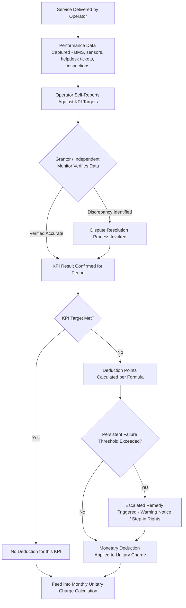

## Key Performance Indicators and Service-Level Agreements

### Overview

Key Performance Indicators (KPIs) and Service-Level Agreements (SLAs) are the technical instruments through which a PPP contract translates an operator's abstract obligation to "deliver a public service to an acceptable standard" into specific, measurable, monitorable, and payment-relevant criteria. Whereas the payment mechanism (e.g., availability payment, unitary charge) determines *how much* an operator is paid, the KPI/SLA framework determines *whether* the operator has actually earned that payment in a given period. Together, KPIs and SLAs form the operational backbone of performance-based contracting: without a well-designed measurement and monitoring architecture, even the most sophisticated payment-deduction formula becomes unenforceable or arbitrary in practice.

### Defining the Terms

**Key Performance Indicator (KPI)**

A KPI is a specific, quantifiable metric used to measure the performance of a discrete aspect of service delivery against a defined target or threshold — for example, "percentage of maintenance requests resolved within 24 hours," "average response time to a security incident," or "percentage of scheduled cleaning cycles completed to specification." KPIs are the individual measurement units within the broader performance regime.

**Service-Level Agreement (SLA)**

An SLA is the broader contractual framework (or a defined schedule within the PPP contract) that specifies the required service standards, the KPIs used to measure them, the target/threshold performance levels, the monitoring and reporting methodology, and the consequences (payment deductions, remedies, escalation) of failing to meet those standards. The SLA is where individual KPIs are assembled into a coherent, contractually binding performance regime.

$$\text{SLA} = \{\text{KPI}_1, \text{KPI}_2, \ldots, \text{KPI}_n\} + \text{Targets} + \text{Monitoring Method} + \text{Consequence Regime}$$

### Categories of KPIs in PPP Contracts

**Key Points**

- **Availability KPIs**: measure whether the physical asset or a defined functional area of it is available for its intended use (e.g., percentage of classrooms available, percentage of prison cells operational, percentage of hospital beds accessible).
- **Performance/Quality KPIs**: measure the quality of service delivered even when the asset is technically available (e.g., indoor temperature within a specified range, water quality parameters, cleanliness scores against a defined inspection methodology).
- **Response-Time KPIs**: measure how quickly the operator responds to and resolves defined categories of fault or incident (e.g., "Category 1 urgent fault repaired within 4 hours," "Category 3 routine fault repaired within 5 working days").
- **Compliance/Safety KPIs**: measure adherence to statutory, regulatory, or contractually specified safety and compliance standards (e.g., fire safety inspection pass rates, health and safety incident rates).
- **Soft Facilities Management KPIs** (where bundled into the contract): measure service quality for functions such as catering, security, grounds maintenance, portering, or reception services.
- **User Satisfaction / Experience KPIs**: some contracts incorporate periodic user or occupant satisfaction survey results as a supplementary (often lower-weighted, sometimes non-payment-linked) indicator of service quality.

### KPI Design Criteria: The SMART Framework Applied to PPPs

Well-designed PPP KPIs are generally evaluated against a structured set of design criteria, commonly summarized (as in general performance-management practice) using a SMART-style framework, adapted here to the PPP contracting context:

| Criterion | PPP-Specific Application |
| --- | --- |
| **Specific** | The KPI must precisely define what is being measured (e.g., "operating theatre availability" rather than "hospital availability" generally), avoiding ambiguity that could later generate disputes over scope. |
| **Measurable** | The KPI must be quantifiable using a defined, ideally objective methodology (sensor data, inspection checklist scores, ticketing-system timestamps) rather than subjective grantor judgment alone. |
| **Achievable** | Targets must be realistically achievable given the asset's design and specification — targets set unrealistically high can undermine financeability and invite disputes; targets set too low fail to drive genuine performance. |
| **Relevant** | The KPI must genuinely reflect an aspect of service delivery that matters to service users and to the underlying public policy objective of the contract, avoiding "KPI proliferation" around administratively convenient but substantively minor metrics. |
| **Time-bound** | The KPI must specify a clear measurement period (daily, monthly) and response/resolution timeframes for fault-based KPIs. |

### Monitoring and Verification Architecture

**Key Points**

- **Self-monitoring by the operator, with grantor audit rights**: many PPP contracts require the operator to self-report performance data against KPIs (since the operator typically controls the building management systems, helpdesk/ticketing systems, and maintenance records that generate the underlying data), while granting the grantor (or an independent monitor) audit and inspection rights to verify the accuracy of self-reported data.
- **Independent monitoring/certifier roles**: some contracts, particularly for large or complex assets, engage an independent technical adviser or certifier to conduct periodic inspections, verify self-reported KPI data, and adjudicate disputed performance claims.
- **Automated/sensor-based monitoring**: increasingly, building management systems (BMS), Internet-of-Things (IoT) sensors, and helpdesk ticketing platforms provide real-time or near-real-time data feeds for availability and response-time KPIs, reducing reliance on manual reporting and narrowing the scope for dispute over factual performance data.
- **Reporting cycle and payment cycle alignment**: the KPI monitoring/reporting cycle must be aligned with the payment cycle (typically monthly) so that verified performance data flows directly into the unitary charge calculation for that period without excessive lag.
- **Dispute resolution mechanisms**: SLAs typically include a defined escalation and dispute-resolution process (initial informal resolution, escalation to a designated senior representative, and ultimately expert determination or arbitration) for disagreements over whether a KPI failure occurred or was correctly measured.

### The KPI-to-Payment Linkage

The technical mechanism connecting KPI performance to the payment mechanism (discussed in detail under availability payment structures) typically works as follows:

1. Each KPI is assigned a **weighting** reflecting its relative importance to overall service delivery.
2. Failure to meet a KPI's target generates a **performance point** or **deduction unit**, often scaled by the severity and duration of the failure.
3. Accumulated deduction units in a monitoring period are converted into a **monetary deduction** from the unitary charge, using a pre-agreed conversion formula specified in the payment mechanism schedule.
4. **Persistent or repeated failure** of the same KPI beyond a defined threshold (e.g., three failures of the same KPI within a rolling six-month period) triggers escalated contractual remedies beyond the routine financial deduction — potentially including formal warning notices, step-in rights, or, in extreme and sustained cases, grounds for termination for default.

### Worked Illustrative Example

**Example**

A hospital PPP contract includes the following simplified SLA schedule for a single monitoring month:

| KPI | Weighting | Target | Actual Performance | Result |
| --- | --- | --- | --- | --- |
| Operating theatre availability | 30% | 99.5% | 98.2% | Below target — deduction triggered |
| Category 1 (urgent) fault response | 25% | 100% within 4 hrs | 100% | Target met |
| Ward cleanliness inspection score | 20% | ≥ 95/100 | 91/100 | Below target — deduction triggered |
| Category 3 (routine) fault resolution | 15% | 95% within 5 days | 96% | Target met |
| Catering service quality audit | 10% | ≥ 90/100 | 93/100 | Target met |

**Deduction calculation** (illustrative simplified formula):

$$\text{Total Deduction} = \sum_{k} \left( \text{Weight}_k \times \text{Shortfall}_k \times \text{Base Charge} \times \text{Deduction Multiplier} \right)$$

For the operating theatre availability failure: a 1.3 percentage-point shortfall (99.5% − 98.2%) against a 30% weighting, applied to a hypothetical monthly base charge of $1,500,000 with a deduction multiplier of 5 (reflecting high criticality), might produce:

$$\text{Deduction}_{\text{theatre}} = 0.30 \times 0.013 \times \$1{,}500{,}000 \times 5 = \$29{,}250$$

A similar calculation would apply to the cleanliness shortfall, with the two deductions summed to determine the total monthly reduction to the unitary charge. If the operating theatre availability KPI has now failed in three consecutive months, this would likely cross a persistent-failure threshold, triggering a formal warning notice under the contract's escalation ladder in addition to the recurring financial deduction.

### Common SLA Structuring Approaches

| Approach | Description | Typical Use Case |
| --- | --- | --- |
| **Fixed-weight scorecard** | Each KPI has a pre-set percentage weighting summing to 100%; deductions calculated per-KPI and aggregated | Most common approach for social infrastructure (hospitals, schools, prisons) |
| **Points-based accumulation** | Failures generate points rather than direct monetary values; points convert to deductions via a lookup table or banded formula | Contracts wanting to smooth minor fluctuations while still capturing cumulative underperformance |
| **Tiered severity bands** | KPI failures are categorized into severity tiers (minor/major/critical), each with different deduction multipliers | Useful where the consequence of a failure varies enormously by context (e.g., a failed fire door vs. a scuffed wall) |
| **Persistent breach escalation ladder** | Independent of the per-period deduction, tracks repeated failures of the same KPI over a rolling window and triggers non-financial remedies | Nearly universal as a supplementary mechanism alongside any of the above |

### KPI/SLA Governance Structure (SVG Diagram)

<svg xmlns="http://www.w3.org/2000/svg" viewBox="0 0 760 380" font-family="Arial, sans-serif">
<text x="380" y="26" text-anchor="middle" font-size="17" font-weight="bold" fill="#1a1a2e">KPI and SLA Governance Architecture (svg_diagram)</text>
<rect x="280" y="50" width="200" height="45" fill="#1a1a2e" />
<text x="380" y="78" text-anchor="middle" font-size="13" fill="#ffffff" font-weight="bold">Service-Level Agreement</text>
<line x1="380" y1="95" x2="150" y2="135" stroke="#888" stroke-width="1.5" />
<line x1="380" y1="95" x2="380" y2="135" stroke="#888" stroke-width="1.5" />
<line x1="380" y1="95" x2="610" y2="135" stroke="#888" stroke-width="1.5" />
<rect x="60" y="135" width="180" height="55" fill="#eef2f7" stroke="#c0c8d4" />
<text x="150" y="158" text-anchor="middle" font-size="11" font-weight="bold" fill="#1a1a2e">Availability KPIs</text>
<text x="150" y="175" text-anchor="middle" font-size="10" fill="#1a1a2e">e.g., % zones operational</text>
<rect x="290" y="135" width="180" height="55" fill="#eef2f7" stroke="#c0c8d4" />
<text x="380" y="158" text-anchor="middle" font-size="11" font-weight="bold" fill="#1a1a2e">Performance/Quality KPIs</text>
<text x="380" y="175" text-anchor="middle" font-size="10" fill="#1a1a2e">e.g., temperature, cleanliness</text>
<rect x="520" y="135" width="180" height="55" fill="#eef2f7" stroke="#c0c8d4" />
<text x="610" y="158" text-anchor="middle" font-size="11" font-weight="bold" fill="#1a1a2e">Response-Time KPIs</text>
<text x="610" y="175" text-anchor="middle" font-size="10" fill="#1a1a2e">e.g., fault resolution SLAs</text>
<line x1="150" y1="190" x2="380" y2="230" stroke="#888" stroke-width="1.5" />
<line x1="380" y1="190" x2="380" y2="230" stroke="#888" stroke-width="1.5" />
<line x1="610" y1="190" x2="380" y2="230" stroke="#888" stroke-width="1.5" />
<rect x="230" y="230" width="300" height="50" fill="#fff3cd" stroke="#f0d68a" />
<text x="380" y="260" text-anchor="middle" font-size="12" font-weight="bold" fill="#5a4a1a">Weighted Aggregation + Verification</text>
<line x1="380" y1="280" x2="220" y2="315" stroke="#888" stroke-width="1.5" />
<line x1="380" y1="280" x2="540" y2="315" stroke="#888" stroke-width="1.5" />
<rect x="80" y="315" width="280" height="50" fill="#d4edda" stroke="#a3d9b1" />
<text x="220" y="345" text-anchor="middle" font-size="11" fill="#1a1a2e">Financial Deduction to Unitary Charge</text>
<rect x="400" y="315" width="280" height="50" fill="#f8d7da" stroke="#e6a5ab" />
<text x="540" y="345" text-anchor="middle" font-size="11" fill="#1a1a2e">Persistent Breach Escalation Ladder</text>
</svg>

### Comparison: KPI/SLA Design Across Sectors

| Sector | Dominant KPI Types | Notable Design Consideration |
| --- | --- | --- |
| Hospitals | Clinical-area availability, infection-control/cleanliness, critical response times | High-criticality weighting on clinical/life-safety KPIs; strong regulatory overlay from health authorities |
| Schools | Classroom availability, thermal comfort, fire/safety compliance | Simpler KPI sets than hospitals; often lower financial materiality per KPI given lower life-safety stakes |
| Prisons/Correctional | Cell/wing availability, security-system uptime, incident response times | Security-critical KPIs often carry non-financial consequences (regulatory reporting, oversight body involvement) beyond payment deductions |
| Toll roads (availability-based) | Lane availability, pavement condition indices, incident-clearance times | KPIs often tied to safety and traffic-flow standards rather than building-services metrics |
| Water/wastewater utilities | Water quality parameters, service continuity (hours of supply), leakage rates | Strong linkage to public health regulatory standards; KPIs often mirror utility regulator reporting requirements |

### Common Pitfalls in KPI and SLA Design

**Key Points**

- **KPI proliferation**: including too many KPIs, especially low-materiality ones, increases monitoring burden and transaction costs on both sides without proportionate benefit to service quality or genuine risk transfer.
- **Poorly defined measurement methodology**: a KPI that sounds precise in contract text ("cleanliness must be maintained to a high standard") but lacks an objective, agreed measurement protocol becomes a perennial source of dispute.
- **Weighting misalignment with actual criticality**: assigning similar weights to a life-safety KPI and a cosmetic/administrative KPI understates the real risk profile of the asset and can produce perverse operator prioritization.
- **Data ownership and access asymmetry**: where the operator controls all underlying monitoring systems and data, grantors without adequate audit rights or independent verification capacity can find themselves structurally dependent on operator-reported data they cannot meaningfully challenge.
- **Static KPI sets over multi-decade contracts**: technology, service expectations, and asset use can change substantially over a 25–30 year contract term; SLAs without a structured mechanism for periodic KPI review and update risk becoming misaligned with genuine service needs well before contract expiry.
- **Gaming near threshold boundaries**: operators facing a persistent-breach threshold may be incentivized to marginally avoid crossing it (e.g., rectifying just before a reporting cutoff) rather than genuinely resolving underlying service issues — well-designed SLAs anticipate and mitigate this by using rolling-window calculations and trend-based escalation triggers rather than simple period-boundary counts.

[Inference] Because independent, sensor-based, or automated monitoring reduces both dispute risk and administrative burden relative to manual self-reporting, the long-run trend in PPP contract drafting is plausibly toward greater integration of building-management-system and IoT data feeds directly into KPI calculation — though the specific pace and extent of this shift will vary by sector, asset age, and jurisdictional contracting practice, and was not independently verified against current market-wide contracting data for this response.

### Related Topics

- Availability payment structures and the unitary charge deduction mechanism (direct payment linkage)
- Independent certifier and technical adviser roles in PPP contract monitoring
- Persistent breach, step-in rights, and termination for default provisions
- Building Management Systems (BMS) and IoT-enabled facilities monitoring
- Dispute resolution and expert determination clauses in PPP contracts
- Output-Based Aid verification methodology (comparative results-based payment design)
- Contract variation mechanisms for updating KPI/SLA schedules over long contract terms
- Soft vs. hard facilities management bundling in PPP service specifications
- Benchmarking and market-testing clauses for FM service costs
- Handback standards and condition surveys at contract expiry