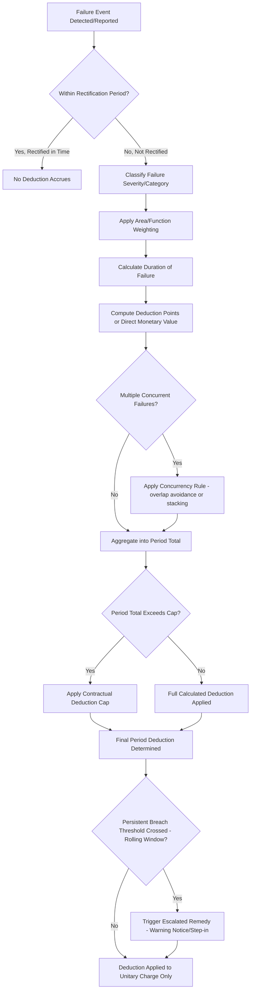

## Payment Deduction and Abatement Regimes

### Overview

A payment deduction and abatement regime is the detailed contractual and mathematical mechanism by which a PPP contract converts measured service failures — whether unavailability, performance shortfalls, or KPI breaches — into a quantified reduction of the periodic payment owed to the private operator. Where the payment mechanism (availability payment) establishes the base charge, and KPIs/SLAs establish what is being measured, the deduction and abatement regime is the calculation engine that connects the two: it is the formula set, banding structure, and escalation logic that determines exactly how many dollars, pounds, or euros are withheld from the operator for a given period's underperformance. This regime is the single most scrutinized technical schedule in a PPP contract from both a commercial-bankability and a statistical-classification (ESA2010/MGDD) perspective, because its design determines whether risk transfer is real or merely nominal.

### Core Terminology

**Key Points**

- **Deduction**: a reduction applied to the unitary charge or availability payment for a specific measured failure in a given monitoring period (typically monthly).
- **Abatement**: often used interchangeably with "deduction" in PPP contract drafting, though in some jurisdictions "abatement" refers more specifically to a proportionate reduction applied for partial unavailability of a defined area or function (as distinct from a fixed-penalty-style deduction for a discrete performance failure).
- **Performance Point / Deduction Unit**: an intermediate, non-monetary unit used to quantify the severity of a failure before conversion into a monetary deduction — used in points-based abatement regimes to allow more granular scoring before applying a final conversion formula.
- **Persistent Breach**: a defined threshold of repeated failure (of the same KPI, or of aggregate deduction levels) within a rolling period, which triggers remedies beyond the routine financial deduction.
- **Rectification Period**: a defined window (often measured in hours or days depending on failure severity) during which the operator may cure a fault before deductions begin to accrue, or before which accrued deductions may be reversed.

### The Deduction Calculation Chain

A typical abatement regime processes a service failure through a defined calculation sequence:

### Deduction Formula Architectures

Different PPP programs and sectors have converged on several recurring formula architectures. Understanding their trade-offs is central to structuring an effective regime.

**1. Proportionate Area/Time Abatement**

The most common approach for availability failures: the deduction is proportional to the affected area's weighting and the duration of unavailability relative to the total period.

$$\text{Deduction} = \text{Base Charge} \times \frac{\sum_{i} (w_i \times t_i)}{W_{\text{total}} \times T_{\text{period}}}$$

Where $w_i$ is the weighting of affected zone $i$, $t_i$ is the duration of unavailability for zone $i$, $W_{\text{total}}$ is the sum of all zone weightings, and $T_{\text{period}}$ is the total time in the monitoring period.

**2. Points-Based Accumulation**

Failures generate deduction points according to a lookup table (varying by severity category and duration), which are summed across the period and then converted to a monetary value via a fixed points-to-currency conversion rate, often with banded thresholds that increase the marginal rate as accumulated points rise.

$$\text{Deduction} = \sum_{k} \text{Points}_k \times \text{Conversion Rate} \quad \text{(rate may increase across bands)}$$

**3. Fixed-Penalty Schedule**

Certain discrete, binary failures (e.g., missing a statutory inspection deadline, failing a specific compliance test) attract a fixed pre-agreed deduction amount regardless of duration — used where the failure itself, not its persistence, is the primary concern (e.g., safety-critical compliance failures).

**4. Hybrid Regimes**

Most mature PPP contracts combine proportionate area/time abatement for availability failures with a points-based or fixed-penalty overlay for discrete performance/compliance KPI failures, reflecting the different nature of the underlying risks being measured.

### Deduction Caps and Floors

**Key Points**

- **Deduction caps**: many contracts cap the maximum deduction achievable in a single monitoring period (e.g., no more than 30–50% of the base unitary charge in any one month), primarily to preserve project financeability — senior lenders typically require assurance that even in a bad-performance month, the operator retains sufficient revenue to service debt and avoid default under the financing agreements.
- **Statistical scrutiny of caps**: this is a direct point of tension with statistical classification frameworks (notably Eurostat's ESA2010/MGDD three-risk test), which specifically examines whether deduction caps are set so low, or activated so easily, that the availability-risk transfer becomes immaterial in substance — a cap that is realistically never approached in practice does not evidence genuine risk transfer, whereas a cap that only binds in truly extreme failure scenarios is more consistent with real risk-bearing by the operator.
- **Minimum payment floors**: some contracts, particularly where senior lenders require a minimum debt-service-covering payment regardless of performance, build in an implicit or explicit floor beneath which the unitary charge cannot fall — the same statistical tension applies here as with caps.
- **Cumulative annual caps**: distinct from a per-period cap, some contracts also cap the total deductions achievable across a full contract year, adding a further layer of protection for the operator's overall annual cash flow.
- [Inference] The tension between financeability (which pushes toward caps and floors that limit downside volatility for lenders and equity) and statistical/genuine-risk-transfer credibility (which pushes toward caps set high enough, or floors set low enough, to preserve material risk) is a recurring structuring negotiation in nearly every availability-based PPP, and the specific cap/floor levels ultimately agreed are usually the product of financial-model stress testing balanced against anticipated statistical/audit scrutiny.

### Persistent Breach and Escalation Mechanisms

Beyond the routine financial deduction, most abatement regimes incorporate a separate escalation track that operates on **frequency and pattern** of failure rather than the monetary magnitude of any single period's deduction:

| Escalation Stage | Typical Trigger | Consequence |
| --- | --- | --- |
| Warning Notice | Same KPI fails N times within a rolling 6–12 month window | Formal written notice; operator required to submit remediation plan |
| Enhanced Monitoring | Warning notice ineffective; failures continue | Increased inspection frequency, additional reporting obligations, possible independent technical review |
| Step-in Rights (Lender or Grantor) | Persistent breach continues to threaten service delivery or debt serviceability | Grantor (or, more commonly, senior lenders under a direct agreement) may temporarily assume management/operational control |
| Termination for Default | Persistent breach continues beyond final cure period, or reaches a contractually defined severity/frequency threshold | Contract terminated; termination compensation regime applies (often reduced compensation compared to no-fault termination) |

### Concurrency and Double-Counting Rules

A frequently overlooked but operationally critical element of abatement regime design is how the formula treats **overlapping or concurrent failures**:

- **Overlap avoidance rules**: prevent an operator from being deducted twice for what is substantively a single underlying failure that happens to trip multiple KPI definitions simultaneously (e.g., a power outage causing both an "availability" failure and a "temperature control" failure in the same zone at the same time).
- **Stacking rules**: conversely, some contracts deliberately allow deductions to stack where multiple genuinely independent failures occur concurrently, on the basis that simultaneous independent failures represent a materially worse service outcome than either failure alone and should be reflected as such.
- [Inference] Ambiguity in concurrency treatment is a common source of payment disputes in operational PPPs, since the classification of whether two measured failures share a single root cause (favoring overlap avoidance) or are genuinely independent (favoring stacking) is often a judgment call that the contract's dispute resolution mechanism must ultimately resolve.

### Worked Illustrative Example: Full Abatement Calculation

**Example**

Consider a prison PPP with a monthly base unitary charge of $3,000,000, structured with a proportionate area/time abatement for availability and a points-based overlay for discrete compliance KPIs. In a given month:

**Availability failure**: Wing C (weighting 15 out of 100 total facility weight points) is unavailable for 72 hours out of a 720-hour month.

$$\text{Deduction}_{\text{availability}} = \$3{,}000{,}000 \times \frac{15 \times 72}{100 \times 720} = \$3{,}000{,}000 \times 0.15 = \$450{,}000$$

**Compliance KPI failure**: A statutory fire-safety inspection deadline was missed, attracting a fixed-penalty deduction of $50,000 per the contract's fixed-penalty schedule.

**Total calculated deduction before cap**: $450,000 + $50,000 = $500,000, representing approximately 16.7% of the base charge.

**Applying the contractual cap**: if the contract specifies a maximum monthly deduction cap of 25% of base charge ($750,000), the calculated deduction of $500,000 falls within the cap and is applied in full — the cap does not bind in this scenario, which (from a statistical risk-transfer perspective) is actually the more reassuring outcome, since it demonstrates the deduction mechanism operating on its uncapped terms rather than being artificially limited.

**Persistent breach check**: if Wing C has now failed its availability KPI in three of the last six months, this likely crosses a persistent-breach threshold, triggering a formal warning notice in addition to the $500,000 monthly deduction.

### Comparative Summary: Deduction Regime Design Choices

| Design Choice | Favors Financeability | Favors Genuine Risk Transfer / Statistical Credibility |
| --- | --- | --- |
| Low deduction cap (e.g., 15% of base charge) | Yes — protects debt service | No — may be viewed as immaterial by statisticians |
| High or no deduction cap | No — increases revenue volatility for lenders | Yes — demonstrates genuine downside exposure |
| Generous rectification periods | Yes — reduces operator's realized deductions | Potentially — depends on whether periods are proportionate to actual risk |
| Minimum payment floor | Yes — guarantees baseline debt service | No — undermines availability risk transfer if floor is high relative to base charge |
| Points-based banding with escalating marginal rates | Neutral to moderate | Yes — captures worsening severity better than flat-rate deductions |
| Fixed-penalty schedule for compliance failures | Yes — predictable, capped exposure per event | Moderate — depends on penalty size relative to overall revenue |

### Abatement Regime Cash Flow Impact (SVG Diagram)

<svg xmlns="http://www.w3.org/2000/svg" viewBox="0 0 760 360" font-family="Arial, sans-serif">
<text x="380" y="26" text-anchor="middle" font-size="17" font-weight="bold" fill="#1a1a2e">Deduction Regime: From Failure to Cash Flow Impact (svg_diagram)</text>
<rect x="40" y="55" width="160" height="50" fill="#f8d7da" stroke="#e6a5ab" />
<text x="120" y="76" text-anchor="middle" font-size="11" font-weight="bold" fill="#1a1a2e">Failure Detected</text>
<text x="120" y="93" text-anchor="middle" font-size="10" fill="#1a1a2e">(availability/KPI)</text>
<line x1="200" y1="80" x2="240" y2="80" stroke="#888" stroke-width="1.5" marker-end="url(#a3)" />
<rect x="240" y="55" width="160" height="50" fill="#fff3cd" stroke="#f0d68a" />
<text x="320" y="76" text-anchor="middle" font-size="11" font-weight="bold" fill="#5a4a1a">Formula Applied</text>
<text x="320" y="93" text-anchor="middle" font-size="10" fill="#5a4a1a">(weight × duration)</text>
<line x1="400" y1="80" x2="440" y2="80" stroke="#888" stroke-width="1.5" marker-end="url(#a3)" />
<rect x="440" y="55" width="160" height="50" fill="#eef2f7" stroke="#c0c8d4" />
<text x="520" y="76" text-anchor="middle" font-size="11" font-weight="bold" fill="#1a1a2e">Cap Check</text>
<text x="520" y="93" text-anchor="middle" font-size="10" fill="#1a1a2e">(binds or not)</text>
<line x1="600" y1="80" x2="640" y2="80" stroke="#888" stroke-width="1.5" marker-end="url(#a3)" />
<rect x="640" y="55" width="80" height="50" fill="#d4edda" stroke="#a3d9b1" />
<text x="680" y="76" text-anchor="middle" font-size="10" font-weight="bold" fill="#1a1a2e">Final</text>
<text x="680" y="93" text-anchor="middle" font-size="10" font-weight="bold" fill="#1a1a2e">Deduction</text>
<line x1="680" y1="105" x2="680" y2="140" stroke="#888" stroke-width="1.5" marker-end="url(#a3)" />
<line x1="120" y1="105" x2="380" y2="140" stroke="#888" stroke-width="1.5" marker-end="url(#a3)" stroke-dasharray="4,4" />
<rect x="60" y="140" width="640" height="45" fill="#1a1a2e" />
<text x="380" y="167" text-anchor="middle" font-size="12" font-weight="bold" fill="#ffffff">Applied to Unitary Charge Waterfall (equity distribution absorbs first)</text>
<line x1="380" y1="185" x2="200" y2="220" stroke="#888" stroke-width="1.5" />
<line x1="380" y1="185" x2="560" y2="220" stroke="#888" stroke-width="1.5" />
<rect x="80" y="220" width="240" height="50" fill="#eef2f7" stroke="#c0c8d4" />
<text x="200" y="250" text-anchor="middle" font-size="11" fill="#1a1a2e">Single-period impact on revenue</text>
<rect x="440" y="220" width="240" height="50" fill="#eef2f7" stroke="#c0c8d4" />
<text x="560" y="250" text-anchor="middle" font-size="11" fill="#1a1a2e">Rolling-window persistent-breach tracking</text>
<rect x="60" y="290" width="640" height="55" fill="#fff3cd" stroke="#f0d68a" />
<text x="380" y="313" text-anchor="middle" font-size="12" font-weight="bold" fill="#5a4a1a">Cap/floor calibration is the central financeability-vs-risk-transfer</text>
<text x="380" y="331" text-anchor="middle" font-size="12" font-weight="bold" fill="#5a4a1a">negotiation in every availability-based PPP structuring process</text>
</svg>

### Interaction with Statistical Classification (ESA2010/MGDD)

**Key Points**

- The abatement regime is the single technical schedule most directly examined when assessing whether **availability risk** has been genuinely transferred under the ESA2010/MGDD three-risk test discussed in the statistical treatment of PPPs.
- Eurostat's assessment specifically weighs whether deductions are **material** — meaning realistically capable of significantly affecting the operator's revenue in plausible underperformance scenarios — rather than merely present in contract text.
- A deduction regime with an unrealistically generous rectification period, an unreasonably low deduction cap, or a conversion formula that produces negligible deductions even for serious failures is likely to be assessed as not providing genuine risk transfer, which can jeopardize intended off-balance-sheet treatment for the entire project.
- Conversely, an abatement regime that is calibrated to bite meaningfully in realistic underperformance scenarios — while still preserving basic financeability through appropriately (not excessively) generous caps — supports the case for genuine risk transfer.

### Common Pitfalls

**Key Points**

- **Formula complexity outpacing monitoring capability**: highly sophisticated multi-variable deduction formulas can become practically unenforceable if the grantor's monitoring team lacks the data systems or capacity to verify inputs reliably each period.
- **Caps calibrated purely for financeability, ignoring statistical scrutiny**: structuring caps solely to satisfy lender comfort without considering ESA2010/MGDD materiality tests risks an unpleasant surprise at the point of statistical classification review.
- **Ambiguous concurrency treatment**: failing to specify clear overlap-avoidance or stacking rules invites recurring monthly disputes over calculation of deductions for compound failures.
- **Rectification periods disproportionate to risk**: overly generous cure windows for high-criticality failures (e.g., a life-safety system fault) can undermine both actual service quality and the statistical credibility of the risk-transfer claim.
- **No periodic review mechanism for formula appropriateness**: as an asset ages or usage patterns change over a multi-decade contract, an abatement formula calibrated at financial close may become poorly matched to the asset's actual risk profile, without a structured mechanism to reassess it.
- **Persistent breach thresholds disconnected from financial deduction severity**: a poorly calibrated escalation ladder can allow an operator to absorb repeated moderate financial deductions indefinitely without ever triggering the non-financial remedies intended to address chronic underperformance.

[Inference] Because deduction and abatement formulas sit at the direct intersection of commercial bankability, operational enforceability, and statistical risk-transfer credibility, they are typically subject to the most intensive negotiation and external technical/legal review of any single schedule in a PPP contract — more so than the headline unitary charge amount itself, since the formula (not the base price) determines the actual risk allocation the contract achieves in practice.

### Related Topics

- Availability payment structures and the unitary charge concept (parent payment mechanism)
- Key Performance Indicators and Service-Level Agreements (source of the measured inputs to abatement formulas)
- Eurostat ESA2010 availability risk materiality assessment
- Step-in rights, lender direct agreements, and persistent breach remedies
- Termination compensation regimes for default versus no-fault termination
- Financial model stress testing and debt service coverage ratio sensitivity
- Dispute resolution and expert determination clauses for contested deductions
- Independent certifier and technical adviser roles in verifying deduction calculations
- Handback standards and condition-based deductions near contract expiry
- Contract variation mechanisms for updating deduction formulas over long contract terms