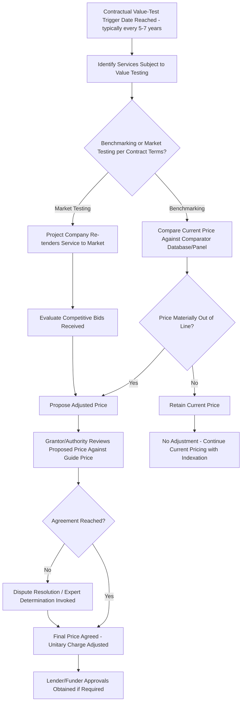

## Benchmarking and Market Testing of Service Costs

### Overview

Benchmarking and market testing (collectively often referred to as "value testing") are contractual mechanisms built into long-term PPP contracts to periodically re-align the cost of certain ongoing services — most commonly "soft" facilities management (FM) services such as cleaning, catering, portering, security, and grounds maintenance — with prevailing market conditions. These mechanisms exist to solve a structural mismatch: a PPP contract for a long-lived physical asset (a school, hospital, or prison) typically runs for 25–30 years, but the market for many of the ongoing sub-services bundled into that contract — particularly labor-intensive soft services — is one where market contracts are typically of much shorter duration. Fixing soft-service pricing for the full contract term, adjusted only by simple inflation indexation, risks that costs drift materially out of line with actual market rates over such a long horizon, in either direction.

### Why Value Testing Exists: The Underlying Problem

**Key Points**

- Long-lived hard assets (the building itself, major mechanical/electrical systems) are naturally priced and financed over the full PPP contract term, since the capital investment and associated debt are amortized across that period.
- Soft services, by contrast, are typically procured in the broader market on 3–5 year contract cycles, meaning market rates for cleaning, catering, and similar labor-intensive services can shift meaningfully (due to wage inflation, changing minimum-wage regulation, evolving service specifications, or new market entrants) well within a single PPP contract's lifespan.
- Service providers would normally be reluctant to commit to a fixed price (with only simple inflation indexation) for such labor-intensive services over a 25–30 year period, because actual costs are likely to diverge from a generic inflation index over time — index composition rarely tracks sector-specific wage and input cost pressures precisely.
- Without a value-testing mechanism, a PPP contract risks becoming saddled with service and maintenance costs that are, over time, higher (sometimes significantly higher) than if government procured the same services directly or through a separately re-tendered private contractor — a frequently criticized feature of some long-running PFI/PPP programs.
- This approach is most closely associated with — and most extensively documented within — the United Kingdom's Private Finance Initiative (PFI) tradition, though the underlying design logic is applicable to any long-term availability-based PPP bundling soft services.

### Two Distinct Mechanisms: Benchmarking vs. Market Testing

Although often discussed together under the umbrella term "value testing," benchmarking and market testing are distinct mechanisms with different processes and risk profiles.

**Benchmarking**

- The cost of a defined service is compared against the cost of equivalent services provided under comparable contracts elsewhere (a market database or panel of comparator prices), without necessarily re-tendering the service itself.
- If the benchmarked comparison indicates the current price is out of line with the market, the price is adjusted (up or down) to reflect the benchmark finding, subject to procedures and dispute mechanisms defined in the contract.
- Benchmarking is generally seen as a lighter-touch, lower-transaction-cost process than full market testing, since it does not require running a competitive procurement exercise.

**Market Testing**

- The relevant service is formally re-tendered by the contractor (the Project Company/SPV) to the market, inviting bids from third-party suppliers (which may include the incumbent service provider bidding to retain the work).
- Any resulting increase or decrease in the cost of the service, as evidenced by the re-tendered market price, is reflected as an adjustment to the unitary charge.
- Market testing is generally regarded as offering greater transparency and stronger competitive discipline on pricing than benchmarking, since it tests actual current market appetite and pricing rather than relying on potentially imperfect or dated comparator data.
- Reflecting this perceived advantage, later-generation standardized PFI contract templates in the UK moved toward preferring market testing over benchmarking as the primary or sole value-testing mechanism, with some later contracts dispensing with benchmarking altogether in favor of market testing only.

### Typical Process and Governance

### Governance and Best-Practice Guidance (UK Context)

Because the UK PFI program generated the largest and most mature body of practice in this area, several documented governance frameworks and guidance sources are directly relevant:

- **UK Operational Taskforce Note 1** — provides detailed practical guidance to public-sector contract managers on how to approach and manage the benchmarking and market testing ("value testing") process, addressing public-sector concerns about managing both the process and outcomes of value testing.
- **Department of Health Code of Best Practice on Benchmarking and Market Testing (NHS PFI projects)** — sector-specific guidance focused on hospital PFI contracts, setting out criteria and a defined process to ensure consistency of approach, transparency, and objectivity in value testing.
- **National Audit Office (NAO) reports** — periodic reviews assessing whether public officials are effectively testing the cost and quality of facilities services to secure value for money over the life of PFI contracts, drawing out lessons on how value-testing should be conducted.
- **NISTA (National Infrastructure and Service Transformation Authority) Contract Management Guidance** — more recent UK government guidance confirming that most PFI contracts include periodic benchmarking or market testing, typically every 5–7 years, situating value testing within the broader unitary-charge/performance-linked payment mechanism framework.

**Key Points**

- Both benchmarking and market testing are typically the primary responsibility of the Project Company (the SPV/contractor) in terms of cost and management of the process, though the contracting authority retains review, approval, and often veto/escalation rights over outcomes.
- Early planning and identification of the skills and resources required for value testing is repeatedly emphasized as critical to a well-run process — value testing exercises are resource-intensive and benefit substantially from being planned well ahead of the contractual trigger date rather than initiated reactively.
- Under many contract structures (particularly in NHS PFI practice), the contracting authority (e.g., an NHS Trust) takes the benefit and risk of price changes resulting from benchmarking and market testing — reflecting the principle that it is not typically value-for-money for bidders to price the full long-term risk of soft-service cost volatility into their original bid, and that the authority should instead pay something closer to the actual prevailing market price for these services as it evolves.

### Scope of Services Typically Subject to Value Testing

| Service Category | Typically Subject to Value Testing? | Rationale |
| --- | --- | --- |
| Cleaning | Yes | Labor-intensive, short market-contract cycles, wage-sensitive |
| Catering | Yes | Labor and food-cost sensitive, competitive market exists |
| Portering | Yes | Labor-intensive, comparable market benchmarks available |
| Security (unarmed/general) | Yes | Labor-intensive, competitive market exists |
| Grounds maintenance | Yes | Seasonal, labor-intensive, competitive market exists |
| Hard FM (building fabric, M&E maintenance) | Generally No | Tied more directly to the specific asset design and long-term lifecycle plan; less standardized market comparator exists |
| Major lifecycle replacement (e.g., roof, HVAC systems) | Generally No | Governed by the lifecycle/major maintenance reserve mechanism rather than value testing |
| Core building availability obligations | No | Governed by the availability payment/deduction mechanism, not value testing |

The scope of services subject to value testing differs meaningfully between contracts, but in the majority of cases centers on soft FM services rather than hard FM or core asset-availability obligations.

### Frequency and Timing

- Most PFI/PPP contracts specify value testing at defined intervals — commonly every 5–7 years — reflecting a balance between giving enough time for market conditions to genuinely shift (avoiding excessive transaction costs from overly frequent testing) and not allowing prices to drift too far from market reality for too long.
- Some contracts stagger value-testing dates across different service categories rather than testing all soft services simultaneously, spreading transaction costs and administrative burden over the contract term.

### Worked Illustrative Example

**Example**

A hospital PFI contract reaches its Year 7 market-testing trigger date for the cleaning service package, currently priced at $1,200,000 per year within the unitary charge.

1. **Service specification review**: the Project Company and Trust first confirm whether the underlying service specification has changed since the original contract signing (e.g., additional clinical areas requiring specialist infection-control cleaning protocols added since financial close) — any specification changes are typically priced separately from the pure market-price adjustment.
2. **Re-tender process**: the Project Company invites bids from qualified cleaning service providers (potentially including the incumbent subcontractor) for the defined, currently-specified scope of work.
3. **Bid evaluation**: bids are received ranging from $1,050,000 to $1,350,000 per year, reflecting genuine market variation in cost structures and competitive positioning among bidders.
4. **Selection and price submission**: the Project Company selects a preferred bid (or retains the incumbent at a revised price) — say, $1,100,000 per year — and submits this revised price to the Trust for review against a guide price or expected range.
5. **Trust review and approval**: the Trust reviews the proposed $1,100,000 price against its own expectations (informed by benchmarking data or independent market knowledge) and, finding it reasonable, approves the adjustment.
6. **Unitary charge adjustment**: the unitary charge is adjusted downward to reflect the $100,000 annual saving, with the benefit (under a Trust-bears-risk-and-benefit structure) accruing to the public authority.
7. **Funder approval**: because the change affects the project's revenue profile, relevant approvals from senior lenders/funders may be required to confirm the change does not adversely affect the financing structure's covenants.

### Value Testing Governance Structure (SVG Diagram)

<svg xmlns="http://www.w3.org/2000/svg" viewBox="0 0 760 340" font-family="Arial, sans-serif">
<text x="380" y="26" text-anchor="middle" font-size="17" font-weight="bold" fill="#1a1a2e">Value Testing: Benchmarking vs. Market Testing (svg_diagram)</text>
<rect x="290" y="50" width="180" height="40" fill="#1a1a2e" />
<text x="380" y="75" text-anchor="middle" font-size="13" fill="#ffffff" font-weight="bold">Value Testing</text>
<line x1="380" y1="90" x2="190" y2="125" stroke="#888" stroke-width="1.5" />
<line x1="380" y1="90" x2="570" y2="125" stroke="#888" stroke-width="1.5" />
<rect x="80" y="125" width="220" height="55" fill="#eef2f7" stroke="#c0c8d4" />
<text x="190" y="148" text-anchor="middle" font-size="12" font-weight="bold" fill="#1a1a2e">Benchmarking</text>
<text x="190" y="166" text-anchor="middle" font-size="10" fill="#1a1a2e">Compare vs. comparator database</text>
<rect x="460" y="125" width="220" height="55" fill="#eef2f7" stroke="#c0c8d4" />
<text x="570" y="148" text-anchor="middle" font-size="12" font-weight="bold" fill="#1a1a2e">Market Testing</text>
<text x="570" y="166" text-anchor="middle" font-size="10" fill="#1a1a2e">Re-tender service to open market</text>
<line x1="190" y1="180" x2="190" y2="210" stroke="#888" stroke-width="1.5" />
<line x1="570" y1="180" x2="570" y2="210" stroke="#888" stroke-width="1.5" />
<rect x="80" y="210" width="220" height="50" fill="#fff3cd" stroke="#f0d68a" />
<text x="190" y="232" text-anchor="middle" font-size="10" fill="#5a4a1a">Lower transaction cost,</text>
<text x="190" y="248" text-anchor="middle" font-size="10" fill="#5a4a1a">relies on comparator data quality</text>
<rect x="460" y="210" width="220" height="50" fill="#d4edda" stroke="#a3d9b1" />
<text x="570" y="232" text-anchor="middle" font-size="10" fill="#1a1a2e">Higher transaction cost,</text>
<text x="570" y="248" text-anchor="middle" font-size="10" fill="#1a1a2e">stronger competitive price discipline</text>
<line x1="190" y1="260" x2="380" y2="285" stroke="#888" stroke-width="1.5" />
<line x1="570" y1="260" x2="380" y2="285" stroke="#888" stroke-width="1.5" />
<rect x="230" y="285" width="300" height="40" fill="#f8d7da" stroke="#e6a5ab" />
<text x="380" y="310" text-anchor="middle" font-size="12" font-weight="bold" fill="#1a1a2e">Unitary Charge Adjusted (Soft FM Component)</text>
</svg>

### Documented Sources of Dispute and Conflict

**Key Points**

- Despite PFI transaction documents typically being closely scrutinized at signing by all parties (procurer, contractor, lenders, service providers), benchmarking and market testing mechanisms have proven a recurring source of disputes over the long life of these contracts, given the multi-decade time horizon and multiple competing interests involved.
- Ambiguities in the drafted mechanism, or unexpected outcomes once a value test is actually run (e.g., bid results diverging sharply from what either party anticipated), have generated litigated disputes — one documented example is litigation concerning a facilities management agreement for a Scottish NHS PFI hospital, illustrating that even well-established, standardized value-testing clauses can generate genuine legal disagreement over interpretation and application in practice.
- The value-test process being run primarily by the Project Company creates an inherent tension: the Project Company has commercial interests in the outcome (e.g., retaining the work at favorable margins if it also owns or is affiliated with the incumbent service subcontractor), which is one reason independent guidance and authority review/approval rights are considered important governance safeguards.

### Common Procedural Pitfalls

**Key Points**

- **Inadequate early planning**: because value testing is resource- and process-intensive, contracting authorities that do not begin preparation well ahead of the contractual trigger date risk being under-resourced relative to the Project Company when the process actually runs.
- **Ambiguous or under-specified contractual mechanics**: contracts from earlier in the PFI program's history, before standardized templates matured, are particularly prone to drafting ambiguity around exactly how the value-test process should run, what "guide price" benchmarks apply, and how disputes are resolved — contributing to the litigation risk noted above.
- **Too few bidders competing in market testing**: if a market-testing exercise attracts insufficient competitive interest (e.g., due to a niche service specification, an unattractive short remaining contract term, or general market conditions), the resulting price may not genuinely reflect competitive market rates, undermining the mechanism's core purpose; well-drafted contracts anticipate this scenario with a defined procedure for "too few bidders" situations.
- **Service specification creep left unpriced**: failing to clearly separate genuine market-price movement from changes in the underlying service specification (which should typically be priced as a separate contract variation) can distort the value-testing outcome and generate disputes over what the adjusted price is actually compensating for.
- **Neglecting funder/lender approval requirements**: overlooking the need for senior lender consent to unitary charge adjustments arising from value testing can create late-stage delays or complications in finalizing an otherwise agreed price change.
- **Conflating value testing with the broader deduction/abatement regime**: value testing addresses the *underlying price* of soft services against market conditions; it operates independently from, and should not be confused with, the payment deduction/abatement mechanism (discussed separately), which addresses *performance* against that price in each monitoring period.

[Inference] Because value testing outcomes directly affect the unitary charge and therefore project cash flow, and because the process is typically Project-Company-led, contracting authorities with limited in-house commercial and technical benchmarking expertise may benefit from independent advisory support to ensure genuinely balanced outcomes — though the specific resourcing model varies significantly by jurisdiction and by the individual authority's institutional capacity.

### Related Topics

- Availability payment structures and the unitary charge concept (the payment stream value testing adjusts)
- Payment deduction and abatement regimes (distinct, performance-based mechanism operating alongside value testing)
- Soft vs. hard facilities management bundling in PPP service specifications
- Contract variation mechanisms for service specification changes
- Lender direct agreements and funder consent requirements for unitary charge adjustments
- Dispute resolution and expert determination clauses in long-term PPP contracts
- UK Private Finance Initiative (PFI) program structure and standardized contract templates
- Lifecycle and major maintenance reserve accounts (contrasted with value-tested soft services)
- Independent contract management advisory support for public authorities
- Refinancing and renegotiation triggers over the life of a PPP contract