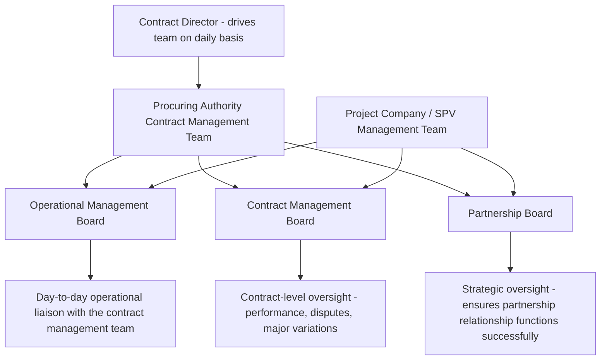

## Establishing a Contract Management Function and Team

### Overview

Establishing an effective contract management function is the process by which a procuring authority (the government contracting entity, or "grantor") builds the institutional capacity, team structure, governance arrangements, and staff competencies needed to manage a PPP contract across its entire multi-decade life cycle. The existence of an effective contract management team is vital to ensuring a project's objectives — value for money, service quality, risk allocation as originally intended — are actually realized in practice over the long term, rather than merely captured on paper in the signed contract. This function sits at the operational heart of everything discussed elsewhere in this chapter: KPI monitoring, payment deductions, benchmarking and market testing, and dispute resolution all depend on a competent, appropriately resourced, and well-governed contract management team to function as intended.

### Why Early Establishment Matters

**Key Points**

- Good practice calls for the contract management function to be planned and, ideally, involved from the **inception of the project** — not created only after financial close or, worse, only once construction is complete and operations begin.
- Late appointment of the contract management function creates a documented risk: a resulting lack of knowledge of the signed contract's specific obligations, roles, and responsibilities can delay the project, create indecision, and in some cases strain the relationship between government and the private partner from the very start of the operational relationship.
- It is good practice to include the proposed **contract director** (the individual who will drive the contract management team on a daily basis once the contract is operational) in the government's project management team at an early stage of the procurement process itself — well before financial close — so that continuity and accumulated institutional knowledge carry through from procurement into contract management.
- The transition points in a PPP's life cycle — from procurement to financial close, from financial close to construction, and from construction to operations — each represent a distinct shift in what the contract management team needs to do, and staff continuity/overlap across these transitions materially aids knowledge transfer and reduces the "cold start" risk of a team encountering unfamiliar contract terms under operational pressure.

### Determining Team Size and Structure

There is no single set formula for the size and structure of a procuring authority's contract management team — appropriate sizing depends on a defined set of project-specific factors rather than a generic template.

**Key Sizing Factors**

1. **Level of obligations and risk retained by the procuring authority**: where the authority has taken on significant residual obligations or risks under the PPP contract (e.g., land acquisition responsibilities, obtaining regulatory approvals, or bearing certain risk categories), it must assume a correspondingly more active contract management role, requiring a larger and more specialized team.
2. **Nature and complexity of the project**: larger, more technically complex projects (e.g., a major hospital or multi-site rail concession) with sophisticated KPI/payment-deduction regimes require proportionately more contract management capacity than a simpler, single-asset availability PPP.
3. **Access to external and centralized resources**: the presence of a central PPP unit, sector-specific support programs, or the ability to engage external advisors materially affects how large the core in-house team needs to be.

**Observed Range in Practice**

- Team size can vary enormously — from a couple of individuals to more than 50 people — depending on the complexity of the contract, the project, and the degree of active involvement the procuring authority has chosen or is required to take.
- Most commonly, the core **permanent** contract management team comprises a small number of staff — fewer than 10, and often fewer than five — with a well-managed PPP typically deploying a small core team that leverages the professional expertise and support of other departments within the procuring authority, a central PPP unit, and/or external advisors, rather than attempting to internalize every specialist skill within the core team itself.

### Active vs. Passive Contract Management Roles

**Key Points**

- Where the procuring authority has retained a high level of risk and has significant ongoing obligations under the PPP contract, it must assume an **active** role in contract management — proactively monitoring, engaging, and intervening as needed.
- Where the risks and obligations retained by the procuring authority are comparatively fewer (e.g., in a well-structured availability PPP where the operator bears most construction, availability, and lifecycle risk), the procuring authority may be able to adopt a more **passive** — though still genuinely responsible — role; even a passive contract management posture should not have its importance underestimated, since basic contract administration, payment certification, and relationship stewardship functions remain essential regardless of risk allocation.
- This active/passive determination is one of the primary drivers of appropriate team sizing and skill-mix decisions, and should be made explicitly and early rather than defaulting implicitly based on available headcount.

### Core Setup Considerations (Structured Checklist)

Good-practice guidance frames the setup process around a defined sequence of considerations:

1. **Consider the scope of the procuring authority's role** in managing the specific PPP contract, informed by the active/passive determination above.
2. **Base team size on the nature of the project and availability of external resources** — sizing decisions should not be made in isolation from what centralized or external support is genuinely accessible.
3. **Ensure an appropriate governance structure, skillset, and competencies** exist within the team relative to the specific project's demands.
4. **Plan the set-up of the contract management team before financial close** — reinforcing the early-establishment principle discussed above.
5. **Centralize resources where there is a program of multiple PPPs**, so that synergies (shared expertise, consistent contract-monitoring tools, cross-project learning) can be generated rather than each project team operating in isolation.
6. **Use external consultants where appropriate**, while ensuring transitions between successive consultants (as contracts for advisory support are renewed or re-tendered) are managed carefully to avoid knowledge-continuity gaps.
7. **Evaluate the structure and resourcing of the team on an ongoing basis** and make adjustments as the project moves through its life-cycle phases (construction, early operations, mature operations, approaching expiry).
8. **Plan for staff turnover** and ensure adequate succession planning and knowledge documentation, given that PPP contracts routinely outlast the tenure of any individual staff member, sometimes by decades.

### The Role of Central PPP Units

**Key Points**

- In many jurisdictions, a central government body — commonly a dedicated **PPP unit** — provides support to individual project-level contract management teams across a program of PPPs, rather than each procuring authority building fully independent capacity from scratch.
- PPP units typically provide guidance on contract management strategies and implementation, benchmarking, technical/operational compliance, achieving whole-life value for money, and refinancing of operational contracts.
- The extent of PPP unit involvement varies substantially by jurisdiction: some national PPP units (e.g., Colombia's Agencia Nacional de Infraestructura, ANI) provide extensive, hands-on support across the portfolio of contracts; in many other jurisdictions, PPP units are smaller and provide only ad hoc or intermittent specialized expert advice to individual procuring authorities' day-to-day contract management teams.
- Sector-specific support networks can also exist alongside or instead of a general central PPP unit — for example, dedicated programs established to promote and support PPPs within a specific sector (such as waste infrastructure).
- Centralized resources play a particularly valuable role in staff training, helping to build and maintain PPP-specific contract management competencies across a program of projects more efficiently than each project training its team independently.

### Governance Structure: Multi-Layer Boards

Good practice for PPP contract governance typically establishes multiple layers of formal interaction between the procuring authority and the private partner, structured to match different levels of strategic vs. operational decision-making:

- The **partnership board**'s role is to ensure the overall project runs smoothly and that the partnership relationship itself is successfully executed, typically operating at a more strategic and relationship-oriented level than day-to-day operational matters.
- These governance structures and the associated emphasis on good, collaborative relationships between the parties do **not** detract from or substitute for the underlying contractual obligations of each party — governance boards support and inform contract administration; they do not replace the enforceable terms of the contract itself.
- The procuring authority should adopt whichever specific governance structure best fits its own existing internal structures and governance arrangements, adapted to the complexity of the individual project, rather than importing a rigid template that may not match institutional realities.

### The Contract Director Role

**Key Points**

- The contract director is the individual responsible for driving the contract management team on a daily basis once the PPP contract is operational — functionally, the single point of accountability for the procuring authority's ongoing management of the relationship.
- Continuity and prior experience of a good contract director materially benefits the process — which is why good practice recommends identifying and involving the prospective contract director early, ideally within the government's project team during procurement itself, before the contract is even signed.
- The contract director typically interfaces directly with governance board structures (contract management board, operational management board) and coordinates the specialist inputs (technical, financial, legal) that active contract management of a complex PPP requires.

### Illustrative Team Structure for a Mid-Sized Availability PPP

| Role | Typical Function | Sourcing |
| --- | --- | --- |
| Contract Director | Overall accountability for contract management relationship; primary liaison with Project Company senior management | Core permanent staff |
| Performance/KPI Monitoring Officer | Reviews operator-reported performance data, coordinates independent verification, calculates/validates payment deductions | Core permanent staff or centrally shared resource |
| Technical Adviser | Assesses technical compliance, lifecycle maintenance adequacy, asset condition | External consultant or centrally shared specialist |
| Financial Adviser | Reviews financial model updates, refinancing proposals, benchmarking/market testing price submissions | External consultant or PPP unit support |
| Legal Adviser | Contract interpretation, variation drafting, dispute resolution support | External consultant or in-house legal department |
| Independent Certifier (where used) | Certifies construction completion, conducts periodic technical audits | Independent third-party appointment, not part of core team |
| PPP Unit Liaison | Channels centralized guidance, training resources, and cross-project lessons learned | Central PPP unit (if one exists) |

### Life-Cycle Phase Transitions and Evolving Team Needs

**Key Points**

- **Procurement to Financial Close**: the emphasis is on capturing institutional knowledge from the procurement team and formally transferring responsibility to the contract management structure, with the contract director ideally already embedded.
- **Financial Close to Construction**: the contract management team's role shifts toward active oversight of construction progress, milestone certification, and management of any land acquisition or other authority-retained obligations — this transition requires an effective contract management team to be firmly established, with staff overlap between procurement/financial-close personnel and the ongoing team facilitating knowledge transfer and training.
- **Construction to Operations**: this transition involves another major change in the contract management team's role, particularly for projects with complex KPI regimes and payment deductions — the team must pivot from construction-milestone monitoring to continuous operational performance monitoring, deduction calculation and validation, and relationship management over what is typically the longest phase of the contract.
- **Approaching Contract Expiry**: (though not always detailed in early-stage guidance) the team's focus increasingly shifts toward handback condition assessment, asset transition planning, and potentially re-procurement or in-house transition planning for the post-contract period.

### Establishing Contract Management Function: Setup Flow (SVG Diagram)

<svg xmlns="http://www.w3.org/2000/svg" viewBox="0 0 760 380" font-family="Arial, sans-serif">
<text x="380" y="26" text-anchor="middle" font-size="17" font-weight="bold" fill="#1a1a2e">Contract Management Function Setup Sequence (svg_diagram)</text>
<rect x="40" y="55" width="200" height="50" fill="#2c3e50" />
<text x="140" y="76" text-anchor="middle" font-size="12" fill="#ffffff" font-weight="bold">1. Assess Active vs.</text>
<text x="140" y="93" text-anchor="middle" font-size="12" fill="#ffffff" font-weight="bold">Passive Role Needed</text>
<rect x="280" y="55" width="200" height="50" fill="#2c3e50" />
<text x="380" y="76" text-anchor="middle" font-size="12" fill="#ffffff" font-weight="bold">2. Determine Team Size</text>
<text x="380" y="93" text-anchor="middle" font-size="12" fill="#ffffff" font-weight="bold">and Skill Mix</text>
<rect x="520" y="55" width="200" height="50" fill="#2c3e50" />
<text x="620" y="76" text-anchor="middle" font-size="12" fill="#ffffff" font-weight="bold">3. Identify Contract</text>
<text x="620" y="93" text-anchor="middle" font-size="12" fill="#ffffff" font-weight="bold">Director Early</text>
<line x1="240" y1="80" x2="280" y2="80" stroke="#888" stroke-width="1.5" marker-end="url(#a4)" />
<line x1="480" y1="80" x2="520" y2="80" stroke="#888" stroke-width="1.5" marker-end="url(#a4)" />
<rect x="40" y="140" width="200" height="50" fill="#eef2f7" stroke="#c0c8d4" />
<text x="140" y="161" text-anchor="middle" font-size="12" font-weight="bold" fill="#1a1a2e">4. Establish Governance</text>
<text x="140" y="178" text-anchor="middle" font-size="12" font-weight="bold" fill="#1a1a2e">Board Structure</text>
<rect x="280" y="140" width="200" height="50" fill="#eef2f7" stroke="#c0c8d4" />
<text x="380" y="161" text-anchor="middle" font-size="12" font-weight="bold" fill="#1a1a2e">5. Engage Central PPP</text>
<text x="380" y="178" text-anchor="middle" font-size="12" font-weight="bold" fill="#1a1a2e">Unit / External Advisors</text>
<rect x="520" y="140" width="200" height="50" fill="#eef2f7" stroke="#c0c8d4" />
<text x="620" y="161" text-anchor="middle" font-size="12" font-weight="bold" fill="#1a1a2e">6. Plan Set-Up Before</text>
<text x="620" y="178" text-anchor="middle" font-size="12" font-weight="bold" fill="#1a1a2e">Financial Close</text>
<line x1="620" y1="105" x2="620" y2="140" stroke="#888" stroke-width="1.5" marker-end="url(#a4)" />
<line x1="140" y1="105" x2="140" y2="140" stroke="#888" stroke-width="1.5" marker-end="url(#a4)" />
<line x1="380" y1="105" x2="380" y2="140" stroke="#888" stroke-width="1.5" marker-end="url(#a4)" />
<rect x="150" y="225" width="460" height="50" fill="#fff3cd" stroke="#f0d68a" />
<text x="380" y="255" text-anchor="middle" font-size="12" font-weight="bold" fill="#5a4a1a">7. Staff Overlap Across Transitions (Procurement → Construction → Operations)</text>
<line x1="380" y1="190" x2="380" y2="225" stroke="#888" stroke-width="1.5" marker-end="url(#a4)" />
<line x1="380" y1="275" x2="380" y2="305" stroke="#888" stroke-width="1.5" marker-end="url(#a4)" />
<rect x="150" y="305" width="460" height="50" fill="#d4edda" stroke="#a3d9b1" />
<text x="380" y="335" text-anchor="middle" font-size="12" font-weight="bold" fill="#1a1a2e">8. Continuous Evaluation and Succession Planning</text>
</svg>

### Worked Illustrative Example

**Example**

A mid-sized government agency is preparing to procure a hospital availability PPP with an estimated 28-year operational term. During the procurement stage, having reviewed guidance on active vs. passive contract management roles, the agency determines that it retains meaningful obligations (obtaining certain planning approvals, coordinating clinical service integration with the new facility) and therefore must adopt an active contract management posture.

Applying the setup checklist:

- The agency identifies its preferred **contract director** candidate — a senior official with prior infrastructure project experience — and embeds this person in the procurement team roughly 18 months before financial close.
- Given the project's moderate complexity, the agency plans a core permanent team of four: the contract director, a performance/KPI monitoring officer, a financial liaison, and an administrative/contract coordinator.
- Recognizing it lacks in-house technical facilities-management expertise, the agency arranges a standing retainer with an external technical adviser to support KPI verification and lifecycle maintenance assessment.
- Because the country has a national PPP unit with moderate capacity, the agency establishes a liaison relationship to access training resources and benchmarking data from comparable hospital PPPs elsewhere in the country's portfolio.
- A three-tier governance structure is agreed with the prospective private partner during contract negotiation: an annual partnership board (senior executives from both sides), a quarterly contract management board (contract director and Project Company commercial director), and a monthly operational management board (performance officer and Project Company operations manager).
- The agency schedules a formal knowledge-transfer overlap period spanning the transition from construction to operations, ensuring the construction-phase monitoring staff remain engaged for the first six months of service commencement to support the performance/KPI monitoring officer's ramp-up.

### Common Pitfalls

**Key Points**

- **Establishing the contract management team only after financial close (or later)**: forfeits the institutional knowledge accumulated during procurement and risks the team encountering unfamiliar contract obligations under live operational pressure.
- **Sizing the team without reference to the active/passive determination**: leads either to an over-resourced team for a genuinely low-risk-retained contract, or — more commonly and more damagingly — an under-resourced team for a contract where government has retained significant obligations.
- **Failing to identify a contract director early**: loses the continuity and institutional-memory benefits that come from having the same individual span procurement and operational management.
- **No planned staff overlap across life-cycle transitions**: creates knowledge gaps precisely at the moments (construction start, operations start) when the team's required skill set and workload profile change most significantly.
- **Underestimating the "passive" contract management role**: even a well-structured PPP with most risk transferred to the operator still requires competent contract administration, and treating a passive posture as requiring minimal attention risks basic administrative and relationship failures.
- **No succession planning for staff turnover**: given that PPP contracts routinely outlast individual tenures by decades, failing to document institutional knowledge and plan for handover leaves the contract management function vulnerable to significant capability loss whenever key personnel depart.
- **Treating governance boards as a substitute for contractual rigor**: good relationship governance supports but does not replace the enforceable terms of the contract; teams should avoid allowing informal governance-board consensus to quietly override or reinterpret binding contractual obligations without proper variation procedures.

[Inference] Because PPP contract management spans multiple distinct life-cycle phases with different skill demands, and because appropriate team sizing has no fixed formula, procuring authorities embarking on their first PPP (as opposed to an established program) likely benefit disproportionately from external PPP-unit or advisory support relative to authorities managing a mature, repeat portfolio of similar contracts — though the specific point at which in-house capacity-building becomes more cost-effective than continued reliance on external support depends on program scale and was not independently quantified in the sources reviewed for this response.

### Related Topics

- Key Performance Indicators and Service-Level Agreements (the substantive content the contract management team monitors)
- Payment deduction and abatement regimes (the calculation function the team performs or validates)
- Benchmarking and market testing of service costs (a periodic function the team manages)
- Central PPP unit models and comparative institutional design (e.g., Colombia's ANI)
- Independent certifier and technical adviser roles in PPP monitoring
- Staff training and competency development for PPP contract management
- Dispute resolution and expert determination mechanisms
- Handback and asset-transition planning near contract expiry
- Land acquisition and government-retained obligation management in PPPs
- Refinancing gain-sharing oversight as a contract management function