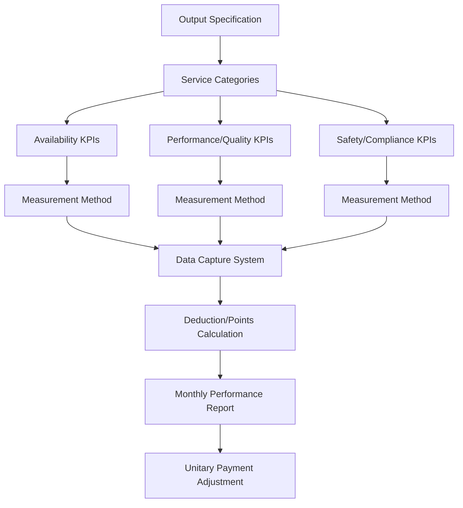
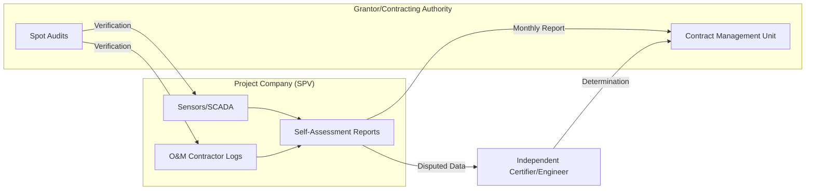
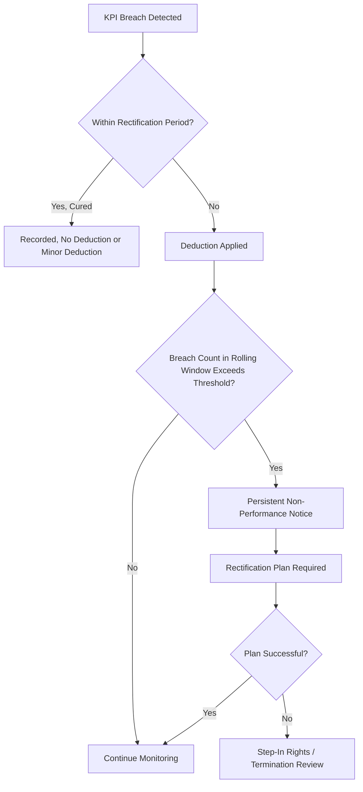

## Performance Monitoring Systems and Reporting Requirements

### Overview

Performance monitoring in Public-Private Partnerships (PPPs) is the institutional and technical apparatus by which the public authority (Grantor/Contracting Authority) verifies that the private party (Project Company/Concessionaire/SPV) is delivering the contracted asset and services in accordance with agreed Key Performance Indicators (KPIs), Service Levels, and output specifications. It is the primary mechanism through which the theoretical risk transfer embedded in the PPP contract is converted into operational reality — a PPP contract that transfers performance risk on paper but is not monitored effectively transfers no risk in practice.

Monitoring systems sit at the intersection of contract law, engineering/operations, and information systems, and they directly determine the size and timing of unitary payments, deductions, penalties, and step-in rights.

### Rationale and Position in the PPP Lifecycle

**Key Points**

- PPPs are typically structured as output- or outcome-based contracts (as opposed to input-based traditional procurement), meaning payment is tied to the *availability* and *performance* of the asset/service, not to the cost of inputs.
- Monitoring is the evidentiary basis for the **payment mechanism**, which is usually defined contractually as a formula referencing availability deductions and performance deductions.
- Monitoring spans the entire operational phase (post-Financial Close, post-Construction Completion through to contract expiry/handback), unlike construction supervision, which is largely limited to the construction period.
- Effective monitoring requires monitoring to be designed *during the transaction structuring phase*, not retrofitted after contract signing — KPI definitions, data sources, and reporting formats should be annexed to the PPP Agreement itself.

### Core Components of a Performance Monitoring System

#### 1. Output and Performance Specifications

The foundation of any monitoring system is a precise, unambiguous, and (as far as possible) objectively measurable specification of what "acceptable performance" means. These specifications generally fall into two categories:

- **Availability-based indicators**: whether the asset/facility/service is available for use as intended (e.g., a lane on a highway is open, a hospital ward is usable, a school classroom is functional).
- **Performance/quality-based indicators**: whether the asset/service meets defined quality thresholds while available (e.g., road surface roughness (IRI), water quality parameters, cleaning frequency compliance, response times to faults).

**Example**

For a toll road PPP:

- Availability KPI: percentage of lane-kilometers open to traffic during specified hours (target ≥99.5%).
- Performance KPI: International Roughness Index (IRI) not exceeding a defined threshold (e.g., $IRI \leq 2.5$ m/km).
- Safety KPI: number of Category 1 safety defects unremedied beyond the rectification period.

#### 2. Key Performance Indicators (KPIs) and Service Level Agreements (SLAs)

KPIs must generally satisfy the **SMART** criteria (Specific, Measurable, Achievable, Relevant, Time-bound), and contractually should specify:

- **Definition** of the metric and calculation methodology
- **Measurement frequency** (real-time, daily, monthly, quarterly)
- **Data source** (sensor, manual inspection, third-party audit, customer complaint log)
- **Threshold/target** and tolerance bands
- **Rectification period** (time allowed to cure a defect before a deduction/penalty is triggered)
- **Persistent failure** definitions (repeated breaches within a rolling window that may trigger escalated remedies, e.g., step-in or termination)

A typical KPI hierarchy:

#### 3. Data Collection and Monitoring Architecture

Monitoring architecture typically combines several data-capture layers:

- **Automated/sensor-based monitoring**: SCADA systems, IoT sensors, CCTV, traffic counters, water quality sensors, building management systems (BMS). Increasingly standard in transport, water, and energy PPPs.
- **Manual inspection regimes**: scheduled and unscheduled site inspections by the Grantor's monitoring team or an appointed **Independent Certifier/Technical Adviser**.
- **Self-monitoring/self-reporting by the Project Company**: the SPV is typically contractually obligated to monitor and report its own performance first, with the Grantor auditing/spot-checking this data — this reduces the Grantor's monitoring burden while placing an information-asymmetry risk that must be mitigated via audit rights.
- **User/customer feedback channels**: complaint logs, satisfaction surveys, ombudsman referrals (common in social infrastructure PPPs such as hospitals and schools).
- **Third-party/independent verification**: an Independent Engineer or Certifier appointed jointly or by the Grantor to validate self-reported data, resolve disputes, and issue certificates (e.g., Completion Certificates, Non-Conformance Reports).

#### 4. Reporting Requirements and Cadence

PPP agreements typically mandate a tiered reporting structure:

| Report Type | Frequency | Typical Content | Prepared By |
| --- | --- | --- | --- |
| Operational/Incident Report | Real-time to 24-48 hrs | Faults, safety incidents, unplanned outages | SPV/O&M Contractor |
| Monthly Performance Report | Monthly | KPI results, deduction calculations, rectification status | SPV, reviewed by Grantor |
| Quarterly Management Report | Quarterly | Trend analysis, persistent failures, financial summary | SPV |
| Annual Report | Annually | Asset condition survey, lifecycle/renewals status, compliance certification | SPV, often audited |
| Handback/Expiry Survey | Pre-expiry (e.g., 2-5 years prior) | Residual asset condition vs. handback standards | Independent surveyor |

**Key Points**

- Reports typically must follow a **prescribed template** annexed to the contract to enable consistent comparison over time and across projects (important for portfolio-level PPP units, e.g., a national PPP unit or Ministry of Finance).
- Reporting obligations should specify **submission deadlines**, **certification requirements** (e.g., signed off by an authorized SPV representative), and **consequences of late/inaccurate reporting** (often itself a KPI, or grounds for a deemed maximum deduction).
- Many jurisdictions require monitoring data to feed into **fiscal risk registers** and **contingent liability reporting** for public accounts (relevant to IMF/PFRAM-style fiscal risk frameworks).

### Performance Monitoring and the Payment Mechanism

The monitoring system's output feeds directly into the **payment mechanism formula**, typically structured as:

$$UP_{t} = UP_{max} - D_{a,t} - D_{p,t}$$

Where $UP_{t}$ is the unitary payment in period $t$, $UP_{max}$ is the maximum available payment, $D_{a,t}$ is the availability deduction, and $D_{p,t}$ is the performance deduction.

Availability deductions are commonly calculated on a pro-rata or weighted basis, e.g.:

$$D_{a,t} = UP_{max} \times \frac{\sum_{i} w_i \times U_i}{\sum_{i} w_i}$$

Where $w_i$ is the weighting assigned to unavailable component $i$, and $U_i$ is the duration/extent of unavailability of that component, both defined in the payment mechanism schedule.

**Example**

A hospital PPP with a monthly unitary charge of $1,000,000 might weight critical care unavailability at 5x the weighting of a non-critical administrative area. If the critical care unit is unavailable for 10% of the period, the deduction calculation applies that weighting disproportionately, reflecting the higher service criticality — this asymmetric weighting is a deliberate design choice to align deductions with actual user/service impact rather than simple floor-area proportions.

[Inference] The specific deduction formulas, caps, and "points-based" versus "financial deduction" models vary significantly by jurisdiction and sector; UK PF2/PFI, World Bank/IFC toolkits, and various national PPP units (e.g., South Africa National Treasury, Philippines PPP Center) have each published slightly different standard payment mechanism templates, so the exact formula must be taken from the specific project's contractual payment mechanism schedule rather than assumed universal.

### Persistent Breach, Escalation, and Step-In Rights

Monitoring systems must also track **cumulative/persistent non-performance**, since isolated breaches are typically remedied via deductions, but repeated breaches within a rolling window (e.g., 3 breaches of the same KPI in 6 months) can trigger:

- Formal **Non-Compliance Notices** or **Warning Notices**
- Requirement for a **Rectification Plan** submitted by the SPV
- **Monitoring intensification** (increased inspection frequency, additional reporting)
- **Step-in rights** (Grantor or lenders temporarily take over operations)
- Ultimately, **termination for persistent default** under the PPP Agreement's termination clauses

### Governance and Institutional Arrangements

**Key Points**

- **Contract Management Unit (CMU)**: a dedicated team within the Grantor (or a national PPP Unit) responsible for day-to-day monitoring, distinct from the procurement team that awarded the contract — separation of procurement and monitoring functions is widely recommended good practice (cited in World Bank and OECD PPP guidance).
- **Independent Certifier/Engineer**: often jointly appointed and jointly funded by both parties (or funded by the SPV but approved by the Grantor) to reduce perceived bias in dispute situations.
- **Joint monitoring committees**: periodic (e.g., quarterly) meetings between Grantor and SPV representatives to review performance reports, discuss disputes, and agree on rectification plans.
- **Escrow/retention mechanisms**: some contracts require a portion of payments to be held in reserve accounts pending resolution of disputed deductions.

### Technology Systems for Monitoring

Modern PPP monitoring increasingly relies on digital systems:

- **Contract Lifecycle Management (CLM) software**: tracks obligations, deadlines, and deliverables against the contract register.
- **Asset Management Information Systems (AMIS)** and **Computerized Maintenance Management Systems (CMMS)**: track lifecycle condition, maintenance schedules, and link to KPI performance (e.g., IBM Maximo, common in infrastructure PPPs).
- **BIM (Building Information Modeling)** integration for social infrastructure, allowing asset condition tracked against design-stage digital twins, particularly at handback.
- **Dashboards/Business Intelligence tools**: aggregating KPI data for real-time visibility to both SPV management and the Grantor's CMU.
- **GIS-based monitoring**: for linear infrastructure (roads, rail, pipelines) to geo-tag incidents and defects.

[Unverified] The extent of digital/automated monitoring adoption varies substantially by country income level and sector maturity; while advanced-economy transport and water PPPs increasingly deploy IoT and real-time SCADA-linked deduction systems, many developing-country PPPs — particularly in social infrastructure — still rely predominantly on manual inspection and paper-based/spreadsheet reporting, so specific technology stack assumptions should be verified against the project's own monitoring plan rather than presumed as a sector-wide standard.

### Common Design Pitfalls

**Key Points**

- **Over-specification**: too many KPIs (some projects have had 100+ indicators) dilutes monitoring focus and increases both parties' administrative burden; leading practice favors a smaller set of high-impact "core" KPIs.
- **Ambiguous metrics**: subjective terms like "clean" or "well-maintained" without objective measurement criteria lead to disputes — every KPI should have a defined measurement protocol.
- **Data asymmetry**: relying solely on SPV self-reported data without adequate audit rights creates moral hazard; contracts should include Grantor audit/inspection rights and penalties for data manipulation.
- **Static specifications**: KPIs fixed at contract signing that fail to evolve with technology, changing service standards, or usage patterns over a 20-30 year concession term; well-drafted contracts include KPI review/reset mechanisms at defined intervals.
- **Weak enforcement culture**: monitoring systems that exist on paper but where the Grantor lacks capacity or political will to apply deductions, undermining the entire risk-transfer rationale of the PPP structure.

### Illustrative Monitoring Data Flow (SVG)

<svg xmlns="http://www.w3.org/2000/svg" viewBox="0 0 800 320" font-family="sans-serif">
<text x="400" y="24" text-anchor="middle" font-size="16" font-weight="bold" fill="#1a1a1a">PPP Performance Monitoring Data Flow (svg_diagram)</text>
<rect x="20" y="60" width="160" height="60" rx="6" fill="#dbeafe" stroke="#2563eb" />
<text x="100" y="85" text-anchor="middle" font-size="12" fill="#1e3a8a">Field Sensors /</text>
<text x="100" y="102" text-anchor="middle" font-size="12" fill="#1e3a8a">Manual Inspection</text>
<rect x="230" y="60" width="160" height="60" rx="6" fill="#dcfce7" stroke="#16a34a" />
<text x="310" y="85" text-anchor="middle" font-size="12" fill="#14532d">SPV Data</text>
<text x="310" y="102" text-anchor="middle" font-size="12" fill="#14532d">Aggregation System</text>
<rect x="440" y="60" width="160" height="60" rx="6" fill="#fef9c3" stroke="#ca8a04" />
<text x="520" y="85" text-anchor="middle" font-size="12" fill="#713f12">KPI Calculation</text>
<text x="520" y="102" text-anchor="middle" font-size="12" fill="#713f12">Engine</text>
<rect x="650" y="60" width="130" height="60" rx="6" fill="#fee2e2" stroke="#dc2626" />
<text x="715" y="85" text-anchor="middle" font-size="12" fill="#7f1d1d">Monthly</text>
<text x="715" y="102" text-anchor="middle" font-size="12" fill="#7f1d1d">Performance Report</text>
<line x1="180" y1="90" x2="230" y2="90" stroke="#555" stroke-width="2" marker-end="url(#arrow)" />
<line x1="390" y1="90" x2="440" y2="90" stroke="#555" stroke-width="2" marker-end="url(#arrow)" />
<line x1="600" y1="90" x2="650" y2="90" stroke="#555" stroke-width="2" marker-end="url(#arrow)" />
<rect x="440" y="180" width="160" height="60" rx="6" fill="#ede9fe" stroke="#7c3aed" />
<text x="520" y="205" text-anchor="middle" font-size="12" fill="#3b0764">Grantor Contract</text>
<text x="520" y="222" text-anchor="middle" font-size="12" fill="#3b0764">Management Unit</text>
<rect x="650" y="180" width="130" height="60" rx="6" fill="#e0f2fe" stroke="#0284c7" />
<text x="715" y="205" text-anchor="middle" font-size="12" fill="#0c4a6e">Payment</text>
<text x="715" y="222" text-anchor="middle" font-size="12" fill="#0c4a6e">Adjustment</text>
<line x1="715" y1="120" x2="715" y2="180" stroke="#555" stroke-width="2" marker-end="url(#arrow)" />
<line x1="650" y1="210" x2="600" y2="210" stroke="#555" stroke-width="2" marker-end="url(#arrow)" />
<line x1="520" y1="180" x2="520" y2="120" stroke="#555" stroke-width="2" stroke-dasharray="4,3" marker-end="url(#arrow)" />
<text x="540" y="150" font-size="10" fill="#555">audit/verify</text>
</svg>

### Related Topics

- Payment Mechanisms and Availability/Performance Deduction Formulas
- Independent Certifier/Engineer Roles and Dispute Resolution Procedures
- Contract Management Units and Institutional Capacity for PPP Oversight
- Handback Standards and End-of-Concession Asset Condition Surveys
- Risk Allocation Matrices and Performance Risk Transfer
- Lender Step-In Rights and Direct Agreements
- Fiscal Risk Registers and Contingent Liability Reporting for PPPs
- Renegotiation Triggers Linked to Persistent Non-Performance