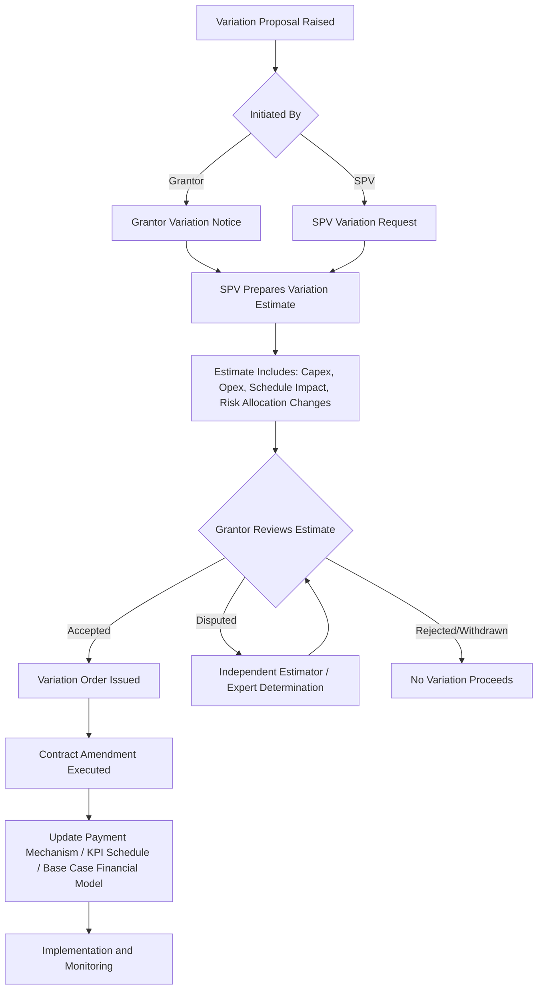
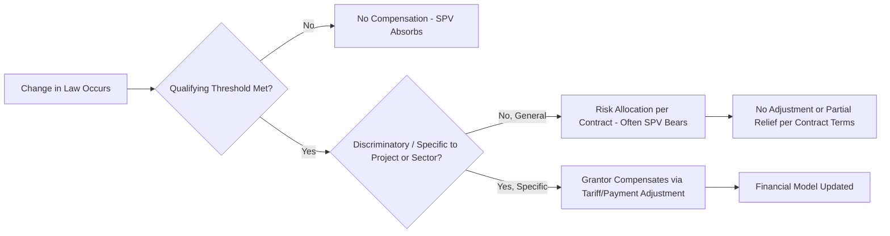

## Managing Variations and Change Orders

### Overview

Variations (also termed Change Orders, Contract Variations, or Modifications) are formally sanctioned changes to the scope, specifications, service standards, or terms of a PPP contract after Financial Close or Contract Effectiveness. Because PPP contracts typically run 20-30+ years and are structured on a fixed-price, output-based, risk-allocated basis, an effective variation management mechanism is essential: without one, either party may be forced to absorb costs never priced into the original risk allocation, or the contract becomes commercially unworkable in the face of legitimate changed circumstances (new regulations, technology shifts, demand changes, force majeure recovery works).

Variations are distinct from, but often interact with, **relief events**, **compensation events**, and **force majeure** provisions — the variation mechanism deals with the Grantor (or occasionally the SPV) *proactively requesting a change*, whereas relief/compensation events deal with *unforeseen circumstances* triggering entitlement to relief.

### Rationale and Position in the PPP Lifecycle

**Key Points**

- Variations commonly arise from: evolving user/service needs (e.g., a hospital requiring additional bed capacity), regulatory/legal changes (change in law), technology obsolescence (equipment refresh), design errors discovered during operations, or Grantor-initiated policy changes.
- A robust variations mechanism protects the **risk allocation matrix** established at Financial Close — uncontrolled variations are one of the most common causes of PPP contract value erosion and disputes.
- Poorly managed variations are a leading driver of **contract creep**, where cumulative small changes erode the original competitive tension and value-for-money basis of the deal.
- Variations regimes must balance **flexibility** (the public interest in adapting to changing needs) against **contract sanctity** (protecting the SPV's and lenders' financial model assumptions, and preserving the deal's bankability).

### Categorization of Variations

Most PPP contracts define variation thresholds and categories to determine which approval process and pricing mechanism applies:

| Category | Typical Trigger | Approval Process | Pricing Approach |
| --- | --- | --- | --- |
| Minor/De Minimis Variation | Below a monetary threshold (e.g., <$100,000 or <0.5% of contract value) | SPV/Grantor operational sign-off | Pre-agreed schedule of rates |
| Standard Variation | Within defined scope categories, moderate value | Formal Variation Procedure under the contract | Open-book costing or competitive quotation |
| Major/Material Variation | Exceeds threshold, changes core scope or risk allocation | Board-level/Ministerial approval, sometimes requiring legislative or Treasury sign-off | Independent estimation, sometimes re-tendering |
| Change in Law (Qualifying/Non-Qualifying) | Legal/regulatory change | Often a distinct contractual mechanism, not the general Variation Procedure | Cost pass-through (qualifying) vs. absorbed by SPV (non-qualifying, per risk allocation) |

[Inference] Exact thresholds and categorization labels differ significantly across jurisdictions and standard contract forms (e.g., UK PF2 Standardisation guidance, World Bank PPP Contractual Provisions, various national PPP unit templates); the categories above represent commonly observed structures rather than a single universal standard, so the applicable thresholds must be read from the specific project agreement.

### The Variation Procedure — Standard Workflow

Most well-drafted PPP agreements include a dedicated **Variation Procedure** schedule/clause specifying a structured sequence:

**Key Points**

- **Variation Notice/Request**: formal written trigger, referencing the specific contract clause and describing the required change in output/specification terms (not prescriptive design terms, to preserve the SPV's design responsibility and innovation incentive).
- **Estimate/Quotation**: the SPV (or, for major variations, an independent estimator) prepares a costed proposal covering capital cost, operating cost impact, financing cost impact, and schedule/programme impact.
- **Open-book costing**: many contracts require the SPV to provide transparent cost breakdowns (labor, materials, plant, overhead, margin) rather than a lump-sum black-box quote, often subject to audit rights.
- **Independent Estimator/Expert Determination**: used where the parties cannot agree on price or scope — a named or appointed technical/quantity-surveying expert issues a binding or semi-binding valuation.
- **Contract Amendment**: the executed variation typically requires updating the payment mechanism, KPI/output specification, and — critically — the **Financial Model / Base Case**, which underpins future refinancing, dispute valuations, and lender consents.

### Pricing Mechanisms for Variations

**Key Points**

- **Schedule of Rates**: pre-agreed unit rates (established at bid stage or during early operations) applied to defined units of work — reduces negotiation friction for recurring, predictable variation types.
- **Open-Book/Cost-Plus**: actual verified costs plus an agreed margin, typically used for larger or non-standard variations.
- **Competitive Quotation**: for very large variations, the Grantor may require the SPV to competitively tender the works to a panel of subcontractors, preserving value-for-money.
- **Independent Benchmarking**: cost estimates checked against external benchmarks/databases (particularly for standardized categories like equipment refresh in social infrastructure PPPs).

**Example**

A school PPP requires additional classroom capacity due to demographic change. Contractually:

1. Grantor issues a Variation Notice specifying required additional student capacity and output specification (not detailed design).
2. SPV prepares an open-book capex estimate plus revised lifecycle Opex and additional unitary charge calculation.
3. Grantor's technical adviser reviews and benchmarks the estimate against comparable school-build costs.
4. Parties agree a **Variation Order**, which is priced into a revised (typically higher) unitary payment, with the capex amortized over the remaining concession term or a separately negotiated period.
5. The Base Case Financial Model is updated, requiring lender consent (as the change affects debt service coverage ratios and possibly gearing).

### Financial Model Integration

Because unitary payments in most PPPs are derived from a **Base Case Financial Model**, any variation with capex, opex, or timing implications must be reflected there:

$$UP_{revised} = UP_{original} + \Delta UP_{variation}$$

Where $\Delta UP_{variation}$ is calculated to maintain the SPV's contractually agreed rate of return (e.g., equity IRR) on the incremental investment, holding all other Base Case assumptions constant — this is the standard "no better, no worse off" principle applied in variation pricing.

[Inference] The specific mechanics for recalculating $\Delta UP_{variation}$ (e.g., whether it uses the original project discount rate, a fixed markup, or a re-tendered rate) depend entirely on the variation pricing clause negotiated in each project agreement, and there is no single universal formula across all PPP programs.

**Key Points**

- Lender consent is almost always required for material variations, since they affect the security package, cash flow waterfall, and covenant compliance (e.g., Debt Service Cover Ratio, Loan Life Cover Ratio).
- Some contracts require variations above a threshold to trigger a **refinancing gain-share** recalculation if the variation materially changes the risk/return profile.

### Change in Law — A Distinct Sub-Regime

Change in Law provisions are usually separated from general Variations because they are triggered externally (not by either party's choice) and have distinct risk allocation logic:

| Change in Law Type | Typical Risk Allocation |
| --- | --- |
| **General/Non-Discriminatory Change in Law** (affects the economy broadly) | Often borne by the SPV, reflecting normal business risk |
| **Specific/Discriminatory Change in Law** (targets the PPP sector or project specifically) | Typically passed through to the Grantor via compensation/tariff adjustment |
| **Qualifying Change in Law** (exceeds a materiality threshold) | Compensation mechanism activated regardless of category, per contract definition |

### Governance, Audit, and Anti-Corruption Controls

**Key Points**

- Variations are a recognized **corruption and value-erosion risk point** in PPPs — because the original competitive tension of the tender no longer applies, uncontrolled variations can be used to inflate contract value post-award.
- Good practice controls include: independent technical/cost review for all material variations, publication/disclosure of variation registers, aggregate variation value caps requiring escalated approval (e.g., cumulative variations exceeding 10-15% of original contract value trigger a full re-approval process), and audit trails linking each variation to a specific contractual trigger clause.
- Many national PPP frameworks (e.g., World Bank PPP guidance, various Supreme Audit Institution reports) flag "variation creep" as a specific audit focus area, since it can undermine the original value-for-money case approved at contract signing.
- A **Variation Register** — a running log of all proposed, approved, and rejected variations with status, value, and approval authority — is standard good practice for both parties' contract management functions.

### Common Pitfalls

**Key Points**

- **Scope ambiguity**: Grantors specifying detailed design changes (rather than output requirements) in a Variation Notice can inadvertently shift design risk back to the public sector, undermining the original risk transfer rationale.
- **Financial model drift**: failing to update the Base Case Financial Model after each variation leads to disputes at refinancing, termination, or handback, when the "current" Base Case is unclear or contested.
- **Threshold gaming**: splitting a large variation into multiple smaller ones to avoid triggering higher approval thresholds or lender consent requirements.
- **Delayed pricing**: allowing works to proceed before agreeing price/scope (sometimes under urgency provisions) creates weak negotiating leverage for the Grantor and increases dispute risk.
- **Neglecting Change in Law interaction**: treating a genuine Change in Law event as a standard Variation (or vice versa) can result in incorrect risk allocation and improper compensation.

### Related Topics

- Compensation Events, Relief Events, and Force Majeure Provisions
- Base Case Financial Model Mechanics and Refinancing Gain-Share
- Risk Allocation Matrices in PPP Contract Design
- Dispute Resolution and Expert Determination Procedures
- Contract Amendment Governance and Anti-Corruption Safeguards
- Lender Consent Rights and Direct Agreements
- Payment Mechanism Recalibration After Scope Changes
- Handback Standards and Their Interaction with Late-Stage Variations