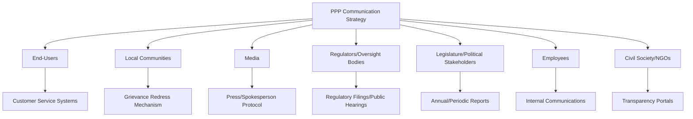
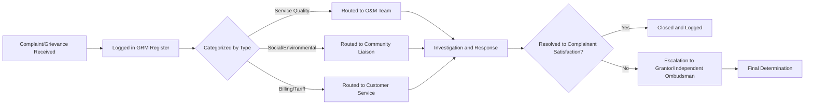

## Stakeholder and Public Communication During Operations

### Overview

Stakeholder and public communication during the operational phase of a Public-Private Partnership refers to the structured, ongoing processes by which the Grantor and the Project Company (SPV) inform, consult, and manage relationships with affected parties — end-users, communities, employees, media, oversight bodies, and civil society — once the asset or service is live. Unlike the intense, front-loaded stakeholder engagement typical of the procurement and construction phases (focused on planning approvals, land acquisition, and construction disruption), operational-phase communication is continuous, service-oriented, and directly tied to public trust in the PPP model itself, since operational failures or perceived unfairness (e.g., tariff increases, service outages) are often what determine the political sustainability of the PPP program as a whole.

### Rationale and Position in the PPP Lifecycle

**Key Points**

- PPPs frequently attract public scrutiny due to concerns about private profit from public services, tariff/toll levels, transparency of contract terms, and job security for transferred public employees — communication strategy is a risk mitigation tool against these reputational and political risks.
- Poor operational communication is a documented contributor to PPP renegotiation, early termination, or non-renewal of similar programs, independent of the underlying technical/financial performance of the asset.
- Communication obligations are increasingly written directly into PPP contracts (not left to discretion), reflecting lessons learned from high-profile disputes over toll increases, water tariffs, and service quality complaints.
- Effective communication supports **social license to operate** — the ongoing, informal community acceptance that complements the formal legal license/contract.

### Core Stakeholder Groups and Communication Needs

| Stakeholder Group | Primary Concerns | Typical Communication Channel |
| --- | --- | --- |
| End-users/Customers | Service quality, tariffs/fares, complaint resolution | Customer service centers, apps, websites, IVR systems |
| Local communities | Disruption, environmental/social impacts, local employment | Community liaison officers, town halls, grievance mechanisms |
| Media | Newsworthy events, tariff changes, incidents, controversies | Press releases, media briefings, spokesperson protocols |
| Oversight bodies/Regulators | Compliance, tariff justification, performance data | Formal regulatory filings, public hearings |
| Legislature/Political stakeholders | Value-for-money, fiscal exposure, public interest | Parliamentary/committee briefings, annual reports |
| Employees (SPV and transferred public staff) | Job security, terms of employment, safety | Internal communications, union consultation |
| Civil society/NGOs/Academics | Transparency, equity of access, environmental/social safeguards | Public disclosure portals, consultations |
| Lenders/Investors | Reputational risk exposure, ESG compliance | Investor reports (indirect stakeholder interest in public perception) |

### Contractual Communication Obligations

**Key Points**

- **Communications Plan/Protocol**: many PPP agreements require the SPV to submit a formal Communications and Stakeholder Engagement Plan as a condition of Operational Acceptance, updated periodically (e.g., annually).
- **Grantor approval/coordination rights**: contracts commonly reserve the right for the Grantor to review, approve, or coordinate SPV public statements — particularly around sensitive topics like tariff changes, incidents, or service failures — to maintain a consistent public narrative and protect the Grantor's political accountability.
- **Crisis communication protocols**: pre-agreed procedures for joint or coordinated communication during incidents (safety events, major outages, natural disasters affecting the asset), typically specifying response time thresholds and designated spokespersons.
- **Branding and signage requirements**: contracts often specify whether/how the private partner's brand appears alongside government branding (relevant to public perception of "privatization" versus partnership).
- **Non-disparagement/confidentiality carve-outs**: balancing public transparency obligations (especially in jurisdictions with freedom-of-information laws) against commercially sensitive information (financial model details, proprietary technology).

### Grievance Redress Mechanisms (GRM)

A Grievance Redress Mechanism is a formalized channel for stakeholders (particularly affected communities and end-users) to raise complaints and have them tracked to resolution — often a requirement of international financial institution (IFI) safeguards policies (e.g., World Bank, IFC Performance Standards, ADB Safeguard Policy Statement) when PPPs receive multilateral financing or guarantees.

**Key Points**

- GRMs typically specify response time targets (e.g., acknowledgment within 48 hours, resolution within 15-30 days) which may themselves be tracked as a KPI under the performance monitoring regime.
- A well-designed GRM includes multiple accessible channels (phone, in-person, online, written) to accommodate varying stakeholder literacy and access levels — a particular consideration in social infrastructure and rural utility PPPs.
- GRM data (volume, categories, resolution times) is often required to be reported publicly or to the Grantor as part of periodic performance reporting, connecting communication management directly to the broader performance monitoring system.

### Transparency and Disclosure Practices

**Key Points**

- **Contract disclosure**: growing global practice (supported by frameworks such as the **Open Contracting Partnership** and various national PPP disclosure policies) to publish PPP contracts, or summaries thereof, to counter perceptions of secretive deal-making — though full commercial and financial model disclosure remains contested and varies by jurisdiction.
- **Public performance dashboards**: some PPP programs publish KPI performance data publicly (e.g., punctuality statistics for rail PPPs, water quality data for utility PPPs) as a trust-building and accountability measure.
- **Annual public reporting**: many PPP units require an annual public report summarizing financial performance, service performance, and any material variations/disputes.
- **Tariff-setting transparency**: particularly critical in economically regulated PPPs (water, toll roads) where tariff formulas and adjustment mechanisms should be publicly available to justify price changes and pre-empt public backlash.

[Unverified] The specific extent and format of mandatory public disclosure varies enormously by country and sector — some jurisdictions mandate full contract publication (e.g., certain Latin American and some African PPP disclosure laws), while others treat PPP contracts as largely commercially confidential; the applicable disclosure regime should be verified against the specific jurisdiction's PPP law and access-to-information framework rather than assumed.

### Crisis and Incident Communication

**Example**

A water utility PPP experiences a service interruption affecting 50,000 households due to a burst main. A well-structured crisis communication protocol would typically involve:

1. Immediate internal notification per the incident escalation matrix (SPV operations to SPV management to Grantor liaison, within a contractually defined timeframe, e.g., 1-2 hours for major incidents).
2. Joint fact-finding to establish cause, scale, and estimated restoration time before any public statement.
3. Coordinated public messaging — typically the Grantor issues or co-signs the public statement to maintain public accountability, even though the SPV holds operational responsibility.
4. Ongoing updates via agreed channels (SMS alerts, social media, local radio) until resolution.
5. Post-incident report to the Grantor's Contract Management Unit, feeding into the persistent-failure tracking under the performance monitoring regime, and potentially into public disclosure of the incident and remedial actions taken.

### Employee and Labor Communication

**Key Points**

- PPPs involving transfer of existing public employees (common in utility, transport, and health PPPs) require careful communication to address concerns over job security, pension continuity, and terms of employment — often governed by specific labor transfer regulations (e.g., TUPE-equivalent regimes in various jurisdictions).
- Union consultation requirements are frequently mandated by law or by the PPP contract itself, particularly at operational transition and at any major variation affecting staffing levels.
- Ongoing internal communication (safety culture, service standards, customer-facing training) affects the "human" quality dimensions of performance that are harder to capture in formal KPIs but strongly influence public perception.

### Common Pitfalls

**Key Points**

- **Communication vacuum during disputes**: when the Grantor and SPV are in commercial dispute, public communication is often deprioritized or contradictory, damaging public trust in both parties regardless of the dispute's merits.
- **Over-reliance on the SPV for public messaging**: since the Grantor retains ultimate political accountability for public services, delegating all communication to the private partner can create a perception (accurate or not) that government has "washed its hands" of the service.
- **Reactive rather than proactive communication**: waiting for negative media coverage or public complaints to trigger communication, rather than establishing routine, positive-baseline public reporting.
- **Ignoring informal/local communication norms**: particularly in rural or community-level PPPs, over-reliance on digital/formal channels (websites, apps) can exclude significant portions of the affected population.
- **Treating communication as a compliance checkbox**: producing legally-required reports and disclosures without genuine responsiveness to stakeholder concerns, which undermines trust even where formal obligations are technically met.

### Related Topics

- Grievance Redress Mechanisms and IFI Safeguard Policy Compliance
- Contract Transparency, Open Contracting, and Public Disclosure Frameworks
- Regulatory Engagement and Tariff-Setting Communication
- Persistent Non-Performance Reporting and Its Public Disclosure Implications
- Political Economy of PPPs and Renegotiation Risk
- Labor Transfer and Union Consultation in Operational PPPs
- Crisis Management and Incident Escalation Protocols
- Social and Environmental Safeguards in PPP Operations