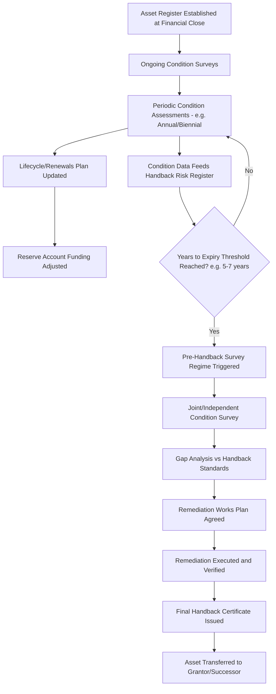

## Asset Condition Monitoring and Handback Standards

### Overview

Asset Condition Monitoring and Handback Standards govern how the physical condition of a PPP asset is tracked throughout the operational period and, critically, how it must be returned to the public sector (or successor operator) at contract expiry. Because most PPP contracts are structured for a fixed concession term (typically 20-35 years) after which the asset reverts to public ownership or control, the **handback regime** is one of the most consequential — and historically most contentious — elements of PPP contract management, since it determines whether the public sector inherits a well-maintained asset or an underfunded liability requiring immediate reinvestment.

### Rationale and Position in the PPP Lifecycle

**Key Points**

- Without a robust handback regime, the SPV has a rational economic incentive to **under-invest in maintenance and lifecycle renewal in the final years** of the concession, since it captures no benefit from asset condition beyond contract expiry — this is a well-documented moral hazard in PPP structuring, sometimes called the "end-of-concession problem" or "terminal value problem."
- Handback standards convert this moral hazard into an enforceable contractual obligation, requiring the asset to be surveyed, remediated if necessary, and certified as meeting defined condition standards before the concession legally ends.
- Handback planning should begin **years before actual expiry** (commonly 3-7 years, depending on asset type and design life of major components) to allow time for surveys, dispute resolution, and remediation works.
- The regime interacts directly with the **lifecycle/renewals reserve accounts** typically required under the financing structure, which are meant to ensure funds are available for major component replacement (roofs, mechanical/electrical systems, road resurfacing, rolling stock overhauls) on a predictable cycle rather than being deferred to save cash near expiry.

### Core Components of the Handback Regime

#### 1. Handback Condition Standards (Output Specification)

The contract must define, in advance, what condition the asset must be in at handback — typically expressed as either:

- **Absolute condition standards**: minimum residual life or condition scores for defined asset components (e.g., "roof covering shall have a minimum residual life of 10 years at handback," or "road pavement structural condition index shall not fall below X").
- **Relative/"as good as new less fair wear and tear" standards**: less precise, and generally disfavored in modern PPP drafting because they generate valuation disputes at expiry.
- **Component-by-component schedules**: a detailed asset register specifying handback condition requirements for major systems (structure, envelope, M&E, finishes, IT/control systems, specialist equipment) — the modern standard approach recommended in most PPP toolkits (e.g., World Bank, UK-derived PF2/PFI guidance, Australian National PPP Guidelines).

**Example**

A hospital PPP's handback schedule might specify:

- Structural elements: no defects requiring remediation within 15 years of handback
- HVAC systems: minimum 5 years remaining useful life or full replacement if below threshold
- Medical gas infrastructure: full compliance with then-current regulatory/clinical standards, not merely the standard at contract signing
- Finishes (flooring, painting): condition equivalent to a defined maintenance standard (e.g., "Grade B" on a defined condition-grading scale)

#### 2. Asset Condition Monitoring Throughout Operations

Handback compliance is not assessed only at the end — it depends on continuous condition data collected throughout the concession:

**Key Points**

- **Asset registers**: a comprehensive, continuously updated inventory of all major components, typically including installation date, design life, condition rating, and maintenance history — often integrated with a Computerized Maintenance Management System (CMMS).
- **Condition grading scales**: many contracts adopt a standardized scale (e.g., a 1-5 or A-E grading system, similar to those used in facilities/asset management standards) to enable objective, comparable assessment across survey cycles.
- **Lifecycle/renewals plans**: a rolling schedule (often 20-30 years, refreshed periodically) forecasting when major components require replacement, linked to the financial model's lifecycle cost reserve.
- **Reserve/sinking fund accounts**: many financing structures require the SPV to fund a **Major Maintenance Reserve Account (MMRA)** or **Lifecycle Reserve Account**, building up cash ahead of scheduled major works, partly to protect the Grantor's handback position by ring-fencing funds that cannot be diverted to equity distributions if lifecycle obligations are underfunded.

#### 3. Pre-Handback Survey and Certification Process

**Key Points**

- **Independent Surveyor/Certifier**: typically a jointly appointed (or Grantor-appointed, SPV-funded) independent technical expert conducts the definitive pre-handback condition survey, distinct from routine performance monitoring inspections.
- **Survey timing**: commonly staged — an initial survey 3-7 years before expiry to identify long-lead-time remediation needs, followed by a final confirmatory survey closer to expiry (e.g., 12-24 months prior).
- **Gap analysis and remediation planning**: any shortfall between actual condition and the contractual handback standard is quantified, and a remediation plan with defined milestones is agreed.
- **Escrow/retention for unremediated defects**: where remediation cannot be completed before contract expiry (e.g., due to a defect discovered late), contracts commonly provide for funds to be held in escrow, or for a **retention/holdback from final payments**, to fund the Grantor's completion of the works after handback.
- **Handback Certificate**: the formal document confirming the asset meets (or has been remediated to meet) handback standards, often a condition precedent to the SPV's final release from certain contractual liabilities and to the release of security/retention.

### Financial Mechanisms Supporting Handback

$$RR_t = \sum_{i} \frac{C_i}{L_i} \times f_i$$

Where $RR_t$ is the required reserve contribution in period $t$, $C_i$ is the replacement cost of component $i$, $L_i$ is its design/economic life, and $f_i$ is a funding adjustment factor reflecting actual condition versus the theoretical straight-line depreciation schedule (used in more sophisticated lifecycle funding models to correct for components deteriorating faster or slower than a simple age-based assumption).

**Key Points**

- Reserve account mechanics are typically defined in the **Common Terms Agreement** or **Accounts Agreement** among the SPV, lenders, and (in some structures) the Grantor, specifying funding triggers, permitted withdrawals, and minimum balance requirements.
- Some contracts link **final unitary payments or equity distributions** in the last years of the concession to demonstrated handback compliance, giving the SPV a direct financial incentive to maintain the asset properly rather than "sweat the asset" for short-term cash extraction.
- **Performance bonds or parent company guarantees** may also be structured to survive into the handback period specifically to secure remediation obligations.

### Records and Knowledge Transfer

Handback is not solely a physical asset transfer — it also encompasses an information/knowledge transfer obligation:

**Key Points**

- **As-built drawings and O&M manuals**: updated to reflect all modifications made during the operational period (not just the original construction-phase documentation).
- **Maintenance history records**: full log of inspections, repairs, and replacements, often required in a specified digital format (CMMS export, BIM model updates) to enable a smooth transition to the successor operator.
- **Warranties and equipment manuals**: transfer of any remaining manufacturer warranties on recently replaced components.
- **Staff transition support**: in some sectors (transport, utilities), contracts require a transition support period where SPV staff assist the incoming operator, particularly for specialized systems knowledge.
- **Software and control system licenses**: increasingly significant in modern PPPs with building management systems, SCADA, and IoT sensor networks — contracts should specify whether software licenses, source code access, or system documentation transfer with the asset, since proprietary control systems can otherwise strand the incoming operator.

### Dispute Resolution at Handback

Handback disputes are common and typically resolved through:

- **Expert Determination**: a pre-agreed technical expert issues a binding (or appealable) determination on disputed condition assessments or remediation cost estimates.
- **Escrow/retention release mechanisms**: disputed amounts are held pending resolution rather than delaying the overall handback transfer.
- **Step-in/interim operation provisions**: in cases of severe dispute or SPV insolvency near expiry, contracts may provide for Grantor or lender step-in to ensure continuity of service and asset protection while disputes are resolved.

[Inference] The specific dispute resolution forum (expert determination versus arbitration versus court litigation) and the extent to which determinations are binding vary by jurisdiction and the specific dispute resolution clause of each contract; no universal standard applies across all PPP programs.

### Common Pitfalls

**Key Points**

- **Vague handback standards**: contracts using subjective language ("good condition," "as new subject to fair wear and tear") without objective, component-level metrics are a leading cause of expiry disputes — modern good practice strongly favors detailed, quantifiable component schedules agreed at Financial Close.
- **Underfunded lifecycle reserves**: if reserve account funding assumptions in the original financial model prove insufficient (due to inflation, technology changes, or optimistic initial assumptions), the SPV may face a genuine funding gap at handback that was not adequately anticipated.
- **Late-stage survey initiation**: beginning pre-handback surveys too close to actual expiry leaves insufficient time to plan and execute remediation works, especially for long-lead-time items (structural works, specialist equipment procurement).
- **Neglecting soft/knowledge assets**: focusing handback planning solely on physical condition while under-specifying data, software, and knowledge transfer requirements, which can be equally disruptive to service continuity.
- **Adversarial end-of-term dynamics**: as the SPV's long-term relationship incentive diminishes near expiry, contract management intensity (from the Grantor side) often needs to *increase*, not decrease, in the final years — a resourcing implication frequently underestimated in Grantor contract management planning.
- **Ambiguity on re-tender transition**: where the asset will be re-tendered to a new operator (rather than returning to direct public operation), unclear provisions on incumbent SPV cooperation during the transition/mobilization period for the successor can create service continuity risk.

### Related Topics

- Lifecycle Cost Planning and Major Maintenance Reserve Accounts
- Performance Monitoring Systems and Persistent Non-Performance (interaction with handback risk)
- Base Case Financial Model Mechanics and Terminal Value Assumptions
- Expert Determination and Dispute Resolution Mechanisms in PPPs
- Common Terms Agreements and Reserve Account Waterfall Structures
- Re-Tendering and Transition Management at Contract Expiry
- Step-In Rights and Interim Operation Provisions
- Knowledge and Data Transfer in Long-Term Infrastructure Contracts