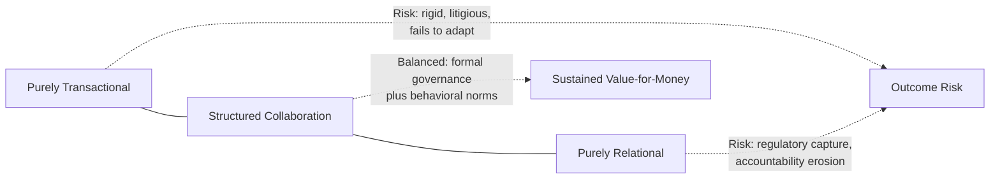
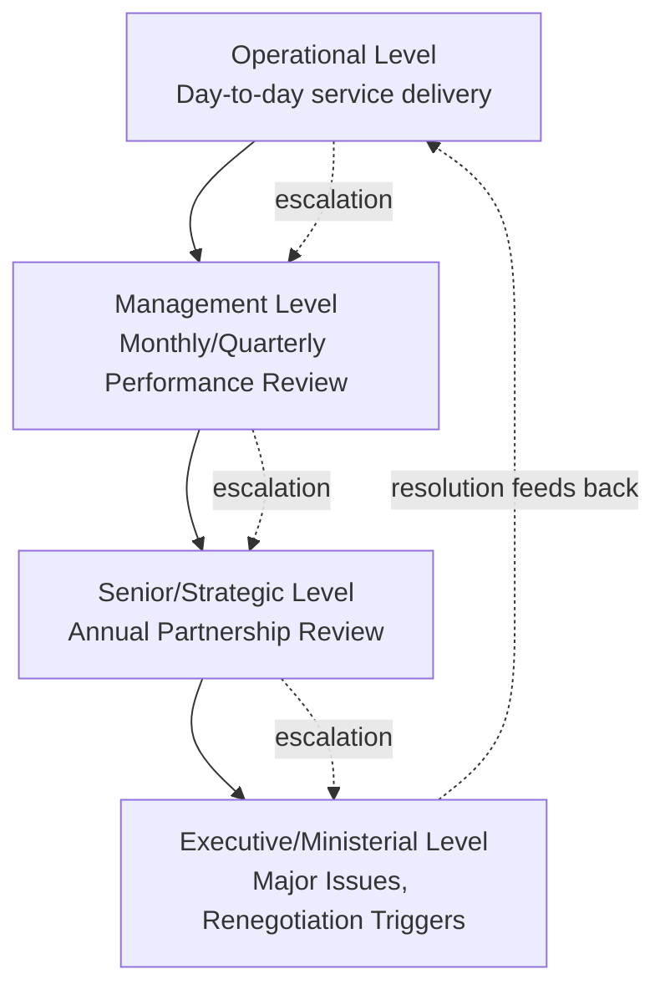

## Managing the Public-Private Relationship Over the Contract Term

### Overview

Managing the public-private relationship over the contract term refers to the institutional, behavioral, and governance practices — beyond the strictly legal/technical mechanics of KPI monitoring, payment mechanisms, and variation procedures — that determine whether a PPP functions as a genuine, collaborative long-term partnership or degenerates into an adversarial, transactional, and litigious arrangement. Because PPP contracts are inherently **incomplete contracts** (no document drafted at Financial Close can anticipate every circumstance across a 20-35 year term), the quality of ongoing relationship management is often as decisive to project success as the quality of the original contract drafting.

### Rationale and Position in the PPP Lifecycle

**Key Points**

- PPP contracts are long-term, relational agreements under conditions of genuine uncertainty — economic, political, technological, and social circumstances at Financial Close will not match those prevailing 15-20 years later, making a degree of ongoing relationship management and contractual flexibility unavoidable.
- Academic and practitioner literature on relational contracting (drawing on transaction cost economics, e.g., Williamson, and relational contract theory, e.g., Macneil) distinguishes "complete contracting" (attempting to specify every contingency, which is practically impossible for PPPs) from **relational governance** — behavioral norms, trust, and collaborative problem-solving that supplement the formal contract.
- Multiple PPP program evaluations (e.g., World Bank, OECD, national auditor-general reports) have identified relationship quality — not just contract design — as a key differentiator between PPPs that deliver sustained value-for-money and those that end in disputes, renegotiation, or early termination.
- Relationship management operates in tension with **contract sanctity/enforcement discipline**: too collaborative an approach risks regulatory capture or erosion of accountability; too rigid/legalistic an approach risks destroying the flexibility needed to adapt to legitimate changed circumstances.

### The Relational-Transactional Spectrum

**Key Points**

- Purely transactional management (strict, adversarial enforcement of every contractual right, minimal informal engagement) tends to produce high dispute rates and defensive behavior from the SPV (e.g., minimum-compliance rather than genuine service quality focus).
- Purely relational management (informal accommodation, reluctance to apply deductions or enforce standards) risks regulatory capture, erosion of the original risk allocation, and public accountability failures.
- Leading practice generally favors **structured collaboration**: rigorous formal governance and enforcement mechanisms (KPIs, deductions, audits) operating alongside genuine relationship-building forums (joint problem-solving, regular senior-level engagement, shared understanding of long-term objectives).

### Institutional Architecture for Relationship Management

#### 1. Contract Management Function (Grantor Side)

**Key Points**

- A dedicated, adequately resourced **Contract Management Unit (CMU)** — distinct from the original procurement team — is widely recommended as the institutional anchor for ongoing relationship management, providing continuity of institutional knowledge across a contract term that will outlast individual officials' tenures.
- CMU capacity gaps (understaffing, high turnover, lack of technical/commercial expertise) are a frequently cited root cause of both poor performance monitoring enforcement and relationship deterioration, since inexperienced counterparts struggle to engage credibly with sophisticated SPV commercial and technical teams.
- Institutional memory mechanisms (comprehensive contract management manuals, transition briefings, documented precedent/decision logs) mitigate the risk of relationship and technical knowledge being lost when key personnel change on either side.

#### 2. Governance Forums and Escalation Structures

**Key Points**

- **Joint/Liaison Committees**: regular (often monthly or quarterly) meetings between operational-level Grantor and SPV staff to review performance reports, discuss emerging issues, and resolve minor disputes before they escalate.
- **Strategic/Partnership Review Boards**: less frequent (often annual) senior-level engagement focused on longer-term issues — asset condition trends, upcoming variations, regulatory changes, and overall partnership health — distinct from routine operational review.
- **Tiered escalation protocols**: clearly defined pathways for issues to move from operational to senior to executive level when unresolved within specified timeframes, preventing both premature escalation (overwhelming senior stakeholders with routine matters) and under-escalation (allowing significant issues to fester at the wrong level).
- **Independent facilitation**: some long-term or complex PPPs use an independent relationship facilitator or mediator for periodic "health checks" of the partnership, separate from formal dispute resolution mechanisms.

#### 3. Dispute Avoidance and Early Resolution Mechanisms

**Key Points**

- **Dispute Review Boards/Panels**: standing panels of independent experts (common in major infrastructure contracts, drawing on FIDIC-style dispute board practice) who engage with the project on an ongoing basis, enabling faster, better-informed resolution than ad hoc arbitration when disputes do arise.
- **Escalating dispute resolution clauses**: typically requiring negotiation, then mediation/expert determination, before formal arbitration or litigation becomes available — designed to preserve the relationship by exhausting collaborative options first.
- **Early warning systems**: proactive identification of emerging performance, financial, or relationship stress (e.g., leading indicators such as declining maintenance spend, increasing complaint volumes, deteriorating communication patterns) before they crystallize into formal disputes.

### Behavioral and Cultural Dimensions

**Key Points**

- **Trust-building through transparency**: proactive, voluntary information-sharing (beyond minimum contractual reporting obligations) by both parties tends to reduce information asymmetry and associated suspicion/monitoring costs over time.
- **Mutual understanding of underlying interests**: effective relationship managers on both sides understand not just the contractual obligations but the underlying political, commercial, and reputational drivers of their counterpart — e.g., a Grantor's political sensitivity to tariff increases, or an SPV's need to protect covenant compliance for its lenders.
- **Consistency of personnel**: high turnover of key relationship contacts (project directors, contract managers) on either side disrupts accumulated trust and institutional knowledge; some contracts include "key personnel" provisions requiring consent for changes to certain roles.
- **Avoiding "gotcha" enforcement culture**: while rigorous KPI enforcement is necessary, an enforcement approach perceived as opportunistic or excessively punitive (rather than genuinely service-outcome-focused) tends to provoke defensive, minimum-compliance behavior and relationship deterioration.

### Renegotiation Dynamics

**Key Points**

- Renegotiation is common in PPPs globally — extensive empirical research (e.g., Guasch's World Bank studies on Latin American infrastructure concessions) has documented that a substantial proportion of PPP/concession contracts are renegotiated within the first several years of operation, often triggered by initially optimistic bids, unforeseen circumstances, or genuine changed conditions.
- Distinguishing **opportunistic renegotiation** (parties exploiting weak initial competitive tension or political leverage to extract better terms) from **legitimate adaptive renegotiation** (genuine response to unforeseeable changed circumstances) is a central relationship management and governance challenge.
- Good practice safeguards against opportunistic renegotiation include: robust initial competitive tendering (reducing the temptation/opportunity for post-award renegotiation), transparent renegotiation approval processes (often requiring independent review or even legislative/audit oversight for material renegotiations), and clear contractual triggers distinguishing genuine relief events from discretionary accommodation.

[Inference] The empirical frequency and typical triggers of PPP renegotiation vary significantly by sector, region, and time period studied in the literature; specific renegotiation rate statistics should be sourced from the relevant primary research (e.g., World Bank PPI Database analyses) rather than treated as a fixed universal figure, since findings differ across studies and have evolved as PPP program maturity and contract design practices have improved over time.

### Political Economy Considerations

**Key Points**

- PPPs typically span multiple political administrations/election cycles; a change in government can bring shifting priorities, ideological positions on private sector involvement in public services, or renewed public scrutiny of "unpopular" aspects of the deal (tariffs, profit levels) — relationship management must therefore include managing continuity across political transitions, not just across operational staff changes.
- Public and media narrative management (see also stakeholder communication practices) directly affects the political space available for the Grantor to maintain the original risk allocation, particularly when service failures or tariff increases generate public pressure for renegotiation or contract termination.
- Some jurisdictions institutionalize continuity through independent PPP units or regulatory bodies with a degree of insulation from short-term political cycles, intended to provide consistent contract management standards regardless of changes in elected leadership.

### Common Pitfalls

**Key Points**

- **Under-resourcing contract management**: treating contract management as an administrative afterthought following the (often intensely resourced) procurement phase, leading to inadequate capacity to manage the relationship, monitor performance rigorously, or engage credibly with the SPV.
- **Relationship capture by informal accommodation**: gradual erosion of contractual enforcement standards through a desire to maintain a "good working relationship," undermining the original risk allocation and value-for-money basis of the deal.
- **Excessive legal/adversarial posture**: treating every issue as a potential dispute to be won rather than a problem to be solved collaboratively, which increases transaction costs and can degrade service quality as the SPV shifts to defensive, minimum-compliance behavior.
- **Loss of institutional memory**: failing to document decisions, precedents, and relationship history, causing successor contract managers (on either side) to relitigate settled issues or repeat past mistakes.
- **Neglecting the "boring middle years"**: relationship management attention often concentrates at contract start (mobilization) and contract end (handback), with the long middle period of steady-state operations receiving insufficient proactive engagement until problems emerge.
- **Failure to plan for political transitions**: not proactively briefing incoming political leadership or public officials on the contract's rationale, risk allocation, and performance history, leaving the partnership vulnerable to uninformed renegotiation or termination pressure.

### Related Topics

- Contract Management Unit Design and Institutional Capacity Building
- Dispute Resolution Mechanisms: Negotiation, Mediation, Expert Determination, Arbitration
- Renegotiation Triggers, Governance, and Value-for-Money Safeguards
- Stakeholder and Public Communication During Operations
- Performance Monitoring Systems and Reporting Requirements
- Political Risk and PPP Program Sustainability Across Election Cycles
- Relational Contract Theory and Incomplete Contracts in Infrastructure
- Key Personnel Provisions and Institutional Continuity Clauses