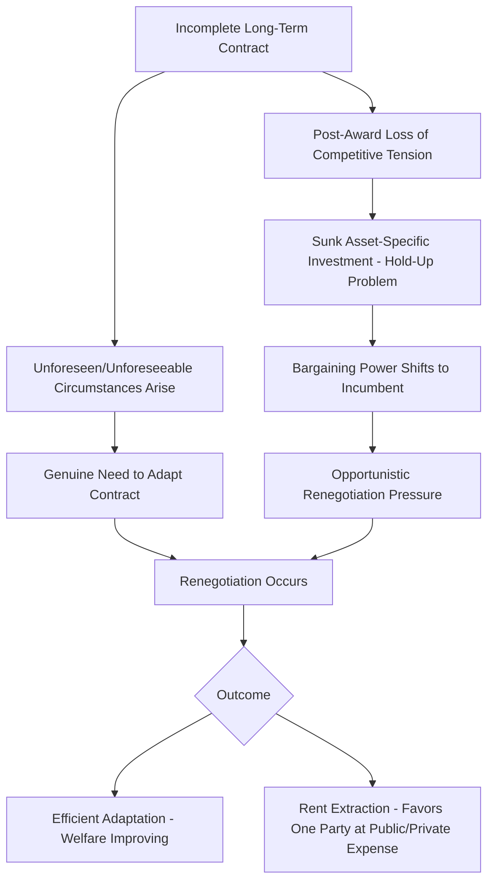
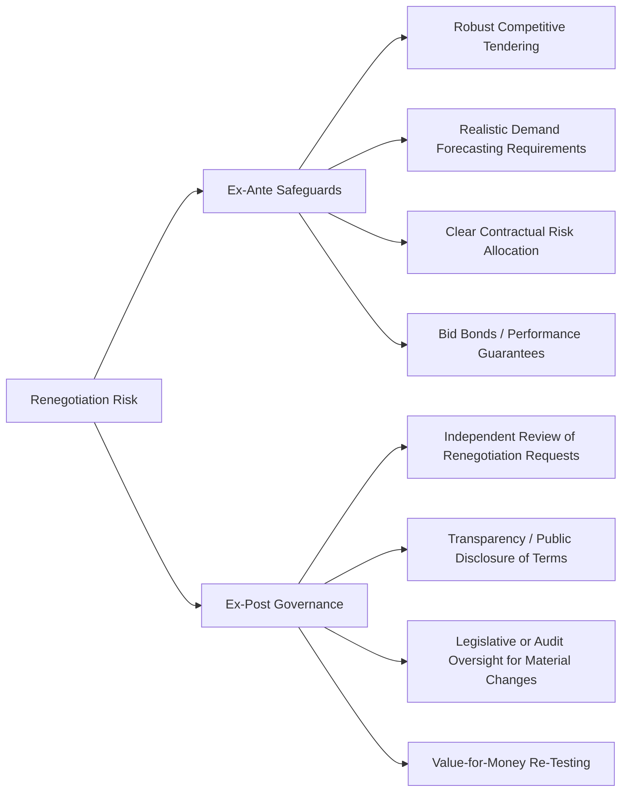

## Economics and Prevalence of PPP Contract Renegotiation

### Overview

The economics of PPP contract renegotiation examines why long-term infrastructure and service concession contracts are so frequently modified after award, what economic incentives drive renegotiation behavior on both sides, and what empirical evidence reveals about its scale, patterns, and welfare consequences. Renegotiation is not a peripheral or exceptional feature of PPPs — extensive empirical research has established it as a pervasive, structurally embedded characteristic of the model, making its study central to understanding whether PPPs deliver their theoretical value-for-money and risk-transfer benefits in practice.

### Theoretical Foundations: Why Renegotiation Is Structurally Likely

**Key Points**

- **Incomplete contracts theory**: PPP contracts govern relationships of 20-30+ years under genuine uncertainty; no contract, however carefully drafted, can fully specify optimal responses to every possible future contingency (demand shocks, technology change, macroeconomic shifts, political change) — this incompleteness creates recurring occasions where the original contract no longer fits circumstances, prompting renegotiation.
- **Asymmetric bargaining power post-award**: once the SPV has made large, sunk, asset-specific investments (a classic "hold-up problem" in transaction cost economics), the competitive tension of the original tender evaporates — the Grantor can no longer credibly threaten to award the contract to a rival bidder, shifting bargaining leverage toward the incumbent operator during subsequent negotiations.
- **Strategic/opportunistic low-balling at bid stage**: because bidders anticipate the possibility of post-award renegotiation, some literature suggests firms may deliberately submit aggressive, unsustainably low bids to win the competitive tender, expecting to recover margin through subsequent renegotiation once competitive pressure is gone — sometimes termed the "winner's curse" or strategic underbidding problem in concession auctions.
- [Inference] The extent to which strategic underbidding (as opposed to genuine optimism bias or authentic unforeseen circumstances) explains observed renegotiation patterns is contested in the academic literature and likely varies by contract, sector, and institutional context; it should be treated as one competing explanation among several rather than an established universal cause.
- **Political economy incentives**: elected officials may have incentives to accept optimistic bids or approve subsequent renegotiations that shift costs into future budget periods or beyond their own political tenure, a dynamic sometimes analyzed through "soft budget constraint" theory (originally developed for state-owned enterprises, later applied to PPP renegotiation behavior).

### Empirical Evidence on Prevalence

**Key Points**

- The most widely cited empirical study, Guasch's (2004) examination of nearly 1,000 Latin American concession contracts awarded between the mid-1980s and 2000, found that 30% of all contracts were renegotiated, with the proportion reaching 54.4% in the transportation sector (roads, ports, tunnels, and airports) and 74.4% in the water sector. [NBER](https://www.nber.org/system/files/working_papers/w15300/w15300.pdf)[King Center on Global Development](https://kingcenter.stanford.edu/sites/g/files/sbiybj16611/files/media/file/389wp_0.pdf)
- Guasch further found that renegotiations often favored the concessionaire: 62% of renegotiations led to tariff increases, 38% led to extensions of the concession term, and 62% led to reductions in investment obligations. [NBER](https://www.nber.org/system/files/working_papers/w15300/w15300.pdf)[King Center on Global Development](https://kingcenter.stanford.edu/sites/g/files/sbiybj16611/files/media/file/389wp_0.pdf)
- Renegotiation is not limited to developing countries — research by Gómez-Ibáñez and Meyer analyzing highway franchises found similar tendencies for concession terms to be modified over the life of a concession, which usually lasts between 20 and 30 years. [King Center on Global Development](https://kingcenter.stanford.edu/sites/g/files/sbiybj16611/files/media/file/389wp_0.pdf)
- Some researchers note that Guasch's dataset likely underestimates true renegotiation prevalence, since it includes concessions that had not yet been renegotiated by the cutoff year of the study but were renegotiated repeatedly in subsequent years. [King Center on Global Development](https://kingcenter.stanford.edu/sites/g/files/sbiybj16611/files/media/file/389wp_0.pdf)
- The **World Bank/PPIAF Private Participation in Infrastructure (PPI) Project Database** remains the primary underlying data source for most empirical renegotiation research, covering thousands of infrastructure projects across low- and middle-income countries, and is periodically used to update and extend renegotiation frequency estimates.
- [Unverified] More recent renegotiation frequency estimates, disaggregated by sector, region, and time period beyond the original Guasch-era studies, should be sourced directly from updated PPI Database analyses or more recent academic literature, since renegotiation rates are influenced by contract design improvements, institutional capacity building, and macroeconomic conditions that have evolved considerably since the datasets underlying the classic findings above.

### Renegotiation Triggers: Distinguishing Categories

| Trigger Category | Nature | Typical Economic Effect |
| --- | --- | --- |
| Genuine unforeseen exogenous shock | Macroeconomic crisis, natural disaster, pandemic-level demand collapse | Often legitimate basis for relief; efficiency case for adaptation |
| Change in law/regulation | Government-initiated policy shift affecting project economics | May shift risk to Grantor if discriminatory/specific to project |
| Design/scope errors discovered in operation | Latent defects, incomplete original specification | Allocation depends on original risk allocation and negligence standards |
| Demand shortfall vs. optimistic forecast | Traffic/usage lower than Base Case projections | Contested: distinguishes genuine forecasting uncertainty from bid-stage optimism bias |
| Government-initiated scope expansion | Political decision to expand service (e.g., extend a toll road) | Typically a Variation, priced to maintain SPV return |
| Strategic renegotiation request by SPV | Attempt to recover margin post-award absent genuine trigger | Opportunistic; governance safeguards should resist absent legitimate basis |
| Political/electoral pressure | New government seeks to revise "unpopular" terms (tariffs, profits) | Risk of contract sanctity erosion; may deter future investment |

### Welfare and Value-for-Money Consequences

**Key Points**

- Renegotiation that systematically favors the private party (as documented in tariff increases, extended terms, and reduced investment obligations) undermines the original competitive tendering process's function of extracting the best available terms for the public sector — if renegotiation is anticipated, it can distort bidding behavior at the tender stage itself.
- Frequent renegotiation, particularly when perceived as non-transparent or favoring politically connected bidders, damages broader investor and public confidence in the PPP model, potentially raising the cost of capital or public acceptability for future PPP programs.
- Conversely, *some* renegotiation reflects genuinely efficient contractual adaptation — refusing to renegotiate in the face of authentic unforeseen circumstances can force inefficient outcomes (e.g., service failure, SPV insolvency, forced termination with associated transition costs) that are worse for both parties and the public than a well-governed renegotiation.
- The central policy challenge is therefore not eliminating renegotiation altogether but **governing it well**: ensuring genuine adaptive renegotiations proceed efficiently while opportunistic or rent-seeking renegotiations are resisted or subject to rigorous, transparent, independently-reviewed approval processes.

### Governance Responses to Renegotiation Risk

**Key Points**

- **Strengthening initial competitive tension**: rigorous, well-designed tender processes with realistic bid evaluation criteria (rather than lowest-price-wins mechanisms vulnerable to strategic underbidding) reduce the incentive and opportunity for opportunistic post-award renegotiation.
- **Independent/external review of renegotiation requests**: routing material renegotiation proposals through an independent technical/economic review (sometimes involving the national PPP unit, a regulator, or supreme audit institution) rather than leaving them to bilateral negotiation between the Grantor's contract management team and the SPV.
- **Transparency and public disclosure**: publishing renegotiated terms publicly increases political and civil society scrutiny, creating a disincentive against renegotiations that clearly favor one party without a defensible efficiency rationale.
- **Distinguishing the renegotiation process from the routine variation process**: as covered under contract management, well-designed contracts separate genuine "Variations" (discrete, scoped changes within the existing framework) from full "Renegotiations" (fundamental revisions to risk allocation, term, or pricing basis), applying more stringent governance and approval requirements to the latter.
- **Legal/institutional constraints on renegotiation scope**: some jurisdictions impose statutory limits on what can be renegotiated without returning to a competitive process, or require legislative approval for renegotiations exceeding a materiality threshold, specifically to counter the political economy incentives that favor easy accommodation of SPV requests.

### Sectoral Patterns

**Key Points**

- Water and sanitation concessions have historically exhibited among the highest renegotiation rates in the empirical literature, plausibly linked to the acute political sensitivity of water tariffs, the technical complexity of asset condition assessment at award, and the essential-service nature of the sector making service interruption politically costly for the Grantor (strengthening the incumbent's bargaining position).
- Transport concessions (toll roads, ports, airports) show elevated renegotiation rates often linked to demand risk — traffic/usage forecasts embedded in bids are a well-documented source of both genuine forecasting error and (per the strategic-bidding literature) potential optimism bias or deliberate underestimation of construction costs/overestimation of demand to win competitive tenders.
- Energy sector PPPs/concessions have historically shown comparatively different renegotiation dynamics, often linked more closely to regulatory and tariff-setting frameworks specific to the sector's economic regulation model.
- [Inference] Sectoral renegotiation patterns are also strongly influenced by the maturity of each country's regulatory institutions and contract standardization practices, meaning cross-country and cross-sector comparisons should account for institutional context rather than attributing differences solely to sector characteristics.

### Common Analytical Pitfalls

**Key Points**

- **Treating all renegotiation as evidence of contract failure**: some renegotiation reflects efficient, welfare-improving adaptation to genuine unforeseen circumstances; a high renegotiation rate alone does not prove poor contract design or bad faith by either party.
- **Ignoring the distributional direction of renegotiation outcomes**: aggregate renegotiation frequency statistics can obscure whether renegotiations systematically favor one party — the *direction* of renegotiated terms (as documented in the tariff/term/investment-obligation findings above) is often more analytically informative than frequency alone.
- **Conflating routine variations with fundamental renegotiations**: not distinguishing operationally necessary scope changes (handled via standard Variation Procedures) from fundamental revisions to risk allocation or pricing basis can inflate perceived renegotiation rates and obscure the specific governance weaknesses that enable opportunistic behavior.
- **Assuming renegotiation is unique to PPPs**: comparative analysis should account for the fact that traditional public procurement contracts and directly state-operated infrastructure also experience significant cost overruns and scope changes; the relevant comparison for value-for-money analysis is PPP renegotiation outcomes versus the counterfactual public delivery alternative, not an assumption that renegotiation-free delivery is the realistic benchmark.

### Related Topics

- Renegotiation Governance, Approval Processes, and Independent Review Mechanisms
- Strategic Bidding, Optimism Bias, and Winner's Curse in Concession Auctions
- Managing Variations and Change Orders (routine vs. fundamental contract change)
- Dispute Resolution Mechanisms: Negotiation, Mediation, Expert Determination, Arbitration
- Value-for-Money Assessment and Public Sector Comparator Methodology
- Demand Risk Allocation in Transport and Utility Concessions
- Political Economy of PPPs and Contract Sanctity
- Termination for Convenience, Default, and Force Majeure