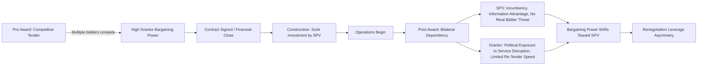
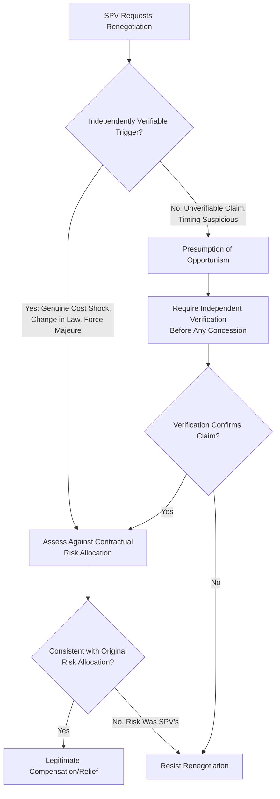

## Opportunistic Renegotiation and Bargaining Power Dynamics

### Overview

Opportunistic renegotiation refers to a party's use of post-award bargaining power — rather than genuine unforeseen circumstances — to extract contract modifications that improve its own position at the other party's expense. Bargaining power dynamics in PPPs analyze how the relative negotiating leverage of the Grantor and the Project Company (SPV) shifts systematically over the contract lifecycle, from a Grantor-favorable position during competitive tender to, in many cases, an SPV-favorable position once the contract is signed and investments are sunk. Understanding these dynamics is essential to designing governance safeguards that distinguish legitimate contractual adaptation from rent-seeking behavior.

### Theoretical Foundation: The Hold-Up Problem

**Key Points**

- The core mechanism is the **hold-up problem** from transaction cost economics (associated with Williamson, and with the property-rights approach of Grossman, Hart, and Moore): once a party makes large, sunk, asset-specific investments, it becomes vulnerable to the counterparty exploiting the fact that those investments cannot be redeployed elsewhere without substantial loss.
- In PPPs, the SPV typically makes the sunk investment (construction of the asset), which conventional hold-up theory suggests should make the *SPV* vulnerable to Grantor opportunism post-completion. In practice, however, PPP bargaining dynamics frequently run in the *opposite* direction, because the Grantor also faces a form of lock-in.
- **Grantor-side lock-in** arises because: (a) the public sector has typically committed politically and often has no readily available alternative operator for an essential public service; (b) service interruption during a forced re-tender or dispute is politically and socially costly in ways the Grantor's own decision-makers bear directly; (c) the Grantor often lacks the in-house technical capacity to resume direct operation on short notice; and (d) termination remedies, while contractually available, are frequently costly, slow, and legally contested in practice.
- This mutual lock-in — sometimes termed **bilateral dependency** — means that once a PPP is operational, *both* parties have reduced outside options relative to the pre-award competitive tender stage, but the SPV's incumbency, technical information advantage, and the Grantor's political exposure to service disruption often combine to shift effective bargaining leverage toward the private party during subsequent renegotiations.

### Mechanisms of Opportunistic Behavior

**Key Points**

- **Strategic underbidding ("low-balling")**: bidders may submit unsustainably aggressive bids to win the competitive tender, anticipating that once competition is eliminated, they can renegotiate more favorable terms — this is a recurring theme in the empirical renegotiation literature, though the extent to which it (versus genuine optimism bias) explains observed patterns is debated.
- **Information asymmetry exploitation**: the SPV typically possesses superior information about actual operating costs, asset condition, and technical constraints than the Grantor's contract management team, allowing it to frame renegotiation requests (e.g., claimed cost overruns, technical infeasibility) in ways that are difficult for the Grantor to independently verify.
- **Threat of service disruption or under-investment**: an SPV facing financial distress (whether genuine or strategically induced) can implicitly or explicitly signal that continued underperformance, deferred maintenance, or insolvency is likely absent renegotiated terms — leveraging the Grantor's political exposure to service failure.
- **Timing manipulation**: initiating renegotiation requests at politically sensitive moments (e.g., shortly before elections, during a public health or economic crisis) when the Grantor's incentive to avoid disruption or negative headlines is at its peak.
- **Scope/threshold gaming**: structuring change requests to fall just below approval thresholds that would otherwise trigger independent review, legislative oversight, or more rigorous scrutiny.
- **Financial engineering leverage**: threatening lender-triggered step-in or default scenarios (real or strategically emphasized) to pressure the Grantor into concessions that avoid the reputational and operational costs of a lender-driven disruption.

### Bargaining Power Determinants Across the Contract Lifecycle

| Lifecycle Stage | Grantor Bargaining Power | SPV Bargaining Power | Key Driver |
| --- | --- | --- | --- |
| Pre-tender / RFP design | High | Low | Grantor controls scope, terms, evaluation criteria |
| Competitive bidding | High | Low (multiple bidders compete) | Rival bidder threat disciplines pricing |
| Financial Close / contract signing | Moderate-High | Moderate | Terms locked in; some residual negotiation on financing conditions |
| Construction phase | Moderate | Moderate-Rising | SPV investment increasingly sunk; Grantor political commitment builds |
| Early operations | Low-Moderate | High | Asset sunk, service now essential and politically visible |
| Mid-to-late operations | Variable | High (unless institutionally checked) | Incumbency entrenched; alternative operators scarce; political cycles create pressure points |
| Approaching expiry / re-tender | Rising (if re-tender credible) | Declining (if genuine competition restored) | Threat of competitive re-tender restores some Grantor leverage |

### The "Efficient Breach" vs. "Rent Extraction" Distinction

A central analytical challenge is distinguishing renegotiations that are genuinely welfare-improving from those that constitute pure rent extraction:

**Key Points**

- The critical test is whether the triggering event falls within the risk allocation the SPV explicitly or implicitly accepted at Financial Close — a renegotiation request premised on a risk the SPV was contractually allocated (e.g., ordinary demand forecasting risk, standard cost inflation) should generally be resisted, whereas one arising from a risk genuinely allocated to or shared with the Grantor (e.g., discriminatory change in law) has a legitimate basis.
- Verifiability is central to governance design: opportunistic claims often rely on information the SPV controls and the Grantor cannot easily independently check (e.g., internal cost structures, alternative financing options, true reasons for financial distress) — governance responses should therefore prioritize independent technical/financial verification before conceding any renegotiation.
- [Inference] In practice, the line between "genuine hardship" and "opportunistic pressure" is frequently ambiguous and contested — financial distress can be simultaneously real (the SPV may indeed face genuine cash flow strain) and strategically leveraged (used to extract more favorable terms than the underlying hardship alone would justify), and case-specific independent analysis is generally required rather than a categorical rule.

### Governance Safeguards Against Opportunistic Renegotiation

**Key Points**

- **Independent renegotiation review bodies**: routing renegotiation requests through a body independent of the day-to-day contract management relationship (e.g., a central PPP unit, ministry of finance review panel, or in some jurisdictions, a specialized regulatory or audit authority) reduces the risk of a captured or under-resourced local contract manager conceding to pressure.
- **Mandatory transparency/disclosure**: requiring public disclosure of renegotiation requests and outcomes increases the political cost of conceding to unjustified demands and enables civil society/media scrutiny as an external check.
- **Legislative or high-level approval thresholds**: requiring renegotiations above a materiality threshold to obtain legislative, cabinet, or supreme audit institution approval introduces an additional veto point that is harder for an SPV to capture through routine relationship pressure.
- **Standardized risk allocation matrices at bid stage**: clearly and unambiguously allocating risks in the original contract reduces the scope for later dispute over "who bears this risk," narrowing the space for opportunistic reinterpretation.
- **Bid evaluation reforms**: moving away from pure lowest-price bid evaluation (which rewards strategic underbidding) toward evaluation criteria that also weight technical robustness, realistic financial assumptions, and bidder track record, reduces the incentive to submit unsustainable bids anticipating renegotiation.
- **Credible re-tendering capacity**: maintaining genuine institutional capacity (technical, financial, legal) to actually execute a re-tender or temporary public takeover if negotiations fail restores some Grantor bargaining power by making the "walk away" threat credible rather than purely theoretical.
- **Multi-year contract manager continuity and expertise**: well-resourced, experienced Grantor contract management teams are less susceptible to information asymmetry exploitation than high-turnover or under-skilled teams facing sophisticated SPV commercial negotiators.

### Asymmetric Information and the Role of Independent Experts

**Key Points**

- Independent technical advisers, auditors, and expert determination panels play a central role in narrowing the information asymmetry that underlies much opportunistic renegotiation leverage — by providing the Grantor with independently verified cost, engineering, and financial analysis rather than relying solely on SPV-supplied figures.
- Open-book accounting requirements (also relevant to variations management) extend naturally to renegotiation contexts: requiring the SPV to substantiate hardship claims with auditable financial data, rather than assertions, shifts some bargaining leverage back toward the Grantor.
- Benchmarking against comparable projects (cost databases, sector-wide performance data) provides an external reference point to assess whether a renegotiation request reflects genuine market conditions or an outlier demand.

### Common Pitfalls in Practice

**Key Points**

- **Conceding under time pressure**: agreeing to renegotiation terms under artificial urgency (e.g., "service will fail next week without this concession") without independent verification, rewarding and reinforcing opportunistic timing tactics.
- **Under-resourced Grantor counter-analysis**: lacking the technical/financial capacity to independently assess SPV claims, forcing reliance on SPV-supplied data and analysis, which structurally favors the party with superior information.
- **Treating incumbency as irreversible**: assuming a re-tender or termination is not a realistic option (even when contractually available) removes a key credible threat and further entrenches SPV bargaining power.
- **Political short-termism**: officials facing near-term political costs of service disruption may rationally (from their own perspective) concede to renegotiation terms whose costs fall on future budgets or successor administrations — a manifestation of the soft-budget-constraint dynamic identified in the renegotiation economics literature.
- **Absence of institutional memory**: without documented records of prior renegotiation history and the reasoning behind past concessions, successor contract managers may be unable to detect patterns of repeated opportunistic requests from the same counterparty.

### Related Topics

- Economics and Prevalence of PPP Contract Renegotiation
- Risk Allocation Matrices and Contractual Risk Transfer Design
- Managing Variations and Change Orders
- Dispute Resolution Mechanisms: Expert Determination and Independent Verification
- Termination for Default, Convenience, and Lender Step-In Rights
- Bid Evaluation Design and Strategic Underbidding in Concession Auctions
- Political Economy of PPPs and Soft Budget Constraints
- Contract Management Unit Capacity and Institutional Design