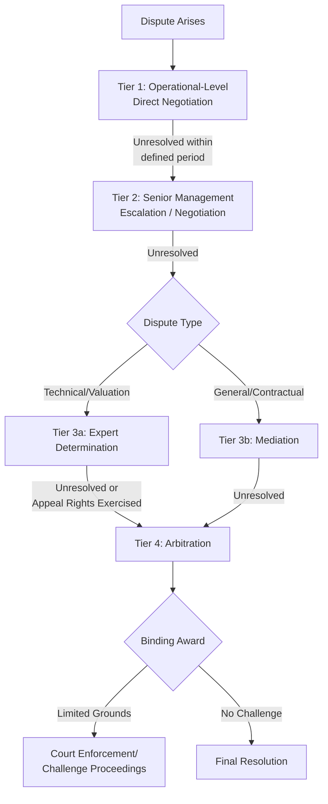

## Dispute Resolution Mechanisms and Escalation Procedures

### Overview

Dispute resolution mechanisms in PPPs are the contractually pre-agreed procedures for resolving disagreements between the Grantor and the Project Company (SPV) over contract interpretation, performance, payment, variations, or renegotiation — without allowing every disagreement to escalate to costly, slow, and relationship-damaging litigation or international arbitration. Because PPP contracts run for 20-35 years and govern relationships characterized by significant information asymmetry and bilateral dependency, a well-designed, tiered dispute resolution architecture is essential infrastructure for the partnership's overall functioning, not merely a boilerplate legal clause.

### Rationale and Design Objectives

**Key Points**

- **Proportionality**: minor operational disagreements should be resolved quickly and cheaply at the lowest appropriate level, while only genuinely significant, unresolved disputes should reach expensive, formal binding processes such as arbitration.
- **Preserving the relationship**: because the parties must continue working together for the remaining contract term regardless of dispute outcome, mechanisms that preserve collaborative engagement (negotiation, mediation) are generally preferred as first-line responses, with adjudicative processes (expert determination, arbitration, litigation) reserved for genuine impasses.
- **Technical competence**: many PPP disputes involve highly technical engineering, financial modeling, or specialized regulatory questions poorly suited to generalist judges or arbitrators without domain expertise — mechanisms should route technical disputes to technically qualified decision-makers.
- **Speed and cost proportionate to stakes**: full international arbitration can take years and cost millions in legal/expert fees, which is disproportionate for many operational-level disputes but appropriate for high-value, contract-defining disagreements (e.g., termination validity, major compensation claims).
- **Continuity of service during disputes**: mechanisms should generally avoid triggering service interruption while a dispute is being resolved (e.g., "pay now, argue later" provisions, interim measures) to protect the public interest in continuous service delivery.

### The Tiered Escalation Structure

Most well-drafted PPP contracts adopt a multi-tier, escalating dispute resolution clause, requiring parties to exhaust each tier before proceeding to the next:

**Key Points**

- **Tier 1 – Direct/Operational Negotiation**: the parties' operational-level representatives (contract managers, project directors) attempt to resolve the issue directly within a short, contractually defined period (e.g., 10-20 business days).
- **Tier 2 – Senior Management Escalation**: if unresolved, the dispute escalates to more senior representatives (executives, board-level, or ministerial-level for major public sector disputes) for a further negotiation period.
- **Tier 3 – Expert Determination or Mediation**: technical/valuation disputes (e.g., variation pricing, asset condition assessments, KPI calculation disagreements) typically route to Expert Determination; broader contractual or relationship disputes may route to Mediation.
- **Tier 4 – Arbitration or Litigation**: reserved as the final, binding mechanism for disputes that survive all prior tiers, or for categories of dispute (e.g., termination validity, fundamental breach claims) that the contract designates as directly arbitrable.

### Negotiation and Escalation Protocols

**Key Points**

- Contracts typically specify **precise timeframes** for each negotiation tier (e.g., "the parties shall negotiate in good faith for 30 days before either party may refer the matter to mediation") to prevent indefinite stalling by either side.
- **"Good faith negotiation" clauses**, while common, are of variable legal enforceability across jurisdictions — some legal systems treat them as enforceable obligations, others as largely aspirational — so contracts often supplement them with objective triggers (defined notice periods, defined escalation contacts) rather than relying solely on subjective good faith standards.
- **Notice requirements**: formal dispute notices (specifying the nature of the dispute, contractual provisions at issue, and relief sought) are typically a condition precedent to invoking each successive tier, creating a documented record and preventing informal disagreements from later being characterized as formal disputes retroactively.

### Mediation

**Key Points**

- Mediation involves a neutral third party facilitating negotiation between the parties, without the mediator issuing a binding decision — the goal is a mutually agreed settlement rather than an imposed outcome.
- Mediation is particularly well-suited to disputes with a significant relational or reputational dimension (e.g., disagreements over communication protocols, minor persistent performance issues, or ambiguous contractual interpretation where both parties have plausible positions).
- Non-binding nature means mediation carries lower risk for both parties to attempt before committing to more adversarial, binding processes — many contracts make mediation a mandatory precondition to arbitration, sometimes called a "multi-tiered" or "escalation" clause.
- Mediator selection is typically from a pre-agreed panel or a recognized mediation institution, sometimes requiring specific sector expertise (infrastructure, construction, public finance).

### Expert Determination

**Key Points**

- Expert Determination involves referring a specific, usually technical or valuation, question to an independent expert (engineer, quantity surveyor, accountant) who issues a determination based on their own investigation and expertise, rather than adversarial submissions as in arbitration.
- Commonly used for: variation pricing disputes, KPI/performance measurement disagreements, asset condition/handback assessments, and financial model reconciliation disputes — matters where technical expertise, not legal argument, is the primary determinant of the correct answer.
- Determinations are typically **binding but with limited appeal rights**, often restricted to manifest error, fraud, or a failure to follow the agreed determination procedure — narrower grounds for challenge than in arbitration, reflecting the intent for fast, final technical resolution.
- **Dispute Review Boards/Panels** (drawing on FIDIC-style practice common in major construction and infrastructure contracts) extend the expert determination concept into a standing panel engaged with the project on an ongoing basis, enabling faster, better-informed resolution than appointing an expert fresh for each dispute.
- Expert Determination is generally faster and cheaper than arbitration but is only suitable for questions that can be meaningfully resolved by technical/expert judgment rather than requiring full legal argument, evidence, and cross-examination.

### Arbitration

**Key Points**

- Arbitration is the most common final, binding dispute resolution mechanism for major PPP disputes, particularly where a foreign private investor is involved (given concerns about the neutrality or capacity of domestic courts) or where technical/commercial confidentiality is valued over public court proceedings.
- **Institutional vs. ad hoc arbitration**: contracts specify either a named arbitral institution (e.g., ICC, LCIA, SIAC, ICSID for certain investor-state disputes, or regional/domestic institutions) administering the process under its rules, or an ad hoc process governed by rules such as UNCITRAL, without institutional administration.
- **Seat and governing law**: the arbitration clause specifies the legal seat (which determines the procedural law and courts with supervisory jurisdiction) and the substantive governing law of the contract — these need not be the same jurisdiction, and are often the subject of careful negotiation given asymmetric perceptions of "home court advantage."
- **Arbitrator qualifications**: PPP arbitration clauses often specify required expertise (e.g., "an arbitrator with not less than 15 years' experience in infrastructure/project finance") to ensure technical competence in a field where generalist commercial arbitrators may lack relevant background.
- **Investor-State Dispute Settlement (ISDS)**: where a PPP involves foreign investment protected under a bilateral investment treaty (BIT) or multilateral investment treaty, disputes may additionally be arbitrable directly against the host state under investment treaty arbitration (e.g., under ICSID), a distinct track from the contractual dispute resolution clause and governed by international investment law standards (fair and equitable treatment, expropriation protections) rather than solely the PPP contract's terms.
- [Inference] The relative prevalence and strategic use of treaty-based ISDS claims versus contractual arbitration in PPP disputes varies significantly by country, sector, and time period, and is a rapidly evolving area of international investment law subject to ongoing reform debates (e.g., UNCITRAL Working Group III discussions on ISDS reform); current specifics should be verified against up-to-date legal sources rather than assumed static.

### Interim Measures and "Pay Now, Argue Later" Provisions

**Key Points**

- Many contracts include provisions allowing either party to seek **interim/emergency relief** (injunctions, orders to maintain service continuity, preservation of evidence) from courts or emergency arbitrators pending final resolution of the underlying dispute, to prevent irreparable harm during what may be a lengthy process.
- **"Pay now, argue later" clauses**: particularly relevant to disputed deductions under the payment mechanism — the SPV may be required to continue receiving (or the Grantor to continue paying) amounts as calculated under the contract's default mechanism while a dispute over the correct calculation is resolved through the escalation procedure, avoiding cash flow disruption from disputes that may ultimately be resolved either way.
- Escrow arrangements for disputed amounts (as also seen in variations and handback contexts) allow contested sums to be held pending determination rather than requiring either party to bear the cash flow risk of an eventual adverse ruling.

### Governance and Institutional Design Considerations

**Key Points**

- **Dispute avoidance boards** engaged proactively throughout the contract term (not only when disputes arise) can identify and resolve emerging disagreements before they crystallize into formal disputes, extending the "structured collaboration" relationship management philosophy into the dispute resolution architecture itself.
- **Sovereign immunity and enforceability considerations**: where the Grantor is a sovereign or sub-sovereign public entity, contracts may need to address potential sovereign immunity defenses to enforcement of arbitral awards, sometimes through explicit waiver clauses, though the enforceability and scope of such waivers vary by jurisdiction.
- **Confidentiality vs. transparency tension**: arbitration's confidentiality (an attractive feature for commercially sensitive disputes) is in some tension with the public accountability and transparency expectations increasingly applied to PPPs — some jurisdictions or contracts now require at least summary public disclosure of dispute outcomes involving public infrastructure, even where the underlying arbitration remains confidential.
- **Cost allocation mechanisms**: contracts typically specify how legal/expert costs of dispute resolution are allocated (e.g., "loser pays," each party bears its own costs, or arbitrator discretion), which itself affects parties' incentives to pursue or resist escalation.

### Common Pitfalls

**Key Points**

- **Ambiguous or gapped escalation clauses**: failing to clearly specify mandatory timeframes, notice requirements, or the precise trigger for moving between tiers creates its own source of dispute (a "dispute about the dispute process").
- **Mismatched mechanism to dispute type**: routing complex technical valuation disputes to generalist arbitration (slow, expensive, potentially lacking technical expertise) rather than expert determination, or routing fundamental legal/contractual disputes to expert determination (exceeding the expert's mandate and expertise).
- **Neglecting interim relief and cash flow provisions**: absent "pay now, argue later" mechanisms, ordinary payment disputes can trigger disproportionate service or financial disruption while working through a multi-tier escalation process designed for more significant disagreements.
- **Underestimating enforcement risk**: obtaining a favorable arbitral award is not equivalent to successful recovery — enforcement against sovereign or sub-sovereign entities can face practical and legal obstacles that should be considered at the contract drafting stage, not discovered only after a dispute arises.
- **Over-reliance on formal mechanisms at the expense of relationship management**: treating the dispute resolution clause as the primary tool for managing disagreements, rather than as a backstop supporting proactive relationship management (see also ongoing partnership governance), tends to produce more frequent and more adversarial disputes over time.

### Related Topics

- Managing the Public-Private Relationship Over the Contract Term
- Opportunistic Renegotiation and Bargaining Power Dynamics
- Termination for Default, Convenience, and Force Majeure
- Investor-State Dispute Settlement and Bilateral Investment Treaty Protections
- Managing Variations and Change Orders (interaction with valuation disputes)
- Asset Condition Monitoring and Handback Standards (interaction with handback disputes)
- Sovereign Immunity and Enforcement of Arbitral Awards Against Public Entities
- Dispute Avoidance Boards and Proactive Conflict Management