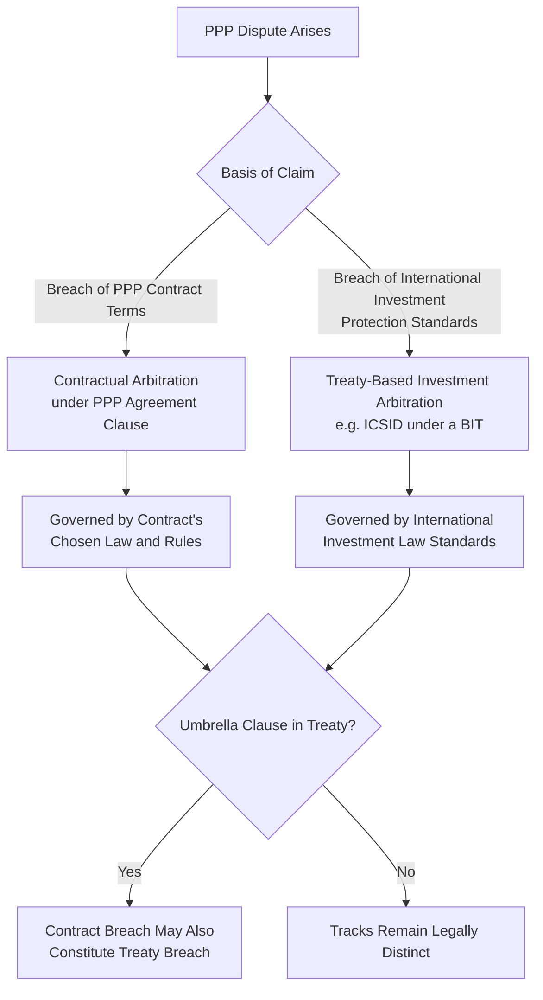
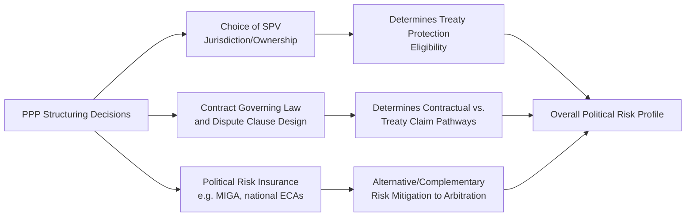

## International Arbitration Under ICSID and Other Frameworks

### Overview

International arbitration in the PPP context refers to the resolution of disputes between a private investor/Project Company and a host state (or state entity) through arbitral mechanisms operating outside domestic court systems, most prominently under the International Centre for Settlement of Investment Disputes (ICSID) and comparable institutional or ad hoc frameworks. This is analytically distinct from ordinary contractual arbitration between the SPV and the Grantor under the PPP agreement's dispute resolution clause — international investment arbitration typically arises from a separate legal basis: a bilateral investment treaty (BIT), multilateral investment treaty, or an investor-state arbitration clause embedded directly in the PPP contract itself, and it engages international law standards of investor protection, not merely contract interpretation.

### Distinguishing Contractual Arbitration from Treaty-Based Investment Arbitration

**Key Points**

- **Contractual arbitration** (commercial arbitration under the PPP agreement's dispute resolution clause) resolves disputes about the meaning and performance of the specific contract, governed by the contract's chosen governing law and arbitral rules (e.g., ICC, UNCITRAL, LCIA), with the state acting essentially as a contracting party.
- **Treaty-based investment arbitration** arises from an international investment agreement (a BIT, a regional investment treaty, or an investment chapter within a broader trade agreement) that grants qualifying foreign investors a direct right to arbitrate claims against the host state, independent of any contractual arbitration clause, governed by international investment law standards rather than solely domestic contract law.
- A single PPP dispute can potentially be pursued through **both tracks simultaneously or sequentially** (a phenomenon sometimes called "treaty shopping" or parallel proceedings), which has generated significant jurisprudential debate over jurisdiction, admissibility, and the appropriate relationship between contract claims and treaty claims (the "fork in the road" and "umbrella clause" doctrines are central to this analysis).
- [Inference] Whether a specific PPP dispute can access treaty-based arbitration depends heavily on the specific treaty's definitions of "investment" and "investor," the nationality and corporate structure of the SPV's shareholders, and the specific treaty's dispute resolution provisions — this is a highly fact-specific and jurisdiction-specific legal question that requires case-by-case legal analysis rather than general assumption.

### The ICSID Framework

**Key Points**

- ICSID was established under the 1965 **Convention on the Settlement of Investment Disputes between States and Nationals of Other States** (the "ICSID Convention" or "Washington Convention"), administered by the World Bank Group, and provides a specialized institutional and procedural framework specifically for investor-state disputes.
- ICSID jurisdiction requires: (a) a legal dispute arising directly out of an investment; (b) between a Contracting State (or a constituent subdivision/agency designated by it) and a national of another Contracting State; and (c) written consent of both parties to ICSID jurisdiction — consent is typically given by the state in advance through a BIT, investment treaty, or national investment law, and by the investor when initiating the claim.
- A distinctive feature of ICSID awards is their **enforcement mechanism** under the Convention: awards are treated as final and binding, and each Contracting State is obligated to enforce the pecuniary obligations of an ICSID award as if it were a final judgment of its own domestic courts, without the additional recognition/enforcement review process (such as under the New York Convention) that applies to non-ICSID arbitral awards — though practical enforcement against sovereign assets can still face sovereign immunity obstacles.
- ICSID also administers arbitration under its **Additional Facility Rules** for disputes that do not qualify for the Convention itself (e.g., because one party's state is not an ICSID Contracting State), providing broader access to the ICSID institutional framework and procedural rules.

### Other Arbitral Frameworks Relevant to PPP Disputes

| Framework | Nature | Common Use in PPP Context |
| --- | --- | --- |
| ICSID Convention | Treaty-based institutional arbitration, specialized for investor-state disputes | Direct investor claims against host states under BITs |
| UNCITRAL Arbitration Rules | Ad hoc procedural rules, no fixed institution | Used for both contractual and treaty-based arbitration; flexible, no institutional overhead |
| ICC (International Chamber of Commerce) | Institutional commercial arbitration | Common for contractual PPP disputes between SPV and Grantor |
| LCIA (London Court of International Arbitration) | Institutional commercial arbitration | Common choice given English law's frequent use as governing law in project finance |
| SIAC / HKIAC | Regional institutional arbitration (Singapore/Hong Kong) | Increasingly common for Asia-Pacific PPP and infrastructure disputes |
| PCA (Permanent Court of Arbitration) | Administers ad hoc and treaty-based proceedings | Used for some state-to-state and investor-state disputes outside ICSID |

**Key Points**

- Non-ICSID arbitral awards are generally enforced under the **1958 New York Convention on the Recognition and Enforcement of Foreign Arbitral Awards**, which is separate from the ICSID enforcement mechanism and requires enforcement through domestic courts of the state where enforcement is sought, subject to limited grounds for refusal specified in the Convention.
- The choice between ICSID and non-ICSID frameworks in a PPP contract or governing treaty has practical consequences: ICSID offers a more streamlined enforcement path (for Contracting States) but requires both the host state and investor's home state to be ICSID Convention parties, whereas UNCITRAL/ICC/other frameworks offer broader applicability but rely on New York Convention enforcement mechanics.

### Investment Protection Standards Commonly Invoked

**Key Points**

- **Fair and Equitable Treatment (FET)**: a frequently invoked and broadly interpreted standard, often covering protection against denial of justice, lack of due process, arbitrary or discriminatory treatment, and frustration of the investor's legitimate expectations — of particular relevance where a host state renegotiates, fails to enforce, or unilaterally alters PPP contract terms in ways perceived as unfair.
- **Full Protection and Security**: generally requires the host state to exercise due diligence in protecting the investment from physical harm and, in some interpretations, from legal/regulatory harm.
- **Protection against unlawful expropriation**: covers both direct expropriation (formal seizure/nationalization) and indirect/"creeping" expropriation (regulatory or contractual actions that substantially deprive the investor of the economic value of the investment without formal seizure) — a frequently litigated and contested category in PPP-related investment disputes, particularly concerning tariff-setting, regulatory changes, or termination actions.
- **National Treatment and Most-Favored-Nation (MFN) treatment**: protections against discriminatory treatment relative to domestic investors or investors from third countries, respectively.
- **Umbrella clauses**: treaty provisions requiring the host state to "observe any obligations" it has entered into with the investor — where present, an umbrella clause can potentially elevate an ordinary contract breach into a treaty breach, though tribunals have taken varying approaches to the scope and effect of such clauses.
- [Inference] The precise scope, interpretation, and application of these standards vary considerably across different tribunals, treaties, and cases — investment arbitration jurisprudence is not fully harmonized (there is no binding system of precedent among ICSID tribunals), and specific outcomes depend heavily on the particular treaty text and factual circumstances rather than a single settled body of doctrine.

### Relevance to PPP Structuring and Risk Management

**Key Points**

- **Treaty shopping / nationality planning**: some investors structure their investment through holding companies incorporated in jurisdictions with favorable BITs with the host state specifically to gain access to investment treaty protection — a practice that has faced increasing scrutiny and, in some tribunal decisions, been found to constitute an abuse of process when structured purely for litigation advantage after a dispute is foreseeable.
- **Political risk insurance as a complement, not substitute**: instruments such as **MIGA (Multilateral Investment Guarantee Agency)** guarantees, national export credit agency (ECA) political risk cover, and private political risk insurance provide an alternative or complementary risk mitigation route to pursuing arbitration directly, often with faster claims resolution than full investment arbitration proceedings.
- **Interaction with domestic PPP law**: some host states have enacted domestic PPP or investment laws containing direct consent to ICSID or other arbitration for qualifying investors, creating a treaty-independent basis for investor-state arbitration — the specific consent mechanism (treaty vs. contract vs. national law) affects both jurisdiction and applicable substantive standards.
- **Cost and duration considerations**: investment arbitration proceedings are typically lengthy (commonly multiple years from filing to award) and costly (legal and expert fees frequently reaching many millions of dollars for complex infrastructure disputes), which should factor into overall PPP risk assessment and the design of contractual dispute resolution alternatives that might resolve disputes faster and more cheaply where treaty claims are not essential to the investor's position.

### ISDS Reform Context

**Key Points**

- Investor-state dispute settlement has been the subject of sustained international reform debate, most notably through **UNCITRAL Working Group III**, addressing concerns including: perceived inconsistency in tribunal decisions, concerns about arbitrator independence and repeat appointments, the cost and duration of proceedings, and calls for a standing multilateral investment court to replace ad hoc tribunal appointments.
- The European Union has pursued its own **Investment Court System (ICS)** model in several of its more recent trade and investment agreements, intended to introduce greater consistency and an appellate mechanism compared to traditional ad hoc ISDS tribunals.
- [Unverified] The pace, scope, and ultimate outcome of ISDS reform efforts (including the status of a potential multilateral investment court) continue to evolve and should be verified against current UNCITRAL and relevant treaty-body sources rather than assumed settled, since this is an active area of ongoing international negotiation.

### Common Pitfalls in PPP Structuring Related to International Arbitration

**Key Points**

- **Failing to consider treaty protection at structuring stage**: not accounting for available BIT protections when structuring SPV ownership can leave an investor without treaty-based recourse that might otherwise have been available through minor, legitimate structuring choices made before a dispute becomes foreseeable.
- **State-side underestimation of exposure**: host states sometimes underappreciate how broadly standards like Fair and Equitable Treatment have been interpreted in practice, leading to unanticipated exposure when contract renegotiation, regulatory changes, or termination actions are challenged as treaty breaches rather than mere contractual disputes.
- **Ambiguous consent provisions**: poorly drafted state consent to arbitration (in national law, contract, or treaty) can create prolonged jurisdictional disputes before the merits of the underlying claim are even addressed, adding significant cost and delay.
- **Conflating contractual and treaty remedies**: assuming that resolving a contractual dispute (e.g., through the PPP agreement's own arbitration clause) forecloses a parallel or subsequent treaty claim, or vice versa, without careful analysis of "fork in the road" clauses and umbrella clause interactions in the specific treaty at issue.
- **Underusing political risk insurance**: overlooking MIGA or national ECA political risk insurance products that may provide faster, less adversarial resolution of certain categories of loss than pursuing full investment arbitration.

### Related Topics

- Dispute Resolution Mechanisms and Escalation Procedures (contractual arbitration)
- Opportunistic Renegotiation and Bargaining Power Dynamics
- Political Risk Insurance: MIGA, ECAs, and Private Market Instruments
- Termination for Default, Convenience, and Force Majeure
- Expropriation, Indirect Expropriation, and Regulatory Takings in Infrastructure
- Bilateral and Multilateral Investment Treaties: Structuring Considerations
- Sovereign Immunity and Enforcement of Arbitral Awards Against Public Entities
- ISDS Reform and the Proposed Multilateral Investment Court